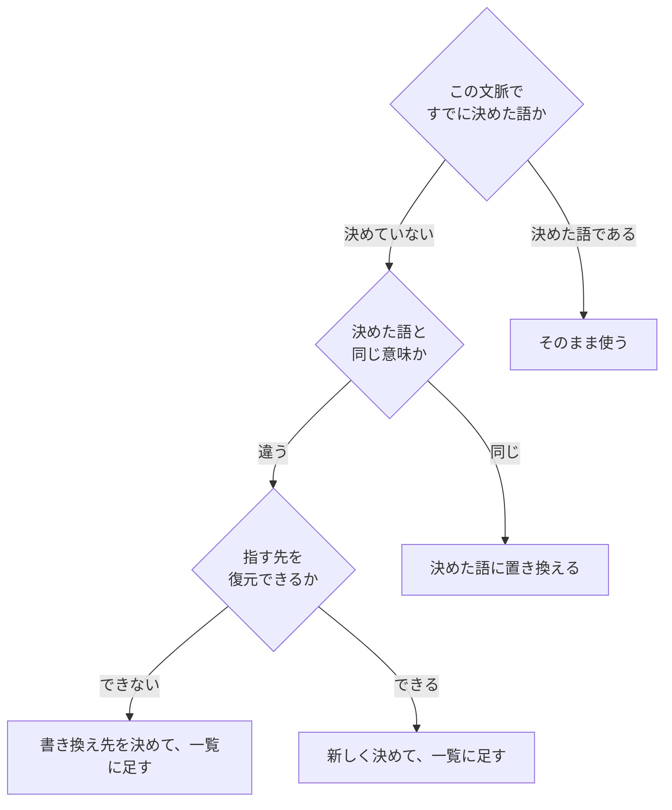

# ubiquitous-language-in-documents

---

## 概要

### この概念が答える判断

- ある語を、この文書で使ってよいか
- 同じものを2つの語で呼んでよいのは、どういうときか
- 語の定義を、どこに置くか
- 語彙が揃っているかを、どう確かめるか

**ユビキタス言語の概念そのものは `ubiquitous-language` にある。**
**本文書は、その概念を文書に当てたときに何が変わるかだけを書く。**

---

## 原則

**会話に当てるときと、文書に当てるときで、4つが変わる。**

### 1. 文書には、聞き返す相手がいない

**会話では、誤解はその場で直る**。相手が聞き返し、言い直せるからである。
**文書では直らない**。読み手は、書き手の意図を推測して読み進める。

**だから、語の定義を文書のなかに置く。**
会話で育てる代わりに、書いた時点で決めきる。

**日本語での現れ**——普通の日本語を、役割や分類の名前に取らない。
「現象」「狙い」「見方」のような語は、指す先を復元できない。

### 2. 1つの語に1つの意味。1つの意味に1つの語

**あいまいな語は、意味ごとに分ける。**
そして、同じ意味を2つの語で呼ばない。

**ただし、意図が違うなら別の語にしてよい。**
技術的には同じものでも、扱いが違うなら別の名前を持つ。

**日本語での現れ**——「特徴」と「性質」のように、日常では同じに見える語を、
役割ごとに使い分けると決めたなら、その決めを文書に書く。

### 3. 文脈の境界を、文書の側で決める

**会話には、話している場そのものが文脈になる。**
**文書には、それが無い**。どこまでが1つの文脈かを、書いて決める必要がある。

**境界を決めないと、1語1意味を守れない。**
守る範囲が定まっていないためである。

**日本語での現れ**——語の一覧を1か所に置き、どの文書群に当たるかを書く。

### 4. 語は、翻訳を経由すると変質する

**書き手と読み手のあいだに、要約や言い換えを挟まない。**
挟むたびに意図が変わる。

**日本語での現れ**——原典から引くときは、原典の文字列で引く。
要約から引くと、原典に無い語が混ざる。

---

## 分類

**語の扱いは3つに分かれる。**

| | 中身 | 置き場所 |
|---|---|---|
| **決めた語** | この文脈で、1つの意味に固定した語 | 語の一覧 |
| **使わない語** | 決めた語と同じ意味を持つので、使わないと決めた語 | 同上 |
| **曖昧な語** | そのままでは指す先を復元できない。書き換え先を示す | 同上 |

**3つとも、同じ1か所に置く。**
**散らすと、語を足すときに既存の語と衝突したかどうかを確かめられない。**

---

## 判断基準

**迷ったら一覧を見る**。一覧に無いなら、まだ決めていないということである。

---

## 実例

**1語が2つの意味を持っている状態と、分けた状態を並べる。**

| | 語 | 指しているもの |
|---|---|---|
| **分ける前** | 道具 | 判定者に与えるツール ／ 測る仕組みの全体（2つの意味） |
| **分けた後** | **読む道具 ／ 書く道具** | 判定者に与えるツール |
| **分けた後** | **道具** | 測る仕組みの全体 |

**分ける前は、本文の29か所が広い意味で使い、定義だけが狭い意味だった。**
**語の定義と本文がずれていることに、29か所そろうまで気づけなかった。**

**これが概念1の現れである。**
**会話なら「どっちの意味？」と聞かれた時点で気づく。**

---

## アンチパターン

| 名前 | 何が問題か | 外れている概念 |
|---|---|---|
| **定義せずに使い始める** | 読み手は文脈から推測する。推測は読み手ごとに違う | 1 |
| **定義と本文がずれる** | 定義を1度書いて、本文が育つと起きる。**書いた本人が気づけない** | 1 |
| **同じものを2つの語で呼ぶ** | 読み手は、違うものを指していると受け取る | 2 |
| **境界を書かずに語を決める** | どこまでその意味なのかが決まらない | 3 |
| **要約から引く** | 原典に無い語が混ざる。**混ざったことを後から検めにくい** | 4 |
| **標準的な語を別の意味で使う** | その分野の読み手が、標準の意味で読む | 1・2 |

---

## 検査

**語の対は機械で見える。それ以外は見えない。**

| 見える | 見えない |
|---|---|
| 決めた語と使わない語が、同じ文書に同居している | **定義と本文がずれていないか** |
| | **境界の外で、その語を使っていないか** |
| | **標準的な意味と食い違っていないか** |

**見えないものは、読み手を立てて確かめる**（`reader-testing`）。

---

## 出典・根拠の透明性

**ユビキタス言語の概念は『ドメイン駆動設計をはじめよう』第2章にある。**
**このリポジトリでは `ddd-advisor/references/knowledge/ubiquitous-language.md` が、その書き起こしを持つ。**

**本文書は、書き起こしを繰り返さない。**
**会話に当てる概念を、文書に当てたときに変わる4つだけを書いている。**

| 本文書の概念 | 元にした考え方 |
|---|---|
| 1 聞き返す相手がいない | 継続的に取り組む（会話で誤解を検出し、直し続ける） |
| 2 1語1意味・1意味1語 | 一貫性（一語一義）／ 同義語を使わない |
| 3 文脈の境界を決める | 区切られた文脈 |
| 4 翻訳を経由すると変質する | アンチパターン「翻訳を挟む」 |

### 出所を持たないもの

**各概念の「日本語での現れ」には、出所が無い。**
**このリポジトリで実際に起きた語のずれから起こしている。**

---

## 関連概念

| 関連概念 | 関係 |
|---|---|
| `ubiquitous-language` | 概念そのものである。本文書はこれを文書に当てている |
| `technical-writing-for-research-documents` | 文書の書き方の全体である。本文書は、その概念3と5を語の側から支える |
| `reader-testing` | 機械で見えないずれを、読み手を立てて確かめる |
