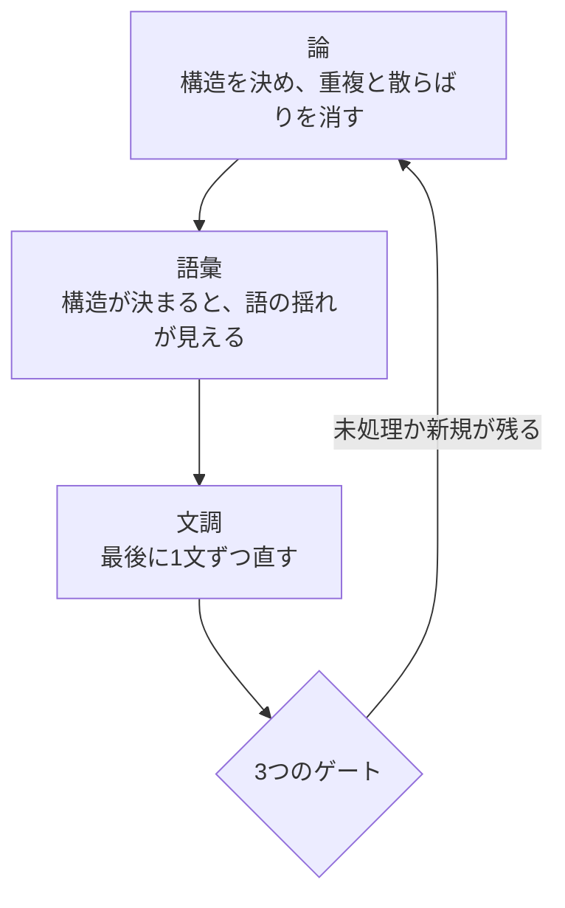

<!-- writing-guard: exempt -->
# 3つのレーンの判定の仕方

**`SKILL.md` Step 2 の各レーンについて、どう判定し、どう直すかを書く。**

| レーン | 見るもの |
|---|---|
| **論** | 意味が通り、論が崩れていないか |
| **文調** | 人が読んで、一度で意味が取れるか |
| **語彙** | 同じものが、同じ語で呼ばれているか |

---

## 論のレーン

### 読み手の窓を超えていないか

#### 判定

| 見るところ | 超えている兆し |
|---|---|
| 文書全体 | 見出しの並びを読み終える前に、何の文書か分からなくなる |
| 1つの節 | 見出しが、その節の中身を言い切れていない |
| 1つの表 | 列が5つを超え、どの列を見ればよいか決まらない |

#### 直し方

**「決めたこと」と「どうやったか」と「なぜそう判断したか」で分ける。**

```
決めたこと      読み手が最初に要る。本体に置く
どうやったか    疑ったときに開く。別ファイルへ出す
なぜそう判断    後から問われたときに開く。別ファイルへ出す
```

**分けたら、本体から参照を張る。**参照先の見出しは、探し物の名前と揃える。

#### 失敗の例

**「除外はしない」という見出しの節へ、「外す条件」を探しに行かせる。**
見出しが「無い」と言っているので、読み手は開かない。

### 同じことを2か所に書いていないか

#### 判定

| 種類 | 見つけ方 |
|---|---|
| 同一の文 | 文書内の全文を句点で切り、同じものが2つ無いかを数える |
| 言い換えた重複 | 同じ主張が、違う言葉で2か所に無いかを読む |
| 相互参照の空回り | A が B を指し、B に A と同じ文がある |

#### 直し方

**片方を正本にし、もう片方は参照だけにする。**
**どちらを正本にするかは、読み手が最初に開く側で決める。**

#### 失敗の例

**§3 が「詳しくは §5」と書き、§5 に §3 と同じ文がある。**
読み手は往復して、同じものを2回読む。

### 情報が散っていないか

#### 判定

| 見るところ | 散っている兆し |
|---|---|
| 表と本文 | 表の列に無い項目を、本文が論じている |
| 数値と出所 | 数値を出した節と、出所を書いた節が離れている |
| 定義と使用 | 語を定義した節と、その語を使う節のあいだに、無関係な節が挟まっている |
| 同じ対象 | 1つの対象についての記述が、3か所以上に分かれている |

#### 直し方

**同じものについての記述を、1か所へ寄せる。**
寄せられないときは、寄せられない理由を書く。

#### 失敗の例

**表の列が `Purpose` の有無だけなのに、本文が「Requirement を1つ以上持つ割合」を論じる。**
読み手は、その数字を表から確かめられない。

### 欄の本文は、結論の一文で始める

**読み手が中身を読む前に、その欄が何を言っているかを掴めるようにする。**
対象は**本文の書き出し**であり、見出しではない。
対象外は、それ自体が一文である欄だけである。

**結論が末尾にあることは、先頭の一文の代わりにならない。**
連鎖の末尾に結論の段を持つ欄も、書き出しの一文を省かない。

### 見出し・ラベル・列名は、文にしない

**見出しは名前であって、文ではない。**
名詞句で置き、そこに文脈・理由・結論を持ち込まない。

```
悪い   ## 名前を鍵にすると、改名で結びが切れるので印を持たせる
良い   ## 節の同一性

悪い   列名：この案を採ったときに引き受けることになる代償
良い   列名：代償
```

**言いたいことは、本文の一文目で言う。**見出しへ載せると、目次と一覧が読めなくなり、
同じ主張が見出しと本文の2か所に現れる（観点2）。

### 理由は、連鎖で書く

**理由の欄を、論証の連鎖として書く。**段の種別は左に置き、文字を増やさない。

| 段 | 中身 |
|---|---|
| 測った | 出所つきの観測。再測定できる |
| 確かめていない | 判断の土台にしたが、検証していない前提。測り直せず、採るか捨てるかしかない |
| だから ／ 一方で ／ 合わせると | 推論の接続。飛躍をここで見せる |
| 結論 | 連鎖の終点。**1つだけ**。途中の段は結論ではなく踏み台である |
| 反証 | **既に観測されている**不利な事実。無ければ「探したが見つからない」と書く |

**崩れる条件は、測った段と確かめていない段にだけ1行で添える。**
結論には付けない ── 「上のどれかが崩れたとき」で自明なので、書くと繰り返しになる。

**「これから崩れうる」と「もう崩れかけている」は別である。**
崩れる条件だけを書くと反証不能な断定になり、反証だけを書くと弁護になる。両方を置く。

### 記録を分ける単位を、何で決めるか

**1つの記録が扱う決定は、原則1つである。**

| 分ける前に問う | Yes のとき | No のとき |
|---|---|---|
| その決定は、自分の理由・自分の判断を分けた軸・自分の答えないことを要するか | 独立した記録として起こす | 付随して決めたことへ置く |
| 同じ理由と同じ軸を持つ決定が、他にもありそうか | それらを覆う高さまで決定を上げる | その高さのまま起こす |

**反対側の圧力がある ── 記録の数が増えること自体が、読み手の負荷である。**
決定を1段上げると、同型の決定が1本で覆える。個別に起こすと、同じ理由と同じ軸の記録が3本並ぶ。

### 論証が循環していないか

**前の節が、後の節で決まることを使っていると、論証が循環する。**

```
悪い   §3「625件から148件を単純無作為に引くと…」
       → 148件は §5 の配分で決まる数である。§3 の時点では存在しない

良い   §3「625件から一部を単純無作為に引くと…」
       → 論証に件数は要らない
```

**章の冒頭で結論を先に置くのは、依存ではない。**
**論証の途中で使うと循環になる。**

| 場所 | 後の節の値を出してよいか |
|---|---|
| 章の冒頭の要約 ／ 流れの図 | **よい。**地図であり、論証ではない |
| 節の本文 | **その値を決める節より後でだけ使う** |

### 抽象から具体へ降りているか

**具体から書き始めると、なぜそれを選んだのかが言い残される。**

```
悪い   ## なぜ参照パスで層を作るか
       → いきなり具体。そもそもなぜ層に分けるのかが無い

良い   ## なぜ層に分けるか
       ### 単純無作為では、少数派が標本に入る保証がない   ← 抽象
       ### 層の軸が満たすべき条件                        ← 抽象
       ### 参照パスがその条件を満たす                     ← 具体
```

**見出しを読んで、抽象から具体へ降りているかを見る。**

### 添える情報を、前に置くか後ろに置くか

**主部を読むために要る情報は前、主部を読んだうえで疑ったときに要る情報は後ろに置く。**
判定は「これが無いと主部を正しく読めないか」を問うだけでよい。

| 添える情報 | 判定 | 置き場所 |
|---|---|---|
| 図を変更として読むのに要る、変更点の一覧 | 読むために要る | 図の前（折りたたむ） |
| 図の中の表記についての注意 | 読むために要る | 図の前 |
| 条件ごとの根拠。なぜ × なのか | 疑うときに要る | ○×の表の後ろ |
| 段の出所。その段が崩れる条件 | 疑うときに要る | 連鎖の後ろ |

**中身の形では決めない。**折りたたみか本文か、表か散文かは、置き場所を決めたあとで選ぶ。

---

## 文調のレーン

**層は、読み手が何をさせられるかで分ける。**
**前の層ほど、文の意味に届く前に計算を強いられる。**

| 層 | 読み手がさせられること | 判定 | 機械の検査 |
|---|---|---|---|
| **A 打ち消しが重なる** | 打ち消しを数えて、真偽を組み立て直す | 下の「A」にある | **無い** |
| **B 係り先を探す** | どの語がどこに掛かるかを、後戻りして決める | 下の「B・C」にある | 1文が長い |
| **C 語をほどく** | 1つの語の中身を、読みながら分解する | 同上 | 名詞を連ねている |
| **D 要らないものを読む** | 情報が増えない文を読み進める | 下の「D」にある | **無い** |

**A と D に機械の検査を置いていないのは、書けないからではなく、置くと決めていないからである。**
指さしが増えても、直し方が判断である以上、読む手間は減らない。
**当てながら手応えを見て、要ると分かってから作る。**

### A 打ち消しが重なる

#### 判定

**1文の中で、真偽を組み立て直させていないかを見る。**

| 見るもの | 重なっている兆し |
|---|---|
| **打ち消し** | 1つの文に打ち消しが2つ以上あり、どちらかを消すと意味が変わらない |
| **条件** | 「〜なら」「〜とき」「〜場合」「〜たら」が2つ以上、同じ述語に掛かる |
| **打ち消しと条件** | 条件の側と述語の側の両方が打ち消しになっている |

**確かめ方は1つ。**その文を「**もし〜なら、〜する**」の形に開き直す。
**2段以上になるか、開き直せないなら、重なっている。**

**義務の言い方は、重なりに数えない。**
「〜なければならない」「〜ざるを得ない」は、打ち消しが2つあっても1つの語として読まれる。
**読み手が計算しないものは、負荷ではない。**

#### 直し方

| 重なり | 直す向き |
|---|---|
| 二重否定 | **肯定で言い直す。**言い直せないなら、打ち消しているものを名詞にする |
| 条件が2つ | **文を割る。**1文に1つの条件だけを残す |
| 条件が3つ以上 | **表にする。**条件と結果を列に置けば、読み手は計算せずに引ける |

#### 失敗の例

| 悪い | 良い |
|---|---|
| 検査が通っていないわけではないが、通ったとは言えない | 検査は通った。ただし、見ていない範囲がある |
| 原文が無いとき、または照合していないとき、正本を書き換えてはならない | 正本を書き換えてよいのは、原文が在り、かつ照合したときだけである |

**2つ目は、打ち消しを条件の側から述語の側へ寄せている。**
条件を肯定で並べ、打ち消しを1か所に集めると、数える回数が1回で済む。

### B 係り先を探す ／ C 語をほどく

#### 判定

**禁止として当てない。**日本語は主語を省くのが普通で、体言止めも見出しや表では自然である。
**復元できるかどうかで見る。**

| 見るもの | 判定 |
|---|---|
| **主語** | その文の主語が何かを、文だけを読んで言えるか |
| **述語** | 説明の文が体言で終わって、動作の主が消えていないか |
| **目的語** | 省いた「何を」を、文脈から一意に復元できるか |
| **1文1義** | 1文が2つ以上の命題を運んでいないか |
| **名詞の連結** | 初めて見る語を4つ以上つなげていないか |
| **指示語** | 指す先が離れていないか。候補が複数ないか |
| **接続** | 「〜が、」で意味の違う2文をつないでいないか |

| 自然な場所 | 例 |
|---|---|
| **体言止め** | 表のセル ／ 見出し ／ 箇条書き |
| **主語の省略** | 直前の文と主語が同じとき ／ その文書のなかで主語が一つに定まるとき |
| **倒置** | 主語と述語が近いとき。強調の技法である |

#### 3つに分解して確かめる

**見出しと導入文は、必ず分解する。**
主語・目的語・述語のどれかが出てこなければ、その文は書き直す。

```
本研究は ／ 仕様の性質を ／ 使う          主語・目的語・述語がある
判定者は ／ 11項目すべてを ／ 当てる      主語・目的語・述語がある

先行研究が示した性質を、11項目そのまま使う   使うのは誰か
項目は落とさず、増やさない                 落とさないのは誰か
```

**省いてよいのは2つの場合である。**

```
直前の文と主語が同じ                判定者は … 当てる。そして … 記録する
その文書のなかで主語が一つに定まる  自分の研究の話だと分かる文書で
                                    「本研究は」を繰り返さない
```

**分解して主語が復元できないときだけ、書き足す。**

#### 補う相手を、先に決める

**文を短くするために、主語と目的語を落とさない。**
読み手は、語彙の難しさより先に、文法の欠けで詰まる。

| 省いた形 | 欠けているもの | 補った形 |
|---|---|---|
| 仕様だけを読んで、具体が2通り以上に成り立つなら、特徴が足りない | 誰が読むのか。何の具体か | **読み手が**仕様だけを読んで**実装の**具体を組み立てたとき、**その仕様は**特徴が足りていない |
| 読み手で測る限り、一律にはできない | 何を測るのか。誰ができないのか | 読み手**の理解で下限を**測る限り、**この道具は**一律の基準を置けない |
| 対称性のために層を作らない、が4件を貫く | 主語が節の途中で入れ替わる | **4件を貫くのは、**見た目の対称性のために層を作らないという判断である |
| 表記・移行・範囲の広げ方は、この決定では扱わない | 体言止めの列挙で、述語が遠い | **この決定は、**語の表記・既存の図の移行・扱う範囲の広げ方**を扱わない** |

**補う主語は、その文書の登場人物から選ぶ。**
書き手・読み手・扱っている対象・その決定のどれかである。

#### 直し方

| 悪い | なぜ悪いか | 良い |
|---|---|---|
| **判定の仕方。**その語が何を指すかを見る | 体言止めで、次の文との関係が決まらない | **次の問いで判定する。**その語が何を指すかを見る |
| 前提は破れる。破れるのは、仕様の情報構造が原因で、AIが読んだ仕様と生成した実装が食い違い、実践者がその食い違いに触れないまま承認するからである | 1文に主語が3つ移り、3つの命題が入っている | **仕様が実装を説明できなくなる原因は、2つある。**1つは〜である。もう1つは〜である |
| 仕様の必須説明範囲から外している | 名詞を4つ連ねている | 仕様が必ず説明すべきものから外している |
| 小さい層を全数にすることを悉皆層と呼び、層化抽出の標準的な扱いである | 「呼び」で繋いだまま、主語が「こと」から「扱い」へ移る | **小さい層を全数に近づける層を、悉皆層と呼ぶ。**これは層化抽出の標準的な扱いである |
| なぜ「はず」と言えるのか | 語尾を鉤括弧で括って、名詞のように使っている。何を指すかが決まらない | そう言える根拠 |
| この「はず」の検定である | 同上 | この予想が成り立つかを確かめる |

### D 要らないものを読む

#### 判定

**確かめ方は1つ。その文を消して、後の文が読めるかを試す。**
**読めるなら、その文は情報を増やしていない。**

**この試験は、消してはいけないものを自分で守る。**
結論の一文・根拠・例外・反証は、消すと後の文が拠り所を失うので、試験に残る
（論のレーンの「理由は、連鎖で書く」を参照）。

| 出方 | 見分け方 |
|---|---|
| **前置き** | 「この節では〜を述べる」。**見出しが既に言っている**ので、消しても後が読める |
| **言い換えの水増し** | 「つまり」「言い換えれば」の後ろに、新しい語が1つも増えていない |
| **一般論の敷き** | 「〜は重要である」だけで、**次の文で何も決まらない** |
| **基準の無い修飾** | 「適切に」「しっかりと」「必要に応じて」。**基準を書けるかを問い、書けないなら読み手へ判断を投げている** |
| **二重の宣言** | 同じことを、事実の形と当為の形で2回言う（「〜が要る。だから〜すべきである」） |

#### 直し方

| 出方 | 直す向き |
|---|---|
| 前置き | **消す。**見出しが言っていることを、本文で繰り返さない |
| 言い換えの水増し | **一方だけ残す。**残すのは、後の文が使うほうである |
| 一般論の敷き | **何が決まるかを書く。**決まらないなら消す |
| 基準の無い修飾 | **基準を書く。**書けないなら、その語を消す |
| 二重の宣言 | **どちらか一方にする。**規約なら当為、観測なら事実で書く |

#### 失敗の例

| 悪い | なぜ悪いか | 良い |
|---|---|---|
| この節では、検査の当て方について述べる。検査は3つのレーンに分かれている。 | 1文目を消しても2文目が読める | 検査は3つのレーンに分かれている。 |
| 語の揺れは重要である。同じ意味に2つの語を当てない。 | 1文目で何も決まらない | 同じ意味に2つの語を当てない。 |
| 必要に応じて、適切に分割する。 | 「必要」も「適切」も基準が無く、読み手が決めることになる | 1つの節に主題が2つ入ったら、分割する。 |
| 出典が要る。だから出典を書くべきである。 | 同じことを、事実と当為で2回言っている | 主張には出典を書く。 |

---

## 語彙のレーン

### 判定

**4種類の揺れがある。**

| 揺れ | 中身 | 例 |
|---|---|---|
| **同義の分裂** | 同じ意味に2つの語を当てている | 「性質」と「特徴」を同じ意味で使う |
| **同語の多義** | 違う意味に同じ語を当てている | 「被覆」を、枠が母集団を覆う意味と、標本に現れる確率の意味で使う |
| **普通名詞の占有** | 普通の日本語を役割の名前に取る | 「読み手」を役割として定義し、同じ文書で普通の名詞としても使う |
| **借用** | **別の分野の語を、断らずに当てている** | 「当たり判定」を、何を欠陥に数えるかの意味で使う |

### 直し方

**語の一覧を文書の冒頭か、別の文書に置く。**

```
使う語   何を指すか   使わない語
```

**役割の名前は、普通の文で使わない語から選ぶ。**
**標準的な意味を持つ専門用語は、その意味でだけ使う。**別の意味なら別の語にする。

**借りた語は、指す先を動作で書き直す。**
**あえて例えるなら「たとえるなら」と断る。**断らずに技術の語の位置へ置かない
（`knowledge/technical-writing-for-research-documents.md` 概念9）。

### 失敗の例

**統計で「被覆確率」は、信頼区間が真の値を含む確率を指す。**
それを「特徴が標本に現れる確率」の意味で使うと、同じ文書のなかで衝突する。

---

## レーンを当てる順序

**論から順に当てる。順序には理由がある。**



**文調から始めない。**
**文を磨いても、論が崩れていれば読めないままである。**

**そして、直したあとにもう一度、論から当てる。**
節を分けると参照が切れ、語を変えると別の箇所と揃わなくなる。
