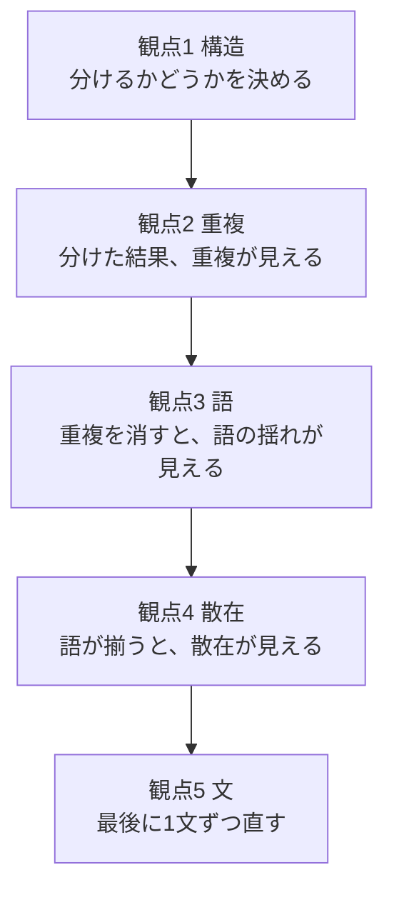

<!-- writing-guard: exempt -->
# 5観点の判定の仕方

**`SKILL.md` Step 3 の各観点について、どう判定し、どう直すかを書く。**

---

## 観点1: 読み手の窓を超えていないか

### 判定

| 見るところ | 超えている兆し |
|---|---|
| 文書全体 | 見出しの並びを読み終える前に、何の文書か分からなくなる |
| 1つの節 | 見出しが、その節の中身を言い切れていない |
| 1つの表 | 列が5つを超え、どの列を見ればよいか決まらない |

### 直し方

**「決めたこと」と「どうやったか」と「なぜそう判断したか」で分ける。**

```
決めたこと      読み手が最初に要る。本体に置く
どうやったか    疑ったときに開く。別ファイルへ出す
なぜそう判断    後から問われたときに開く。別ファイルへ出す
```

**分けたら、本体から参照を張る。**参照先の見出しは、探し物の名前と揃える。

### 失敗の例

**「除外はしない」という見出しの節へ、「外す条件」を探しに行かせる。**
見出しが「無い」と言っているので、読み手は開かない。

### 論証が循環していないか

**前の節が、後の節で決まることを使っていると、論証が循環する。**

```
悪い   §3「625件から148件を単純無作為に引くと…」
       → 148件は §5 の配分で決まる数である。§3 の時点では存在しない

良い   §3「625件から一部を単純無作為に引くと…」
       → 論証に件数は要らない
```

**章の冒頭で結論を先に置くのは、依存ではない。**
**論証の途中で使うと循環になる。**

| 場所 | 後の節の値を出してよいか |
|---|---|
| 章の冒頭の要約 ／ 流れの図 | **よい。**地図であり、論証ではない |
| 節の本文 | **その値を決める節より後でだけ使う** |

### 抽象から具体へ降りているか

**具体から書き始めると、なぜそれを選んだのかが言い残される。**

```
悪い   ## なぜ参照パスで層を作るか
       → いきなり具体。そもそもなぜ層に分けるのかが無い

良い   ## なぜ層に分けるか
       ### 単純無作為では、少数派が標本に入る保証がない   ← 抽象
       ### 層の軸が満たすべき条件                        ← 抽象
       ### 参照パスがその条件を満たす                     ← 具体
```

**見出しを読んで、抽象から具体へ降りているかを見る。**

---

## 観点2: 同じことを2か所に書いていないか

### 判定

| 種類 | 見つけ方 |
|---|---|
| 同一の文 | 文書内の全文を句点で切り、同じものが2つ無いかを数える |
| 言い換えた重複 | 同じ主張が、違う言葉で2か所に無いかを読む |
| 相互参照の空回り | A が B を指し、B に A と同じ文がある |

### 直し方

**片方を正本にし、もう片方は参照だけにする。**
**どちらを正本にするかは、読み手が最初に開く側で決める。**

### 失敗の例

**§3 が「詳しくは §5」と書き、§5 に §3 と同じ文がある。**
読み手は往復して、同じものを2回読む。

---

## 観点3: 語が揺れていないか

### 判定

**4種類の揺れがある。**

| 揺れ | 中身 | 例 |
|---|---|---|
| **同義の分裂** | 同じ意味に2つの語を当てている | 「性質」と「特徴」を同じ意味で使う |
| **同語の多義** | 違う意味に同じ語を当てている | 「被覆」を、枠が母集団を覆う意味と、標本に現れる確率の意味で使う |
| **普通名詞の占有** | 普通の日本語を役割の名前に取る | 「読み手」を役割として定義し、同じ文書で普通の名詞としても使う |
| **借用** | **別の分野の語を、断らずに当てている** | 「当たり判定」を、何を欠陥に数えるかの意味で使う |

### 直し方

**語の一覧を文書の冒頭か、別の文書に置く。**

```
使う語   何を指すか   使わない語
```

**役割の名前は、普通の文で使わない語から選ぶ。**
**標準的な意味を持つ専門用語は、その意味でだけ使う。**別の意味なら別の語にする。

**借りた語は、指す先を動作で書き直す。**
**あえて例えるなら「たとえるなら」と断る。**断らずに技術の語の位置へ置かない
（`knowledge/technical-writing-for-research-documents.md` 概念9）。

### 失敗の例

**統計で「被覆確率」は、信頼区間が真の値を含む確率を指す。**
それを「特徴が標本に現れる確率」の意味で使うと、同じ文書のなかで衝突する。

---

## 観点4: 情報が散っていないか

### 判定

| 見るところ | 散っている兆し |
|---|---|
| 表と本文 | 表の列に無い項目を、本文が論じている |
| 数値と出所 | 数値を出した節と、出所を書いた節が離れている |
| 定義と使用 | 語を定義した節と、その語を使う節のあいだに、無関係な節が挟まっている |
| 同じ対象 | 1つの対象についての記述が、3か所以上に分かれている |

### 直し方

**同じものについての記述を、1か所へ寄せる。**
寄せられないときは、寄せられない理由を書く。

### 失敗の例

**表の列が `Purpose` の有無だけなのに、本文が「Requirement を1つ以上持つ割合」を論じる。**
読み手は、その数字を表から確かめられない。

---

## 観点5: 日本語として読めるか

### 判定

**禁止として当てない。**日本語は主語を省くのが普通で、体言止めも見出しや表では自然である。
**復元できるかどうかで見る。**

| 見るもの | 判定 |
|---|---|
| **主語** | その文の主語が何かを、文だけを読んで言えるか |
| **述語** | 説明の文が体言で終わって、動作の主が消えていないか |
| **目的語** | 省いた「何を」を、文脈から一意に復元できるか |
| **1文1義** | 1文が2つ以上の命題を運んでいないか |
| **名詞の連結** | 初めて見る語を4つ以上つなげていないか |
| **指示語** | 指す先が離れていないか。候補が複数ないか |
| **接続** | 「〜が、」で意味の違う2文をつないでいないか |

| 自然な場所 | 例 |
|---|---|
| **体言止め** | 表のセル ／ 見出し ／ 箇条書き |
| **主語の省略** | 直前の文と主語が同じとき ／ その文書のなかで主語が一つに定まるとき |
| **倒置** | 主語と述語が近いとき。強調の技法である |

#### 3つに分解して確かめる

**見出しと導入文は、必ず分解する。**
主語・目的語・述語のどれかが出てこなければ、その文は書き直す。

```
本研究は ／ 仕様の性質を ／ 使う          主語・目的語・述語がある
判定者は ／ 11項目すべてを ／ 当てる      主語・目的語・述語がある

先行研究が示した性質を、11項目そのまま使う   使うのは誰か
項目は落とさず、増やさない                 落とさないのは誰か
```

**省いてよいのは2つの場合である。**

```
直前の文と主語が同じ                判定者は … 当てる。そして … 記録する
その文書のなかで主語が一つに定まる  自分の研究の話だと分かる文書で
                                    「本研究は」を繰り返さない
```

**分解して主語が復元できないときだけ、書き足す。**

### 直し方

| 悪い | なぜ悪いか | 良い |
|---|---|---|
| **判定の仕方。**その語が何を指すかを見る | 体言止めで、次の文との関係が決まらない | **次の問いで判定する。**その語が何を指すかを見る |
| 前提は破れる。破れるのは、仕様の情報構造が原因で、AIが読んだ仕様と生成した実装が食い違い、実践者がその食い違いに触れないまま承認するからである | 1文に主語が3つ移り、3つの命題が入っている | **仕様が実装を説明できなくなる原因は、2つある。**1つは〜である。もう1つは〜である |
| 仕様の必須説明範囲から外している | 名詞を4つ連ねている | 仕様が必ず説明すべきものから外している |
| 小さい層を全数にすることを悉皆層と呼び、層化抽出の標準的な扱いである | 「呼び」で繋いだまま、主語が「こと」から「扱い」へ移る | **小さい層を全数に近づける層を、悉皆層と呼ぶ。**これは層化抽出の標準的な扱いである |
| なぜ「はず」と言えるのか | 語尾を鉤括弧で括って、名詞のように使っている。何を指すかが決まらない | そう言える根拠 |
| この「はず」の検定である | 同上 | この予想が成り立つかを確かめる |

---

## 検査の順序

**観点1から順に当てる。順序には理由がある。**



**観点5から始めない。**
**文を磨いても、構造が悪ければ読めないままである。**

**そして、直したあとにもう一度観点1から当てる。**
節を分けると参照が切れ、語を変えると別の箇所と揃わなくなる。
