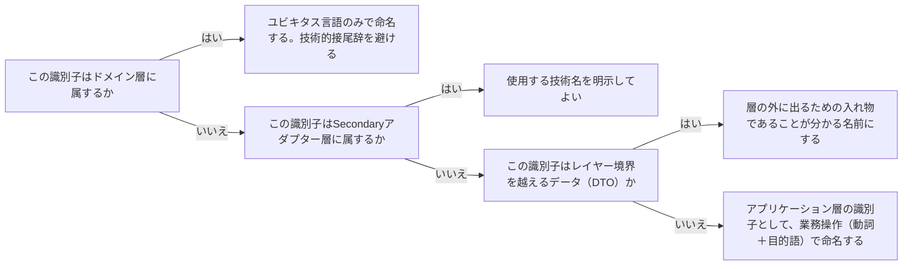

# レイヤーの命名規約を定める概念：architecture-layer-naming-convention

## 概要

### この概念が答える判断

- レイヤーごとにクラス名・モジュール名はどう命名すべきか？
- ドメイン層の識別子に技術的な接尾辞（Impl・DTO・Entity等）をつけてよいか？
- 同じ概念が複数の層に登場するとき、名前を変えるべきか、揃えるべきか？

レイヤー間の依存方向・境界を名前そのもので可視化するための命名原則。ユビキタス言語の一貫性を、レイヤーをまたいでも壊さないための実践的なルール。

---

## 原則

- ドメイン層の識別子（クラス名・メソッド名）は、業務エキスパートに通じる言葉（ユビキタス言語）だけで構成し、技術的な接尾辞（Impl・DTO・Manager・Helper等）を持ち込まない——技術的な接尾辞は、その概念がドメインの言葉ではなく実装の都合で存在していることの兆候である。
- 一方、Secondaryアダプター層の識別子は、実装技術を明示してよい（例：PostgresShipmentRepository）——アダプターはポートの実装詳細を担うことが責務そのものであり、その技術を隠す理由がない。
- 同じ概念がレイヤーをまたいで異なる型（ドメインの集約・DTO・DBレコード）として複数回登場する場合、それぞれの型の名前は「その層における役割」を表すべきで、無理に1つの名前に統一する必要はない——ただし指し示す概念（ユビキタス言語上の同一性）が保たれていることは、命名やマッピングコードで明示すべきである。

---

## 分類

| 分類 | 特徴 |
|---|---|
| ドメイン層の識別子 | ユビキタス言語のみ。技術的接尾辞を避ける（例：Shipment、Shipmententityとしない） |
| アプリケーション層の識別子 | ユースケース名は動詞＋目的語の業務操作として命名する（例：RequestPickup） |
| Secondaryアダプター層の識別子 | 使用する技術を明示してよい（例：PostgresShipmentRepository、InMemoryShipmentRepository） |
| レイヤー境界を越えるデータ（DTO）の識別子 | 層の外に出るための入れ物であることが分かる命名にする（例：ShipmentStatusResponse） |

---

## 判断基準

---

## 実例

架空の物流プラットフォームで、ドメイン層の集約は`Shipment`（技術的接尾辞なし）。これを永続化するSecondaryアダプターの実装クラスは`PostgresShipmentRepository`（技術名を明示）。APIレスポンスとして返すDTOは`ShipmentStatusResponse`（越境用であることが分かる命名）。同じ「配送」という概念が3つの型として登場するが、それぞれの名前は各層での役割を表しており、`Shipment`という業務語彙はドメイン層でのみ純粋に保たれている。

---

## アンチパターン

| アンチパターン | 問題点 |
|---|---|
| ドメイン層のクラス名に`ShipmentEntity`・`ShipmentImpl`のような技術的接尾辞をつける | 技術実装の都合がドメインの語彙に混入し、業務エキスパートが読んでも実装の言葉に見えてしまう |
| DTOとドメインオブジェクトを同じクラス名で使い回す | どちらの層の型かが名前から判別できず、レイヤー境界を越える際の越境ルール違反を誘発しやすくなる |

---

## 出典・根拠の透明性

クリーンアーキテクチャ・ヘキサゴナルアーキテクチャの命名原則と、DDDのユビキタス言語原則（一語一義・業務用語のみ）の交差点をAIが総合し、has-udd独自にまとめたものである。ユビキタス言語そのものの原則はddd-advisorの`ubiquitous-language.md`が扱い、本ファイルはそれをレイヤー横断の命名規約として実務適用する部分のみを扱う（[[brainstorm-platform-engineering-application]] 論点11拡張を受けて着手）。

---

## 関連概念

| 関連概念 | 関係 |
|---|---|
| architecture-cross-layer-data-shape | DTOの命名はレイヤー境界を越えるデータの形と対になる判断 |
| architecture-dependency-direction | 命名だけで層の帰属が判別できることは、依存方向の検証を人間にとって容易にする |
