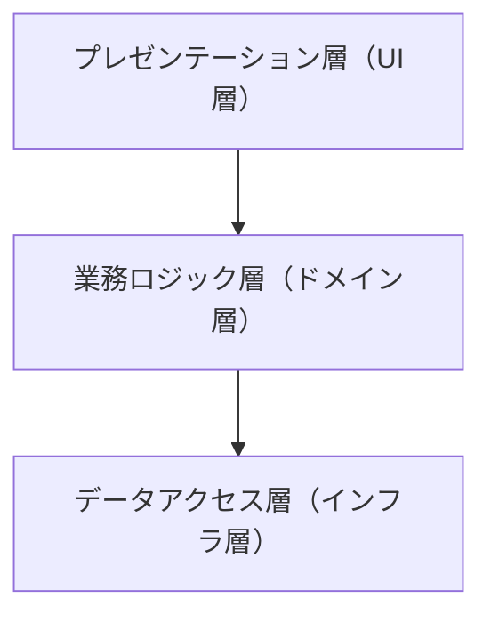
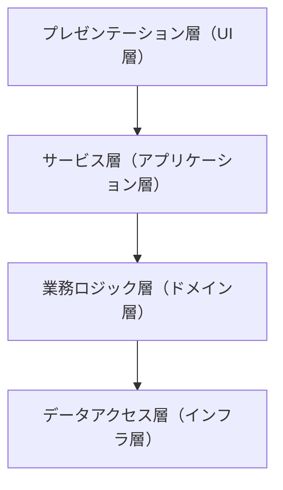
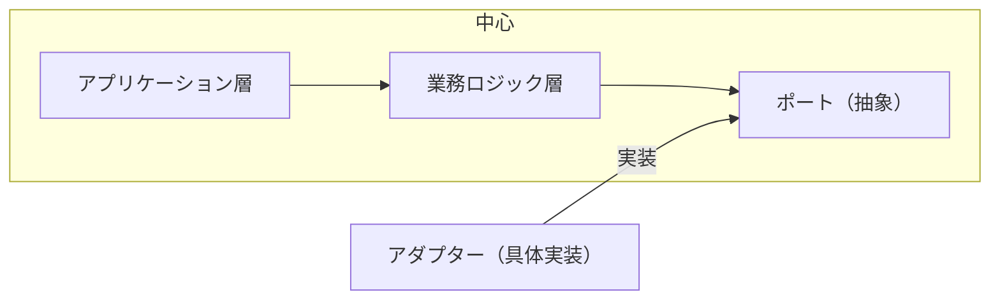
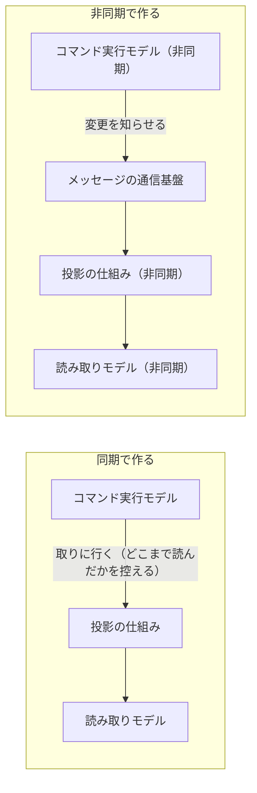
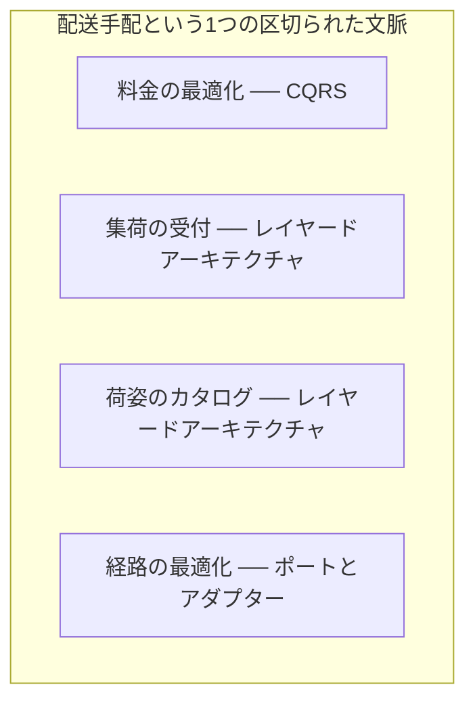
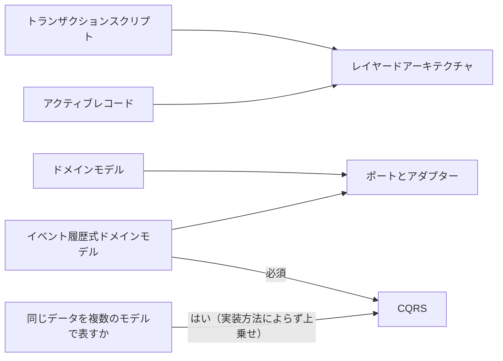

# 技術方式を扱う概念：architecture-patterns

## 概要

### この概念が答える判断

- 3つの技術方式は何が違い、どれを選べばよいか
- レイヤードアーキテクチャとポートとアダプターの依存の向きはどう違うか
- CQRS の読み取りモデルは、どう作ればよいか
- コマンドはデータを返してよいか
- 1つの区切られた文脈の中で、技術方式を混在させてよいか

コードベースの関心事——利用者とのやりとり・業務ロジック・永続化・外部との連係——をどう構造化するかの原則。レイヤードアーキテクチャ、ポートとアダプター、CQRS の3つを扱う。どれを採るかは業務ロジックの実装方法から決まり、区切られた文脈ごとではなく業務領域ごとに選べる。

---

## 出典・根拠の透明性

『ドメイン駆動設計をはじめよう』第8章の書き起こしを、粒度を保ったまま構造へ移したもの。見出しそれぞれにノードを1つ対応させ、書き起こし版で図として書かれていたものは、すべて図として持たせている。

### 留保事項

実例は著作権への配慮から架空の業務（配送手配）へ置き換え、コード例に含まれていた実在の基盤の名前は、役割を表す一般的な名前に置き換えた。図が示す依存の向きと分岐の構造は保っている。

---

## 関連概念

| 関連概念 | 関係 |
|---|---|
| business-logic-simple | レイヤードアーキテクチャが向く実装方法（手続き・1行のオブジェクト）の詳細 |
| domain-model | ポートとアダプターが向くドメインモデルの詳細 |
| event-sourced-domain-model | CQRSが必須となるイベント履歴式ドメインモデルの詳細 |
| bounded-context | 技術方式を選ぶ単位となる区切られた文脈 |
| design-heuristics | 実装方法から技術方式を決める経験則の全体像 |

---

## 技術方式

### 技術方式とは何か

コードベースにあるさまざまな関心事——利用者とのやりとり・業務ロジック・永続化・外部との連係——をどう構造化するかについての原則。業務ロジックはソフトウェアで最も重要な部分だが唯一の関心事ではなく、混在させると業務ロジックが技術的な都合に浸食されて拡散する。扱う方式は3つ——レイヤードアーキテクチャ、ポートとアダプター、CQRS。

### レイヤードアーキテクチャ

技術的な関心事にもとづいてコードを分ける方式。

レイヤードアーキテクチャの3つの層と、依存の向きを示す

上から下へ一方向に依存する。各層は直下の層だけを知っている。



| どこの話か | 図に載せきれないこと |
|---|---|
| プレゼンテーション層（UI層）から業務ロジック層（ドメイン層） | 呼び出しの向きであると同時に、依存の向きでもある。上の層は下の層を知っているが、下の層は上の層を知らない。 |
| 業務ロジック層（ドメイン層）からデータアクセス層（インフラ層） | この向きがこの方式の弱点にあたる。業務ロジックが永続化の都合を知ってしまうので、基盤を替えると業務ロジックまで波及する。ポートとアダプターは、ここだけを逆にする。 |
| 2本の矢印 | 層を1つ飛ばして下へ向かう線は描いていない。描き忘れではなく、各層は直下の層にしか依存しないという規則があるためである。 |

#### 3つの層

層ごとに呼び名が複数ある。

3つの層の呼び名と役割を並べる

同じ層が複数の名前で呼ばれるので、文献をまたぐと別のものに見える。役割で対応づける。

| 層 | 別の呼び名 | 役割 |
|---|---|---|
| プレゼンテーション層 | UI層 | 利用者とのやりとり（画面・コマンド行・API・メッセージの購読と送出）。外へ公開する入口 |
| 業務ロジック層 | ドメイン層・モデル層 | 業務ロジックを閉じ込める。実装方法（手続き／1行のオブジェクト／ドメインモデル）はここで使う |
| データアクセス層 | インフラ層 | 永続化と外部との連係（データベース・メッセージの通信基盤・ファイルの保管・外部サービス） |

#### 層のあいだの通信

上から下への一方向で、各層は直下の層にだけ依存する。層を飛ばして下へ依存することはしない。

#### サービス層

プレゼンテーション層と業務ロジック層のあいだに挟む仲介役。アプリケーション層とも呼ばれる。プレゼンテーション層は画面・コマンド行・メッセージの購読など複数ありうるので、その多様さから業務ロジックを守る論理的な境界として置く。物理的に独立したサービスではない。

サービス層を挟むと、層が4つになることを示す

プレゼンテーション層と業務ロジック層のあいだに1つ挟む。依存が一方向であることは変わらない。



| どこの話か | 図に載せきれないこと |
|---|---|
| サービス層（アプリケーション層） | 物理的に独立させたサービスではない。同じプロセスの中に引く論理的な境界である。名前に「サービス」とあるために別プロセスと読まれやすいが、そうではない。 |
| プレゼンテーション層（UI層）からサービス層（アプリケーション層） | プレゼンテーション層は1つとは限らない。画面・コマンド行・メッセージの購読など複数ありうるものを、この1本にまとめて描いている。サービス層を挟むのは、その多様さから業務ロジックを守るためである。 |

#### 層と段の違い

層は論理的な境界、段は物理的な境界を指す。同じコードを層で分けたまま、物理的には2段（アプリケーションとデータベース）や3段で配置できる。層の数と段の数は一致しない。

層と段の違いを並べる

どちらも「分ける」ことを指すが、分ける場所が違う。混同すると、論理的に分けたつもりが物理的に分けたことになる。

| 区分 | 性質 | 何を指すか |
|---|---|---|
| 層 | 論理的な境界 | 同じプロセスの中でコードを分けた構造 |
| 段 | 物理的な境界 | 別のサーバー・別のプロセスへ分けた構造 |

#### いつ使うか

手続きとして書く・1行のオブジェクトを介する、で実装する業務ロジックに向く。ドメインモデルを使う複雑な業務ロジックには向かない——業務ロジック層がデータアクセス層に依存する形になり、集約と値オブジェクトを永続化から引き離しにくいためである。

### ポートとアダプター

レイヤードアーキテクチャの弱点——業務ロジックが永続化と結びつくこと——を解く方式。

ポートとアダプターが、依存の向きを逆にしていることを示す

業務ロジック層が抽象を定義し、インフラ層がそれを実装する。矢印はインフラ層から中心へ向かう。



| どこの話か | 図に載せきれないこと |
|---|---|
| アダプター（具体実装）からポート（抽象） | この1本だけが外から中へ向かう。レイヤードアーキテクチャでは中から外へ向いていた線で、向きを逆にしたことがこの方式の核心にあたる。 |
| ポート（抽象） | 中心の側に置いてあるのは、抽象を定義するのが業務ロジック層だからである。外側が「こう呼んでほしい」と決めるのではなく、中心が「こう呼ぶ」と決める。 |
| 中心 | 囲みは配置場所ではなく、基盤の都合から切り離されている範囲を表す。中心の中身は、どの基盤を使うかを知らないまま動く。 |

#### 依存の向きを逆にする

レイヤードアーキテクチャでは業務ロジック層がデータアクセス層に依存していた。ポートとアダプターではこの向きを逆にする。業務ロジック層が外部とやりとりするための抽象（ポート）を定義し、インフラ層がそれを実装した具体（アダプター）を置く。

ポートとアダプターが、コード上でどう分かれるかを示す

抽象は業務ロジック層に置き、具体はインフラ層に置く。業務ロジック層は具体の名前を知らない。

```csharp
// ポート（業務ロジック層に置く）
public interface IEventPublisher {
    void Publish(IDomainEvent domainEvent);
}

// アダプター（インフラ層に置く）
public class QueueEventPublisher : IEventPublisher {
    public void Publish(IDomainEvent domainEvent) { ... }
}
```

#### 同じものを指す別の呼び名

呼び名が複数あるが、中身は同じである。

同じものを指す別の呼び名を並べる

呼び名が違うだけで中身は同じなので、文献ごとに別の方式だと読まないようにする。

| ここでの呼び名 | 別の呼び名 |
|---|---|
| ポートとアダプター | ヘキサゴナルアーキテクチャ・オニオンアーキテクチャ・クリーンアーキテクチャ |
| アプリケーション層 | サービス層・ユースケース層 |
| 業務ロジック層 | ドメイン層・コア層 |

#### いつ使うか

ドメインモデルを用いた業務ロジックの実装に向く。業務ロジックをすべての基盤コンポーネントから独立させたい場合に使う。

### CQRS（コマンド・クエリ責任分離）

同じデータを複数の永続化モデルで表せるようにする方式。イベント履歴式ドメインモデルと強く結びついている。

#### なぜ複数のモデルが要るか

1つのモデルですべての要求——日々の更新と、集計や分析——に応えるのは難しい。用途が違えば必要なモデルも違う。

#### 2つのモデル

状態を変える側と、参照する側を分ける。

コマンド実行モデルと読み取りモデルの違いを並べる

片方だけが真実を持つ。もう片方はそこから機械的に作られる複製にすぎない。

| モデル | 役割 | 性質 |
|---|---|---|
| コマンド実行モデル | 状態を変える操作だけを担う | 業務ロジック・規則の検証・不変条件の強制。強い一貫性。競合したら後から来たほうを弾く。真実を語る唯一の拠り所 |
| 読み取りモデル（投影） | 利用者への表示・他システムへの提供 | いくつあってもよい。投影した結果を控えておくもの（データベース・ファイル・メモリ上）。読み取り専用 |

#### 読み取りモデルの作り方

同期と非同期の2通りある。常に同期から始めることが勧められる。同期は投影の仕組みがコマンド実行モデルを取りに行き、どこまで読んだかを控えておく形で、新しい投影を足すのもゼロから作り直すのも簡単である。非同期はコマンド実行モデルが変更をメッセージの通信基盤へ知らせ、投影の仕組みが受け取って更新する形で、規模と速度に利点がある一方、順番の保証と同じ知らせが二度届くことへの対処が難しく、一貫性を保ちにくい。

読み取りモデルの作り方が2通りあることを示す

同期は投影する側が取りに行き、非同期は変更する側が知らせる。どちらも読み取りモデルへ行き着く。



| どこの話か | 図に載せきれないこと |
|---|---|
| 同期で作る／非同期で作る | 2つの囲みは選択肢だが、対等ではない。同期から始めるのが勧められる作り方で、非同期は規模や速度の要求が出てから足すものである。 |
| コマンド実行モデルから投影の仕組み（取りに行く） | どこまで読んだかを控えておくので、投影をゼロから作り直せる。新しい読み取りモデルを後から足すのが簡単なのは、この一点による。 |
| メッセージの通信基盤 | この経路が入ることで、順番が入れ替わる・同じ知らせが二度届くという問題が生じる。図では1本の線だが、そこに一貫性を保つ難しさが集まっている。 |
| 読み取りモデル／読み取りモデル（非同期） | 同じものを2つ描いてあるが、別々のものではない。作り方の違いを並べるために分けている。 |

#### コマンドはデータを返せる

コマンドは何も返さない、というのはよくある誤解である。返してよい。ただし返すデータはコマンド実行モデルを元にすること。読み取りモデルから取って返すと、コマンドとクエリを分けた意味が失われる。

#### いつ使うか

同じデータをもとに複数のモデルを扱う必要がある場合に使う。イベント履歴式ドメインモデルを使うシステムでは必須になる——集約の状態にもとづいて参照できないためである。

### 技術方式が及ぶ範囲

技術方式は、1つの区切られた文脈の全体を1つに決めるものではない。複数の業務領域を含む区切られた文脈では、業務領域ごとに異なる技術方式を混在させてよい。適切な垂直の境界を定義し、それぞれに適した技術方式を採ることが重要である。この垂直の論理的な境界は、将来さらに細分化した区切られた文脈の物理的な境界へ引き直せる。

1つの区切られた文脈の中で、業務領域ごとに技術方式が違ってよいことを示す

4つの業務領域が同じ文脈に属しながら、それぞれ別の技術方式を採っている。



| どこの話か | 図に載せきれないこと |
|---|---|
| 配送手配という1つの区切られた文脈 | 囲みの中に線が1本も無いが、4つが無関係という意味ではない。この図は技術方式の割り当てだけを示していて、業務領域どうしの関係は扱っていない。 |
| 集荷の受付 ── レイヤードアーキテクチャ／荷姿のカタログ ── レイヤードアーキテクチャ | 同じ技術方式が2つ現れるのは、揃えたからではなく、それぞれ別々に判断した結果として同じになったからである。 |
| 4つの業務領域 | この区切り方は、将来そのまま別々の区切られた文脈へ分けるときの切れ目にもなる。いまは論理的な境界だが、物理的な境界へ引き直せる。 |

### 3つの対比

特徴と向いている実装方法で並べる。

3つの技術方式を、特徴と向いている実装方法で対比する

どれが優れているかではなく、業務ロジックの実装方法によってどれが要るかが変わる。

| 技術方式 | 特徴 | 向いている実装方法 |
|---|---|---|
| レイヤードアーキテクチャ | 技術的な関心事で分ける。業務ロジックが永続化と結びつく | 手続きとして書く・1行のオブジェクトを介する |
| ポートとアダプター | 依存の向きを逆にする。業務ロジックを基盤から切り離す | ドメインモデル |
| CQRS | 同じデータを複数のモデルで表す | イベント履歴式ドメインモデル（必須）・複数の永続化モデルが要る場合 |

### どの技術方式を選ぶか

業務ロジックの実装方法から決まる。

どの技術方式を選ぶかを、業務ロジックの実装方法から決める

実装方法が決まれば技術方式も決まる。永続化モデルを複数持ちたい場合だけ、CQRSが上乗せされる。



| どこの話か | 図に載せきれないこと |
|---|---|
| イベント履歴式ドメインモデルからCQRS（必須） | 他の線と違い、選択の余地が無い。集約の状態にもとづく参照ができないので、CQRSが無いと成り立たない。 |
| イベント履歴式ドメインモデルからCQRS／イベント履歴式ドメインモデルからポートとアダプター | 2本出ているのは、どちらかを選ぶという意味ではない。両方を同時に採る。 |
| 同じデータを複数のモデルで表すか | 左の4つから切り離してあるのは、実装方法によらない独立した問いだからである。どの実装方法から来てもこの問いには当たり、「はい」なら CQRS が上乗せされる。 |
| レイヤードアーキテクチャへ入る2本 | トランザクションスクリプトとアクティブレコードで、層の数が違う。前者は3層、後者はサービス層を足した4層になる。図では同じ終点に見える。 |

### アンチパターン

技術方式の選び方でよく起きる誤り。

#### ドメインモデルにレイヤードアーキテクチャを使う

業務ロジックとデータアクセスが結びつき、ためすのが難しくなる。外部の基盤を替えると業務ロジックまで波及する。

#### 非同期の投影だけを使う

順番の入れ替わりと二重の処理が一貫性を損なう。同期を基本にして、必要に応じて非同期を足す。

#### コマンドから読み取りモデルのデータを返す

コマンドとクエリを分けた意味が失われる。コマンドが返すデータはコマンド実行モデルを元にする。
