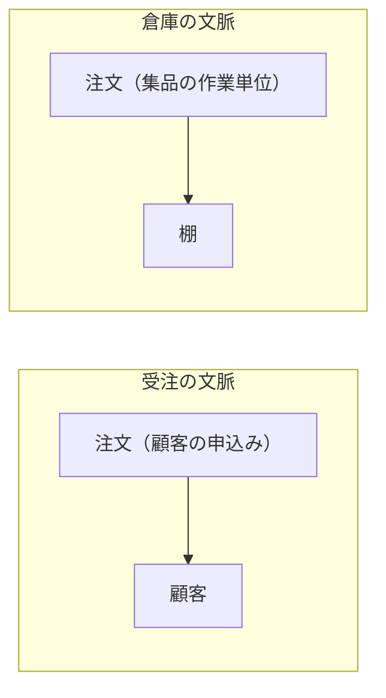
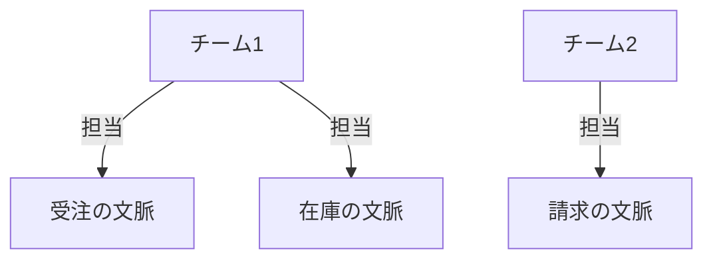

# 境界づけられたコンテキストの概念そのものを扱う：bounded-context

## 概要

### この概念が答える判断

- 一つの言葉が複数の意味を持つとき、どうするか
- 区切られた文脈の大きさはどれくらいにするか
- 業務領域と区切られた文脈を1対1に対応させるべきか
- 業務領域の分割と、区切られた文脈の分割は何が違うのか
- 一つの文脈を複数のチームで担当してよいか

同じ言葉が一貫した意味を持ち続けられる範囲を定義した境界。モデルの境界であり、同時にシステムを実装する単位・チームの所有権の単位でもある。

---

## 出典・根拠の透明性

『ドメイン駆動設計をはじめよう』第3章の書き起こしを、粒度を保ったまま構造へ移したもの。見出しそれぞれにノードを1つ対応させている。

### 留保事項

実例は著作権への配慮から、書籍固有の企業例を避けた一般的な題材で書いている。ただし図が示す関係の構造は原文のまま保っている。

---

## 関連概念

| 関連概念 | 関係 |
|---|---|
| ubiquitous-language | 区切られた文脈の内側で一貫性を保つ同じ言葉 |
| subdomain | 区切られた文脈が対応する業務活動の単位 |
| business-domain | 区切られた文脈が属する事業全体 |

---

## 区切られた文脈（Bounded Context）

### 区切られた文脈とは

同じ言葉（ユビキタス言語）が通用する範囲を定義した境界。モデルの境界であり、同時にシステムを実装する単位の境界でもある。同じ言葉を一貫した意味で使えるのは、区切られた文脈の内側だけである。

### なぜ必要か

一つの言葉が文脈によって異なる意味を持つことがある。同じ言葉を文脈ごとに小さく分割し、それぞれの文脈へ割り当てることで解く。事業活動がそれなりの規模になれば、言葉の意味が衝突し文脈が暗黙化するのは本来の姿であり、区切られた文脈はその暗黙の文脈を明確にする方法である。

同じ言葉が文脈ごとに別の意味を持つことと、文脈を区切ればそれが解けることを示す

「注文」という同じ言葉が、受注の文脈では顧客が出した申込みを指し、倉庫の文脈では棚から品を集める作業の単位を指す。文脈を分けることで、それぞれの内側で言葉の意味が一つに定まる。

| どこの話か | 図に載せきれないこと |
|---|---|
| 受注の文脈／倉庫の文脈 | 組織やシステムの区切りではなく、言葉の意味が一つに定まる範囲を表す。同じチームが両方を担当していてもよい。 |
| 注文（顧客の申込み）／注文（集品の作業単位） | 括弧の中は説明であって、業務で使う名前ではない。実際にはどちらも「注文」と呼ばれ、どちらの文脈にいるかだけが両者を区別する。 |
| 2つの囲みのあいだ | 線が無いのは無関係という意味ではない。この図は文脈の内側の話をしていて、文脈どうしをどうつなぐかは別の話になる。 |

### 文脈の境界

モデルには必ず境界がある。境界を広げすぎるとそのモデルは役に立たなくなる。区切られた文脈は、個々の課題領域に特化したモデルを作るための手法であり、同じ言葉の一貫性を保つための境界でもある。

#### 地図のたとえ

建物の意匠図・構造図・設備図は、それぞれ異なる目的に特化したモデルであり、設備図を見ても柱がどこまで細くできるかは判断できない。同じ言葉も同様で、ある文脈で使われる言葉が別の文脈ではまったく役に立たないことがある。

### 同じ言葉の定義（改良版）

「同じ言葉」は組織全体で統一した言葉という意味ではない。通用する範囲は区切られた文脈の境界の内部に限定され、文脈ごとの固有のモデルを表現することに焦点を合わせる。同じ言葉を定義・利用するには、その言葉が通用する範囲を明確にした区切られた文脈が要る。

### 区切られた文脈の大きさ

大きさ自体は重要ではなく、モデルが役に立つかどうかが基準になる。同じ言葉の一貫性に注目することで、その言葉が通用するもっとも広い範囲を特定できる。それ以上広げると一貫性が失われる。大きな文脈を小さく切り分ける理由は、開発チームを増やす場合・非機能要件に対応するために開発単位を分ける場合・スケールアウトが必要な機能を切り離す場合。

### 業務領域と区切られた文脈の関係

業務領域の「分割」と、区切られた文脈の「分割」は目的が異なる。

#### 業務領域 ── 発見

事業活動を分析し、業務領域を中核・補完・一般に分類する。企業がどのように競合他社と差別化を図ろうとしているかを明らかにする作業であり、事業活動とシステムへの要求事項からユースケースを定義するのは事業側の役割。ソフトウェア技術者は事業活動を分析して業務領域とそのカテゴリーを識別する。

#### 区切られた文脈 ── 設計

モデルの境界をどう選ぶかは設計判断である。ソフトウェア設計の視点から、どのように事業活動を小さく扱いやすい単位に分割するかを決める。業務領域は事業方針によって決まる構造だが、区切られた文脈はプロジェクトの目的と制約条件に合わせてソフトウェア技術者が決定できる。

#### 業務領域と区切られた文脈の対応

一対一に対応させることが最善の場合もあるし、別の方針で分割することが役立つ場合もある。小さなシステムなら単一の文脈で開発でき、モデルの不整合が見つかれば複数へ分割し、さらに業務領域ごとに細分化することもできる。重要なのは、同じデータに対して操作を行うユースケースの集まりを特定し、その集まりを複数の区切られた文脈へ分散させないこと。また、一つの業務領域でも課題が複数あれば課題ごとに別のモデルを作るほうがよいことがあり、「一つの業務領域に一つのモデル」という固定観念は持たない。

### 文脈の境界が決めるもの

区切られた文脈は、システムの物理的な境界と、システムの所有権の境界を決める手法である。

#### 物理的な境界

区切られた文脈はモデルの境界を定義し、同時にシステムを実装する単位を定義する。独立したサービスまたはプロジェクトとして実装し、他の文脈から切り離して開発・変更・バージョン管理する。一つの文脈が複数の業務領域を含む場合、物理的には単一の境界、論理的には複数の業務領域の境界（名前空間・モジュール・パッケージで表現）になる。

#### 所有権の境界

一つの区切られた文脈の開発・変更・保守を担当するのは一つのチームである。複数のチームが一つの文脈を担当してはいけない（一つのソフトウェアに異なるモデルが無意識に混入するのを防ぐため）。チームと文脈の関係は単方向で、一つのチームが複数の文脈を所有することはできる。お互いのモデルとシステムをどう連係させるかの約束事は明示的に決める。

チームと文脈の担当関係が単方向であることを示す

1つのチームが複数の文脈を担当することはできるが、1つの文脈を複数のチームが担当することはできない。関係は単方向である。

| どこの話か | 図に載せきれないこと |
|---|---|
| チーム1から受注の文脈／チーム1から在庫の文脈 | 手が回るという意味ではなく、担当してよいという規則を表す。 |
| 受注の文脈 | ここへチーム2からも線を引く形は、この規則では禁じられる。図にはできる形だけを描いているので、できない形は図に現れない。 |

### 現実世界の区切られた文脈

区切られた文脈は事業活動や業務領域のように明白には存在しない。しかし業務エキスパートの頭の中に、業務のとらえ方として存在する。業務エキスパートが事業活動に関わるヒト・モノ・コトをどのようにとらえているかを意識することで把握できる。

#### 言葉の意味論

区切られた文脈は、言語学の「意味論的な領域」にもとづく。意味論的な領域とは、言葉が同じ意味で使われる範囲のことである。

同じ言葉が文脈ごとに別の意味を持つことを、身近な例で示す

「当日」は、受注の文脈では注文が入った日、倉庫の文脈では集品を行う日、会計の文脈では売上を計上する日、利用者の文脈では荷物が届く日を指す。どれも誤りではなく、それぞれの文脈の内側で正しい。言葉の意味は文脈が決める。

| 文脈 | 「当日」の意味 |
|---|---|
| 受注の文脈 | 注文が入った日 |
| 倉庫の文脈 | 棚から品を集める作業を行う日 |
| 会計の文脈 | 売上を計上する日 |
| 利用者の文脈 | 荷物が届く日 |

#### 両立しないモデルが、それぞれの文脈で役に立つ

同じ工事に対して、概算の見積りと詳細の見積りは異なる金額を出す。概算は商談の初期に、詳細は着工前に役に立つ。数字が食い違うからどちらかが誤りだ、とはならない。知識の本当の評価基準は真理かどうかではなく、役に立つかどうかである。

#### 大きなモデルを1つ作らない

新しいサーバーラックが機械室の扉を通るかを確かめるのに、建物の3次元モデルを作るのは明らかに過剰である。床に引いた幅の印と、扉の高さを測ったメモという2つの小さなモデルで足りる。個別の課題を解決するシンプルなモデルを組み合わせて目的を達成できるなら、「何にでも手を出して、どれもちゃんとできていない」単一の入り組んだモデルは要らない。

### アンチパターン

区切られた文脈でよく起きる誤り。

#### 組織全体で同じ言葉を統一しようとする

「同じ言葉」は組織全体の共通言語ではない。文脈の外では一貫性を強制しなくてよい。無理に統一しようとすると、業務ごとのモデルの独立性が失われる。

#### 複数のチームで一つの区切られた文脈を担当する

複数チームが担当すると、一つのソフトウェアに異なるモデルが無意識に混入する。通信規約を明示せず暗黙の依存が生まれる。一つの文脈は一つのチームが所有する。

#### 区切られた文脈を細かく分割しすぎる

細分化しすぎると、それらを組み合わせて全体を組み立てることがやっかいになる。大きさは「モデルが役に立つか」で判断する。

#### 一つの業務領域に一つのモデルという固定観念

業務領域と区切られた文脈を1対1に限定すると課題解決の柔軟性が失われる。一つの業務領域に複数の課題があれば、課題ごとに別のモデルを作ったほうがよい場合がある。
