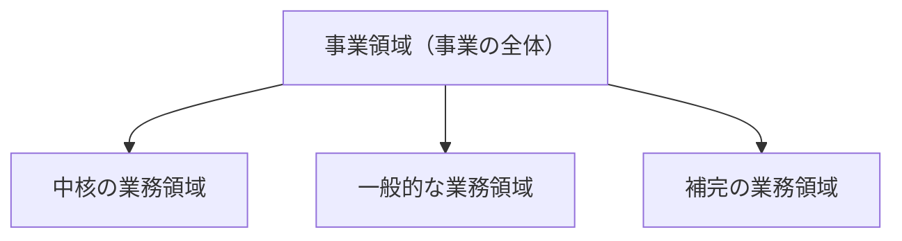
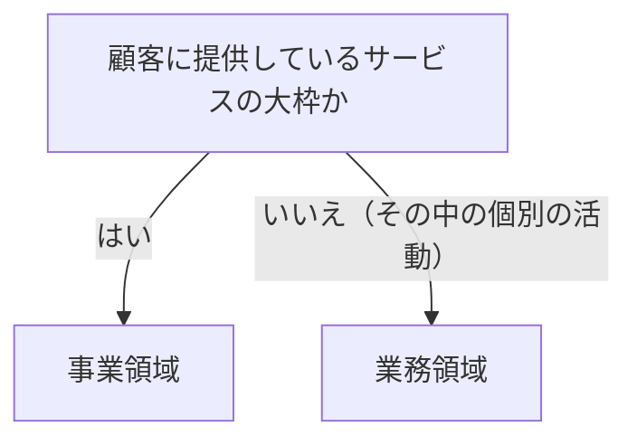

# 事業領域を扱う概念：business-domain

## 概要

### この概念が答える判断

- これは事業領域か、その中の業務領域か
- 1つの会社が複数の事業を営んでいるとき、どう分析するのか
- いま分析している事業領域は、この先も同じままか

企業が事業活動を展開する領域。顧客に提供するサービスの大枠であり、複数の業務領域から構成される。会社と1対1で対応するとは限らず、時とともに移り変わることもある。分析はこの単位で区切って始める。

---

## 出典・根拠の透明性

『ドメイン駆動設計をはじめよう』の書き起こしを、粒度を保ったまま構造へ移したもの。見出しそれぞれにノードを1つ対応させ、図として書かれていたものは図として持たせている。

### 留保事項

実在の企業名と、実在企業の実際の沿革は、著作権への配慮からすべて架空の会社へ置き換えた。示している構造——1社が複数の事業領域を持つ場合があること、事業領域が時とともに移ることがあること——は保っている。

---

## 関連概念

| 関連概念 | 関係 |
|---|---|
| subdomain | 事業領域を構成する個々の業務活動の単位 |
| bounded-context | 業務領域をソフトウェアとして実装するときの境界 |
| domain-expert | この領域の活動に精通している人たち |

---

## 事業領域

### 事業領域とは何か

企業が事業活動を展開する領域。顧客に提供するサービスの大枠にあたり、複数の業務領域から構成される。

### 事業領域の構造

1つの事業領域の中身が、中核・一般・補完の3種類の業務領域に分かれる。

事業領域が、複数の業務領域から成ることを示す

事業領域は器で、その中身が3種類の業務領域に分かれる。

| どこの話か | 図に載せきれないこと |
|---|---|
| 3本の矢印 | 業務領域が3つあるという意味ではない。分類が3種類あるという意味で、1つの分類の下に業務領域がいくつあってもよいし、ある分類に当てはまる業務領域が1つも無いこともある。 |
| 事業領域（事業の全体） | 会社と1対1で対応するとは限らない。1つの会社が複数の事業領域を持つこともあり、その場合は事業領域ごとに別々に業務領域を分析する。 |
| この図全体 | 階層に見えるが、上下の関係は分解であって、指揮や依存の関係ではない。 |

### 会社と事業領域は1対1ではない

1つの会社が複数の事業領域を持つことがある。その場合、事業領域ごとに独立して業務領域の分析を行う。まとめて1つとして扱うと、性質の違う活動が同じ器に入り、分類が定まらなくなる。

会社の種類ごとに、事業領域がどう置かれるかを並べる

1つの会社が複数の事業領域を持つ場合があり、そのときは事業領域ごとに分析を分ける。

| 会社の例（架空） | 事業領域 |
|---|---|
| 荷物を届ける会社 | 宅配のサービス |
| 喫茶店を営む会社 | 飲食のサービス |
| 通販と、計算資源の貸出を両方営む会社 | 通販／計算資源の貸出（2つ） |
| 移動の仲介と、料理の配達を両方営む会社 | 移動の仲介／料理の配達（2つ） |

### 事業領域は変わる

いま何を主力にしているかは、その会社の始まりとは限らない。たとえば印刷業として創業した会社が、紙の需要が減るのを受けて包装材の製造へ移り、いまは物流の梱包設計を主力にしている、というような移り変わりが起きる。分析の対象は現在の事業領域であって、社名や沿革ではない。

### 事業領域か業務領域か

顧客に提供しているサービスの大枠かどうかで見分ける。

事業領域か業務領域かを、1つの問いで見分ける

顧客に提供しているサービスの大枠かどうかだけで決まる。

| どこの話か | 図に載せきれないこと |
|---|---|
| 顧客に提供しているサービスの大枠か | 規模の大小では決まらない。小さな会社の事業領域が、大きな会社の1つの業務領域より小さいことは普通にある。 |
| 業務領域 | この終点へ来たものは、さらに中核・一般・補完のどれかへ分類する段階に進む。見分けはここで終わりではない。 |

### アンチパターン

事業領域の扱いでよく起きる誤り。

#### 事業領域と業務領域を混同する

通販を営む会社にとって「通販」は事業領域であり、その中の「商品の推薦」「物流の管理」「決済」が業務領域である。粒度を取り違えると、設計の起点そのものが狂う。
