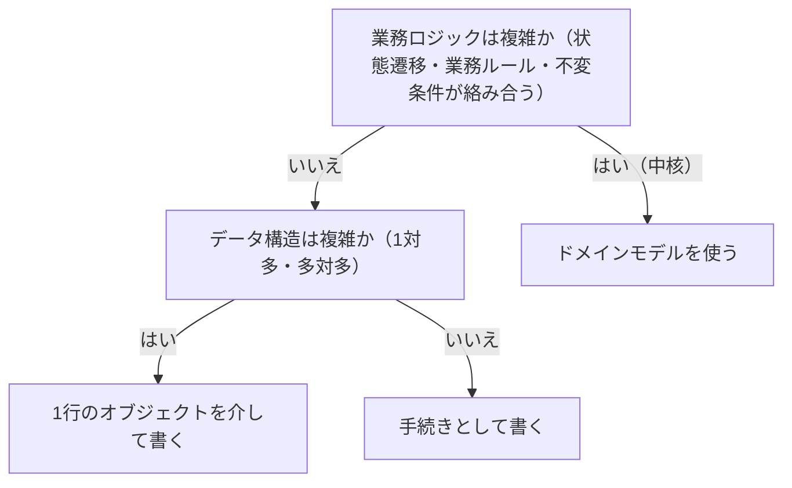

# シンプルな業務ロジックの扱い方を定める概念：business-logic-simple

## 概要

### この概念が答える判断

- 手続きとして書く方法と、1行のオブジェクトを介する方法のどちらを選ぶか
- この実装方法をどの業務領域に使ってよいか
- トランザクション管理で、何をまちがえやすいか
- 業務ロジックが複雑になったら、どう見分けるか

業務ロジックが単純な場合に適した2つの実装方法——手続きとして書く方法と、データベースの1行を表すオブジェクトを介して書く方法。どちらも補完的・一般的な業務領域に使い、中核には使わない。

---

## 出典・根拠の透明性

『ドメイン駆動設計をはじめよう』第5章の書き起こしを、粒度を保ったまま構造へ移したもの。見出しそれぞれにノードを1つ対応させている。

### 留保事項

コードの題材は著作権への配慮から架空の業務（配送の依頼）へ置き換え、人名・書名は落とした。コードが示す構造（手続きの順序・トランザクションの括り方・オブジェクトを介する形）は保っている。

---

## 関連概念

| 関連概念 | 関係 |
|---|---|
| subdomain | 実装方法の選択は業務領域のカテゴリーに依存する |
| domain-model | 複雑な業務ロジックに対応する実装方法 |
| bounded-context | 手続きとしての実装は、モデル変換にも使われる |

---

## 単純な業務ロジックの実装

### この実装方法が扱う範囲

業務ロジックはソフトウェアでもっとも重要な部分だが、業務領域のカテゴリーが異なれば戦略的な重要性と複雑さが異なる。ここで扱うのは、業務ロジックがかなり単純な場合に適した2つの実装方法である。

### トランザクションスクリプト

外部からの要求を処理する手順の中に、業務ロジックを埋め込む実装方法。システムが公開するインターフェースは、利用者が実行できる業務処理の集まりと見なせる。データ操作の手続きを、順次処理のスクリプトとして書く。処理手続きが満たすべき唯一の要件はトランザクション管理で、完全に成功するか完全に失敗するかのどちらかで終わる。

手続きを順に並べただけの実装がどう見えるかを示す

取り出す・変換する・書き出す・完了を記録する、という手順が上から順に並ぶ。抽象化は最小限で、読めば何が起きるか分かる。この形が満たすべき唯一の要件は、全部成るか全部成らないかで終わること。

```csharp
DB.StartTransaction();
var job = DB.LoadNextJob();
var csv = LoadFile(job.Source);
var records = ConvertCsvToRecords(csv);
WriteFile(job.Destination, records.ToString());
DB.MarkJobAsCompleted(job);
DB.Commit();
```

#### トランザクション管理の落とし穴

見た目は単純だが、トランザクション管理の誤った実装が多くの問題の原因になる。

複数の更新をひとつのトランザクションにまとめない形と、まとめた形を対比する

上の書き方では、1つ目が成功して2つ目が失敗したとき、配送の状態だけが進んで記録が残らない。下の書き方なら、どちらも成るか、どちらも成らないかになる。

```csharp
// 2つの操作がバラバラのトランザクション
_db.Execute("UPDATE Shipments SET status=@p1 WHERE shipment_id=@p2", s, id);
_db.Execute("INSERT INTO StatusLog(shipment_id, status) VALUES(@p1, @p2)", id, s);

// ひとつのトランザクションとして管理
_db.StartTransaction();
try {
    _db.Execute("UPDATE Shipments ...");
    _db.Execute("INSERT INTO StatusLog ...");
    _db.Commit();
} catch { _db.Rollback(); throw; }
```

##### トランザクション管理の欠落

複数の更新処理をひとつのトランザクションとして管理しないと、処理の途中で障害が発生したときにデータの不整合が起きる。

##### 分散トランザクション

複数のデータベースにまたがる操作や、書き込みと外部への送出を組み合わせた操作は分散トランザクションになる。仕組みが複雑で規模を広げにくく、失敗も起きやすい。多くの場合、分散トランザクションは使わない。

##### 暗黙的な分散トランザクション

一見すると単一のデータベースへの単純な操作に見えても、呼び出し元へ結果を返すこと自体が含まれるため、実質的に分散トランザクションになる。呼び出し元が結果を受け取れずにやり直すと、更新が二重に効く。対処のひとつは、同じ操作を繰り返しても結果が変わらないようにすること。

#### トランザクションスクリプトをいつ使うか

向いているのは、手続き的なデータ操作だけという単純な問題領域、データの抽出と変換と書き出し、補完的な業務領域、一般的な業務領域に導入した外部サービスとの連係、そして区切られた文脈をつなぐモデル変換の一部。中核の業務領域には使ってはいけない——複雑な業務ロジックに対応できない。よい点は単純さで、抽象化は最小限、実行時の負荷も小さく、読めば分かる。欠点は、業務ロジックが複雑になるとあちこちのスクリプトで同じロジックを重複して書くことになり、一貫性が保てなくなること。

### アクティブレコード

データベースの1行を表すオブジェクトを介して業務ロジックを書く実装方法。そのオブジェクトはデータベース操作をカプセル化し、データに関連する業務ロジックを持つ。トランザクションスクリプトとの違いは、複雑なデータ構造（1対多・多対多）を扱えること。名前は「データ構造を表すオブジェクト自身が能動的にデータを操作すること」に由来する。

アクティブレコードを使っても、業務ロジックは手続きとして書かれることを示す

手続きがデータベースを直接触るのではなく、1行を表すオブジェクトを作って値を入れ、保存を呼ぶ。全部成るか全部成らないかの管理は、依然として手続きの側にある。

```csharp
public class RegisterShipment {
    public void Execute(ShipmentDetails details) {
        _db.StartTransaction();
        try {
            var shipment = new Shipment();   // 1行を表すオブジェクト
            shipment.Receiver = details.Receiver;
            shipment.PostalCode = details.PostalCode;
            shipment.Save();                 // 保存
            _db.Commit();
        } catch { _db.Rollback(); throw; }
    }
}
```

#### 業務ロジックは依然として手続きとして書く

アクティブレコードを使う場合も、業務ロジックはトランザクションスクリプトとして書く。ただし手続きがデータベースを直接操作するのではなく、1行を表すオブジェクトを操作する。典型的な使い方は、データ構造と振る舞いの分離である——オブジェクトが値の出し入れを公開し、外部の手続きがその値を変更する。

#### アクティブレコードをいつ使うか

本質的にはトランザクションスクリプトであり、主な目的はデータベース操作の最適化。補完的な業務領域、一般的な業務領域向けの外部サービスとの連係、区切られた文脈どうしを連係するモデルの変換に使う。

#### 貧血ドメインモデルという批判について

アクティブレコードは「貧血ドメインモデル」と呼ばれるアンチパターンとして知られているが、設計手法として否定的に扱うのは避けたい。業務ロジックが単純な場合にこれを使うことに問題はない。むしろ業務ロジックが単純な場合、手の込んだ設計で実装するほうが不必要な複雑さを持ち込む。

#### 設計パターンであって、枠組みの名前ではない

ここで説明しているのは設計パターンであり、同じ名前を持つ特定の枠組みの機能ではない。設計パターンが先にあり、その実装のひとつとして後から枠組みが生まれた。

### 2つの実装方法の対比

扱えるデータ構造と、向き不向きで並べたもの。

2つの実装方法を、扱えるデータ構造と向き不向きで対比する

違いはデータ構造の複雑さだけで、業務ロジックはどちらも手続きとして書く。どちらも中核の業務領域には向かない。

```markdown
| 観点 | 手続きとして書く | 1行のオブジェクトを介して書く |
|---|---|---|
| データ構造 | 平ら | 複雑（1対多・多対多） |
| データベースの操作 | 直接 | オブジェクト経由 |
| 業務ロジックの記述 | 手続きの中 | 手続きの中（オブジェクトを操作） |
| 向いている領域 | 補完・連係・データの移し替え | 補完・外部との連係・モデルの変換 |
| 向いていない領域 | 中核 | 中核 |
```

### 現実的に考える

業務データは重要で、コードを書くときにデータの一貫性を保証しなければならない。しかし現実的な選択が必要な場合もある。大量のデータを扱うとき、一貫性に対して柔軟な立場を選ぶこともある——百万件のうち1件の誤りを検出したとき、業務全体を止めるべきかどうかは事業による。どんな状況にも適用できる汎用の規則はない。特殊なケースを切り捨てることによるリスクと事業への影響を評価して判断する。

### どの実装方法を選ぶか

業務ロジックの複雑さと、データ構造の複雑さで決まる。中核の業務領域なら、どちらも使わずドメインモデルを使う。

3つの実装方法のどれを選ぶかを、順に問うて決める

まず業務ロジックが複雑かを問い、複雑ならこの2つは使わずドメインモデルへ行く。複雑でなければ、扱うデータ構造が平らか複雑かで、手続きとして書くか、1行のオブジェクトを介するかが決まる。



| から | へ | 関係 |
|---|---|---|
| 業務ロジックは複雑か（状態遷移・業務ルール・不変条件が絡み合う） | ドメインモデルを使う | はい（中核） |
| 業務ロジックは複雑か（状態遷移・業務ルール・不変条件が絡み合う） | データ構造は複雑か（1対多・多対多） | いいえ |
| データ構造は複雑か（1対多・多対多） | 1行のオブジェクトを介して書く | はい |
| データ構造は複雑か（1対多・多対多） | 手続きとして書く | いいえ |

### アンチパターン

単純な実装方法でよく起きる誤り。

#### 中核の業務領域に手続きとしての実装を使う

業務ロジックが複雑になると、あちこちのスクリプトで同じロジックを重複して書くことになる。一貫性が保てなくなり、変更がやっかいで危険な塊になる。

#### トランザクション管理を省略する

複数の更新処理をひとつのトランザクションで管理しないと、処理途中の障害でデータの不整合が発生する。トランザクション管理は、この実装方法の名前の由来であり必須である。

#### 分散トランザクションを使う

複数のデータベースや外部の基盤にまたがる操作を分散トランザクションで管理しようとすると、複雑になり規模を広げにくく、失敗も起きやすい。別の仕組みを検討する。
