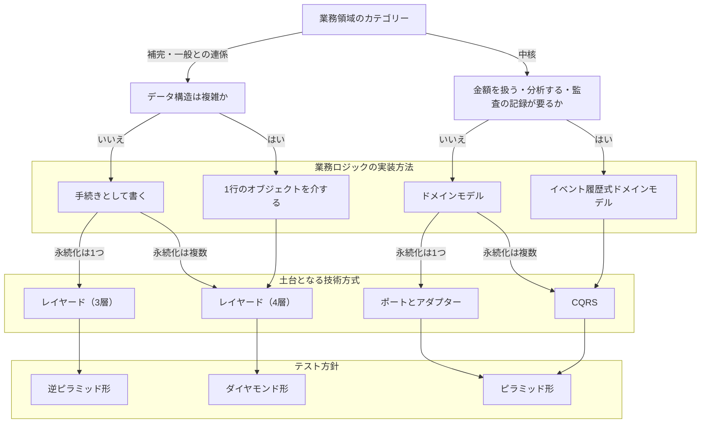
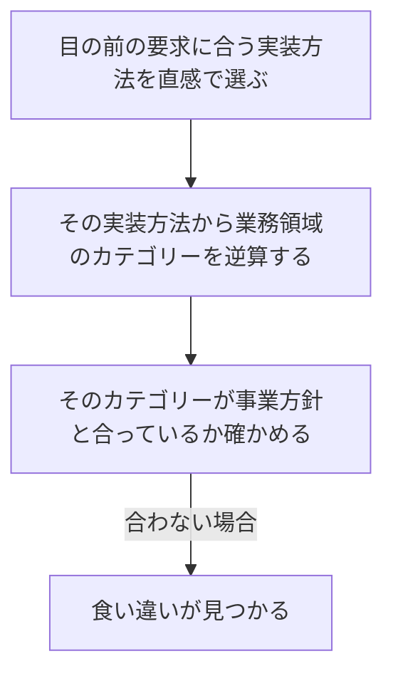
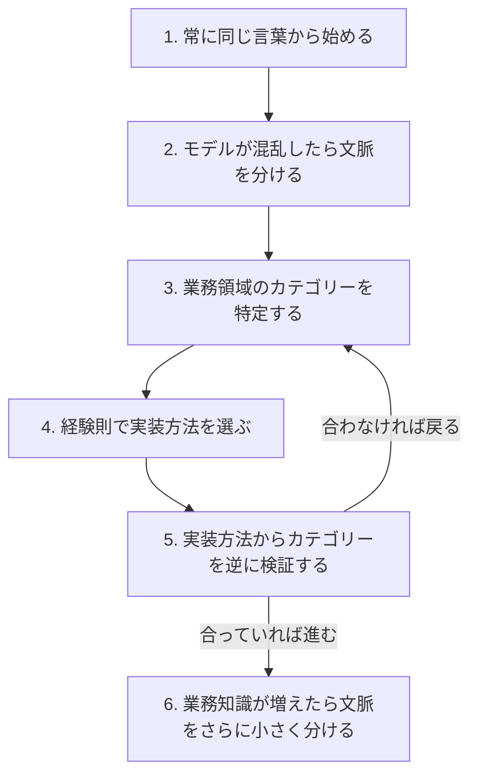

# 実装方法を選ぶ経験則と事例を扱う概念：closing-heuristics

## 概要

### この概念が答える判断

- カテゴリーから実装方法・技術方式・テスト方針まで、どう一続きに決まるのか
- 業務領域のカテゴリーの判断が正しいかを、どう確かめるのか
- 集約の名前に前置きが要り始めたら、それは何の合図か
- 境界の引き方には何通りあり、やってはいけないのはどれか
- 実装がたいへんだと感じたとき、それをどう読むのか

この本の全判断を1枚にまとめた流れと、実践の事例から得た教訓。5つの区切られた文脈それぞれに別の失敗と学びがあり、共通するのは同じ言葉の有無が結果を分けたこと。実装方法からカテゴリーを逆に検証する手が、判断の誤りを見つける道具になる。

---

## 出典・根拠の透明性

『ドメイン駆動設計をはじめよう』の結びの言葉と付録の書き起こしを、粒度を保ったまま構造へ移したもの。見出しそれぞれにノードを1つ対応させ、書き起こし版で図として書かれていたものは図として持たせ、文章で述べられていた逆の検証と6つの段も図として起こしている。

### 留保事項

事例研究の企業名と5つの文脈の名前は、著作権への配慮からすべて架空の業務（物流）へ置き換えた。比喩に由来する節の見出しは、その内容の説明へ言い換えている。示している構造——5つの文脈それぞれの教訓、同じ言葉の有無と結果の対応、境界の引き方4つの評価——は保っている。

---

## 関連概念

| 関連概念 | 関係 |
|---|---|
| subdomain | 事業領域の3分類（中核・一般・補完） |
| business-logic-simple | 手続き・1行のオブジェクトを介する形 |
| domain-model | 値オブジェクト・エンティティ・集約 |
| event-sourced-domain-model | イベント履歴式ドメインモデル |
| architecture-patterns | レイヤード・ポートとアダプター・CQRS |
| design-heuristics | この流れの詳細版 |
| evolving-design | カテゴリーの変化への対応 |
| ubiquitous-language | 同じ言葉と区切られた文脈の関係 |

---

## 実装方法を選ぶ経験則と事例

### 3つのカテゴリーの対比

競争優位を生むかどうかを起点に、6つの観点で分かれる。

3つのカテゴリーを、6つの観点で対比する

競争優位を生むかどうかが最初の分かれ目で、そこから複雑さ・変化・作り方が決まる。

| カテゴリー | 競争優位 | 複雑さ | 変化 | 作り方 | 課題の性質 |
|---|---|---|---|---|---|
| 中核 | あり | 大きい | 多い | 社内で開発する | 複雑で興味深い |
| 一般 | なし | 大きい | 少ない | 既製品や外部のサービスを使う | 既存の解決策がある |
| 補完 | なし | 小さい | 少ない | 内製または外部へ委託する | 単純 |

### 全判断を1枚にまとめた流れ

業務領域のカテゴリーから、実装方法・技術方式・テスト方針までを一続きで決める。この本のすべての判断がここに集まっている。

業務領域のカテゴリーから、実装方法・技術方式・テスト方針までを一続きで決める

この本の全判断を1枚にまとめたもの。入口はカテゴリー1つで、出口はテスト方針になる。



| どこの話か | 図に載せきれないこと |
|---|---|
| 1行のオブジェクトを介するからレイヤード（4層） | この1本だけ、永続化が1つでも複数でも行き先が変わらない。他の実装方法では枝が分かれるので、ここだけ形が違う。 |
| 業務領域のカテゴリー | 唯一の入口である。ここを取り違えると、以降の3つの判断がすべてずれる。逆に言えば、出口のテスト方針が現場の実感と合わないとき、疑うべきはここになる。 |
| ピラミッド形へ入る2本 | 経路が違っても同じ終点に行き着く。テスト方針を決めているのは経路ではなく、業務ロジックが1つの層に集まっているかどうかである。 |

### 事例から学ぶ

ある新興企業での実践の記録。5つの区切られた文脈それぞれに、別の教訓がある。

#### 1つ目：集荷の受付 ── 設計は粗くても、同じ言葉があれば成立した

最初の設計は失敗だった。要求に出てくるすべての名詞を集約として宣言し、巨大な一枚岩へ詰め込む形で、業務ロジックはほとんど無く、すべてサービス層に書かれていた——中身の無いドメインモデルである。それでも一時的にうまくいったのは3つの理由による——業務エキスパートとのあいだに同じ言葉が確立できていたこと。少人数で開発するには十分な設計だったこと。そして動くソフトウェアを短期間で市場へ出せたこと。教訓は、補完や一般の業務領域では単純な実装が適切だということ。設計の正しさより「動くソフトウェアを早く出せるか」が事業として重要な場合がある。

#### 2つ目：荷主の管理 ── 名前に前置きが要り始めたら、境界が足りない

問題は集約の名前に現れた。業務エキスパートとの会話では短い言葉で通じるのに、コードでは文脈を示す前置きを付けないと区別できなくなっていた——区切られた文脈が欠けているという合図である。そこで巨大な一枚岩を2つの区切られた文脈へ分けた。

集約の名前に文脈を示す接頭語が要るようになった状態を示す

業務エキスパートとの会話では「荷主」「依頼」だけで通じるのに、コードでは前置きを付けないと区別できなくなっている。

```csharp
CustomerCareShipper   // 荷主管理の側の荷主
IntakeShipper         // 集荷受付の側の荷主
IntakeRequest         // 集荷受付の側の依頼
CustomerCareRequest   // 荷主管理の側の依頼
```

##### 「正しくやる」ことは高くついた

中身の無いドメインモデルから脱して本物の集約を実装しようとしたが、困難だった。適切なトランザクション境界を最初から見つけることは、ほとんど不可能である。正しくやろうとすると多くの時間がかかり、期限に間に合わなかった。結果として経営の側が、業務ロジックをデータベース側の手続きへ移すことを決めた。

##### 別々の言葉が並び立った

データベース側へ移したことで、宣言されていない区切られた文脈が生まれた。2つのチームがそれぞれ独自の言葉で業務を記述し、同じ業務の要素を、ほとんど会話せずに別々に実装した。互いのモデルはまったく一致せず、業務知識が重複し、同じ規則が二重に実装された。業務ロジックを変えるたびに、両者のあいだに食い違いが生まれた。予定の期日にはリリースできず、欠陥だらけのソフトウェアを数年にわたって動かし続けることになった。

##### この時点でまだ欠けていたもの

同じ言葉を守るために区切られた文脈を作り、その中でドメインモデルを実装する——ここまでは理解できていた。欠けていたのは業務領域の考え方と、そのカテゴリーの判断である。そのため、補完の業務領域をドメインモデルで実装するという無駄な努力をしていた。

#### 3つ目：外部の通知の取り込み ── カテゴリーが変わったのに、実装を変えなかった

外部から届く通知の処理は、2つの文脈のどちらか一方の責任ではなく、どちらも変更しなければならない機能だった。そこで独立した補完の業務領域として切り出し、補完なので簡単な手続きとして実装した。誤りは、そのあとにあった——事業が発展するにつれて複雑な業務ロジックが加わり、本格的な中核の業務領域に育ったにもかかわらず、手続きのままにしていた。

#### 4つ目：運賃の精算 ── 同じ言葉があったので、変えどきに気づけた

補完の業務領域として設計した。事業が発展するにつれて計算の処理が複雑になり、金額を扱うようになった——中核の業務領域へ変わったのである。そこでイベント履歴式ドメインモデルへ作り替えた。同じ言葉を使っていたおかげで、1行のオブジェクトではモデル化できなくなった時点で早く気づけた。無駄な努力を最小限にできた。

#### 5つ目：提携先の連携基盤 ── カテゴリーの判断そのものが誤っていた

中核の業務領域と判断し、イベント履歴式ドメインモデルとCQRSを採り、集約ごとにサービスを分ける形で実装した。分割は大失敗だった——「小さなサービスがよいサービス」という誤解から集約ごとに分けた結果、システムが育つにつれてサービスどうしの通信が増え、1つの機能を実現するのに多くのサービスからデータをかき集める必要が生じた。緩やかな結びつきを目指したのに、できたのは分散した大きな泥団子だった。

##### 本当の課題は分割ではなかった

この領域は、実際には補完の業務領域だった。新たな収益源を期待して中核と判断したが、競争優位はソフトウェアの機能ではなく、他社との協業関係にあった。その結果、技術の複雑さが業務の複雑さをはるかに上回る不必要な複雑さが生じた。適切な実装は、単純に1行のオブジェクトを介する形だった。

### 同じ言葉は選ぶものではない

5つの文脈を並べると、同じ言葉の有無が結果を分けている。状況によって使ったり使わなかったりするものではない。中核・一般・補完のどの業務領域でも、必ず同じ言葉を使って開発する。できるだけ早い段階から投資することが重要である。

5つの文脈について、同じ言葉の有無と結果を並べる

有無が結果を分けている。設計の巧拙より、こちらのほうが結果に効いている。

| 文脈 | 同じ言葉 | 結果 |
|---|---|---|
| 集荷の受付 | あり | しっかりした同じ言葉が設計の欠陥を補い、成功に導いた |
| 荷主の管理 | なし（2つの言葉が混在） | 大失敗。意図が伝わらず、大きな混乱が残った |
| 外部の通知の取り込み | なし | 成長したときに後悔した。同じ言葉があれば、もっと短期間で成果を出せた |
| 運賃の精算 | あり | 設計の方針を変えるべき時期に、早く気づけた |

### 実装方法からカテゴリーを逆に検証する

通常はカテゴリーを特定してから実装方法を選ぶ。その順序を逆にたどると、カテゴリーの判断そのものを確かめられる。食い違いが見つかったとき、それは誤りの発見であると同時に、技術の側と業務の側のあいだに新しい対話の機会を生む。

カテゴリーの判断を、実装方法から逆に検証する

通常はカテゴリーから実装方法を選ぶが、その順序を逆にたどって、カテゴリーの判断そのものを確かめる。



| どこの話か | 図に載せきれないこと |
|---|---|
| 目の前の要求に合う実装方法を直感で選ぶ | 憶測や粉飾を入れずに選ぶことが条件である。「中核だからドメインモデルにすべき」と考えた時点で、この検証は成り立たなくなる。 |
| 食い違いが見つかる | 食い違いは誤りの発見ではなく、対話の入口である。技術の側と業務の側のあいだに、新しい話し合いの機会を生む。 |
| この流れ全体 | 通常の手順を置き換えるものではない。カテゴリーを決めてから実装方法を選ぶ手順は残したうえで、その結果を逆からもう一度確かめる。 |

実装方法とカテゴリーが食い違ったときの、2つの読み方を並べる

どちらの方向にずれているかで、疑うべき相手が変わる。

| 食い違いの形 | 何を疑うか |
|---|---|
| 業務の側は「中核」と考えているのに、1日で実装できてしまう | 技術の側が課題を簡単に考えすぎているか、その機能が競争優位に結びついていない |
| 業務の側は「補完」と考えているのに、ドメインモデルやイベント履歴式が要る | 業務の側が要件を必要以上に複雑にしているか、競争優位の源に気づいていない |

### たいへんさを無視しない

業務ロジックの実装がたいへんなら、それは事業モデルの発展や設計判断の進化につながる、きわめて重要な兆候である。気づいたら業務エキスパートとよく話し合い、業務領域のカテゴリーと実装方法を再検討すべき状況の変化が無いかを確かめる。そしてひるまずに設計を変える——業務ロジックを適切にモデル化していれば、変化に合わせて洗練された方法へ変えることは比較的簡単にできる。

### 境界の引き方4つと、その評価

実際に試した4通り。1つは絶対にやってはいけない。

実際に試した4つの境界の引き方と、その評価を並べる

上2つは有効、3つ目は条件つき、4つ目は絶対にやってはいけない。

| 境界の引き方 | 説明 | 評価 |
|---|---|---|
| 言葉による境界 | 同じ言葉を守るために文脈を区切る | 有効 |
| 業務領域ごとの境界 | 業務領域ごとに1つの区切られた文脈を作る | 有効 |
| 集約ごとの境界 | 各集約を独立した文脈として扱う | 特定の状況でのみ有効。この事例では失敗した |
| 1つの集約を2つの文脈へ分ける | 集約を境界でまたがせる | **絶対にやってはいけない** |

#### 最初の文脈の大きさ

業務知識が乏しいほど、広い範囲の文脈で始める。知識を増やしながら段階的に小さく分けていき、文脈の区切り方の作り直しは、十分な業務知識を得たあとで行う。こうすると、細かく分けすぎる失敗を避けられる。

### 実践するときの6つの段

同じ言葉から始まり、逆の検証で戻ることがある。「いつでもどこでも集約」から「いつでもどこでも同じ言葉」への変化にあたる。

実践するときの6つの段を示す

同じ言葉から始め、混乱したら分け、カテゴリーを決め、実装方法を選び、逆から確かめ、知識が増えたらさらに分ける。



| どこの話か | 図に載せきれないこと |
|---|---|
| 1. 常に同じ言葉から始める | 「常に」が付いているのは、業務領域のカテゴリーによらないためである。中核でも一般でも補完でも、必ずここから始める。 |
| 5から3へ戻る線 | この線があるので、6つの段は一直線ではない。逆の検証で合わなければ、カテゴリーの判断まで戻る。 |
| 6. 業務知識が増えたら文脈をさらに小さく分ける | 最初から細かく分けないことが前提になっている。業務知識が乏しいうちは広い範囲で始め、増えてから分ける。 |

### アンチパターン

事例から学ぶ6つの誤り。

#### すべての名詞を集約にする

要求に出てくるすべての名詞を集約として宣言し、業務ロジックをサービス層に書く。見た目はドメインモデルだが、実質は手続きである。中核の業務領域では負債になる。ただし補完や一般の業務領域では、合理的な選択になりうる。

#### 区切られた文脈なしに同じ言葉を守ろうとする

一枚岩のシステムで同じ言葉を使おうとすると、集約の名前に文脈を示す前置きを付けるしかなくなる。本当の解決策は、区切られた文脈で境界を設けることである。

#### ドメインモデルで正しくやることを急ぐ

適切なトランザクション境界を最初から見つけることは、ほとんど不可能である。多くの時間と試行錯誤が要る。期限がある状況では、動くソフトウェアを優先し、設計をあとから改善する進め方も現実的である。

#### 補完の業務領域をドメインモデルで実装する

単純で変化の少ない補完の業務領域にドメインモデルを当てるのは過剰である。技術の複雑さが業務の複雑さを上回る、不必要な複雑さになる。

#### 集約ごとにサービスを分ける

「小さなサービスがよいサービス」という誤解から集約ごとに分けると、サービスどうしの通信が爆発的に増え、分散した大きな泥団子になる。区切られた文脈の粒度で分ける。

#### 1つの集約を2つの区切られた文脈へ分ける

絶対にやってはいけない。業務ロジックが分断され、別々の言葉が並び立つ状態を招く。
