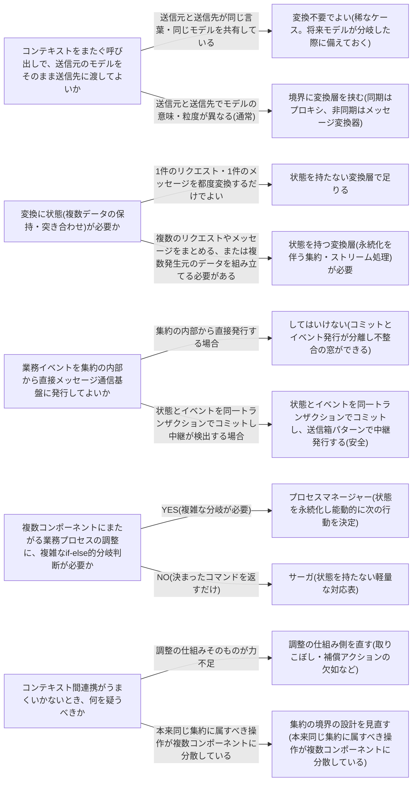

# 境界づけられたコンテキスト間の連携パターンを扱う概念：communication

## 概要

### この概念が答える判断

- 境界づけられたコンテキストどうしをどうつなぐか。内部モデルをそのまま外に見せていいか
- 業務イベントを他のコンテキストに確実に届けるには、どう発行すればよいか
- 複数のコンテキストにまたがる業務プロセスを、何を使って調整すべきか
- その調整役はサーガでよいのか、プロセスマネージャーが必要なのか

境界づけられたコンテキストどうしが業務プロセスを跨いで連携する際に必要な、モデル変換・イベント発行・プロセス調整に関する通信の原則を扱う。

---

## 原則

- 境界づけられたコンテキストは内側で一貫したモデルを持つが、事業のプロセスはコンテキストの境界をまたいで流れる。
- この境界をまたぐ通信には、単体のコンテキスト設計とは別の原則が要る。
- 第一の原則は、内部モデルをそのまま境界の外に露出しないこと。
- コンテキストの内部で使う言葉・イベント・データ構造はそのコンテキストの都合で自由に変わってよいものであり、それを外部にそのまま渡すと外部のコンテキストが内部の実装詳細に依存してしまう。
- 境界を越える際には必ず変換の層を挟む。
- 第二の原則は、集約の内部から直接メッセージ通信基盤へ発行しないこと。
- 集約はデータベースへのコミットで自らの状態変更を確定させる。
- イベントの発行とこのコミットが同一のトランザクションで保証されなければ、コミットは失敗したのにイベントは届いた、あるいはイベントが届く前にコミットが可視化されたといった不整合が生まれる。
- 発行はコミットと不可分に結び付ける必要がある。
- 第三の原則は、複数コンポーネントにまたがる業務プロセスの調整ロジックを、どのコンポーネントの内部にも埋め込まないこと。
- 調整ロジックはそれ自体が独立した責務であり、単純な直線的フローであれば軽量な仕組み(サーガ)で、複雑な分岐や状態管理を要するなら専用の調整役(プロセスマネージャー)として明示的に外出しする。

---

## 分類

| 分類 | 特徴 |
|---|---|
| モデル変換装置(プロキシ/メッセージ変換器) | 境界を越える際に内部モデルを外部向けの言葉に変換する層。同期呼び出しはプロキシ、非同期メッセージングはメッセージ変換器が横取りして変換する |
| 送信箱パターン | 更新された状態とイベントを同一トランザクションでデータベースにコミットし、別の中継の仕組みが未送信イベントを検出して発行する。最低1回は届くことを保証するが、ちょうど1回とは保証しないため受信側は冪等に作る必要がある |
| サーガ | 特定のイベントを受けたら決まったコマンドを返すだけの、状態を持たない軽量な対応表。単純な直線的フローの業務プロセス調整に向く |
| プロセスマネージャー | 状態を永続化し、次に何をすべきかを能動的に決定する専用の調整役。複雑な分岐や状態管理を要する業務プロセスに向く |

---

## 判断基準

---

## 実例

架空のレストラン予約プラットフォームでは、予約・厨房・会計という3つのコンテキストが連携して1件の来店を処理する。モデル変換の例として、予約コンテキストでは来店予定を予約者名・卓番号を含む予約(Reservation)という言葉で表現するが、厨房コンテキストは何人前をいつまでに用意するかだけを必要とするため、予約確定イベントを横取りして仕込み指示(PrepInstruction)に変換する層を境界に置き、予約IDや連絡先などの内部情報は渡さない。送信箱の例として、予約確定を厨房・会計の両方に伝える際、予約集約の内部から直接メッセージ通信基盤に発行するのではなく、予約確定という状態変更とイベントの記録を1つのトランザクションでコミットし、別の中継の仕組みが未送信イベントを検出して配信することで、データベースとイベントの不整合を防ぐ。サーガの例として、予約確定を検知したら仕込みを開始し、仕込み完了を検知したら請求書を発行するという単純な対応関係は軽量なサーガで実装でき、仕込み失敗時は予約を保留にする補償アクションを実行する。プロセスマネージャーの例として、団体予約かつ事前決済ありのコースメニューのように、予約内容によって仕込みのタイミング・決済の順序・キャンセル時の返金可否が分岐し、複数ステップの進行状況を追跡し続ける必要がある場合は、状態を永続化し能動的に次の行動を判断する専用のプロセスマネージャーを用意する。

---

## アンチパターン

| アンチパターン | 問題点 |
|---|---|
| 集約の内部から業務イベントを直接メッセージ通信基盤に発行する | データベースへのコミットと発行が別々の操作になるため、コミット前に発行してしまう、あるいはコミット失敗後でも発行済みという状態が起こり得る。状態とイベントを同一トランザクションでコミットし、別の中継の仕組みに発行を任せるべき |
| 内部モデル・内部イベントをそのまま境界の外に公開する | コンテキストの内部実装がそのまま外部の契約になってしまい、内部を変更するたびに外部が壊れる。境界を越える際は必ず変換層を挟み、外部向けの言葉に変換してから渡すべき |
| 集約境界の設計不備を調整の仕組み(サーガ等)で補おうとする | 本来同じ集約に閉じるべき一連の操作が複数のコンポーネントに分散している場合、どれだけ調整の仕組みを精巧にしても、境界の外側は結果整合にしかならないという制約から逃れられない。まず集約の境界を見直すべき |
| 単純な対応関係にプロセスマネージャーを使う／複雑な分岐にサーガを使う | 前者は過剰設計であり、後者は複雑な業務ロジックがべき等な単純対応の体裁の中に押し込まれて見えにくくなる。分岐の有無・状態管理の要否で機械的に選び分けるべき |

---

## 出典・根拠の透明性

本ファイルの原則・判断の分岐点・アンチパターンは、『ドメイン駆動設計をはじめよう』が扱うコンテキスト間通信(モデル変換・送信箱・サーガ・プロセスマネージャー)の一般原則を要約・再構成したものであり、本文の直接引用ではない。書籍固有の実例・コード・図版は用いず、教材専用の架空ドメイン(レストラン予約プラットフォーム)の実例に置き換えている。

---

## 関連概念

| 関連概念 | 関係 |
|---|---|
| bounded-context | 通信の両端に立つ、モデルが独立している範囲 |
| context-integration | 境界づけられたコンテキストどうしの連係パターン全般 |
| domain-model | 集約の設計原則・業務イベントの発行元 |
| architecture-patterns | CQRS・非同期投影と送信箱パターンの関係 |
