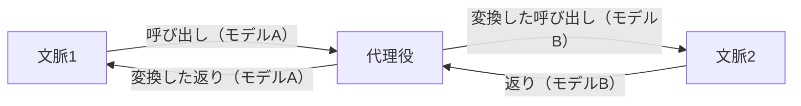
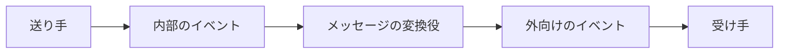
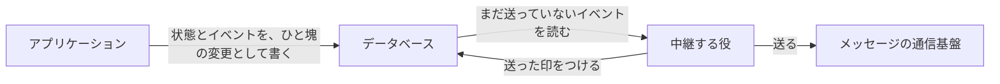
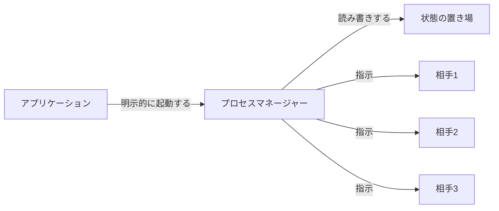
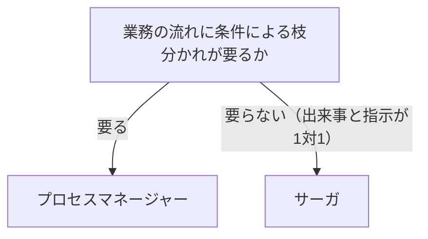

# 部品どうしの通信を扱う概念：communication

## 概要

### この概念が答える判断

- 区切られた文脈のあいだで、モデルをどこで変換するのか
- 内部のイベントと、他の文脈へ渡すイベントをどう分けるのか
- 業務イベントを確実に発行するにはどうするのか
- サーガとプロセスマネージャーは何が違い、どちらを選ぶのか
- サーガを使ってはいけないのは、どういうときか

区切られた文脈の境界を越えて、部品どうしをどうつなぐか。モデルの変換（状態を持つ／持たない）、業務イベントを確実に発行する送信箱、そして複数の文脈にまたがる業務の流れを実現するサーガとプロセスマネージャーを扱う。後半2つの土台になるのは送信箱である。

---

## 出典・根拠の透明性

『ドメイン駆動設計をはじめよう』第9章の書き起こしを、粒度を保ったまま構造へ移したもの。見出しそれぞれにノードを1つ対応させ、書き起こし版で図として書かれていたものは、すべて図として持たせている。

### 留保事項

実在の製品名（外部との入口を担う仕組み・データを流し続ける仕組み・ためて処理する仕組み・変更の記録を追う仕組み）は、著作権への配慮からすべて役割の説明に置き換えた。サーガのコード例は架空の業務（配送の集荷手配）へ置き換えている——3つの出来事に1対1で処理が対応し、条件による枝分かれが1つも無いという構造は保っている。

---

## 関連概念

| 関連概念 | 関係 |
|---|---|
| context-integration | 区切られた文脈どうしの連係方法。モデル変換装置と共用サービスの位置づけ |
| domain-model | 集約の設計原則と、業務イベントの発行 |
| event-sourced-domain-model | 内部のイベントと外向けのイベントの区別 |
| architecture-patterns | CQRS の非同期の投影と、送信箱の関係 |

---

## 部品どうしの通信

### この概念が扱う範囲

個々の区切られた文脈の内部構造ではなく、境界を越えた部品どうしのつなぎ方を扱う。扱うのは3つ——区切られた文脈どうしの通信の仕方、集約の設計原則から生じる連係の制約への対処、そして複数の区切られた文脈にまたがる業務の流れの実現方法。

### モデルの変換

区切られた文脈はモデルの境界なので、つなぐには変換が要ることがある。変換の処理はモデル変換装置でも共用サービスでも同じような実装になるため、ここでは両者を区別せずに扱う。

#### 状態を持たない変換

1回のやりとりの中で完結する変換。代理役として実現する——通信を横取りして、送り手のモデルを受け手のモデルへ変換する。

##### 同期の場合

区切られた文脈のコードの一部に変換の処理を埋め込む。外部との入口を担う一般的な仕組みを使えば、低い費用で実現できる。複数の区切られた文脈から使える独立した文脈として立てることもできる。

同期のモデル変換が、行きと帰りの両方で働くことを示す

代理役が呼び出しを横取りし、送り手のモデルを受け手のモデルへ変換する。返りも同じ経路を通る。


```mermaid
flowchart LR
    n0["文脈1"]
    n1["代理役"]
    n2["文脈2"]
    n0 -->|"呼び出し（モデルA）"| n1
    n1 -->|"変換した呼び出し（モデルB）"| n2
    n2 -->|"返り（モデルB）"| n1
    n1 -->|"変換した返り（モデルA）"| n0
```

| どこの話か | 図に載せきれないこと |
|---|---|
| 代理役 | どちらの側に置くかはこの図では決まらない。上流が置けば共用サービス、下流が置けばモデル変換装置になるが、変換の処理そのものはどちらでも同じである。そのためこの章では両者を区別せずに扱う。 |
| 4本の矢印 | 行きだけでなく返りも変換する。片方だけ変換すると、呼んだ側が自分の知らないモデルを受け取ることになる。 |
| 代理役の中 | 状態を持たない。1回の呼び出しの中で完結するので、外部の入口を担う一般的な仕組みへそのまま載せられる。複数の文脈から使える独立した文脈として立てることもできる。 |

##### 非同期の場合

メッセージの変換役を用意する。送り手が出したメッセージを中間の役が代わりに受け取り、変換してから本来の受け手へ渡す。この位置で、内部のイベントと外向けのイベントをはっきり分けられる。

非同期のモデル変換が、内部のイベントを外向けの言葉へ変える位置を示す

送り手が出したメッセージを中間の役が代わりに受け取り、変換してから本来の受け手へ渡す。


```mermaid
flowchart LR
    n0["送り手"]
    n1["内部のイベント"]
    n2["メッセージの変換役"]
    n3["外向けのイベント"]
    n4["受け手"]
    n0 --> n1
    n1 --> n2
    n2 --> n3
    n3 --> n4
```

| どこの話か | 図に載せきれないこと |
|---|---|
| 内部のイベント／外向けのイベント | 2つを分ける線がこの図の要点である。内部のイベントは文脈の中だけで使い、外向けのイベントは他の文脈と通信するために使う。内部のモデルをそのまま外へ出すのは、よくある誤った設計である。 |
| メッセージの変換役 | 送り手も受け手も、この役がいることを知らないままでよい。横取りして差し替えるので、両端のコードは変わらない。 |

##### 内部のモデルをそのまま外へ出さない

内部のモデルのオブジェクトをそのまま外向けの言葉としてさらけ出すのは、ありがちな誤った設計である。業務イベントをそのまま送ってしまうのも同じ。内部だけで使うイベントと、他の文脈と通信するためのイベントを分ける。

#### 状態を持つ変換

複数のデータを集めて1つにまとめたり、さまざまな発生元からのデータを統合したりする場合。外部との入口を担う一般的な仕組みでは実現できず、保存する場所が要る。

##### 届いたデータを1つにまとめる

複数の呼び出しをまとめて処理する、あるいは小さく分けて届いたメッセージを1つに統合する形。流れ続けるデータとして扱う仕組みでも、ためてから一括で処理する仕組みでも実現できる。

##### 複数の発生元のデータを統合する

画面が複数のサービスからデータを集めて組み立てる状況が典型である。データを使う側の手前にモデル変換装置を置き、他の文脈から来るさまざまなデータを受け取って、1つのまとまりへ変換する。

### 集約どうしの連係

集約が他の部品とつながるやり方として、業務イベントの発行がある。外部の部品はそれを購読して業務ロジックを動かす。

#### 送信箱

集約の内部から業務イベントを直接発行してはいけない。理由は2つある——データベースへ書き込む前に外部へ発信してしまうと、受け取った側から見た状態とデータベースの状態が食い違う。そして書き込みに失敗したあとでも、発信は済んでしまっていて取り消せない。送信箱の形を使えば、業務イベントを確実に発行できる。

送信箱が、状態とイベントを同じひと塊の変更として書き込む形を示す

アプリケーションはメッセージを直接送らない。データベースへ一緒に書き、別の役が読み出して送る。


```mermaid
flowchart LR
    n0["アプリケーション"]
    n1["データベース"]
    n2["中継する役"]
    n3["メッセージの通信基盤"]
    n0 -->|"状態とイベントを、ひと塊の変更として書く"| n1
    n1 -->|"まだ送っていないイベントを読む"| n2
    n2 -->|"送る"| n3
    n2 -->|"送った印をつける"| n1
```

| どこの話か | 図に載せきれないこと |
|---|---|
| アプリケーションからデータベース | この1本がひと塊の変更になっていることが、この形が成り立つ唯一の条件である。状態だけ書けてイベントが書けない、という中途半端な結果が起きない。 |
| アプリケーション | メッセージの通信基盤へ直接つながる線が無い。描き忘れではなく、集約の内部から直接発行してはいけないという規則がある。 |
| 中継する役からメッセージの通信基盤 | 送ったあとに印をつけるまでのあいだに落ちると、同じイベントをもう一度送る。この形が保証するのは「少なくとも1回」までで、受け取る側は同じものが二度来ても平気なように作る必要がある。 |
| データベースから中継する役 | 読み方は2通りある。中継する役が繰り返し探しに行く形と、データベース側の変更の記録を追いかけて知る形。前者は探すための索引の設計が効いてくる。 |

##### どこへ書くか

表を持つデータベースなら、2つの表への書き込みをひと塊の変更にする（送信箱の表を作る）。そうでないデータベースなら、集約の記録そのものの中に発行すべき業務イベントを埋め込む。

##### まだ送っていないイベントをどう読むか

2通りある。中継する役が繰り返しデータベースを探しに行く形——この場合は探すための索引の設計が効いてくる。もう1つは、データベース側の変更の記録を追いかけて、記録の更新や追加を知る形。

##### 同じものが二度届く

この形が保証するのは「少なくとも1回」までである。同じメッセージが二度送られる可能性があるので、受け取る側は、同じものが何度来ても結果が変わらないように作る。

#### サーガ

複数の部品にまたがる、単純で一直線の業務の流れを実装する方法。長く続く業務の流れを指すが、「長く続く」は時間の長さではなく、多数のひと塊の変更から成るという意味である。関係する部品が発行する業務イベントを見つけ、それに続く指示を別の部品へ出す。途中で失敗したら、一貫性を保つために埋め合わせの動作を実行する。起動は暗黙で、特定のイベントを見つけたときに動き出す。

サーガが、出来事を受けて次の指示を出すだけの形であることを示す

3つの出来事それぞれに1つの処理が対応する。条件による枝分かれが1つも無い。拒否されたときの処理が、埋め合わせの動作にあたる。

```csharp
public class ShipmentDispatchSaga {
    // 検知する3つの出来事
    public void Process(ShipmentAccepted @event) {
        var shipment = _repository.Load(@event.ShipmentId);
        var manifest = shipment.GenerateManifest();
        _carrierService.SubmitPickup(@event.ShipmentId, manifest);
    }
    public void Process(PickupConfirmed @event) {
        var shipment = _repository.Load(@event.ShipmentId);
        shipment.TrackPickupConfirmation(@event.ConfirmationId);
        _repository.CommitChanges(shipment);
    }
    public void Process(PickupRejected @event) {
        var shipment = _repository.Load(@event.ShipmentId);
        shipment.TrackPickupRejection(@event.RejectionReason);  // 埋め合わせ
        _repository.CommitChanges(shipment);
    }
}
```

##### 一貫性の前提

集約の境界の内側にあるデータは強く整合していると考えてよい。境界の外側にあるデータは、時間が経てば整合する。この違いが、サーガを使ってよい範囲を決める。

##### 境界の不備を補うために使わない

集約の境界の設計が適切でないことを補うためにサーガを使ってはいけない。同じ集約に属するべき業務処理は、強く整合したデータを必要とするからである。サーガでつなぐと、その必要が満たされない。

#### プロセスマネージャー

業務ロジックが中心となる、複雑な業務の流れを実装する方法。流れの状態を管理し、次に何をすべきかを決める中央の役にあたる。多くの場合、複数の集約の組み合わせとして実装する——状態を持つ集約でも、イベント履歴式の集約でもよい。

プロセスマネージャーが、状態を持ちながら次の指示を出す形を示す

明示的に起動され、自分の状態を保存しながら、複数の相手へ順に指示を出す。


```mermaid
flowchart LR
    n0["アプリケーション"]
    n1["プロセスマネージャー"]
    n2["状態の置き場"]
    n3["相手1"]
    n4["相手2"]
    n5["相手3"]
    n0 -->|"明示的に起動する"| n1
    n1 -->|"読み書きする"| n2
    n1 -->|"指示"| n3
    n1 -->|"指示"| n4
    n1 -->|"指示"| n5
```

| どこの話か | 図に載せきれないこと |
|---|---|
| アプリケーションからプロセスマネージャー（明示的に起動する） | サーガとの決定的な違いがこの1本である。サーガは特定のイベントを見つけて勝手に動き出すが、こちらは誰かが始めると決めて起動する。特定の出来事と結びついていない。 |
| 状態の置き場 | サーガにはこれが無い。どこまで進んだかを覚えている必要があるかどうかが、2つを分ける実装上の違いになる。 |
| 相手1／相手2／相手3 | 3つ並んでいるが、同時に指示を出すという意味ではない。どれへいつ指示を出すかを決めるのがプロセスマネージャーの仕事であり、そこに業務ロジックが入る。 |

##### サーガとの違い

4つの観点で分かれる。経験則として、サーガの実装で条件による枝分かれが要りはじめたら、それはおそらくプロセスマネージャーである。

サーガとプロセスマネージャーの違いを4つの観点で並べる

どれか1つでも右側に当てはまるなら、プロセスマネージャーとして作るほうがよい。

| 観点 | サーガ | プロセスマネージャー |
|---|---|---|
| 複雑さ | 単純・一直線 | 複雑（業務ロジックが中心） |
| 起動 | 特定の出来事を見つけて勝手に動き出す | 明示的に起動する（特定の出来事と結びつかない） |
| 状態 | 持たない | 必ず持ち、保存する |
| 枝分かれ | 要らない | 条件による枝分かれが要る |

### 5つの形の対比

つなぎ方が3つ、業務の流れの作り方が2つ。後者2つの土台になるのは、業務イベントへの非同期な応答と指示の発行の仕組み、つまり送信箱である。

この章で扱う5つの形を、用途で並べる

前半3つはつなぎ方、後半2つは複数の文脈にまたがる業務の流れの作り方である。

| 形 | 用途 |
|---|---|
| モデルの変換（状態なし） | 区切られた文脈のあいだでモデルを変換する（同期は代理役／非同期はメッセージの変換役） |
| モデルの変換（状態あり） | まとめる・統合するなど、覚えておく必要がある変換 |
| 送信箱 | 集約の業務イベントを外部へ確実に発行する（少なくとも1回） |
| サーガ | 複数の部品にまたがる、単純で一直線の業務の流れ |
| プロセスマネージャー | 複雑な業務ロジックを持つ、長く続く業務の流れ |

### サーガかプロセスマネージャーか

業務の流れに条件による枝分かれが要るかどうかで決まる。

サーガとプロセスマネージャーのどちらかを、業務の流れの複雑さで決める

分かれ目は1つ。流れの中で条件による枝分かれが要るかどうか。


```mermaid
flowchart TD
    n0["業務の流れに条件による枝分かれが要るか"]
    n1["プロセスマネージャー"]
    n2["サーガ"]
    n0 -->|"要る"| n1
    n0 -->|"要らない（出来事と指示が1対1）"| n2
```

| どこの話か | 図に載せきれないこと |
|---|---|
| 業務の流れに条件による枝分かれが要るか | 実装を書き始めてから気づくことが多い問いである。サーガとして書いていて条件分岐が要りはじめたら、それはおそらくプロセスマネージャーだ、というのが経験則になっている。 |
| サーガ | この終点を選ぶ前に、もう1つ確かめることがある——集約の境界の設計が適切でないことを補うために使おうとしていないか。そうであれば、サーガではなく集約の境界を直す。 |

### アンチパターン

部品どうしをつなぐときによく起きる誤り。

#### 集約の内部から業務イベントを直接発行する

データベースへ書き込む前に発行すると、状態が食い違う。書き込みに失敗したあとでも発行済みになり、取り消せない。送信箱の形を使う。

#### 内部のモデルをそのまま外向けのイベントとして送る

区切られた文脈の内部の実装が外へ漏れる。業務イベントを外向けの言葉へ変換してから送る。

#### 集約の境界の不備をサーガで補う

本来1つの集約に閉じるべき処理をサーガでつなごうとする設計は失敗する。集約の境界を見直す。
