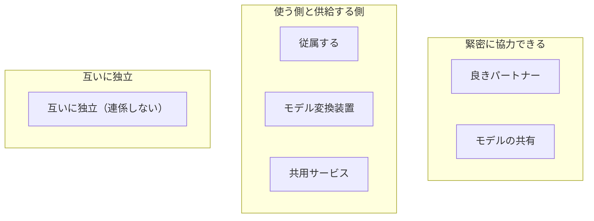
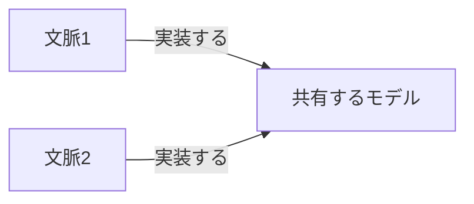
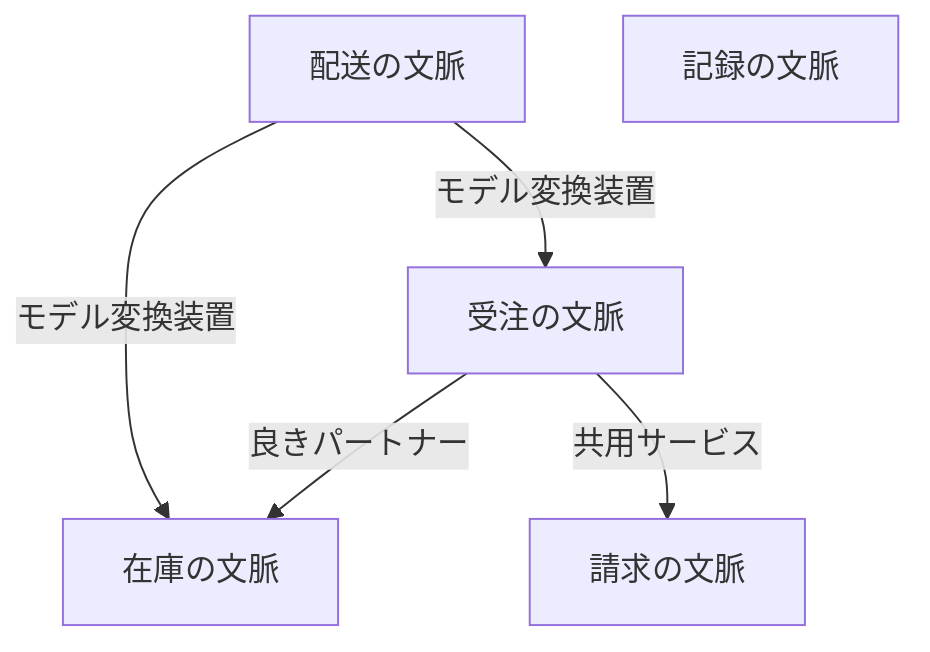
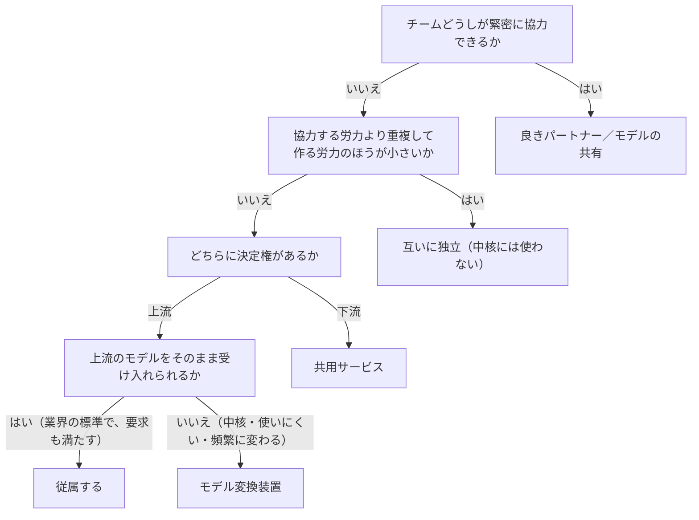

# 区切られた文脈どうしの連係を扱う概念：context-integration

## 概要

### この概念が答える判断

- 区切られた文脈どうしをつなぐ方法は何種類あり、どう選ぶのか
- 上流のモデルをそのまま受け入れてよいのは、どういうときか
- モデル変換装置と共用サービスは何が違うのか
- 連係を「しない」という選択は、いつ正当なのか
- モデルを共有してよいのはどこまでか
- 文脈の地図から何が読み取れるのか

区切られた文脈どうしをどうつなぐかの取り決め（契約）と、その6つの方法。分かれ目は技術ではなく、担当するチームがどれだけ協力できるか、そして上流と下流のどちらに決定権があるかである。選んだ結果はシステム全体の地図として1枚に載せ、組織上の課題を読み取る材料にする。

---

## 出典・根拠の透明性

『ドメイン駆動設計をはじめよう』第4章の書き起こしを、粒度を保ったまま構造へ移したもの。見出しそれぞれにノードを1つ対応させ、書き起こし版で図として書かれていたものは、すべて図として持たせている。

### 留保事項

実在の道具の名前は、著作権への配慮から役割の説明に置き換えた。文脈の地図の例は、書き起こし版に図の中身が無かったため、架空の業務（受注・在庫・請求・配送・記録）で組み立てている——地図から読み取る観点（同じ相手へ変換装置が集まる形・孤立した文脈）は保っている。

---

## 関連概念

| 関連概念 | 関係 |
|---|---|
| bounded-context | 連係する区切られた文脈の定義と境界 |
| subdomain | 連係方法の選択に影響する業務領域のカテゴリー（中核・一般・補完） |
| ubiquitous-language | 区切られた文脈ごとに独自の同じ言葉を持つ。契約が要るのはこのため |
| evolving-design | 組織の変化に伴って、連係方法が押し下げられていく道筋 |

---

## 区切られた文脈どうしの連係

### なぜ連係の取り決めが要るか

区切られた文脈は独立して育てられるが、完全に独立しているわけではない。システムとして働くには、文脈どうしをつなぐ必要がある。そのつなぎ目を契約と呼ぶ。契約が要るのは、区切られた文脈どうしではモデルも言葉も違うからである。取り決めを明文化し、互いの利害を調整しなければならない。

### 連係方法は3つのグループに分かれる

分ける基準は技術ではなく、担当するチームがどれだけ協力できるかである。

6つの連係方法が、チームどうしの協力関係で3つに分かれることを示す

分ける基準は技術ではなく、担当するチームがどれだけ協力できるかである。

| どこの話か | 図に載せきれないこと |
|---|---|
| 3つの囲み | 上から下へ協力の度合いが下がる並びだが、上ほど良いという意味ではない。組織の形と業務領域の種類で、どこが適切かが決まる。 |
| 使う側と供給する側 | 3つ入っているのは、この関係の中で決定権がどちらにあるかがさらに分かれるためである。従属するとモデル変換装置は上流に決定権があり、共用サービスは下流にある。 |
| 互いに独立（連係しない） | 囲みの中に1つしか無いのは、連係しないという選択に種類が無いためである。手を抜いた結果ではなく、正当な選択肢の1つとして並んでいる。 |

### 緊密に協力できる場合

どちらのチームにも決定権があり、連係の課題に一緒に取り組める場合。

#### 良きパートナー

連係を臨機応変に実現する関係。APIを変えたチームが他のチームへ伝えると、他のチームは協力してその変更に応じる——騒ぎにも利害の衝突にもならない。この関係は双方向で、一方が連係の約束事を決めて押しつけることはしない。連係に関わる課題には、2つのチームが協力して取り組む。成り立つ条件は、2つのチームが協力に習熟していること、目標の達成に強い意欲があること、そして頻繁に足並みを揃えること。技術の側では、統合を頻繁に走らせることで連係の問題を早く小さく見つける。物理的に離れたチームどうしでは難しいことがある。

良きパートナーの関係が、双方向であることを示す

どちらか一方が連係の約束事を決めて押しつけることはしない。

| どこの話か | 図に載せきれないこと |
|---|---|
| 2本の矢印 | 行き来があることではなく、どちらにも決定権があることを表す。他の連係方法では、この2本のどちらかが消える。 |

#### モデルの共有

複数の区切られた文脈が同じモデル（またはその一部）を実装する方法。共有する部分は、関係するすべての文脈の要求にもとづいて設計し、使うすべての文脈と整合していなければならない。ある文脈で加えた変更は、共有しているすべての文脈へ同じように適用する必要がある。

モデルの共有で、共有部分がどちらにも属することを示す

同じモデルを2つの文脈が実装する。片方で変えれば、もう片方にも同じ変更が要る。

| どこの話か | 図に載せきれないこと |
|---|---|
| 共有するモデル | 図では1つの箱だが、置き場所は1つとは限らない。同じ置き場に置く形でも、独立した部品として切り出して両方が使う形でもよい。どちらの形でも、変えたらすべての文脈で結合の確認を自動で走らせる。 |
| 2本の矢印 | 共有する範囲は、どちらの文脈にも実装が必須になる部分に限る。理想は、連係のための契約と、境界を越えて渡すデータの形だけである。広げるほど、この2本が密な結びつきになる。 |

##### 共有する範囲

共有しているモデルへの変更は、すべての文脈へただちに影響する。密に結びつく。影響を小さくするため、共有する範囲はどちらの文脈にも実装が必須になる部分に限る。理想は、連係のための契約と、境界を越えて渡すデータの形だけである。

##### どう実現するか

同じ置き場に置いてそれぞれの文脈が同じソースコードを使う形でも、置き場が分かれているなら独立した部品として切り出して各文脈が使う形でもよい。どちらでも、共有モデルを変えたらすべての文脈で結合の確認を自動で走らせる。

##### 共有するかどうか

コードを重複させる負担と、チーム間で調整する負担を比べる。重複の負担のほうが小さければ共有しない。調整の負担のほうが小さければ共有する。モデルが頻繁に変わる場所——中核の業務領域——ほど、共有の負担は高くつく。

##### これは例外的な方法である

1つの区切られた文脈は1つのチームが持つ、という原則と矛盾する。やむを得ず使う状況は3つ——チームが地理的に離れている、または組織の利害が衝突していて良きパートナーになれない場合。既存システムを段階的に置き換えている途中の、一時的な措置として。1つのチームが複数の区切られた文脈を持っていて、境界を明確にする手段として使う場合。

### 使う側と供給する側の関係

片方が供給する側（上流）としてサービスを提供し、もう片方が使う側（下流）になる関係。自分たちの成功にとって相手の成功が必須ではないので、力関係が生まれる。

使う側と供給する側の関係に、力関係が生まれることを示す

供給する側の成功は使う側に必須だが、逆は必須ではない。この非対称が力関係を生む。

| どこの話か | 図に載せきれないこと |
|---|---|
| 上流（供給する側）から下流（使う側） | 矢印はサービスが流れる向きであって、決定権の向きではない。決定権は上流にあることも下流にあることもあり、それによって選ぶ連係方法が変わる。 |
| 上流（供給する側） | 自分たちの成功に相手の成功が必須ではない、という位置にいる。これは怠慢ではなく関係の構造そのもので、良きパートナーとの違いはここにある。 |

#### 従属する

上流に決定権があり、下流が上流のモデルをそのまま受け入れる関係。外部のサービスを使う場合や、組織の力の構造によって決まる。下流がこれを選ぶ理由は2つ——上流が示す契約が業界の標準であって安定している場合と、上流が提供する内容が下流の要求を十分に満たしている場合。

#### モデル変換装置

上流に決定権がある状況で、下流が上流のモデルをそのまま受け入れず、自分たちの要求に合わせて変換する仕組み。使う場面は3つ——下流が中核の業務領域を含む場合（供給側のモデルに引きずられると、中核の課題を表すモデルがゆがむ）。上流のモデルが非効率、あるいは使いにくい場合（込み入ったモデルに合わせると、自分たちのモデルも込み入る。変更がやっかいで危険な既存システムとの連係で起きやすい）。供給側の契約が頻繁に変わる場合（頻繁な変更から自分のモデルを守りたい）。効果は、自分の文脈に関係しない外部の概念を取り除けることと、その結果として自分たちの同じ言葉とモデルが単純で分かりやすくなること。

モデル変換装置が、下流の側に置かれることを示す

上流のモデルをそのまま受け取らず、下流に入る手前で自分たちの形へ変換する。

| どこの話か | 図に載せきれないこと |
|---|---|
| モデル変換装置 | 下流のチームが作り、下流の側に置く。上流は、変換されていることを知らないままでよい。 |
| 上流からモデル変換装置（上流のモデル） | 上流のモデルが変わっても、影響がここで止まる。供給側の契約が頻繁に変わる場合に、この装置が効く理由がこれである。 |

#### 共用サービス

使う側（下流）に決定権がある場合の連係方法。供給する側（上流）が使う側を守り、できるだけよいサービスを提供しようとする。外部へ出す入口を内部のモデルから切り離すので、外に見せるモデルと内部の実装を別々のときに変えられる。

共用サービスが、上流の側に置かれることを示す

上流が外向けの入口を用意し、内部のモデルとは切り離して保つ。

| どこの話か | 図に載せきれないこと |
|---|---|
| 共用サービス（公開された言葉） | モデル変換装置とちょうど裏返しの位置にある。変換するのが供給する側か使う側か、置き場所が上流か下流か、この2点だけが両者の違いである。 |
| 共用サービス（公開された言葉）から上流 | 外向けの言葉は、上流が内部で使う同じ言葉に合わせる必要が無い。この線があることで、外に見せる形と内部の実装を別々のときに変えられる。 |
| 下流から共用サービス（公開された言葉） | 複数の版を同時に出しておける。使う側は自分の都合で新しい版へ移れる。 |

##### 公開された言葉

共用サービスが提供する通信の取り決め。連係のために特化した言葉を定義し、使う側が使いやすい形で提供する。内部で使う同じ言葉に合わせる必要は無い。違う版を並べて提供しておけば、使う側は段階的に新しい版へ移れる。

##### モデル変換装置との違い

違うのは、誰が変換するかと、どこに置くかの2点だけである。共用サービスは供給する側（上流）が変換し、上流に置く。モデル変換装置は使う側（下流）が変換し、下流に置く。ある意味で、両者はちょうど裏返しの関係にある。

### 互いに独立

連係を「しない」という選択肢。連係のために協力する労力より、同じ機能を重複して実装する労力のほうが小さい場合に選ぶ。

#### 意思疎通が難しい

組織が大きい、部門間の利害が対立している、といった事情でチーム間の協力や合意形成に苦労する状況では、それぞれが独立して同じ機能を重複して開発したほうが費用対効果が高い。

#### 一般的な業務領域である

対象が他社と同じような一般的な業務で、既存の解決手段を簡単に組み込める場合、文脈ごとにそれを取り入れるほうが費用対効果が高い。たとえば動作の記録を残す仕組みは、共通のサービスを用意するより、各文脈が個別に組み込むほうが簡単である。

#### モデルの違いが大きい

モデルの違いが大きく、従属ではどちらにも合わせられない場合。必要な機能を文脈ごとに重複して作るほうが、モデル変換装置を作るより負担が小さい場合。

#### 中核どうしには使わない

中核の業務領域どうしをつなぐ場合、この選択肢は避ける。中核を重複して実装することは、中核をもっとも効率よく最適な方法で実装するという事業戦略にそむく。

### 文脈の地図

システム全体の区切られた文脈どうしの関係を、1枚に載せたもの。

文脈の地図が、システム全体の連係の形を1枚に載せることを示す

どの文脈がどの方法でつながっているかを並べると、組織の課題が形として見えてくる。

| どこの話か | 図に載せきれないこと |
|---|---|
| 配送の文脈から受注の文脈／配送の文脈から在庫の文脈 | 1つのチームが関わるすべての相手にモデル変換装置を作っている、という形が見えたら、それは相手側のモデルに問題があるという合図として読む。個々の線ではなく、線の集まり方に意味がある。 |
| 記録の文脈 | どこともつながっていない。孤立している文脈が地図に現れたら、互いに独立の関係に囲まれているということで、それが妥当かを問い直す材料になる。 |
| この地図全体 | 1本の線が1つの連係方法を表しているが、実際にはそう単純にならない。1つの文脈が複数の業務領域を扱っていれば、相手ごとに複数の方法を同時に使うこともあり、業務領域が1つでも、その中の部品ごとに違う方法が要ることがある。 |

#### 地図から見えるもの

3つある。全体の設計——システムの部品と、それぞれが実装するモデルの集まりの全体像。意図の伝わり方——どのチームが協力的な関係にあり、どのチームがモデル変換装置や互いに独立のようにあまり親密でないか。組織上の課題——ある上流チームと関係するすべての下流チームがモデル変換装置を作っているとしたらそれは何を意味するか、あるチームが互いに独立の関係に囲まれているとしたらそれは何を意味するか。

#### 最新の状態を保つには

プロジェクトの開始時に作り、変更があれば描き直す。更新はすべてのチームが共同で進め、各チームは自分が他の文脈とどう連係しているかを地図に反映する責任を持つ。地図をコードとして管理できる道具もある。

#### 地図の限界

1本の線が1つの連係方法を表す、とは限らない。区切られた文脈が複数の業務領域を扱っている場合、相手ごとに複数の連係方法を同時に使うことがある。業務領域が1つであっても、それを構成する部品のあいだで違う連係方法が要ることがある。

### 6つの連係方法の対比

決定権・協力の度合い・主な用途で並べる。

6つの連係方法を、決定権・協力の度合い・主な用途で対比する

決定権がどこにあるかで、選べる方法が絞られる。協力の度合いは組織の状態から決まる。

| 連係方法 | 決定権 | 協力の度合い | 主な用途 |
|---|---|---|---|
| 良きパートナー | 双方 | 高い | 共通の目標を持つ緊密な協力関係 |
| モデルの共有 | 双方 | 高い | どちらにも必須な最小限のモデルを共有する |
| 従属する | 上流 | 低い | 上流のモデルが業界の標準で、要求も満たす |
| モデル変換装置 | 上流 | 低い | 下流が中核・上流のモデルが使いにくい・頻繁な変更から守りたい |
| 共用サービス | 下流 | 低い | 使う側を守りたい・内部の実装を自由に変えたい |
| 互いに独立 | 不要 | なし | 協力する労力が重複の労力を上回る・一般的な業務領域 |

### どの連係方法を選ぶか

チームどうしの協力の可否と、決定権の所在で決まる。

どの連係方法を選ぶかを、順に問うて決める

最初にチームどうしが協力できるかを問い、できない場合に決定権の所在で分かれる。

| どこの話か | 図に載せきれないこと |
|---|---|
| チームどうしが緊密に協力できるか | 技術ではなく組織の状態を問う。地理的に離れている・利害が衝突している、といった事情がここで効く。 |
| 互いに独立（中核には使わない） | 他の終点と違い、条件つきの終点である。中核の業務領域どうしをつなぐ場合には選べない——中核を重複して作ることは、中核をもっとも効率よく実装するという事業戦略にそむく。 |
| 良きパートナー／モデルの共有 | 2つを1つの終点にまとめてあるが、別の方法である。モデルの共有は、1つの文脈は1つのチームが持つという原則と矛盾するため、例外的に使う。 |
| 上流のモデルをそのまま受け入れられるか | 受け入れられるかどうかは、上流の品質だけでは決まらない。下流が中核の業務領域を含むなら、上流が良いモデルでも受け入れない。 |

### アンチパターン

連係方法の選び方でよく起きる誤り。

#### 中核の業務領域に互いに独立を使う

中核を重複して実装することは、もっとも効率よく最適な方法で実装するという事業戦略にそむく。

#### 中核の業務領域で従属するを使う

下流が中核の業務領域を含む場合に従属すると、供給側のモデルに引きずられて、中核の課題を表すモデルがゆがむ。モデル変換装置を使う。

#### モデルの共有範囲を広げすぎる

共有するモデルへの変更はすべての文脈へただちに影響する。密に結びつく。共有部分は、連係のための契約と、境界を越えて渡すデータの形だけに限る。

#### 文脈の地図を作らない・更新しない

作らないと、チーム間の連係方法の全体像が見えず、組織上の課題を見逃す。開始時に作り、継続的に最新の状態を保つ。
