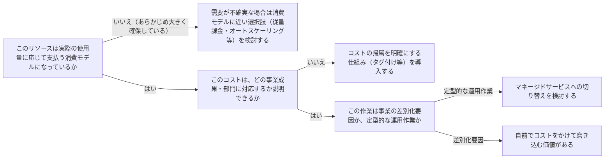

# インフラ・システムのコスト管理の判断を扱う概念：cost-optimization

## 概要

### この概念が答える判断

- コストは誰がどう管理すべきか？
- 使った分だけ払う仕組みと、あらかじめ大きく確保する仕組み、どちらを選ぶべきか？
- 「効率的」かどうかはどう測ればよいか？

コスト最適化とは、無駄な支出を避けながら、事業成果に対して最大の投資対効果を得られるようにシステムを継続的に改善する設計原則である。

---

## 原則

- コスト管理は個人任せにせず、支出を継続的に把握し予算配分を管理する体制（クラウド財務管理）を持つ。
- リソースはあらかじめ大きく確保するのではなく、実際に使った分だけ支払う消費モデルを基本とする。
- 「効率的か」は、事業成果（達成した価値）とコストを対応づけて測る——単にコストが低いことではなく、投資対効果が高いことを目指す。
- 差別化に繋がらない定型的な運用作業（サーバーの物理管理等）にコストと人手をかけるより、マネージドサービスに任せる方が、事業の差別化要因により多くの資源を割ける。
- 支出は部門・機能ごとに把握・帰属させ、どこに何のためにコストがかかっているかを追跡できる状態にする。

---

## 分類

| 分類 | 特徴 |
|---|---|
| 消費モデル | 使った分だけ支払う。事前の大きな確保を避ける |
| 効率性の測定 | コストと事業成果を対応づけて投資対効果を測る |
| 差別化されない作業の外部化 | 定型運用はマネージドサービスに任せ、差別化要因に資源を割く |
| 支出の把握と帰属 | 部門・機能ごとにコストを追跡できる状態にする |

---

## 判断基準

---

## 実例

架空の物流プラットフォーム「ShipFast」で、ピーク時のアクセスに備えて常時大きなサーバー構成を確保していたが、実際のアクセスは時間帯によって大きく変動していた。オートスケーリングを導入し、需要に応じて自動的に増減する消費モデルに切り替えたことで、コストを抑えつつピーク対応も維持できた。また各サービスのコストにチーム名のタグを付け、どのチームのどの機能が何にコストをかけているかを追跡できるようにした。

---

## アンチパターン

| アンチパターン | 問題点 |
|---|---|
| ピーク需要に合わせて常時大きなリソースを確保する | 実際の需要が低い時間帯も同じコストを払い続けることになる |
| コストの帰属先を追跡しない | どの機能・チームが何にコストをかけているか分からず、削減すべき箇所を特定できない |
| 差別化に繋がらない運用作業に人手とコストをかけ続ける | 事業の競争優位に直結しない作業に資源が割かれ、本来注力すべき領域への投資が手薄になる |

---

## 出典・根拠の透明性

AWS Well-Architected FrameworkのCost Optimization Pillarが扱う設計原則（クラウド財務管理・消費モデル・効率性の測定・差別化されない作業の外部化）をAIが要約・再構成したものであり、本文の直接引用ではない。

---

## 関連概念

| 関連概念 | 関係 |
|---|---|
| reliability-targets-and-error-budgets | 可用性目標とコストはトレードオフの関係にあることが多い |
