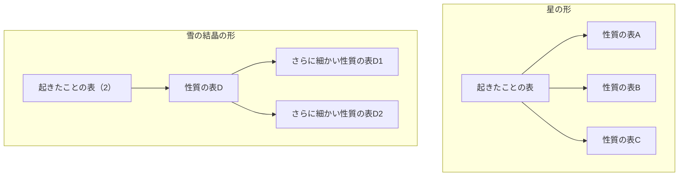
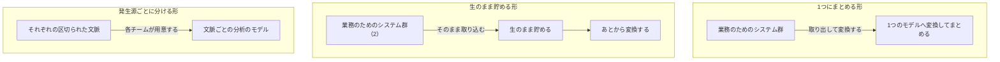
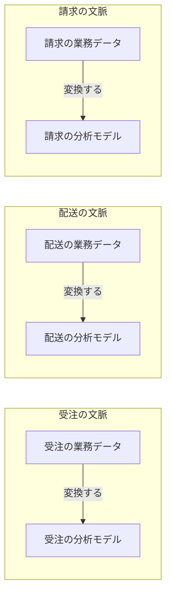
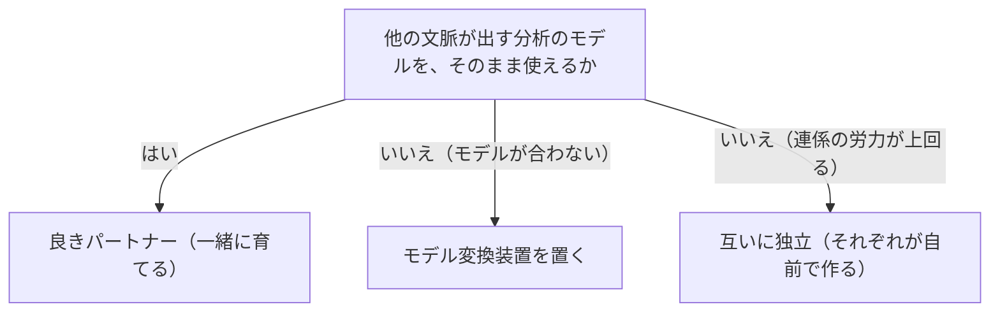
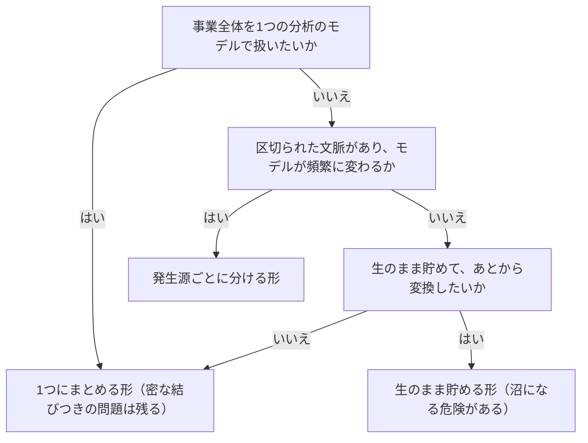

# 分析のためのデータの分割を扱う概念：data-mesh

## 概要

### この概念が答える判断

- 業務のためのモデルを、分析の目的に流用できるか
- 分析のためのデータを集める方式は何種類あり、どう選ぶのか
- 1つにまとめる形と生のまま貯める形の、共通の弱点は何か
- 分析のためのモデルの境界を、どこに引くのか
- 他の文脈が出す分析のモデルを、どう受け取るのか

分析のためのデータに対する、ドメイン駆動設計。全社を1つのモデルへ統合するのではなく、分析のためのモデルの持ち主の境界を区切られた文脈と一致させ、それぞれの文脈が業務のためのモデルと分析のためのモデルの両方を持つ。分析のためのデータを製品として扱い、組織の側も合わせて作り替える。

---

## 出典・根拠の透明性

『ドメイン駆動設計をはじめよう』第16章の書き起こしを、粒度を保ったまま構造へ移したもの。見出しそれぞれにノードを1つ対応させ、書き起こし版で図として書かれていたものは図として持たせ、文章で述べられていた3つの方式の対比も図として起こしている。

### 留保事項

実例は著作権への配慮から架空の業務（受注・配送・請求）へ置き換えた。示している構造——モデルの持ち主の境界が区切られた文脈と一致すること、変換が囲みの内側で完結すること——は保っている。

---

## 関連概念

| 関連概念 | 関係 |
|---|---|
| bounded-context | 分割の境界は、区切られた文脈と自然に一致する |
| context-integration | 連係方法は、分析のためのモデルにもそのまま当てはまる |
| architecture-patterns | CQRSで複数の版を並行して作れる |
| subdomain | 分割の単位は業務領域の分割に対応する |
| domain-model | 業務のためのモデル。分析のためのモデルとは別途設計する |
| event-driven-architecture | イベントを、分析のためのデータの取り込みに使える |

---

## 分析のためのデータの分割

### この概念が扱う範囲

分析のためのデータに対する、ドメイン駆動設計。ドメイン駆動設計が境界を区切って内部を外部から守るのと同じように、分析のためのデータについてもモデルと持ち主の境界を定め、境界の内側のモデルを外部から守る。

### 業務のためのモデルと分析のためのモデル

2つは異なる視点の洞察を得るために設計するので、考え方そのものが違う。業務のためのモデルを分析の目的に流用することはできない。

業務のためのモデルと分析のためのモデルを対比する

目的が違うので設計の考え方も違う。片方をもう片方に流用できない。

| モデル | 処理の種類 | 目的 | 粒度 |
|---|---|---|---|
| 業務のためのモデル | その場のひと塊の変更を処理する | ヒト・モノ・コトを追いかけ、やりとりを調整する | 細かい（1件ずつの記録） |
| 分析のためのモデル | ためた記録を分析する | 事業活動の成果についての洞察を得る | まとめたほうが効率がよい |

#### 2種類の表

分析のためのモデルは、起きたことの表と、その性質の表で構成される。

分析のためのモデルを構成する2種類の表を対比する

起きたことを記す表と、その性質を記す表。前者は消さず足すだけで、後者は繰り返し参照される。

| 種類 | 何を記すか | 性質 |
|---|---|---|
| 起きたことの表 | 業務の流れや行動が行われたこと（動詞にあたる） | 過去に起きた出来事を記す。記録を消しも変えもせず、足すだけ。無効になったことは「いまの状態を表す記録を足す」ことで表す。業務イベントと似ているが、過去形で書くことは必須ではない |
| 性質の表 | 起きたことの性質や状態（形容詞にあたる） | 起きたことの表から参照される。同じ性質が多数の記録に繰り返し現れる。検索の型を予測できないので、高度に正規化する |

#### 分析のためのモデルの形

起きたことの表を中心に性質の表が囲む形と、その性質の表をさらに細かく割った形の2つがある。

分析のためのモデルが取る2つの形を示す

起きたことを記した表を中心に、その性質を記した表が周りを囲む。囲む側をさらに細かく割ると、もう1つの形になる。

| どこの話か | 図に載せきれないこと |
|---|---|
| 起きたことの表 | 矢印は多対1の関係を表す。1つの性質の記録に対して、起きたことの記録が多数ある。 |
| 雪の結晶の形 | 星の形の発展形であって、別物ではない。性質の表をさらに細かく割った結果として、こうなる。全体の量は減って管理しやすくなるが、問い合わせのときに結び合わせる表が増えるので、そのぶん計算する力が要る。 |
| 性質の表A／性質の表B／性質の表C | 分析のためのモデルでは、これらを高度に正規化する。業務のためのモデルなら必要な検索の型を特定できるが、分析ではそれが予測できないためである。 |

### 分析のためのデータを集める3つの方式

1つのモデルへまとめる形、生のまま貯める形、発生源ごとに分ける形。

分析のためのデータをどう集めるか、3つの方式を示す

1つのモデルへまとめる形、生のまま貯める形、発生源ごとに分ける形。前2つは業務のための実装と密に結びつくという同じ弱点を持つ。

| どこの話か | 図に載せきれないこと |
|---|---|
| 1つにまとめる形／生のまま貯める形 | この2つは共通の弱点を持つ。取り出す処理が業務のためのデータベース——つまり内部の実装——を直接参照するので、表の設計を少し変えただけで動かなくなる。モデルが頻繁に変わる領域では、とくに深刻になる。 |
| 発生源ごとに分ける形 | 他の2つと違い、変換する側ではなく発生源の側が用意する。この向きの違いが、密な結びつきを根本から断つ。 |
| 生のまま貯める | 構造の制約が無いので、取り込む段階で品質を保証できない。規模が大きくなると意味を読み解く手間が桁違いに増える。 |

#### 1つのモデルへまとめる形

全社のさまざまな業務のためのシステムからデータを取り出し、1つの分析のためのモデルへ変換して、1つのデータベースへ書き出す方式。取り出して変換して書き出す一連の処理にもとづく。取り出す先は、業務のためのデータベース、イベントのメッセージの流れ、動作の記録のファイルなど。変換のときには、個人の情報を落とす、記録を複製する、イベントの順序を並べ直す、細かいイベントをまとめる、といった操作を行う。特定の分析の目的に関わるデータだけを持つ小さなデータベースを部門ごとに置くこともある。

##### 抱える課題

課題が4つある——1つのモデルで事業全体のあらゆる分析の必要に応えようとするが、それは不可能である。取り出す処理が業務のためのデータベース、つまり内部の実装を直接参照するので密に結びつく。業務のための表の設計を変えると、取り出す処理が動かなくなる。そして業務の側と分析の側を担当する部門のあいだに意思疎通の問題が起きる。

#### 生のまま貯める形

業務のためのシステムのデータを取り込むが、すぐには変換せず、いったん生の状態——業務のためのモデルのまま——で保管する方式。変換をあとから行うので、同じ元データから複数の分析のためのモデルを作れる。ただし構造の制約が無いので、取り込むデータの品質は保証されない。規模が大きくなると、混沌としたデータの意味を読み解く手間が桁違いに増える。

#### 2つに共通する課題

どちらも「分析に取り込むデータが多いほどよい結果が出る」という前提に立つが、現実には巨大なデータの重さに耐えきれず破綻しがちである。根本の問題は、業務のためのシステムの実装モデルと密に結びついていること。ドメイン駆動設計に取り組んでいる場合はとくに深刻になる——モデルが頻繁に変わるので、業務側の変更が分析側に予期しない問題を引き起こす。

### 4つの原則

この方式が立つ原則。前2つがデータの置き方、後ろ2つが組織の作り方にあたる。

この方式が立つ4つの原則を並べる

前2つがデータの置き方、後ろ2つが組織の作り方にあたる。

| 原則 | 内容 |
|---|---|
| データを業務の視点で分割する | 全社を1つのモデルへ統合せず、複数のモデルを発生源と揃える |
| データを製品として扱う | 見つけやすい取り出し口・形を定めた取り決め・信頼できる水準の明示と監視・複数の版の提供 |
| 自律性を高める | 共通の管理基盤を専任のチームが整え、各チームが自分で作れるようにする |
| 生態系を作る | 各文脈の持ち主と基盤チームの代表で統治の集まりを作り、規則を定める |

#### データを業務の視点で分割する

全社のデータを1つのモデルへ統合しようとするのは効果的ではない。複数の分析のためのモデルを使い、それぞれをデータの発生源と揃える。モデルの持ち主の境界は、区切られた文脈の境界と自然に一致する。分析のためのデータを作るのは、その文脈のサービスを開発するチームの責任になる。それぞれの区切られた文脈が、業務のためのモデルと分析のためのモデルの両方を管理する。

分析のためのモデルの持ち主が、区切られた文脈と一致することを示す

それぞれの文脈が、業務のためのモデルと分析のためのモデルの両方を持つ。分析のためのデータを作るのも、その文脈のチームの責任になる。

| どこの話か | 図に載せきれないこと |
|---|---|
| 3つの囲み | 囲みが区切られた文脈と一致しているのが要点である。分析のための境界を新しく引くのではなく、すでにある業務の境界がそのまま使える。 |
| 3本の変換の矢印 | 囲みの内側で完結している。囲みをまたぐ変換の線が無いのは、描き忘れではなく、変換を外部の誰かに任せないという主張である。 |
| 受注の分析モデル／配送の分析モデル／請求の分析モデル | 別々のモデルであって、あとで1つに統合するものではない。統合しないことがこの方式の要点で、必要なら使う側が複数を組み合わせる。 |

#### データを製品として扱う

分析のためのデータを一級の存在として扱う。生のまま貯める形では、詳細を理解していない出どころからデータを取得していたが、この方式では区切られた文脈が、適切に定義した分析のためのモデルを他の文脈へ提供する。製品として扱うための要件は4つ——使う側が必要な取り出し口を簡単に見つけられること。取り出し口には、提供するデータの内容と形を明確に定めた取り決めを用意すること。信頼できることを、水準として定めて監視すること。通常の入口と同じように複数の版を提供し、使う側に壊れる影響を与えないようモデルの変更を管理すること。これを実践するには、開発チームの中にデータに詳しい担当者が要る——業務のためのシステムの専門家だけの構成では欠けていた役割である。

#### 自律性を高める

各チームは自分たちのデータ製品を作るだけでなく、他の文脈が提供するデータ製品を使う側にもなる。相互に使える分析のためのデータを作り・使い・保つ複雑さを扱いやすくするため、共通の管理基盤が要る。その基盤を整える専任のチームが、各開発チームが使えるデータ製品の基本設計を行い、連係の方法を統一し、利用の許可の方針を明確にする。複数の手段でたどりつけるようにし、定めた水準と目的を満たすことを保証する責任も持つ。

#### 生態系を作る

連合の形の統治体制を作る。それぞれの区切られた文脈のデータと製品の持ち主、そして共通基盤のチームの代表で構成する集まりが、健全で相互に使える生態系を保つための規則作りに責任を持つ。規則は、すべてのデータ製品とその入口に適用される。

### ドメイン駆動設計と組み合わせる

この方式の考え方は、ドメイン駆動設計と同じものである。そのため既存の技法がそのまま役に立つ。

#### 同じ言葉と業務知識

分析のためのモデルの設計でも、同じ言葉と業務知識の習得が基本になる。従来の分析のためのモデルでは、ここが欠落しがちだった。

#### 分析のためのモデルは共用サービスである

ある区切られた文脈のデータを、業務のためのモデルとは別の分析のためのモデルとして外へ公開すること自体が、共用サービスにあたる。この場合、分析のためのモデルがもう1つの外向けの言葉になる。

#### CQRSで複数の版を並行して出す

コマンドと参照を分ける方式を採ると、同じデータから複数のモデルを簡単に作れる。さまざまな版の分析のためのモデルを、並行して作って提供できる。

#### 連係方法もそのまま当てはまる

業務のためのモデルで使った区切られた文脈どうしの連係方法——良きパートナー、モデル変換装置、互いに独立など——が、分析のためのモデルにも同じように当てはまる。

他の文脈が出す分析のモデルを、どう受け取るかを決める

そのまま使えるかどうかで分かれる。使えないなら、変換するか自前で作る。

| どこの話か | 図に載せきれないこと |
|---|---|
| 3つの終点 | 業務のためのモデルで使う連係方法が、そのまま当てはまる。分析のためだけの新しい方法を考える必要は無い。 |
| 「いいえ」の2本 | 同じ「いいえ」でも理由が違う。モデルが合わないなら変換を挟み、連係そのものの労力が重複を上回るなら独立する。 |

### どの方式を採るか

分割の単位と、モデルの変更の頻度で決まる。

どの方式を採るかを、分割の単位と変更の頻度で決める

全社を1つのモデルで扱いたいかを先に問い、分けるなら、モデルがどれだけ変わるかで分かれる。

| どこの話か | 図に載せきれないこと |
|---|---|
| 1つにまとめる形（密な結びつきの問題は残る） | 2本の矢印が入っている。積極的に選んだ場合と、他の条件がどれも当てはまらなかった場合の両方でここへ来る。 |
| 区切られた文脈があり、モデルが頻繁に変わるか | 2つを1つの問いにまとめてあるが、実際には両方が要る。境界があってもモデルが変わらないなら、密な結びつきの害はそれほど出ない。 |
| 2つの括弧書き | 終点のうち2つに但し書きが付いている。選んではいけないという意味ではなく、承知したうえで選ぶ、という意味である。 |

### アンチパターン

分析のためのデータの扱いでよく起きる誤り。

#### 業務のためのデータベースを直接参照して取り出す

業務のためのシステムの表の構造は入口ではなく、内部の実装の詳細である。取り出す処理がそこを直接参照すると、表の設計をわずかに変えただけで動かなくなる。区切られた文脈の入口を経由して取得する。

#### 全社の分析のためのデータを1つのモデルへ統合しようとする

全社を1つの分析のモデルで表そうとするのは、全社を1つの業務のモデルで表そうとするのと同じ失敗である。業務領域ごとに分ける。

#### 生のまま貯めた状態を放置する

構造の制約が無いので品質が保証されない。一定の規模になると混沌とし、価値のあるデータを取り出す費用が桁違いに高くなる。取り込む段階で構造を管理するか、発生源ごとに分ける形への移行を検討する。

#### 分析のためのデータを製品として管理しない

明確な持ち主・信頼できる水準・版の管理が無ければ、品質と信頼性は保てない。各文脈のチームが責任を持つ体制を整える。
