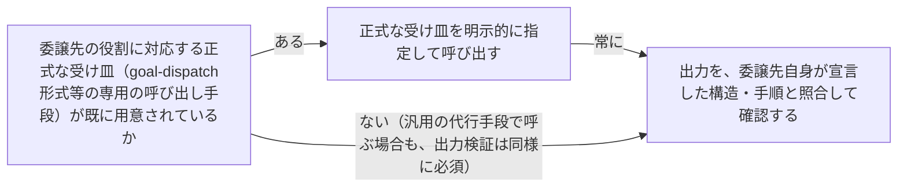

# 委譲の忠実性検証：delegation-fidelity-verification

## 概要

### この概念が答える判断

- 委譲先が、指示した具体的な手順（テンプレート読み込み等）を実際に遂行したかをどう確認すべきか
- goal-dispatch形式の正式な受け皿が存在する場合、汎用のsubagent typeへ要約した指示を渡す代行で済ませてよいか

委譲先に手順への準拠を要約して指示するだけでは、その具体的な手順（テンプレート読み込み等）が実際に遂行される保証にならない。正式な受け皿を明示的に指定し、出力を検証してから確定する必要がある、という原則。

---

## 原則

- 委譲先の内部手順（読むべきテンプレート・従うべき構造等）への準拠は、委譲元が要約した指示を渡すだけでは保証されない。委譲先が実際にその手順を実行したかは別途確認が必要
- goal-dispatch形式のような正式な受け皿（専用の受け取り手段）が既に用意されている場合、汎用の代行手段（要約指示による代行）を使わず、正式な受け皿を明示的に指定する
- 委譲先の出力を受け取ったら、委譲先が自称する準拠（テンプレート構造への準拠等）を、実際の出力を委譲先自身が宣言した構造と照合して確認する。照合せずに委譲先の自己申告を信じない
- テンプレート構造を踏まない出力は、内容の質そのものも未検証とみなす。フォーマットの逸脱は、手順が省略された兆候であり、内容にも同種の省略が生じている可能性を示す

---

## 分類

委譲経路の種類による分岐ではなく、委譲全般に当てはまる単一の原則のため分類軸を持たない

---

## 判断基準

---

## 実例

ある文書管理システムのOrchestratorが、専門家役割（advisor）に判断を委譲する際、その専門家役割は「相談の種類に応じて定型の回答テンプレートを読み込み、その構造で答える」という手順を自身の定義に持っていた。Orchestratorは汎用の代行エージェントに「その専門家役割の定義を読んで、その通りに答えて」と要約した指示だけを渡してしまい、代行エージェントは定義を読んだものの、定型テンプレートを実際には読み込まず、自由な構成で回答した。Orchestratorはその回答を専門家役割の正式な回答として受け取り、検証せずに次の判断へ進めようとした。専門家役割の受け取り専用の正式な呼び出し手段を使って同じ相談をやり直すと、回答の構造だけでなく、踏まえる論点の深さそのものが変わった。

---

## アンチパターン

| アンチパターン | 問題点 |
|---|---|
| 要約指示による代行委譲 | 委譲先の定義文書を要約して代行エージェントに渡すと、定義文書内の具体的な手順（テンプレート読み込み等）が実行される保証がなくなる |
| 出力フォーマットの自己申告を無検証で信じる | 委譲先が「その役割として答えた」と申告しても、実際にその役割が宣言した構造・手順に従っているかを照合しないまま確定すると、フォーマットだけでなく内容の質の劣化も見逃す |

---

## 出典・根拠の透明性

本文書の内容は、実際の委譲作業中に遭遇した事例からの再構成であり、外部文献の引用ではない。

### 留保事項

現時点での実例は1件（advisorへの判断相談の委譲）に限られる。他の委譲対象・他の委譲形式でも同様の失敗が生じるかは未確認。

---

## 関連概念

| 関連概念 | 関係 |
|---|---|
| self-improving-generation-cycle | 生成物の自己申告を検証なしに信じないという原則を、委譲・代行呼び出しの場面に適用したもの |
