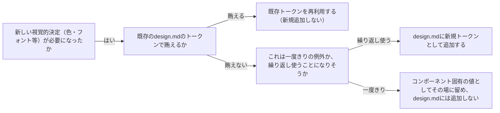

# デザイントークンの設計原則を扱う概念：design-system-tokens

## 概要

### この概念が答える判断

- 新しい色・フォント・余白を使う前に、何を確認すべきか？
- プロジェクトに「デザイントークン」を導入すべきタイミングはいつか？
- AIが陥りがちな紋切り型のデザインを避けるには、何を先に決めるべきか？

デザイントークンとは、色・タイポグラフィ・余白・角丸等の視覚的決定を、コード中に直接埋め込むのではなく、名前付きの再利用可能な値として一箇所に集約したものである。

---

## 原則

- デザイントークンは「決定を先に行い、記録し、以降はその記録を参照する」という運用の土台である。
- 個々のコンポーネントを作り始める前に、カラーパレット・タイポグラフィの役割・レイアウトコンセプト・シグネチャー要素（そのデザインを特徴づける1つの際立った要素）の4種を最小構成として確定し、単一のファイル（design.md）に記録する。
- 個々のコンポーネント実装時は、この記録を読み返して値を引用するだけであり、実装のたびに新しい色・フォントを即興で選んではならない。
- トークンには階層があり、基礎トークン（生の値）→意味トークン（役割を与えたもの）→コンポーネントトークン（特定コンポーネント専用の値）という順で、下位のトークンは上位のトークンから派生させ、独自の値を直接持たない。

---

## 分類

| 分類 | 特徴 |
|---|---|
| 基礎トークン (foundational) | 色・タイポグラフィ・余白等、それ自体では意味を持たない生の値（例: #1A2B3C、16px） |
| 意味トークン (semantic) | 基礎トークンに役割を与えたもの（例: primary-action-color、heading-font） |
| コンポーネントトークン | 特定のコンポーネント専用の値（例: button-border-radius）。基礎/意味トークンから派生させ、独自の値を直接持たない |

---

## 判断基準

---

## 実例

架空のSaaS「TaskFlow」のダッシュボード画面を新規に作る場面を考える。開発着手前に、まずdesign.mdを作成し、カラーパレット（primary: #2D5BFF、background: #F7F8FA等の4〜6色）・タイポグラフィの役割（見出し用/本文用の2種）・レイアウトコンセプト（左サイドバー+右メインの2カラム）・シグネチャー要素（タスクカードの左端に進捗を示す縦バー）を決めてから、個々のコンポーネント実装に着手した。後日「通知バッジ」機能を追加する際、担当者は新しい色を選ばず、design.mdのprimaryトークンをそのまま再利用した。

---

## アンチパターン

| アンチパターン | 問題点 |
|---|---|
| コンポーネントを作りながら都度、新しい色・フォントを即興で選ぶ | 画面ごとに微妙に異なる色・フォントが混在し、後から統一しようとすると全箇所を洗い出す必要が生じる |
| AIが生成しがちな紋切り型パターン（暖色クリーム+セリフ体／ダーク+蛍光グリーン／密な新聞レイアウト）をそのまま採用する | プロダクトの個性がなく、意図的な選択でなく既定値に流された印象を与える |
| design.mdを作らず記憶だけでトークンを管理する | 担当者が変わる・時間が経つと一貫性の判断基準が失われ、コードを読んで逆算するしかなくなる |

---

## 出典・根拠の透明性

Anthropic公式`/frontend-design`skill（設計プラン成果物のフォーマット：カラーパレット・タイポグラフィの役割・レイアウトコンセプト・シグネチャー要素）と、Material Design/Human Interface Guidelinesが採用するトークン階層（基礎/意味/コンポーネント）の考え方をAIが総合し、has-udd独自にまとめたものである。単一の権威ある出典ではなく、複数の確立された実務知見の交差点である。

---

## 関連概念

| 関連概念 | 関係 |
|---|---|
| architecture-dependency-direction | デザイントークンはpresentation層内部の実装詳細であり、依存方向の外側の話ではない（tech-lead-advisorのbackbone） |
