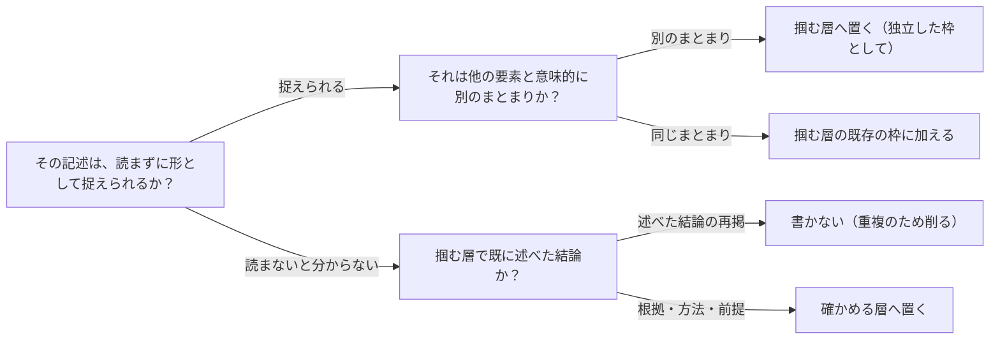

# 掴む層と確かめる層で文書を組み立てる原則を扱う概念：document-two-layer-structure

## 概要

### この概念が答える判断

- 文書のどこに何を書くべきか
- 要約を先頭に置けば読みやすくなるのか
- 冒頭と本文で同じことを書いてよいのか
- 層をどの軸で分けるべきか
- 抽象的な主張はどこまで言い切るべきか

読み手の目的が「まず全体を掴みたい」と「主張を確かめたい」の2つに分かれることを前提に、文書を上下2つの層に分けて構成する考え方。層の分け方・層ごとの責務・両層の関係を定める。

---

## 原則

- 目的で分ける: 層を分ける軸は読み手の属性（人間か機械か、経営層か実務者か）ではなく、読む目的（掴みたいのか、確かめたいのか）に置く。同じ読み手が場面によって両方の目的を持つため、属性で分けるとどちらの層も対象読者を失う。
- 掴む層は要約ではない: 掴む層は本文を短くしたものではなく、情報を落とさずに視覚的な符号へ置き換えたもの。表・図・状態を示す記号によって、読まずに形として捉えられる状態を作る。短くしただけの文章は、読む負荷を減らさない。
- 本質は一点で言い切る: 掴む層の先頭には、その文書が主張することの決め手を1つだけ置く。除いたら結論の必然性が消えるものだけを書き、複数の理由を並べない。理由が複数あると、読み手はどれが効いたのかを判断できない。
- 両層で同じ結論を繰り返さない: 確かめる層は掴む層の結論を再掲する場ではなく、その根拠・測定方法・前提条件を置く場。重複は抽象化ではなく、同じ内容を2回読ませる負荷でしかない。
- 意味的に別のまとまりは構造で区切る: 掴む層に複数の要素（本質・変化・比較・作業の見通し等）を置くとき、それぞれを枠で囲って独立させる。散文として続けて書くと、読み手は境界を自分で見つける負荷を負う。
- 抽象的な主張は具体で裏付けられていること: 掴む層で言い切った本質が、確かめる層のどの記述に支えられているかを辿れる状態にする。視覚的な印（決め手を示す記号等）で対応関係を示せると、主張と根拠の距離が縮まる。
- 確かめる層の並びは固定する: 節の順序を文書ごとに変えない。読み手が「あの情報はこの辺り」という予測を持てるようになり、複数の文書を横断して読むときの負荷が下がる。省略は許すが、入れ替えは許さない。

---

## 分類

| 分類 | 特徴 |
|---|---|
| 掴む層 | 全体を短時間で捉えるための層。本質・変化・比較・作業の見通しなどを、視覚的に符号化した独立した要素として並べる。 |
| 確かめる層 | 主張を裏付けるための層。固定された順序の節に沿って、根拠・測定方法・前提条件・影響範囲・未解決事項を記述する。 |

---

## 判断基準

---

## 実例

ある開発チームが、検索機能の実装方式を決めた記録を書くとする。掴む層の先頭には「運用の負担の軽さが、性能の上振れより重い」という決め手を一点だけ置く。その下に、選ばなかった案との比較を表として並べ、決め手になった観点の行だけに印を付ける。さらに現状と変更後を左右に並べた枠、着手済みと未着手の作業を順に並べた枠を、それぞれ独立した枠として置く。ここまでで、読み手は文章をほとんど読まずに「何を選び、なぜで、どれくらいの作業か」を捉えられる。

確かめる層には、その比較表の各観点をどう測ったかを書く。何件のデータで、どのような条件で計測し、実測できなかった案はどれか。ここで「運用の負担が軽いから選んだ」と再び書いてはならない。それは掴む層で既に述べており、確かめる層の役目は、その主張を疑う読み手に測定の中身を差し出すことにある。

節の順序は、この文書でも他の文書でも同じにする。読み手が3件目を読む頃には、前提条件は2番目の節、未解決事項は最後、と体が覚えている状態になる。

---

## アンチパターン

| アンチパターン | 問題点 |
|---|---|
| 要約と抽象化の混同 | 掴む層に本文の短縮版を置いてしまい、情報が落ちただけで読む負荷が変わらない。読み手は結局本文を読み直すことになり、層を分けた意味が消える。 |
| 読み手の属性による層分け | 「人間向け」「機械向け」「経営層向け」といった属性で層を分けると、同じ読み手が場面によって両方の目的を持つ事実を扱えない。どちらの層も想定読者を失い、書き手も判断に迷う。 |
| 両層での結論の重複 | 掴む層で述べた結論を確かめる層の冒頭でも繰り返すと、読み手は同じ内容を2回読まされる。確かめる層に置くべき根拠のための紙面も奪われる。 |
| 決め手の羅列 | 本質として複数の理由を並べると、どれが効いて結論に至ったのかを読み手が判断できない。後から前提が変わったときに、どの理由が崩れたら結論も崩れるのかを追えなくなる。 |
| 散文への詰め込み | 意味的に別のまとまりを枠で区切らず続けて書くと、読み手が境界を自分で探す負荷を負う。視覚的に捉えられる状態が失われ、掴む層が実質的に本文になる。 |
| 裏付けのない言い切り | 掴む層で強く言い切りながら、確かめる層にそれを支える記述が無い。読み手は主張の当否を判断できず、文書全体の信頼が下がる。 |

---

## 出典・根拠の透明性

特定の文献に基づくものではなく、開発文書を共有しレビューを受ける仕組みを設計する過程で、繰り返し現れた指摘を一般化したもの。要約ではなく再構成である。関連する既存の考え方として、結論を先に述べる文書構成（逆ピラミッド型）や、情報を段階的に開示する設計（progressive disclosure）があるが、本概念はそれらと異なり、層を「読み手の目的」で分ける点と、層をまたぐ重複を明確に禁じる点に主眼がある。

### 留保事項

層を2つとする根拠は、設計の過程で扱った4種類の文書（設計判断の記録・機能の仕様・障害の振り返り・調査の報告）で共通して機能した、という観察に基づく。より多くの種類、あるいは長大な文書で3層以上が必要になるかは検証していない。また、掴む層に置く要素の組み合わせは文書の種類ごとに異なることが分かっているが、その選び方の一般的な規則までは定式化できていない。

---

## 関連概念

| 関連概念 | 関係 |
|---|---|
| progressive-disclosure | 情報を段階的に開示するという点で近いが、本概念は開示の順序ではなく層ごとの責務と重複の禁止を定める |
| visual-hierarchy-and-restraint | 掴む層で視覚的に符号化する際の、強調の配分に関する判断基準を提供する |
