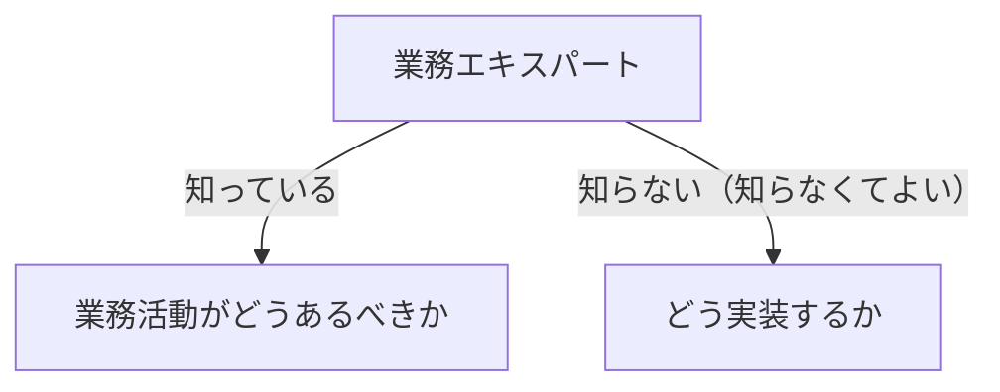
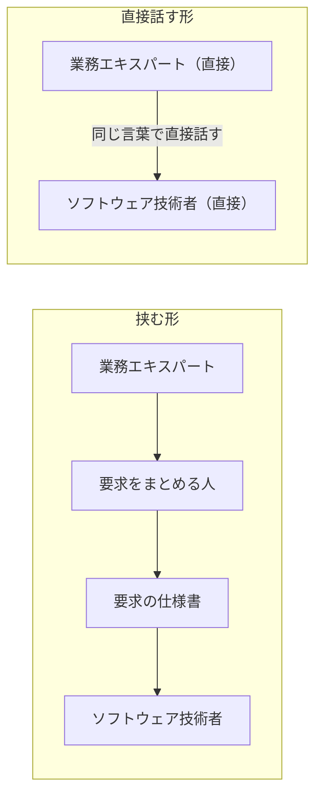

# 業務エキスパートを扱う概念：domain-expert

## 概要

### この概念が答える判断

- 誰を業務エキスパートとして扱うのか
- 業務エキスパートに何を聞いてよく、何を聞いてはいけないのか
- 1人で業務領域の全体を知っている必要があるのか
- なぜ間に要求分析の担当者を立ててはいけないのか

ソフトウェアが対象とする業務領域の活動に精通した人たち。業務活動がどうあるべきかを知っているが、どう実装するかは知らないし、知らなくてよい。同じ言葉はこの人たちから採るものであり、そのために間に人を挟まず直接対話する。

---

## 出典・根拠の透明性

『ドメイン駆動設計をはじめよう』の書き起こしを、粒度を保ったまま構造へ移したもの。見出しそれぞれにノードを1つ対応させ、本文で述べられていた対比は図として持たせている。

### 留保事項

実例は著作権への配慮から架空の業務（配送を担う会社）へ置き換えた。示している構造——知識の範囲が異なる複数の人が、合わせて業務領域の全体をなすこと——は保っている。

---

## 関連概念

| 関連概念 | 関係 |
|---|---|
| ubiquitous-language | 業務エキスパートとソフトウェア技術者が共有する同じ言葉。その源泉がこの人たち |
| subdomain | 業務エキスパートが精通している対象領域 |
| business-domain | 業務領域を含む、事業活動の全体 |

---

## 業務エキスパート

### 業務エキスパートとは誰か

ソフトウェアが対象とする業務領域の活動に精通した人たち。業務領域の課題をはっきりさせ、業務についてのさまざまな知識を提供できる人たちであり、対象領域について信頼できる情報の出どころにあたる。ざっくり言えば、作ろうとしているソフトウェアについて要求を出す人たち、あるいはそのソフトウェアを使う人たちである。

### 役割

3つの役割を担う。

#### 業務活動の代弁者である

要求を分析して整理する専門家ではない。業務領域の活動そのものを代弁する立場にいる。

#### 同じ言葉の源泉である

業務エキスパートの発想や考え方をそのまま表せる言葉が、同じ言葉になる。つまり同じ言葉は、技術者が作るものではなく、この人たちから採るものである。

#### なぜそれが必要かを理解するための対話相手である

ソフトウェア技術者が、業務ロジックや機能が必要な理由を正しく理解するために話す相手にあたる。

### 設計の専門家ではない

業務エキスパートはシステムを設計する専門家ではない。知っているのは業務活動がどうあるべきかであって、どう実装するかではない。ソフトウェア技術者が業務エキスパートになる必要は無いが、その考え方を理解し、業務エキスパートが使っている用語を自分たちも使えるようにすることが求められる。

業務エキスパートが何を知っていて、何を知らないかを分ける

業務活動がどうあるべきかを知っている。どう実装するかは知らないし、知らなくてよい。

| どこの話か | 図に載せきれないこと |
|---|---|
| 業務エキスパートからどう実装するか | この線があるのは、そこに期待してはいけないことを示すためである。知らないのは能力の不足ではなく、役割の範囲である。 |
| 業務活動がどうあるべきか | 技術者の側は、この領域の専門家になる必要は無い。求められるのは、その考え方を理解し、業務エキスパートが使っている用語を自分たちも使えるようになることである。 |

### 知識の範囲はばらばらでよい

1人の中に全部が揃っている必要は無い。たとえば配送を担う会社なら、集荷の計画を立てる責任者、車両の手配を担当する人、実績を分析する人——この全員が業務エキスパートである。それぞれ知っている範囲は違っていてよく、むしろ違うからこそ、合わせて業務領域の全体が見えてくる。

### 間に人を挟まない

業務エキスパートから要求をまとめる人へ、仕様書へ、技術者へ、という伝達の経路では、変換のたびに情報が落ちる。業務エキスパートとソフトウェア技術者が同じ言葉で直接対話することで、これを解く。

業務エキスパートと技術者のあいだに、人を挟むかどうかの違いを示す

挟む形では変換のたびに意図が落ちる。直接話す形では、その変換が起きない。

| どこの話か | 図に載せきれないこと |
|---|---|
| 挟む形 | 間に立つ人が仕事をしていないという意味ではない。変換そのものが情報を落とすので、誰がやっても同じことが起きる。 |
| 業務エキスパート（直接）からソフトウェア技術者（直接） | 矢印は片方向に描いてあるが、この関係は双方向である。技術者からの問いが、業務エキスパート自身も気づいていなかった曖昧さを明らかにすることがある。 |
| 2つの囲み | 上下は良し悪しではなく、間に人が入るかどうかの違いだけを表す。ただしこの概念が勧めるのは下の形である。 |

### アンチパターン

業務エキスパートとの関わり方でよく起きる誤り。

#### 伝達の経路で知識が劣化する

業務エキスパートから要求分析の担当者へ、仕様書へ、開発者へ、という経路では変換のたびに情報が欠落する。直接、同じ言葉で対話する。

#### 業務エキスパートに設計の判断を求める

知っているのは業務活動がどうあるべきかであって、どう実装するかではない。実装の判断を委ねると、答えられないか、業務の視点から離れた答えが返ってくる。
