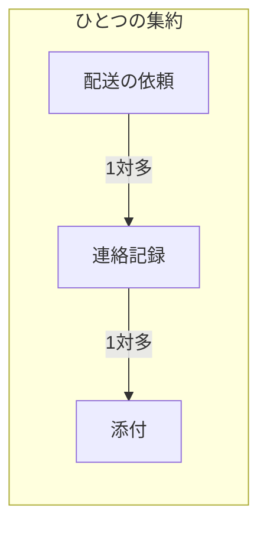
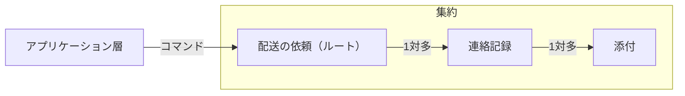
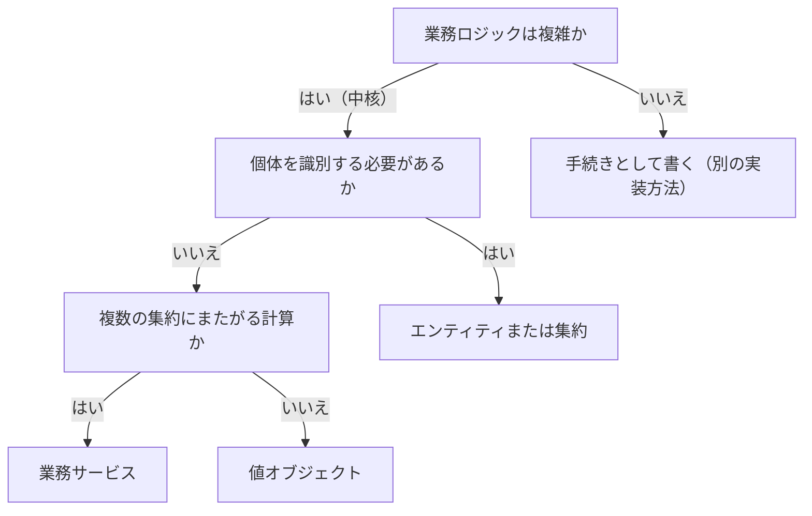

# ドメインモデルの定義を扱う概念：domain-model

## 概要

### この概念が答える判断

- 値オブジェクトとエンティティのどちらで表すか
- あるエンティティを集約の内部に持つか、識別子で参照するか
- 業務サービスを使うのはどんなときか
- そもそもドメインモデルを使うべきか
- 集約の境界はどこに引くか

複雑な業務ロジックを、業務エキスパートの捉え方をそのまま映したオブジェクトとして実装する手法。値オブジェクト・エンティティ・集約・業務サービスの4つの部品からなり、不変条件をカプセル化して自由度を下げることで複雑さを小さくする。

---

## 出典・根拠の透明性

『ドメイン駆動設計をはじめよう』第6章の書き起こしを、粒度を保ったまま構造へ移したもの。見出しそれぞれにノードを1つ対応させている。

### 留保事項

実例とコードの題材は著作権への配慮から架空の業務（配送の依頼）へ置き換えた。コードが示す構造（不変性・版番号による排他・識別子による参照・イベントの発行）は保っている。

---

## 関連概念

| 関連概念 | 関係 |
|---|---|
| subdomain | ドメインモデルは中核の業務領域に使う。補完・一般には別の実装方法を使う |
| business-logic-simple | トランザクションスクリプト・アクティブレコードとの対比 |
| bounded-context | ドメインモデルは区切られた文脈の内部で実装する |
| ubiquitous-language | 集約・値オブジェクト・業務イベントのすべての名前を同じ言葉で命名する |

---

## ドメインモデル（Domain Model）

### ドメインモデルとは

複雑な業務ロジックを実装するための設計手法。技術的な関心事から完全に切り離した素朴なオブジェクトとして実装し、ソースコードが同じ言葉を語り、業務エキスパートの捉え方をそのまま表現する。主要な部品は値オブジェクト・エンティティ・集約・業務サービスの4つ。

### 値オブジェクト

業務で扱う値を表現する部品。欄の値の組み合わせで識別し、明示的な識別子を持たない。不変として実装し、変更するときは新しいインスタンスを返す。等価判定は識別子ではなく値で行う。とくに重要なのは金額の表現で、基本データ型で扱うと丸めや端数の処理に危険な不具合が紛れ込みやすい。

値オブジェクトが不変であり、変更時に新しいインスタンスを返すことを示す

重さを表す値オブジェクトは、足し算をしても自分を書き換えず、計算した結果を持つ新しい値を返す。等価かどうかは識別子ではなく値そのもので決まる。

```csharp
public class Weight
{
    public readonly int Grams;

    public Weight Add(Weight other)
    {
        return new Weight(grams: this.Grams + other.Grams);
    }
}
```

#### 値オブジェクトをいつ使うか

事業活動を表現する基本部品と考えるとよい。エンティティの属性として使い、状態区分や合言葉など、その領域に固有の概念がある場合も値オブジェクトで表現する。

#### 基本データ型から値オブジェクトへ

個々の値を素の型で持つと、その値に関する規則が型の外へ散らばる。値オブジェクトにすると、規則がその値の内側に集まる。

基本データ型への執着と、値オブジェクトで表した形を対比する

上の書き方では、電話番号の桁の検査も重さの単位換算も、この型の外に散らばる。下の書き方では、それぞれの規則がその値の内側に集まる。

```csharp
// 基本データ型への執着
public class Shipment {
    public string ReceiverName;
    public string PhoneNumber;
    public double WeightKg;
    public string PostalCode;
}

// 値オブジェクトで表現
public class Shipment {
    public ReceiverName Receiver;
    public PhoneNumber  Phone;
    public Weight       Weight;
    public PostalCode   PostalCode;
}
```

### エンティティ

値オブジェクトとは対照的な部品。個々のインスタンスを特定するための識別子が必要で、不変ではなく状態が変化する。値オブジェクトはエンティティの状態を表現する手段になる。エンティティは単独で実装せず、必ず集約の実装の一部になる。識別子も値オブジェクトとして実装し、その個体が存在する限り変更しない。

エンティティが識別子を持ち、状態が変化することを示す

配送の依頼は識別子で個体を特定し、受取人の名前は後から変わりうる。識別子そのものも値オブジェクトとして実装する。

```csharp
class Shipment
{
    public readonly ShipmentId Id;      // 値オブジェクト
    public ReceiverName Receiver { get; set; }  // 値オブジェクト
}
```

### 集約

ドメインモデルの中心的な部品。エンティティの階層構造であり、データの一貫性を保証する境界である。集約はエンティティでもあるが、単なるエンティティと違って一貫性の保証を目標とする。

#### 一貫性を強制する

集約は内部と外部の間に明確な境界を定義することで一貫性を強制する。状態を変更できるのは集約内部の業務ロジックだけで、外部には参照だけを許す。状態を変えるには集約が公開しているメソッドを実行する。

#### コマンド

集約が外部へ公開する状態変更メソッドをコマンドと呼ぶ。書き方は2つあり、普通の公開メソッドとして書く方法と、必要な情報をまとめたオブジェクトを渡す方法がある。

集約の状態を変えるコマンドの2つの書き方を示す

普通の公開メソッドとして書く方法と、必要な情報をひとつのオブジェクトにまとめて渡す方法がある。後者は、コマンドの種類が増えても入口をひとつに保てる。

```csharp
// 方法1: 通常の公開メソッド
public void AddNote(UserId from, string body) { ... }

// 方法2: パラメーターオブジェクト（推奨）
public void Execute(AddNote cmd)
{
    var note = new Note(cmd.From, cmd.Body);
    _notes.Append(note);
}
```

#### 並行処理管理

一貫性の保証でもっとも重要な部分。複数の処理が同じ集約を変更するとき、先の更新を後の更新が上書きしないようにする。集約に版番号を持たせ、読んだときの版と一致する場合だけ書き込む。

後から来た更新が、先に来た更新を黙って上書きしないようにする仕組みを示す

集約は版番号を持ち、更新は「読んだときの版と今の版が同じなら書く」という条件で行う。一致しなければ例外を上げ、呼び出し元が読み直してやり直す。条件を書かずに更新すると、後から来たほうが黙って勝つ。

```sql
UPDATE shipments
SET status = @new_status,
    agg_version = agg_version + 1
WHERE shipment_id = @id AND agg_version = @expected_version;
```

#### トランザクションの境界

1つの集約のインスタンスが1つのトランザクションの単位になる。集約内部のすべての状態は単一のトランザクションとして確定する。複数の集約にまたがるトランザクションを実行してはいけない——そうしたくなったなら、集約の境界がまちがっている。

#### エンティティの階層構造

集約は複数のエンティティと値オブジェクトの階層構造を持てる。業務ロジックがすべてを必要とする場合、その階層全体がひとつの集約になる。「集約」という名前は、関連するものをトランザクション境界の内部へ集めることに由来する。

集約が、複数のエンティティと値オブジェクトの階層構造を持てることを示す

配送の依頼の下に連絡記録があり、その下に添付がある。この階層全体がひとつの集約になる——業務ロジックがすべてを必要とする場合に限る。



| から | へ | 関係 |
|---|---|---|
| 配送の依頼 | 連絡記録 | 1対多 |
| 連絡記録 | 添付 | 1対多 |

#### 他の集約を参照する

他の集約は識別子で参照し、オブジェクトそのものを内部に保持しない。境界の外側であることを明確に表し、集約ごとに固有のトランザクション境界を保つため。内部に持つかどうかは、結果整合性しか保証されない相手を業務ロジックが参照したときに不正な状態になる危険があるかで判断する。経験則として、集約はできるだけ小さく設計する。

集約の内側に持つものと、識別子で外を指すものの違いを示す

同じ集約の一部として一貫性を守るものだけを内側に持ち、それ以外は識別子で指す。識別子で指すことが、「これは境界の外側だ」という表明になる。

```csharp
public class Shipment
{
    private CustomerId      _customer;   // 識別子で参照（境界の外）
    private List<ProductId> _products;   // 識別子で参照（境界の外）
    private List<Note>      _notes;      // 集約の内側に保持
}
```

#### 集約のルート

外部に公開するインターフェース役のエンティティは1つにする。それが集約のルート。内部の他のエンティティの状態を変えるコマンドも、必ずルートを経由して実行する。

外部が触れるのは集約のルートだけであることを示す

アプリケーション層はルートへコマンドを渡すだけで、内側のエンティティへ直接は触れない。内側の状態を変えるコマンドも、必ずルートを経由する。



| から | へ | 関係 |
|---|---|---|
| アプリケーション層 | 配送の依頼（ルート） | コマンド |
| 配送の依頼（ルート） | 連絡記録 | 1対多 |
| 連絡記録 | 添付 | 1対多 |

#### 業務イベント

事業活動の中で起きた重要な出来事を表現するメッセージ。名前は必ず過去形にする。集約が発行し、他の処理・集約・外部サービスが購読して業務ロジックを実行する。業務イベントは集約の公開インターフェースの一部であり、外部と連係するもう一つの方法である。

集約が業務イベントを発行する形を示す

条件を満たしたときだけ状態を変え、起きた出来事を過去形の名前で記録する。この記録を他の集約や外部の仕組みが購読して、続きの処理を行う。

```csharp
public void Execute(RequestPriorityDelivery cmd)
{
    if (!this.IsPriority && this.RemainingTimePercentage <= 0)
    {
        this.IsPriority = true;
        _domainEvents.Append(new DeliveryPrioritized(_id, cmd.Reason));
    }
}
```

#### 同じ言葉を厳密に反映する

集約の名前、持つデータの名前、メソッドの名前、発信する業務イベントの名前——そのすべてを、区切られた文脈の同じ言葉によって命名する。

### 業務サービス

集約や値オブジェクトでは表現しにくい業務ロジック、または複数の集約にまたがる業務ロジックを記述するための部品。業務ロジックだけを記述し、自分自身の状態は持たない。多くの場合、さまざまな部品の呼び出しを統合して計算や分析を行う。

業務サービスが、複数の集約から材料を集めて計算だけを行う形を示す

自分自身の状態は持たず、方針と勤務予定という別々の集約から値を読み、締切を計算して返すだけ。どの集約の状態も変えない。

```csharp
public class ResponseDeadlineService
{
    public Deadline Calculate(
        StaffId staffId, Priority priority, bool prioritized, DateTime startTime)
    {
        var policy = _policyRepository.GetFor(staffId);
        var maxTime = policy.GetMaxResponseTimeFor(priority);
        if (prioritized) maxTime = maxTime * policy.PriorityFactor;
        var shifts = _shiftRepository.GetUpcoming(staffId, startTime);
        return CalculateTargetTime(maxTime, shifts);
    }
}
```

#### マイクロサービスの「サービス」とは無関係

業務サービスは、マイクロサービスやサービス指向アーキテクチャの「サービス」という用語とは無関係である。業務ロジックの置き場所として使う、状態を持たないオブジェクトを指す。

#### 抜け道ではない

1集約=1トランザクションの原則は変わらない。業務サービスは複数の集約を参照する計算を書くのに役立つが、複数の集約を単一のトランザクションで変更するための抜け道ではない。

### 複雑さの扱い方

集約と値オブジェクトの背景にある考え方は、不変条件をカプセル化して複雑さを小さくすること。システムの複雑さは自由度——独立して変化できる状態の個数——で決まる。不変条件を加えると制約が増え、自由度が下がり、振る舞いを制御・予測するのが簡単になる。値オブジェクトは値に関する規則を境界の内側に集め、集約は状態を変えられる経路を自分のメソッドだけに絞る。

不変条件を入れると自由度が下がり、扱いが簡単になることを示す

上の型は5つの欄がすべて独立に動くので、取りうる状態の組み合わせが多い。下の型は2つが決まれば残り3つが決まるので、独立に動く欄は2つ。一見すると下のほうが複雑に見えるが、振る舞いを予測するのは下のほうが簡単である。

```csharp
// 自由度5（5つの欄がすべて独立して変化できる）
public class A { public int V1, V2, V3, V4, V5; }

// 自由度2（V1 と V4 だけが独立。残りはそこから決まる）
public class B {
    public int V1 { get => _v1; set { _v1 = value; V2 = value/2; V3 = value/3; } }
    public int V4 { get => _v4; set { _v4 = value; V5 = value*2; } }
    public int V2 { get; private set; }
    public int V3 { get; private set; }
    public int V5 { get; private set; }
}
```

### 4つの部品の対比

識別子の有無・状態が変わるか・何のための部品かで並べたもの。

4つの部品を、識別子の有無・状態の変化・特徴で対比する

識別子を持つのはエンティティと集約。状態が変わるのもその2つ。値オブジェクトと業務サービスはどちらも状態を持たないが、前者は値そのもの、後者は計算の置き場所である。

```markdown
| 部品 | 識別子 | 状態変化 | 特徴 |
|---|---|---|---|
| 値オブジェクト | なし | なし（不変） | 欄の値の組み合わせで識別。変更時は新しいインスタンスを生成 |
| エンティティ | あり | あり | 集約の一部として実装。単独では実装しない |
| 集約 | あり（ルート） | あり | データの一貫性境界。1集約=1トランザクション |
| 業務サービス | なし | なし（状態を持たない） | 複数の集約にまたがる計算ロジック |
```

### どの部品を使うか

個体の識別が要るか、複数の集約にまたがる計算か、そもそも業務ロジックが複雑かで決まる。

4つの部品のどれを使うかを、順に問うて決める

個体を識別する必要があればエンティティ、無ければ値オブジェクト。複数の集約にまたがる計算なら業務サービス。そもそも業務ロジックが複雑でなければ、ドメインモデル自体を使わない。



| から | へ | 関係 |
|---|---|---|
| 業務ロジックは複雑か | 個体を識別する必要があるか | はい（中核） |
| 業務ロジックは複雑か | 手続きとして書く（別の実装方法） | いいえ |
| 個体を識別する必要があるか | エンティティまたは集約 | はい |
| 個体を識別する必要があるか | 複数の集約にまたがる計算か | いいえ |
| 複数の集約にまたがる計算か | 業務サービス | はい |
| 複数の集約にまたがる計算か | 値オブジェクト | いいえ |

### アンチパターン

ドメインモデルでよく起きる誤り。

#### 基本データ型への執着

金額・電話番号・連絡先などを素の文字列や数値で扱うと、関連する業務ロジックがあちこちに散らばる。値オブジェクトで表現して内側に集める。

#### エンティティを単独で実装する

エンティティは必ず集約の実装の一部になる。単独で実装すると、データの一貫性の境界が定義できない。

#### 複数の集約にまたがるトランザクション

複数の集約を単一のトランザクションで確定しようとするのは、集約の境界がまちがっているサイン。集約を設計し直すか、結果整合性で対処する。

#### 集約を大きくしすぎる

集約が大きくなると性能や規模の問題が起きやすくなる。できるだけ小さく設計し、強い一貫性が必要なデータだけを含める。

#### 業務イベントの名前に過去形を使わない

業務イベントは実際に起きた出来事を表現するため、名前は必ず過去形にする。現在形や命令形は、イベントではなくコマンドを表す。
