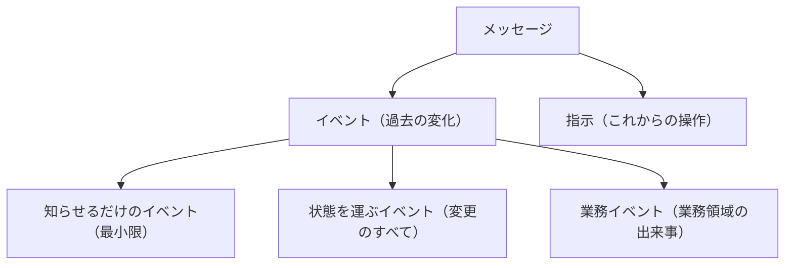
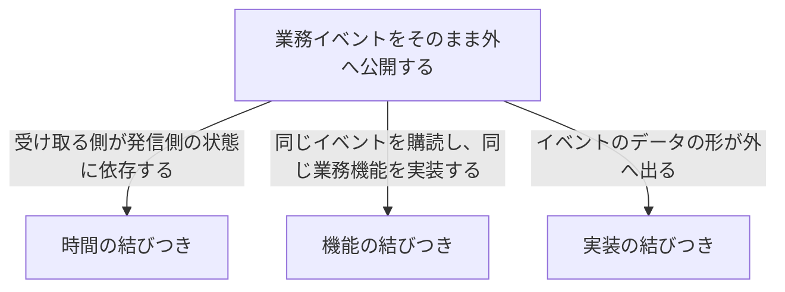
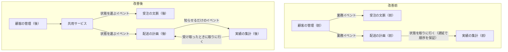
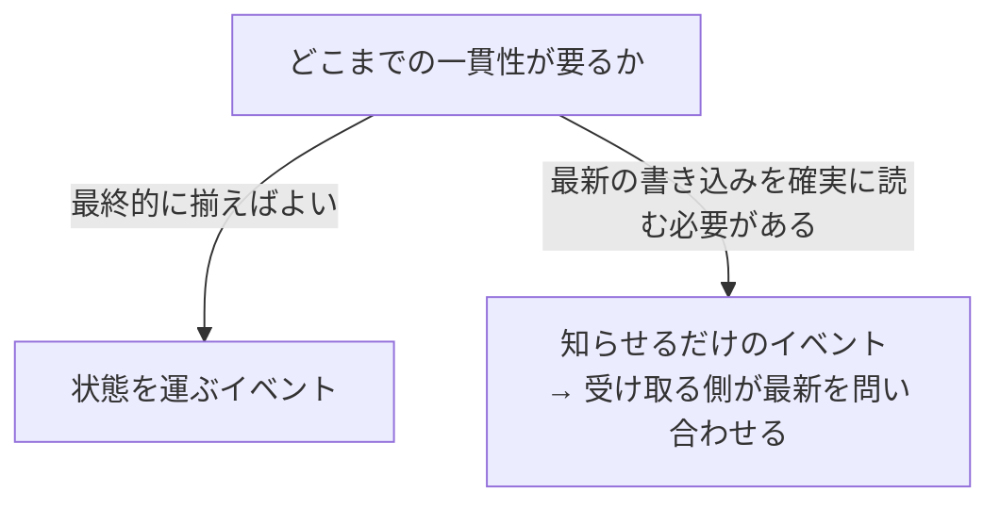
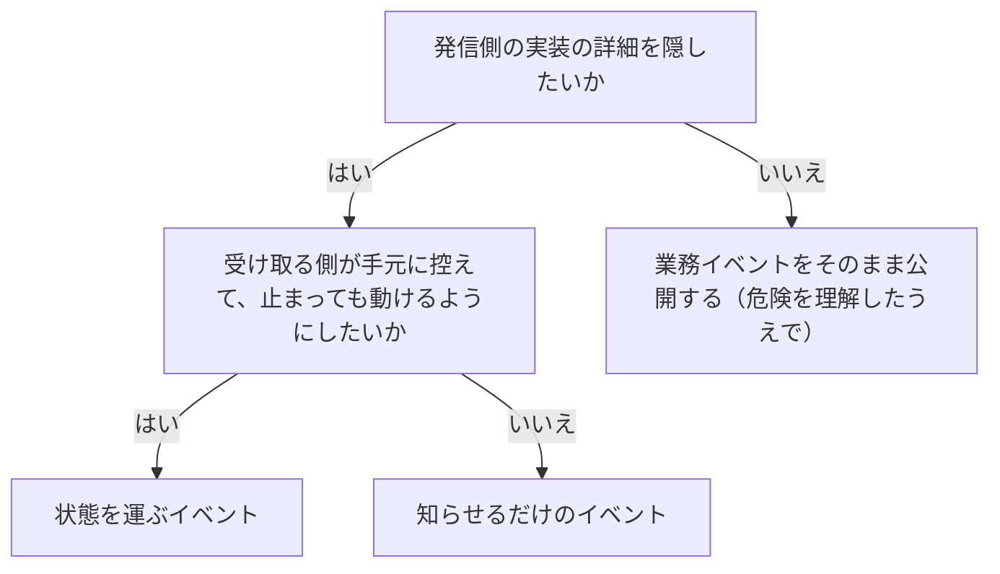

# イベント駆動型の連係を扱う概念：event-driven-architecture

## 概要

### この概念が答える判断

- イベント駆動型と、イベントの履歴を保存する形は何が違うのか
- 3種類のイベントを、どう使い分けるのか
- 分散したのに密に結びついてしまうのは、なぜか
- 求める一貫性の水準は、イベントの選び方にどう影響するのか
- 順序が入れ替わる・重複する前提で、どう設計するのか

部品どうしのあいだで、イベントのメッセージを非同期にやりとりする技術方式。イベントには何をどれだけ載せるかで3つの種類があり、どれを選ぶかで緩やかに結びつくか密に結びつくかが決まる。業務イベントをそのまま外へ出すと、時間・機能・実装の3つの密な結びつきが生じる。

---

## 出典・根拠の透明性

『ドメイン駆動設計をはじめよう』第15章の書き起こしを、粒度を保ったまま構造へ移したもの。見出しそれぞれにノードを1つ対応させ、書き起こし版で図として書かれていたものは図として持たせ、文章で述べられていた密な結びつきの起点も図として起こしている。

### 留保事項

実例は著作権への配慮から架空の業務（配送）へ置き換えた。同じ出来事を3つの種類で書き分ける例は、書き起こし版では人の身分に関わる題材だったが、配送先の変更に差し替えている——示している構造（事実だけ／変わった値／業務としての出来事の要点）は保っている。

---

## 関連概念

| 関連概念 | 関係 |
|---|---|
| communication | 送信箱・サーガ・プロセスマネージャー。この方式の信頼性を支える |
| bounded-context | この方式が設計するのは、区切られた文脈の入口 |
| event-sourced-domain-model | 混同されやすいが別物。こちらは文脈の内部の実装方式 |
| microservices | 入口を小さくして深くする手法と連動する |
| context-integration | 共用サービスは連係方法の1つ |

---

## イベント駆動型の連係

### イベント駆動型とは何か

部品どうしのあいだで、イベントのメッセージを非同期にやりとりする技術方式。区切られた文脈の入口を設計する手段として使う。

#### イベントの履歴を保存する形とは別物である

混同されやすいが、範囲も役割も違う。どちらを採るかは独立して決められる。

イベント駆動型と、イベントの履歴を保存する形の違いを並べる

同じ設計方法の別名ではない。範囲も役割も違うので、どちらを採るかは独立して決められる。

| 概念 | 範囲 | 役割 |
|---|---|---|
| イベント駆動型 | 部品どうしの通信の方式 | 境界を越えてメッセージを非同期でやりとりする |
| イベントの履歴を保存する形 | 区切られた文脈の内部の実装方式 | 集約の状態の変化をイベントとして記録する |

### メッセージの種類

メッセージはイベントと指示に分かれ、イベントはさらに3つに分かれる。どちらも非同期のメッセージとして送られる。

メッセージが2つに分かれ、そのうち片方がさらに3つに分かれることを示す

まずすでに起きたことか、これからやることかで分かれる。すでに起きたことのほうは、何をどれだけ載せるかで3つに分かれる。



| どこの話か | 図に載せきれないこと |
|---|---|
| イベント（過去の変化）／指示（これからの操作） | 決定的な違いは、拒否できるかどうかである。指示は内容が不完全だったり規則に反していたりすれば拒否できるが、イベントは受け取った側が取り消せない。逆向きの処理をするには、埋め合わせの指示を出すしかない。 |
| 3つのイベント | 3つは技術の違いではなく、何のために出すかの違いである。知らせるだけのものは連係の複雑さを減らすため、状態を運ぶものはデータを非同期に複製するため、業務イベントは業務領域の活動をモデル化して説明するため。 |
| 業務イベント（業務領域の出来事） | 他の2つと違い、外部の誰も興味を持たなくても役に立つ。文脈の内側で使うものなので、そのまま外へ出すと実装の詳細が漏れる。 |

#### イベントと指示の違い

イベントはすでに起こった変化を表す。過去に起きた事実なので、受け取った側が取り消すことはできない。名前は過去形で書く。逆向きの処理をするには、埋め合わせの指示を出すしかない。指示はこれから実行すべき操作を表す。内容が不完全だったり業務の規則に反していたりすれば、拒否される可能性がある。

#### イベントのデータの形

何らかのメッセージの通信基盤を通して外へ送れるデータの記録である。説明のための情報と、内容そのものに分かれる。

イベントのデータの形を示す

説明のための情報と、内容そのものに分かれる。どの種類のイベントでも、この骨格は変わらない。

```json
{
  "type": "delivery-confirmed",
  "event-id": "14101928-4d79-4da6-9486-dbc4837bc612",
  "correlation-id": "08011958-6066-4815-8dbe-dee6d9e5ebac",
  "delivery-id": "05011927-a328-4860-a106-737b2929db4e",
  "timestamp": 1615718833,
  "payload": {
    "confirmed-by": "17bc9223-bdd6-4382-954d-f1410fd286bd",
    "delivery-time": 1615701406
  }
}
```

### 3種類のイベント

何をどれだけ載せるかで3つに分かれる。選び方を誤ると密な結びつきを生む。

#### 知らせるだけのイベント

他の部品が反応することを想定した、事業活動で起きた変化についての知らせ。内容は必要最小限で、発生を伝えることだけが目的である。受け取る側は、たどる先を使って詳しい情報を問い合わせる。この形が好ましい状況が2つある——守るべき情報がメッセージの経路に流れるのを防ぎたい場合（問い合わせの時点で追加の権限確認ができる）。そして、届いた時点の内容が最新とは限らないので、厳密に最新の状態が要る場合。複数の受け取り手が競合するときは、同じメッセージを複数が処理しないように制御することもできる。

知らせるだけのイベントの形を示す

内容そのものは載せず、たどる先だけを渡す。受け取った側は、必要になった時点で取りに行く。

```json
{
  "type": "manifest-generated",
  "event-id": "537ec7c2-d1a1-2005-8654-96aee1116b72",
  "shipment-id": "05011927-a328-4860-a106-737b2929db4e",
  "timestamp": 1615726445,
  "payload": {
    "carrier-id": "456123",
    "link": "/manifests/456123/2026/01"
  }
}
```

#### 状態を運ぶイベント

発信側の内部の状態の変化を、購読する側へ知らせるメッセージ。知らせるだけのものとは対照的に、変化を反映したすべてのデータを含む。受け取る側が手元に控えておけるので、発信側が止まっていても処理を続けられる。実質的に、データを非同期に複製する仕組みにあたる。複数の情報の出どころを扱う部品では、性能も上がる。形は2通り——変わったあとの状態のすべてを載せる形と、実際に更新された欄だけを載せる形（データの構造が大きい場合）。

#### 業務イベント

業務領域で起きた重要な出来事を表しつつ、その出来事を説明するすべてのデータを含む。

##### 知らせるだけのイベントとの違い

業務イベントは、その出来事を表すすべての情報を含むので、追加の問い合わせが要らない。目的も違う——知らせるだけのイベントは他の部品との連係の複雑さを減らすためで、業務イベントは業務領域の活動をモデル化して説明するためである。そのため業務イベントは、他の部品が興味を持たなくても役に立つ。

##### 状態を運ぶイベントとの違い

状態を運ぶイベントは、発信側の状態を受け取る側で控えるのに十分な情報を提供する。業務イベントはそうした詳細を外へ出さない。表しているのは集約の状態ではなく、集約の一生の途中で起きた業務としての出来事である。

##### 同じ出来事を3つの種類で書き分ける

何をどれだけ載せるかの違いが、同じ出来事で並べると見える。

同じ1つの出来事を、3つの種類で書き分けた例を示す

同じことを伝えるのに、何をどれだけ載せるかが違う。上は事実だけ、中は変わった値、下は業務としての出来事の要点である。

```javascript
// 知らせるだけ：手続きが済んだという事実だけ
notification = {
  "type": "配送先の変更が受理された",
  "shipment-id": "01b9a761",
  "payload": { "details": "/01b9a761/address-change" }
};

// 状態を運ぶ：変わった値そのもの
stateTransfer = {
  "type": "配送先が変わった",
  "shipment-id": "01b9a761",
  "payload": { "new-address": "北山市中央3-1" }
};

// 業務イベント：業務として何が起きたかの要点
domainEvent = {
  "type": "荷主が届け先を変更した",
  "shipment-id": "01b9a761",
  "payload": { "rerouted-after-dispatch": true }
};
```

### どのイベントを選ぶかで結びつきが決まる

イベントの設計が、部品どうしの連係の仕方と境界を決める。どの種類を選ぶかで、緩やかに結びつくか密に結びつくかが変わる。

#### 3種類の密な結びつき

業務イベントをすべて公開してしまうと、購読する側が実装の詳細と密に結びつく。これが分散した大きな泥団子になる。

3種類の密な結びつきが、それぞれ何に依存して起きるかを示す

時間の順序、同じ機能の重複、データの形。どれも、業務イベントをそのまま外へ出したことから生じる。



| どこの話か | 図に載せきれないこと |
|---|---|
| 業務イベントをそのまま外へ公開する | 3つすべての起点がここにある。個別に対処するより、この起点を絶つほうが根本的である。 |
| 時間の結びつき | 「5分待てば先の処理が終わる」といった遅延の仕組みで対処されがちだが、通信の障害・高い負荷・サービスの停止で破綻する。 |
| 機能の結びつき | 双方向であることが厄介である。機能を変えるとき、両方の部品を同時に変えなければならない。 |

##### 時間の結びつき

実行の順番に強く依存している状態。ある部品の処理が、別の部品より先に終わっていなければならない。対処として遅延を入れることが多いが、通信の障害・高い負荷・サービスの停止で破綻する。根本の原因は、状態を運ぶ形を業務イベントで代用し、受け取る側が発信側の状態に依存していることにある。

##### 機能の結びつき

複数の部品が同じ業務機能を実装している状態。同じイベントを購読して同じ機能を実装しているので、双方向に結びつく。機能が変われば、両方を同時に変えなければならない。

##### 実装の結びつき

ある部品の実装を変えると、購読している別の部品の変更を強いる状態。イベントのデータの形が変わると、投影の処理でエラーが起きる。新しい業務イベントが増えると、受け取る側の投影のモデルにも影響しうる。

#### 結びつきをほどく

実装の結びつきと機能の結びつきは、投影の処理を発信側に閉じ込めることでほどける——受け取る側が必要とするモデルを発信側が投影し、その結果を外向けの言葉に含める。こうすると連係のためのモデルが、発信側の内部の実装モデルから切り離される。発信するイベントは、状態を運ぶ形にする。時間の結びつきは、上流が知らせるだけのイベントを出し、下流がそれを受け取った時点で必要なデータを取りに行く形にすればほどける。遅延の仕組みが要らなくなる。

密な結びつきを解いた前と後を対比する

前は業務イベントが直接ばらまかれ、後ろでは共用サービスを挟んで状態を運ぶ形と知らせるだけの形に分けている。



| どこの話か | 図に載せきれないこと |
|---|---|
| 共用サービス | ここが加わったことが改善の本体である。受け取る側が必要とするモデルを発信側が投影し、その結果を外向けの言葉に含める——連係のためのモデルが、発信側の内部の実装モデルから切り離される。 |
| 実績の集計（後）から配送の計画（後） | 改善前には無かった線である。知らせを受け取ったときに必要なデータを取りに行く形にすると、遅延で順序を保証する仕組みが要らなくなる。 |
| 配送の計画（前）から実績の集計（前） | 括弧の中が問題の核心である。遅延で順序を保証しようとしている時点で、時間の結びつきが起きている。 |

### 設計するときの経験則

3つある。

#### 最悪の場合を前提に置く

起きるかもしれない、ではなく起きるものとして設計する。

起きることを前提に置く5つの事態と、その備えを並べる

どれも「起きるかもしれない」ではなく「起きる」として設計する。

| 前提に置くこと | 備え |
|---|---|
| 通信は必ず遅れる | 順序に依存しない設計にする |
| 機器はもっとも都合の悪いときに壊れる | 送信箱で確実に送り出す |
| イベントは順番どおりに届かない | 受け取る側で並べ直す |
| イベントは重複する | 受け取る側で重なりを取り除く |
| 障害は決まって休みの日に起きる | 複数の文脈にまたがる流れは、サーガかプロセスマネージャーで扱う |

#### 外へ出すイベントと内側のイベントを使い分ける

業務イベントを発行するとき、実装の詳細が外へ漏れないようにする。イベントは区切られた文脈の入口の欠かせない要素として扱う。共用サービスを実装するなら、イベントがその文脈の外向けの言葉を反映するようにする。業務イベントを他の区切られた文脈との通信にそのまま使うのは控え、外へ出す業務イベントを限定することを検討する。知らせるだけのイベントを使えば、入口をさらに小さくできる。

#### 求める一貫性の水準から選ぶ

最終的に揃えばよいのか、最新の書き込みを確実に読む必要があるのかで決まる。

求める一貫性の水準で、使うイベントの種類が決まることを示す

最終的に揃えばよいなら状態を運び、最新を確実に読む必要があるなら知らせるだけにして取りに行かせる。



| どこの話か | 図に載せきれないこと |
|---|---|
| 状態を運ぶイベント | 受け取る側が手元に控えておけるので、発信側が止まっていても処理を続けられる。そのぶん、控えは常に最新とは限らない。 |
| 知らせるだけのイベント → 受け取る側が最新を問い合わせる | 問い合わせが増えるという代償がある。そのかわり、守るべき情報がメッセージの経路に流れないという利点もあり、問い合わせの時点で追加の権限確認もできる。 |

求める一貫性の水準ごとに、使うイベントの種類を並べる

最新を確実に読む必要があるかどうかが分かれ目になる。

| 求める一貫性 | 使う種類 |
|---|---|
| 最終的に揃えばよい | 状態を運ぶイベント |
| 受け取る側で発信側の最新の書き込みを読む必要がある | 知らせるだけのイベントを出し、受け取る側が最新を問い合わせる |

### どのイベントを使うか

実装の詳細を隠すかどうかと、手元に控えるかどうかで決まる。

どの種類のイベントを使うかを、順に問うて決める

まず実装の詳細を隠すかどうかを問い、そのうえで手元に控えるか最新を読むかで分かれる。



| どこの話か | 図に載せきれないこと |
|---|---|
| 業務イベントをそのまま公開する（危険を理解したうえで） | 括弧書きが付いているのはこの終点だけである。禁止ではないが、購読する側が実装の詳細と密に結びつくことを承知したうえで選ぶ。 |
| 発信側の実装の詳細を隠したいか | この問いに「はい」と答えるとき、共用サービスを経由させることが前提になっている。イベントの種類を選ぶだけでは、詳細は隠れない。 |

### アンチパターン

イベント駆動型の設計でよく起きる誤り。

#### 業務イベントをそのまま文脈のあいだの通信に使う

イベントの履歴を保存する形が生む業務イベントをすべて購読する側へ公開すると、実装と密に結びつく。外へ出すものを一部に限るか、状態を運ぶイベントや共用サービスを使う。

#### 遅延で時間の結びつきを解こうとする

「5分待てば先の処理が終わる」という設計は、通信の障害・高い負荷・サービスの停止で破綻する。受け取った時点で問い合わせる設計に変える。

#### 種類を選ばず、すべてに業務イベントを使う

業務イベントの目的は業務領域をモデル化することである。連係の複雑さを減らしたいなら知らせるだけのイベント、状態を非同期に複製したいなら状態を運ぶイベントを使う。種類の取り違えが、分散した大きな泥団子につながる。

#### イベントの履歴を保存する形と混同する

イベント駆動型は部品どうしの通信の方式、イベントの履歴を保存する形は区切られた文脈の内部の実装方式である。どちらを採るかは独立して決められる。
