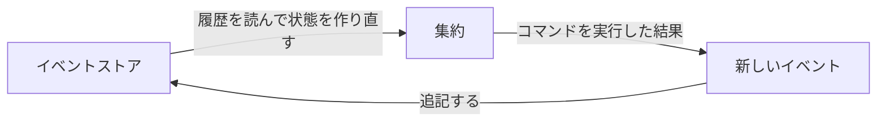
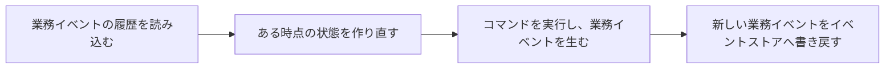
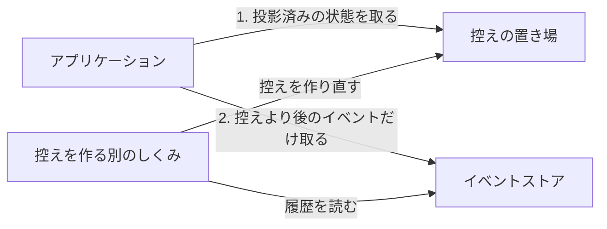
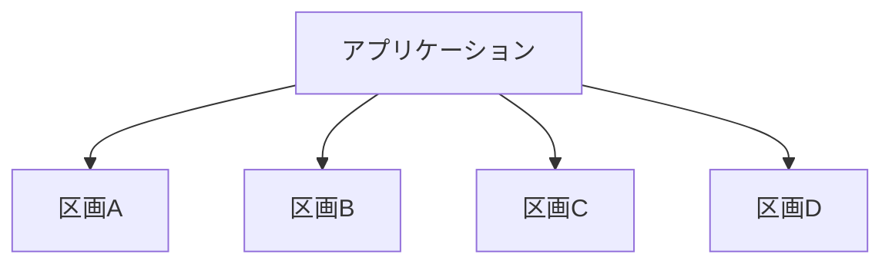
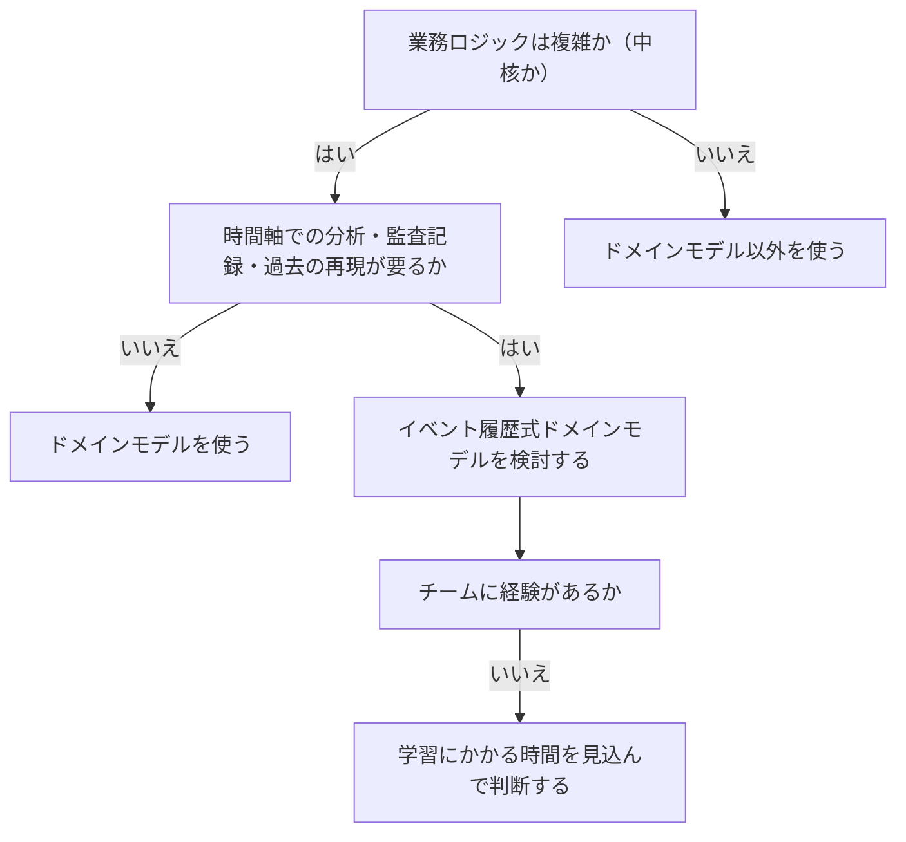

# イベント履歴式ドメインモデルを扱う概念：event-sourced-domain-model

## 概要

### この概念が答える判断

- 従来のドメインモデルと、何が違うのか
- 状態を保存しないで、どうやって業務判断をするのか
- イベント履歴式ドメインモデルを使うべきか、通常のドメインモデルで足りるか
- 履歴が増えたときの性能と、規模の拡大にどう対処するか
- 追記しかできないのに、情報の削除を求められたらどうするか
- 監査の記録なら、履歴の表や記録のファイルでは代われないのか

集約の状態を保存する代わりに、状態が変化したことを業務イベントで表し、その履歴を保存する実装方法。履歴が真実を語る唯一の拠り所になり、状態はそこから毎回作り直される。過去のどの時点でも再現でき、後から新しい見方を足せる一方、学ぶ時間・仕組みの複雑さ・モデルの変えにくさという代償を伴う。

---

## 出典・根拠の透明性

『ドメイン駆動設計をはじめよう』第7章の書き起こしを、粒度を保ったまま構造へ移したもの。見出しそれぞれにノードを1つ対応させ、書き起こし版で図として書かれていたものは、すべて図として持たせている。

### 留保事項

実例は著作権への配慮から架空の業務（配送の依頼）へ置き換え、個人名を含む履歴の例は法人名と伏せた番号に差し替えた。特定の法令の名称は、その法令が求める内容の説明に置き換えている。コードが示す構造（イベントを生んでから適用する順序・投影の作り方）は保っている。

---

## 関連概念

| 関連概念 | 関係 |
|---|---|
| domain-model | この方式の基礎。値オブジェクト・集約・業務イベントは同じ部品を使う |
| business-logic-simple | 手続きとして書く・1行のオブジェクトを介する、との対比 |
| subdomain | この方式を使うのは中核の業務領域に限る |
| architecture-patterns | 投影した状態を保存するには CQRS が要る。この方式では必須になる |
| design-heuristics | 実装方法を選ぶ経験則の全体像 |

---

## イベント履歴式ドメインモデル

### イベント履歴式ドメインモデルとは何か

集約の状態を保存するのではなく、集約の状態が変化したことを業務イベントで表し、その履歴を保存する実装方法。ドメインモデルの部品（値オブジェクト・集約・業務イベント）はそのまま同じで、対象も複雑な業務ロジックと中核の業務領域で変わらない。違うのは、何を保存するかの一点である。

#### この呼び名を選ぶ理由

イベントの履歴を真実の拠り所にする考え方そのものは、集約の状態管理に限らずさまざまな状態管理へ使える。ここでの話は集約の一生の状態管理に限った適用なので、その範囲を示すためにこの呼び名を使う。

### イベントの履歴を保存する

状態そのものを保存する代わりに、状態を変化させたイベントの履歴を保存する。履歴を順に適用すれば、任意の時点の状態を作り直せる。会計の記録に似ている——残高そのものを持たなくても、取引の記録があればいつでも算出できる。

#### 履歴の例

1件の依頼について、受付から支払完了までのイベントが順に並ぶ。

1件の集約について、イベントの履歴がどう並ぶかを示す

1行が1つの出来事にあたる。並びを追うと、受け付けてから支払いが済むまでの経緯が読める。状態はどこにも書かれていない。

```json
{ "request-id": 12, "event-id": 0, "event-type": "受付", "shipper": "北山物流", "phone": "000-0000", "at": "2026-05-20T09:52:55Z" }
{ "request-id": 12, "event-id": 1, "event-type": "連絡", "at": "2026-05-20T12:32:08Z" }
{ "request-id": 12, "event-id": 2, "event-type": "再連絡の予定を置く", "followup-on": "2026-05-27T12:00:00Z", "at": "2026-05-20T12:32:08Z" }
{ "request-id": 12, "event-id": 3, "event-type": "連絡先の変更", "shipper": "北山物流", "phone": "000-1111", "at": "2026-05-20T12:40:11Z" }
{ "request-id": 12, "event-id": 4, "event-type": "連絡", "at": "2026-05-27T12:02:12Z" }
{ "request-id": 12, "event-id": 5, "event-type": "引受", "payment-deadline": "2026-05-30T12:02:12Z", "at": "2026-05-27T12:02:12Z" }
{ "request-id": 12, "event-id": 6, "event-type": "支払完了", "status": "成立", "at": "2026-05-27T12:38:44Z" }
```

#### 投影

履歴の1つ1つに単純な変換を順に当てていくと、状態が組み上がる。版番号をイベントごとに増やしておくのがこの実装の要で、先頭からいくつぶんだけ適用するかを選べば、過去のどの時点の状態も取り出せる。

履歴から最新の状態を作る投影を示す

イベントの種類ごとに1つの適用手続きがある。版番号を毎回増やしているのが、過去の時点を再現できる根拠になる。

```csharp
public class RequestStateProjection
{
    public long RequestId { get; private set; }
    public string Shipper { get; private set; }
    public RequestStatus Status { get; private set; }
    public int Version { get; private set; }

    public void Apply(RequestInitialized @event)      // 受付
    {
        RequestId = @event.RequestId;
        Status = RequestStatus.NEW;
        Shipper = @event.Shipper;
        Version = 0;
    }
    public void Apply(ContactDetailsChanged @event)   // 連絡先の変更
    {
        Shipper = @event.Shipper;
        PhoneNumber = @event.PhoneNumber;
        Version += 1;
    }
    public void Apply(PaymentConfirmed @event)        // 支払完了
    {
        Status = RequestStatus.SETTLED;
        Version += 1;
    }
}
```

#### 検索のための投影

同じ履歴に別の変換を当てれば、変更前の値も残る投影が作れる。上書きせずに足していくだけで、古い連絡先も検索の対象にできる。

同じ履歴から、変更前の値も残す投影を作れることを示す

上書きせず足していく。最新状態の投影と違うのは、この一点だけである。

```csharp
public class RequestSearchProjection
{
    public HashSet<string> Shippers { get; private set; }
    public HashSet<PhoneNumber> PhoneNumbers { get; private set; }

    public void Apply(RequestInitialized @event)
    {
        Shippers = new HashSet<string>();
        PhoneNumbers = new HashSet<PhoneNumber>();
        Shippers.Add(@event.Shipper);
        PhoneNumbers.Add(@event.PhoneNumber);
    }
    public void Apply(ContactDetailsChanged @event)
    {
        Shippers.Add(@event.Shipper);          // 上書きではなく追加
        PhoneNumbers.Add(@event.PhoneNumber);
    }
}
// 結果: PhoneNumbers: ['000-0000', '000-1111']
```

#### 分析のための投影

同じ履歴から、業務の分析に使う値も作れる。あらかじめ数えておかなくても、履歴を数え直せば得られる。

同じ履歴から、数を数える投影も作れることを示す

業務の分析に必要な値を、履歴を数え直すだけで得られる。あらかじめ数えておく必要は無い。

```csharp
public class RequestAnalysisProjection
{
    public int Followups { get; private set; }   // 再連絡の予定を置いた回数
    public RequestStatus Status { get; private set; }

    public void Apply(FollowupSet @event)
    {
        Status = RequestStatus.FOLLOWUP_SET;
        Followups += 1;
    }
}
// 結果: Followups: 1, Status: 成立
```

#### 真実を語る唯一の拠り所

この方式が成り立つ条件は1つ——状態の変化をすべてイベントとして表し、保存すること。保存されたイベントが真実を語る唯一の拠り所になる。イベントを保存するデータベースをイベントストアと呼ぶ。

イベントストアと集約のあいだで、何が行き来するかを示す

集約はイベントストアから履歴を読んで自分を組み立て、実行の結果として生まれたイベントを書き戻す。



| どこの話か | 図に載せきれないこと |
|---|---|
| 新しいイベントからイベントストア | 追記だけで、書き換えも削除も無い。図では他の線と同じ矢印に見えるが、この線だけが一方通行で取り消せない。 |
| イベントストアから集約 | 読み込むのは履歴の全部であって、保存された状態ではない。状態というものはどこにも保存されておらず、毎回この線の上で作り直される。 |
| 集約 | 図では1つの箱だが、実体は集約のインスタンス1件ぶんである。イベントストアの中身は集約のインスタンスごとに分かれている。 |

#### イベントストア

追記だけを受け付ける。記録したイベントの書き換えも削除もできない（データの移行など特殊な場合を除く）。必要な機能は2つだけで、あるインスタンスのイベントをすべて取り出すことと、追記すること。追記のときに期待する版番号を渡すのは、競合を検出するためである——渡した版番号がイベントストア側の最新より古ければ、誰かが先に追記したということなので、書き込みを失敗させる。

イベントストアに最低限必要な操作を示す

取り出すことと、追記すること。この2つだけで足りる。

```csharp
interface IEventStore
{
    IEnumerable<Event> Fetch(Guid instanceId);
    void Append(Guid instanceId, Event[] newEvents, int expectedVersion);
}
```

### 集約への操作の手順

4つの手順を踏む。

イベント履歴式の集約への操作が、4つの手順を踏むことを示す

読み込む・作り直す・実行する・書き戻す。従来のドメインモデルと違うのは、2番目と4番目が加わっていることである。



| どこの話か | 図に載せきれないこと |
|---|---|
| ある時点の状態を作り直す | この手順が従来のドメインモデルには無い。従来は保存された状態をそのまま読むだけだった。 |
| コマンドを実行し、業務イベントを生む | 状態を直接書き換えないのがこの方式の核心である。従来は状態を変えて終わりだったが、ここではイベントを生み、そのイベントを適用した結果として状態が変わる。 |
| 新しい業務イベントをイベントストアへ書き戻す | 書き戻すのはイベントだけで、作り直した状態は保存しない。状態は毎回捨てられる。 |

#### アプリケーション層

4つの手順が、そのまま1つのメソッドの中に並ぶ。

アプリケーション層が4つの手順をどう呼ぶかを示す

読み込む・作り直す・実行する・書き戻す、が1つのメソッドの中に順に並ぶ。

```csharp
public class ShipmentAPI
{
    private IShipmentsRepository _repository;   // イベントストア

    public void RequestPriority(ShipmentId id, PriorityReason reason)
    {
        var events = _repository.LoadEvents(id);            // 手順1
        var shipment = new Shipment(events);                // 手順2（状態を作り直す）
        var originalVersion = shipment.Version;
        var cmd = new RequestPriority(reason);
        shipment.Execute(cmd);                              // 手順3（コマンドを実行）
        _repository.CommitChanges(shipment, originalVersion); // 手順4
    }
}
```

#### 集約の実装

従来のドメインモデルとの違いがここに出る。従来は状態を直接書き換えていたが、ここではイベントを作って渡し、その適用の結果として状態が変わる。

イベント履歴式の集約が、状態をどう変えるかを示す

コマンドの中で状態を直接書き換えていない。イベントを作って渡し、その適用の結果として状態が変わる。

```csharp
public class Shipment
{
    private List<DomainEvent> _domainEvents = new List<DomainEvent>();
    private ShipmentState _state;

    public Shipment(IEnumerable<IDomainEvent> events)
    {
        _state = new ShipmentState();
        foreach (var e in events)
        {
            AppendEvent(e);        // 既存の全イベントを適用して状態を作り直す
        }
    }

    private void AppendEvent(IDomainEvent @event)
    {
        _domainEvents.Append(@event);
        ((dynamic)_state).Apply((dynamic)@event);
    }

    public void Execute(RequestPriority cmd)
    {
        if (!_state.IsPrioritized && _state.RemainingTimePercentage <= 0)
        {
            var prioritized = new ShipmentPrioritized(_id, cmd.Reason);
            AppendEvent(prioritized);   // 状態を変えるのではなくイベントを生む
        }
    }
}
```

#### 状態を持つクラス

イベントごとの適用手続きだけを持ち、業務ロジックは持たない。

状態を持つクラスが、イベントごとの適用手続きだけを持つことを示す

業務ロジックはここには無い。イベントを受けて値を書き換えるだけの、単純な変換に徹している。

```csharp
public class ShipmentState
{
    public ShipmentId Id { get; private set; }
    public int Version { get; private set; }
    public bool IsPrioritized { get; private set; }

    public void Apply(ShipmentInitialized @event)   // 受付
    {
        Id = @event.Id;
        Version = 0;
        IsPrioritized = false;
    }
    public void Apply(ShipmentPrioritized @event)   // 優先扱いへ引き上げ
    {
        IsPrioritized = true;
        Version += 1;
    }
}
```

### 利点

この方式が持つ4つの利点。

#### 過去のどの時点でも再現できる

最新の状態を組み立てるのと同じやり方で、過去のあらゆる時点の状態を再現できる。使い道は、システムの使われ方の分析、システムが下した判定の検査、業務ロジックの改善、そして障害や不具合の調査——障害が起きた時点の集約の状態を、そのまま作り直せる。

#### 後から新しい見方を足せる

1つの履歴から、いくつでも別の状態を作れる。投影する変換を後からいつでも足せるので、すでに溜まっている履歴から、業務について新しい見方を得られる。

#### 監査の記録になる

業務イベントの履歴は、厳密な一貫性を持つ監査の記録そのものである。集約の状態を変えたすべての業務活動の正確な記録になる。事業領域によっては、この種の記録の保存が法令で義務づけられている。金銭や金融の取引を扱うシステムでとくに効く。

#### 競合の判定を業務の視点で行える

従来の競合検出では、読み込んでから書き込むまでのあいだに誰かが同じデータを書き換えていれば、それだけで失敗させる。イベントの履歴があると、そのあいだに何が起きたかを正確に把握できるので、追記しようとしている操作が本当に衝突しているのか、それとも無関係で続けても安全かを、業務の視点で判定する仕組みを組み込める。

### 欠点

この方式が抱える3つの欠点。

#### 学ぶのに時間がかかる

従来のデータの扱い方とまったく違うやり方なので、正しく実装するには訓練が要る。チームにこの方式の開発経験が無いなら、その時間を見込まなければならない。

#### モデルを変えにくい

厳密には、イベントは変わらないものとして扱う。一度決めたイベントのデータ構造を変える作業は、表の設計を変えるのに比べてはるかに難しい。

#### 仕組みが増える

実装にはさまざまな仕組みが必要になり、システム全体の設計が複雑になる。

### よくある質問

性能・規模・削除・代替手段について。

#### イベントが増えると遅くならないか

履歴から状態を作るにはそれなりの処理が要るので、履歴が大きくなるほど性能は落ちる。そこで途中結果を控えておく手がある——投影済みの状態を控えから取り、それより後に追記されたイベントだけを取って、メモリ上で重ねる。ただし使ってよい場面は限られる。多くのシステムでは1つの集約のイベントが1万を超えると性能に響くが、実際には百を超えるシステムがほとんど無い。控えを入れたくなったら、まず集約の境界の設計を見直すほうがよい。

履歴が大きいときに、途中結果を控えておく形を示す

投影済みの状態を控えておき、その後に足されたイベントだけを重ねる。控えは別のしくみが裏で作る。



| どこの話か | 図に載せきれないこと |
|---|---|
| 控えの置き場 | 真実を語る拠り所ではない。捨てても履歴から作り直せるので、失われても業務上の損失は無い。 |
| 控えを作る別のしくみ | アプリケーションと別に描いてあるのは、操作の裏で動くためである。利用者の操作を待たせない。 |
| この図全体 | 使ってよい場面は限られる。1つの集約のイベントが1万を超えると性能に響くが、百を超えるシステムはほとんど無い。控えを入れたくなったら、先に集約の境界の設計を見直すほうがよい。 |

#### 規模を大きくできるか

できる。集約への操作はインスタンスごとに閉じているので、イベントストアを集約の識別子で分割できる。1つのインスタンスに属するイベントを必ず同じ区画へ書き込めばよい。

イベントストアを、集約の識別子で分割できることを示す

1つの集約に属するイベントは必ず同じ区画へ入る。区画をまたいだ操作が起きないので、そのまま増やせる。



| どこの話か | 図に載せきれないこと |
|---|---|
| 区画A／区画B／区画C／区画D | 分ける基準は集約の識別子である。1つの集約のイベントが複数の区画に散らないことが、この形が成り立つ条件になる。 |
| 4本の矢印 | どれか1つを選ぶのではなく、扱う集約に応じて行き先が決まる。集約への操作はインスタンスごとに閉じているので、区画をまたぐ操作は起きない。 |

#### 追記だけなのに、削除を求められたら

忘れられる中身、という形で解く。イベントに含まれる慎重に扱うべき情報をすべて暗号化し、その鍵をイベントストアとは別の置き場に、集約の識別子と対にして保存する。削除を求められたら鍵のほうを消す——イベントは残るが、守るべき情報は二度と読めなくなる。

#### 他のやり方ではだめか

近いことをする代替手段が3つあるが、どれも同じものにはならない。

##### 記録をファイルに書き出して監査の記録にする

データベースへの書き込みとファイルへの書き込みは、全部成るか全部成らないかの扱いが別々になる。片方が失敗すると食い違ったまま残る。

##### 状態と履歴を、ひと塊の変更として同時に書き込む

技術的には一貫性を保てる。しかしプログラムを変えるときに、保守する人が履歴側への反映を忘れる余地が残る。状態の側を真実の拠り所にすると、履歴側の扱いはどうしても雑になる。

##### 状態の表から履歴の表へ、自動で複製する

書き忘れは起きない。しかしこれは値の変化を写しているだけで、業務の文脈——なぜその値が変わったのかという理由——が落ちる。理由が残っていないと、新しい投影を作れる見込みはほとんど無くなる。

### 4つの実装方法の対比

何を保存するかと、対象となる業務領域で並べる。

4つの実装方法を、何を保存するかと対象領域で対比する

分かれ目は2つ。保存するのが最新状態か履歴か、そして業務ロジックが複雑かどうか。

| 実装方法 | 保存するもの | 業務ロジックの複雑さ | 対象領域 |
|---|---|---|---|
| 手続きとして書く | 最新の状態 | 単純 | 補完・一般 |
| 1行のオブジェクトを介する | 最新の状態 | 単純（データ構造が複雑） | 補完・一般 |
| ドメインモデル | 最新の状態 | 複雑 | 中核 |
| イベント履歴式ドメインモデル | イベントの履歴 | 複雑（時間軸の洞察が要る） | 中核 |

### イベント履歴式ドメインモデルを使うか

中核であることを前提に、時間軸の必要とチームの経験で決める。

イベント履歴式ドメインモデルを使うかどうかを、順に問うて決める

中核であることが前提で、そのうえで時間軸の必要があるかを問う。



| どこの話か | 図に載せきれないこと |
|---|---|
| チームに経験があるか | 他の分岐と性質が違う。技術的な適合ではなく、導入の是非を左右する条件を問う。「いいえ」でも採用してよいが、そのぶんの時間を見込む必要がある。 |
| 業務ロジックは複雑か（中核か） | この問いに「はい」であることが前提で、補完や一般の業務領域では以降の問いに進まない。 |
| 時間軸での分析・監査記録・過去の再現が要るか | 3つのうち1つでも当てはまれば「はい」になる。3つとも必要という意味ではない。 |

### アンチパターン

イベント履歴式ドメインモデルでよく起きる誤り。

#### 補完・一般の業務領域に使う

事業活動の視点で設計を判断する、という原則から外れる。使う正当な理由が無く、もっと単純なやり方で足りるなら、欠点（学ぶ時間・仕組みの複雑さ・モデルの変えにくさ）だけが重くのしかかる。

#### 記録のファイルを監査の記録として使う

データベースとファイルでは、全部成るか全部成らないかの扱いが別々なので、一貫性が保証されない。

#### 状態が変わった理由を記録しない

自動の複製による履歴は値の変化だけを写し、業務の文脈が落ちる。理由が残っていないと、新しい投影を足せない。
