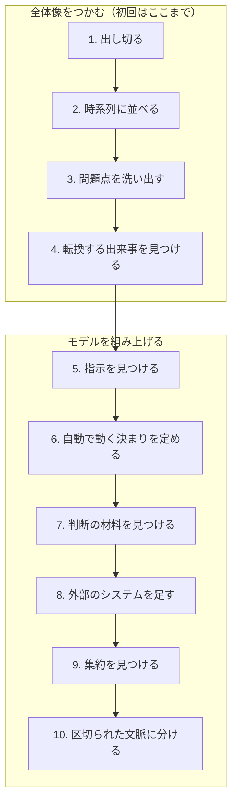
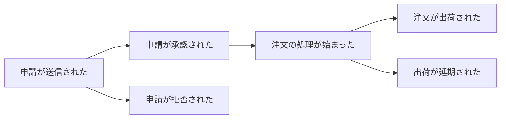
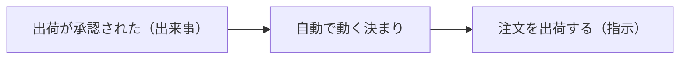
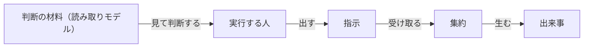
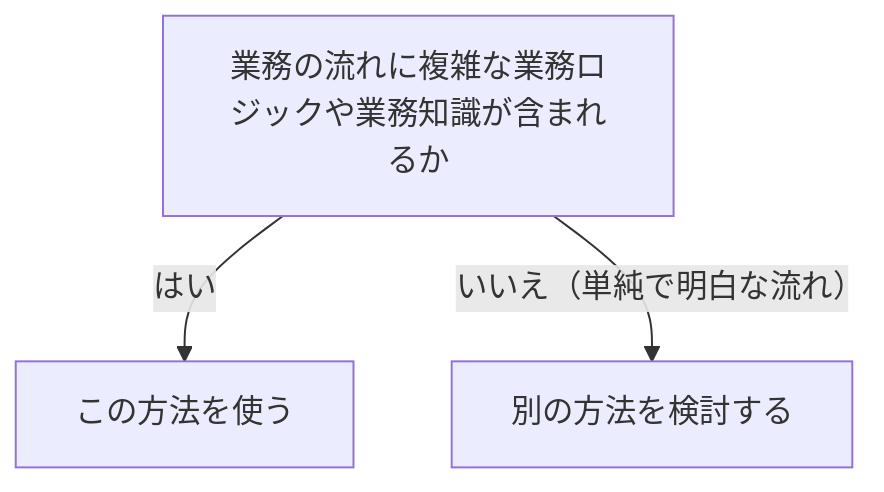

# イベントストーミングを扱う概念：event-storming

## 概要

### この概念が答える判断

- 誰を何人呼べばよいのか
- どういう順で何を出していくのか
- 区切られた文脈の境界は、いつどうやって決まるのか
- この方法が向かないのはどういう場合か
- 離れた場所からでも成立するのか

業務の流れのモデルを短時間で作るための、みんなで行う場。業務イベントを出し切るところから始め、10の段で1種類ずつ要素を足していくと、最後に区切られた文脈の境界が浮かび上がる。主な価値は成果物ではなく、知識を持ち寄って同じ言葉を作る活動そのものにある。

---

## 出典・根拠の透明性

『ドメイン駆動設計をはじめよう』第12章の書き起こしを、粒度を保ったまま構造へ移したもの。見出しそれぞれにノードを1つ対応させ、書き起こし版で図として書かれていたものは図として持たせ、文章で述べられていた10の段と要素の並びも図として起こしている。

### 留保事項

考案者の氏名・実在の道具の名前・特定の出来事の名称は、著作権への配慮からすべて役割や状況の説明に置き換えた。示している構造——段の順序、要素の並び順、境界が最後に浮かび上がること——は保っている。

---

## 関連概念

| 関連概念 | 関係 |
|---|---|
| ubiquitous-language | この場で同じ言葉が作り上げられる |
| bounded-context | 転換する出来事と集約の集まりが、区切られた文脈の手がかりになる |
| domain-model | 9の段で見つける集約は、ドメインモデルの集約と対応する |
| event-sourced-domain-model | この場の成果物は、イベント履歴式ドメインモデルの実装の土台になる |
| domain-expert | 参加する関係者の中心。同じ言葉の源泉 |
| subdomain | 業務領域の分類を特定するのにも使える |

---

## イベントストーミング

### イベントストーミングとは何か

業務の流れのモデルを短時間で作るための、みんなで行う場。厳密な規則ではなく指針として定義されている。主な価値は成果物——モデルや区切られた文脈——ではなく、モデルを作る活動そのものにある。さまざまな立場の人が知識を持ち寄り、事業についての頭の中の像を揃え、同じ言葉を作り上げることが目的である。

### 誰が参加するか

探る業務領域の知識を持つすべての関係者が参加する——ソフトウェア技術者、業務エキスパート、何を作るかを決める立場の人、品質を確かめる人、画面と使い勝手を設計する人、利用者の問い合わせに応じる人。人数の目安は、同じ場所に集まるなら10人以下、離れた場所からなら5人以下。参加の度合いと知識の共有のつり合いで決まる。

### 必要なもの

モデルを貼り出せる広い面（壁でも画面でもよい）、複数の色の付箋、書くもの、軽くつまめるもの、そして椅子の無い広い部屋——動き回れることが要る。

### 要素の見分け方

色と形で9種類を分ける。

モデリングに使う要素と、その見分け方を並べる

色と形で種類を分ける。この対応は場の最初に全員へ示し、終わるまで見える場所に置いておく。

| 見た目 | 表すもの |
|---|---|
| だいだい色 | 業務イベント（起きた出来事） |
| 水色 | 指示（コマンド） |
| 黄色（小さい） | 実行する人 |
| 紫 | 自動で動く決まり |
| 緑 | 判断の材料（読み取りモデル） |
| 黄色（大きい） | 集約 |
| 桃色（四角） | 外部のシステム |
| 桃色（斜めに傾けた四角） | 問題点 |
| 縦の線 | 転換する出来事 |

### 10の段

段ごとに1種類ずつ要素を足しながら、モデルを育てていく。

10の段が、何を積み上げていくかを示す

出来事だけを出すところから始め、段ごとに1種類ずつ要素を足していく。最後に境界が浮かび上がる。

| どこの話か | 図に載せきれないこと |
|---|---|
| 全体像をつかむ（初回はここまで） | 組織に初めて導入するときは、まずここまでを対象の業務全体に対して行う。全体像を得てから、業務の流れごとに場を設けて10段すべてを行う。 |
| 10. 区切られた文脈に分ける | 最後に来るのが要点である。境界を先に決めてから中身を並べるのではなく、並べ終えた結果として境界が浮かび上がる。 |
| 9本の矢印 | 厳密な規則ではなく指針である。順序を入れ替えたり、独自の進め方を作ったりしてよい。ただし10が最後に来ることは動かさない。 |

#### 1. 出し切る

業務イベントを思いつくまま出す。業務イベントとは業務で起きた興味深い出来事で、すでに起きたことなので過去形で書く。この段では順序も重複も気にしない。誰も新しいものを出せなくなるまで続ける。

#### 2. 時系列に並べる

出したものを、業務で起きる順に並べ直す。期待どおりに進む筋書きから始め、それが終わってから間違いや別の判断による筋書きを足す。枝分かれは、先行する出来事から2本の流れを出すか、線でつないで示す。並べ直しながら、誤っているものを直し、重複を消し、足りないものを足していく。

業務イベントを時系列に並べると、枝分かれが見えてくることを示す

正常に進む筋書きを先に並べ、そのあとで別の筋書きを足す。枝が分かれる場所が、業務上の判断が入る場所にあたる。

| どこの話か | 図に載せきれないこと |
|---|---|
| 6つの箱すべて | すべて過去形で書かれている。すでに起きた出来事を表すものなので、「注文が出荷される」ではなく「注文が出荷された」と書く。現在形で書いてあるものは、業務イベントではなく指示であることが多い。 |
| 申請が送信されたから出る2本 | 枝が分かれる場所は、そこに業務上の判断があることを示す。ここに問題点や、まだ言語化されていない規則が潜んでいることが多い。 |
| この並び全体 | 最初から正しい順序で並ぶわけではない。まず順序も重複も気にせず出し切り、そのあとで並べ直す。並べ直す作業そのものが、認識の食い違いをあぶり出す。 |

#### 3. 問題点を洗い出す

並べたあと、流れ全体の中で注意が要る箇所を見つける——詰まっているところ、自動化されていない作業、文書になっていないもの、業務知識が足りていないところ。斜めに傾けた桃色の付箋で印をつける。進行役はすべての段で発言に気を配り、問題や懸念が出たらその場で書き出す。

#### 4. 転換する出来事を見つける

文脈や段階の変わり目を示す重要な業務イベントを探す。縦の線を引き、その線の上に置いて前後で転換があることを表す。これは区切られた文脈を見つける手がかりになる。

#### 5. 指示を見つける

指示とは、出来事や出来事の流れを引き起こすもの。システムへの操作を、何かを命じる形で表す。生み出すであろう出来事の手前に貼る。特定の役割を持つ人が実行する指示なら、その人を小さな付箋で書き添える——ただし明らかな場合に限る。

#### 6. 自動で動く決まりを定める

多くの指示は特定の人と結びついていない。そうした指示を実行しているはずの決まりを探す——ある出来事が起きたときに、対応する指示が自動で実行される、という筋書きである。出来事と指示をつなぐ位置に置く。条件を満たしたときだけ実行されるなら、その条件も書き添える。

自動で動く決まりが、出来事と指示のあいだに入ることを示す

誰も操作していないのに指示が実行される場合、そのあいだに決まりがある。

| どこの話か | 図に載せきれないこと |
|---|---|
| 自動で動く決まり | 指示に人が結びついていないとき、その空白を埋めるものとして探す。見つからないなら、実は人がやっているか、まだ誰も決めていないかのどちらかである。 |
| 自動で動く決まりから注文を出荷する（指示） | 常に実行されるとは限らない。条件つきで実行される場合、その条件も決まりとして書き出す。条件が書き出せないなら、その条件がまだ言語化されていないということになる。 |

#### 7. 判断の材料を見つける

人が指示を出すかどうかを決めるために見る、業務領域の状態を表したもの。画面・報告・通知などが当てはまる。人はこれを見てから指示を出すので、指示の手前に置く。

#### 8. 外部のシステムを足す

探っている業務領域の外側にあるシステムを足す。指示を実行することも、出来事の知らせを受け取ることもある。この段が終わった時点で、すべての指示は「人が実行する」「決まりが起動する」「外部のシステムが呼び出す」のいずれかになっているはずである。

#### 9. 集約を見つける

出来事と指示をすべて出したら、関係する概念を集約としてまとめる。集約は指示を受け取り、出来事を生む。大きな黄色の付箋で表し、左に指示、右に出来事を置く。

1つの流れの中で、5種類の要素がどの順に並ぶかを示す

左から右へ、判断の材料・実行する人・指示・集約・結果の出来事、という並びになる。

| どこの話か | 図に載せきれないこと |
|---|---|
| 判断の材料（読み取りモデル） | 指示より前に置くのは、人が指示を出す前にこれを見るからである。順序が意味を持っていて、装飾ではない。 |
| 実行する人 | ここが空欄になる指示がある。そのときは自動で動く決まりか外部のシステムが入るはずで、3つのうちどれも入らない指示が残っているなら、まだ見つけていないものがあるということになる。 |
| 集約 | 指示を左から受け取り、出来事を右へ生む。この形で並ぶ集約の集まりが、そのまま区切られた文脈の候補になる。 |

#### 10. 区切られた文脈に分ける

最後の段。機能として密接に関係している集約や、自動で動く決まりを介してつながっている集約を探す。そうした集約の集まりが、区切られた文脈の境界の自然な候補になる。

### 進め方は決まっていない

これは指針であって、進め方に厳密な規則は無い。組織に初めて導入するときは、まず対象の業務全体に対して1〜4の段で全体像をつかみ、そのあとで業務の流れごとに場を設けて10段すべてを行うのがよい。得られたモデルは、イベント履歴式ドメインモデルを実装する土台としてそのまま使える——その場合、区切られた文脈も集約も主要な業務イベントも、すでに明らかになっている。

### いつ使うか

向いている場面が5つある。向いていないのは、探る業務の流れが単純で明白な場合と、興味をひくような業務ロジックや複雑さを伴わない、流れ作業のような領域である。

この方法を使うかどうかを、業務の流れの複雑さで決める

複雑さと探る価値があるかで決まる。単純な流れには向かない。

| どこの話か | 図に載せきれないこと |
|---|---|
| 別の方法を検討する | この終点は失敗ではない。流れ作業のような領域では、この方法に時間と労力をかけても得られるものが少ない、という判断にすぎない。 |
| 業務の流れに複雑な業務ロジックや業務知識が含まれるか | 複雑さだけでなく、参加者のあいだで認識が食い違っている可能性も材料になる。単純に見えても、人によって説明が違うなら探る価値がある。 |

この方法が向いている5つの目的を並べる

どれも、成果物より場そのものに価値があるという点で共通している。

| 目的 | 何が起きるか |
|---|---|
| 同じ言葉を作る | 一緒にモデルを作る過程で用語が自然に揃い、全員が同じ言葉を使い始める |
| 新しい業務要件を探る | 全員が新しい機能について同じ理解を持ち、要件で考慮されていなかった特殊な場合が明らかになる |
| 失われた業務知識を取り戻す | 参加者それぞれが持つ知識を1枚にまとめられる（古いシステムを作り直すときにとくに効く） |
| 既存の業務の流れを改善する | 流れ全体を見渡すことで、無駄や改善の機会に気づける |
| 新しく加わった人へ引き継ぐ | 業務知識を伝える手段として有効 |

### 進行のこつ

場を回すうえでの注意。

#### 始める前に

全体の流れと概要を説明する——何を行うか、探る業務の流れの概要、そして使う要素の見分け方。見分け方の一覧は、場が終わるまで全員から見える場所に置いておく。

#### 進めている最中

場の勢いが落ちたら、問いを出して活気を戻すか、次の段へ進む頃合いかを見きわめる。これはみんなで行う活動なので、全員にモデルを作る機会と議論に加わる機会を与える。輪から離れている人には、いまのモデルについて問いを向けて引き戻す。集中を要する活動なので休憩が要る。全員が戻るまで再開しない。

#### 離れた場所から行う場合

考案者はもともと、離れた場所から行うことに異議を唱えてきた——参加の度合い、協力、知識の共有にばらつきが出るためである。同じ場所に集まりにくい状況が広がったことで、共同で書き込める画面を使う道具が現れた。離れた場所から行うなら参加者を5人以下に絞る。多くの人の知識が要るなら、複数の組に分けて行い、あとからモデルを統合してもよい。可能なら、同じ場所に集まる形へ戻すことが勧められる。

### アンチパターン

この方法を使うときによく起きる誤り。

#### 最初から区切られた文脈を決めようとする

目的は探ることと知識を持ち寄ることである。区切られた文脈は最後の段で自然に浮かび上がるもので、最初から境界を決めようとすると、モデルを作る活動そのものの価値が失われる。

#### 技術者だけで行う

業務知識を持つ関係者が参加しないと、技術の側へ偏る。同じ言葉を作るという目的が達成できない。

#### 業務イベントを現在形で書く

業務イベントはすでに起きた出来事なので、必ず過去形で書く。「注文が送信される」ではなく「注文が送信された」。

#### 単純な業務の流れに使う

複雑で探る価値のある業務の流れにこそ効く。流れ作業のような単純な領域では、時間と労力が無駄になる。
