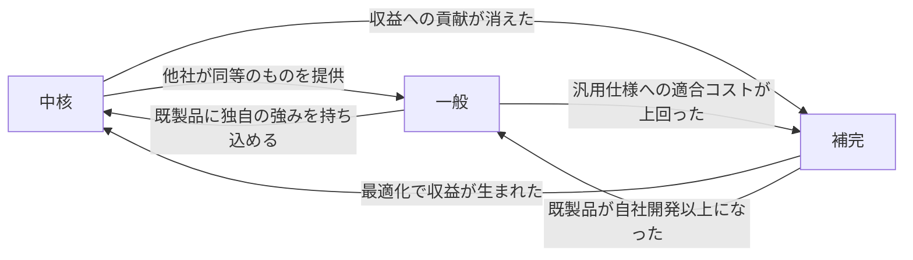
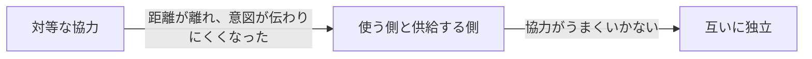

# 設計を継続的に進化させる原則を扱う概念：evolving-design

## 概要

### この概念が答える判断

- 業務領域のカテゴリーが変化したかどうかを、どう見分けるか
- 実装方法を変えるのはいつか
- 業務知識が少ない段階で、境界はどれくらいの粗さで引くべきか
- システムが成長したとき、どこを見直すか
- 補完の業務ロジックが複雑になってきたのは、中核化の兆候か、それとも無駄か

業務領域のカテゴリー・組織・業務知識・システムの規模は変化する。その変化に合わせて、連係の仕方・実装方法・境界の引き方を見直すための考え方。

---

## 出典・根拠の透明性

『ドメイン駆動設計をはじめよう』第11章の書き起こしを、粒度を保ったまま構造へ移したもの。見出しそれぞれにノードを1つ対応させている。

### 留保事項

実例とコードの題材は著作権への配慮から架空の業務（配送の依頼）へ置き換え、企業名・人名は落とした。6つの変化パターンが示す関係の構造は原文のまま保っている。

---

## 関連概念

| 関連概念 | 関係 |
|---|---|
| subdomain | 業務領域のカテゴリー（中核・一般・補完） |
| bounded-context | 区切られた文脈の設計と境界 |
| context-integration | カテゴリー変化に伴う連係の仕方の変更 |
| design-heuristics | 実装方法の選択の経験則 |
| event-sourced-domain-model | イベント履歴式への移行 |

---

## 設計を進化させる

### 設計を進化させるとは

よい設計も変化を扱えなければ危険になる。考慮すべき変化は、事業活動の変化・設計の基本方針の再検討・組織の変更・業務知識の増減・システムの成長の5つ。

### 事業活動の変化

業務領域のカテゴリー（中核・一般・補完）は固定されていない。企業の成長や外部環境によって変化する。

業務領域のカテゴリーが固定ではなく、6通りに変化しうることを示す

中核・一般・補完のあいだは、どの向きにも移りうる。他社が同等のものを出せば中核は一般へ、既製品に独自の強みを持ち込めれば一般は中核へ、収益への貢献が消えれば中核は補完へ移る。分類は一度決めたら固定ではない。



| から | へ | 関係 |
|---|---|---|
| 中核 | 一般 | 他社が同等のものを提供 |
| 一般 | 中核 | 既製品に独自の強みを持ち込める |
| 中核 | 補完 | 収益への貢献が消えた |
| 補完 | 中核 | 最適化で収益が生まれた |
| 補完 | 一般 | 既製品が自社開発以上になった |
| 一般 | 補完 | 汎用仕様への適合コストが上回った |

#### 中核 → 一般

競合他社が同等のサービスや機能を市場に提供するようになったとき。自前で持っていた強みが、買えるものになる。

#### 一般 → 中核

外部の既製品に、独自の競争優位を持ち込める機会を見つけたとき。既製品で足りていた領域に自社の強みを載せられると分かった場合が典型。

#### 補完 → 一般

既製品や公開されている実装が、自社開発以上の機能を提供するようになったとき。

#### 補完 → 中核

補完的な業務ロジックの最適化から、費用の削減や新しい収益が生まれたとき。兆候は、補完の業務ロジックが複雑になってきたこと——定義上、補完のロジックは単純なはずである。時間がたって複雑になり、かつ収益も増えているなら中核化の兆候。収益が増えていないのに複雑になっているだけなら、それは不必要な複雑さである。

#### 中核 → 補完

その業務領域の複雑さに、適切な理由がなくなったとき（収益への貢献が消えた）。他の業務領域を支援する必要最小限のロジックだけを残し、収益を生まない複雑さを取り除く。

#### 一般 → 補完

汎用のサービスの仕様に合わせるための連係の手間が、そこから得られる利点を上回るようになったとき。自前へ戻す。

### 設計の基本方針を再検討する

業務領域のカテゴリーが変わると、文脈どうしの連係の仕方と開発の進め方に影響する。

カテゴリーの変化が、文脈どうしの連係の仕方をどう変えるかを対比する

補完から中核へ移るときは、相手の都合に引きずられないよう自分のモデルを守る仕組みが要る。逆に中核から補完へ移るときは、守りを解いて独立させ、機能の重複を許してよくなる。

```markdown
| 変化 | 連係の仕方の変化 |
|---|---|
| 補完 → 中核 | 互いに独立 → 使う側と供給する側（変換をはさんで内部のモデルを守る） |
| 中核 → 補完 | 使う側と供給する側 → 互いに独立（機能の重複を許してよい） |
| 一般 → 中核 | 協力関係を強める必要がある |
```

#### 開発の進め方の再検討

中核は、社内で業務エキスパートと緊密に協力して開発する（外部委託はしない）。補完は外部委託でき、新人の育成の機会としても使える。

### 業務ロジックの実装方法を見直す

見直すのは、既存の設計では目の前の事業のニーズにうまく対応できなくなったとき。変更がやっかいで危険になってきたときである。実装方法の変更を恐れてはいけない——事業がどう発展するかは誰も予測できないので、状況に応じた適切な設計をして、必要になった時点で進化させる。

実装方法が、業務ロジックの増大に合わせて一方向に移っていくことを示す

手続きとして書く形から始まり、データ構造が込み入れば1行のオブジェクトを介する形へ、不整合や重複が増えればドメインモデルへ、監査記録や分析が必要になればイベント履歴式へ移る。先回りして複雑な方へ行くのではなく、必要になった時点で移す。


| から | へ | 関係 |
|---|---|---|
| 手続きとして書く | 1行のオブジェクトを介する | データ構造が込み入ってきた |
| 1行のオブジェクトを介する | ドメインモデル | 不整合・ロジックの重複が増えた |
| ドメインモデル | イベント履歴式ドメインモデル | 監査記録・分析が必要になった |

#### 手続き → 1行のオブジェクトを介する形へ

手続きとして書いている中で、扱うデータの構造が込み入ってきたとき。込み入った部分を見つけ、そのデータ操作を1行を表すオブジェクトへ包み、データベースを直接操作するのをやめる。

#### 1行のオブジェクト → ドメインモデルへ

データの不整合やロジックの重複が増えてきたとき。手順は4つ——不変として表せそうなデータ構造を値オブジェクトとして切り出し、値の書き込みを外から閉じ、状態を変えるロジックを内側へ移し、最後に一貫性を保証する最小の範囲を集約として定める。外部の集約は識別子で参照し、集約ごとに外へ公開する入口を1つに絞る。

1行のオブジェクトからドメインモデルへ移す手順を、コードの変化で示す

まず値の書き込みを外から閉じる。そこで出るコンパイルエラーが、外部から状態を変えていた箇所——つまり直す対象——の一覧になる。次にその変更のロジックをオブジェクトの内側へ移す。この時点で、そのオブジェクトは集約の候補になっている。

```csharp
// 変更前: 値の書き込みが外へ開いている
public class Shipment {
    public Guid Id { get; set; }
    public int Points { get; set; }
}

// 手順1: 書き込みを閉じる（エラーの出た箇所が直す対象）
public class Shipment {
    public Guid Id { get; private set; }
    public int Points { get; private set; }
}

// 手順2: 状態を変えるロジックを内側へ移す（集約の候補）
public class Shipment {
    public Guid Id { get; private set; }
    public int Points { get; private set; }
    public void ApplyBonus(int percentage) {
        this.Points *= 1 + percentage / 100.0;
    }
}
```

#### ドメインモデル → イベント履歴式へ

集約のデータを直接変更する代わりに、集約の一生を表す一連の業務イベントを特定する。難点は、すでに存在している集約の履歴をどうするか——最新の状態しか持っていないものを、履歴の形へ移す方法が要る。

#### 失われた履歴をどう扱うか

2つの方法がある。最新の状態から「こうだったはずだ」という筋書きを組み立てて近似的に復元する方法と、「移行した」という事実そのものを最初の記録にする方法。前者は完全には復元できず、後者は旧い仕組みの痕跡が残り続ける。

過去の記録が失われたまま移行するときの、2つの書き方を対比する

上は最新の状態から「こうだったはずだ」という筋書きを組み立てて記録する方法で、完全には復元できない（数えていなかったものは戻らない）。下は「移行した」という事実そのものを最初の記録にする方法で、失われたことが明示される代わりに、旧い仕組みの痕跡が残り続ける。

```json
// 近似的に復元する
{"event-type": "新規作成", "shipment-id": 12}
{"event-type": "集荷済", "timestamp": "..."}
{"event-type": "配達完了", "status": "完了"}

// 移行そのものを記録する
{"event-type": "移行", "shipment-id": 12, "status": "完了"}
```

### 組織の変更

組織が変わると、チーム間で意図がどう伝わるかが変わり、それが文脈どうしの連係の仕方に影響する。

組織の変化が、文脈どうしの連係の仕方を押し下げることを示す

チームが離れて意図が伝わりにくくなると、対等な協力から使う側と供給する側の関係へ移る。それも難しくなると、互いに独立し、機能の重複を許すほうが費用対効果で有利になることもある。



| から | へ | 関係 |
|---|---|---|
| 対等な協力 | 使う側と供給する側 | 距離が離れ、意図が伝わりにくくなった |
| 使う側と供給する側 | 互いに独立 | 協力がうまくいかない |

### 業務知識

価値を生み出すソフトウェア設計には業務知識が不可欠である。そして業務の複雑さは最初は見えない——最初はすべて単純に見えるが、機能を追加するたびに例外的な条件が増え、規則や不変条件が見つかる。この新しい洞察が、それまで整理してきた秩序を壊し、モデルを作り直すことになる。

#### 業務知識と境界の経験則

業務知識が少ない段階では、広い範囲で文脈を区切る——まちがえても、論理的な境界を引き直すほうが物理的な境界を動かすより簡単だから。業務知識が増えたら、広い文脈を小さく分解できる。

#### 業務知識の劣化

時間がたつと文書が更新されなくなり、初期の担当者が去り、その場しのぎで機能が追加される。業務知識は放っておくと劣化する。

### システムの成長

システムが成長するのはソフトウェアが健全な証だが、設計を再検討せずに成長させると大きな塊になる。増大する複雑さのうち、過去の設計判断に起因する必要のない複雑さを特定して取り除き、事業活動が本来持つ複雑さのほうには、しかるべき手法で対処する。

#### 業務領域の見直し

事業が成長すると業務領域の境界がぼやけてくる。経験則は、強く関係するユースケース——**同じデータ集合を操作するユースケースの集まり**——に注目して切れ目を見つけること。目指すのは純度の高い中核の業務領域を抽出することで、そうすれば事業戦略上もっとも重要な領域へ開発の力を集められる。

#### 区切られた文脈の見直し

開発の規模が大きくなると、文脈の焦点がぼやけてくる。合図は、文脈どうしでかなりの通信が発生していること——モデルが適切でないので、区切り方を見直す。「何にでも手を出して、どれもちゃんとできていない」モデルを作ってはいけない。

#### 集約の見直し

集約はできるだけ小さく設計する。守るべき一貫性とは無関係なデータを集約へ足すと、必要のない複雑さが入る。業務機能を専用の集約へ抽出すると、元の集約が単純になるだけでなく、隠れていた別のモデル——新しい区切られた文脈——が見つかることも少なくない。

#### 成長への対応指針

業務領域の機能を広げる必要が出たら、業務領域を小さい単位で識別することを検討する。「何にでも手を出して、どれもちゃんとできていない」文脈を作らない。集約はできるだけ小さく設計する。さまざまな境界を常に監視し、必要のない複雑さを取り除く。

### アンチパターン

設計を進化させるときによく起きる誤り。

#### カテゴリーが変わっても設計を変えない

中核から補完へ移ったのに社内開発を続けたり、補完から中核へ移ったのに手続きとしての実装を使い続けると、競争力と費用の最適化の機会を失う。

#### 業務知識が少ない段階で境界を細かく切る

後から直す費用が高くつく。最初は広い範囲で区切り、業務知識が増えたら分割する。

#### 成長に合わせた境界の見直しをしない

「何にでも手を出して、どれもちゃんとできていない」文脈や集約になる。成長のたびに設計判断を再検討する。
