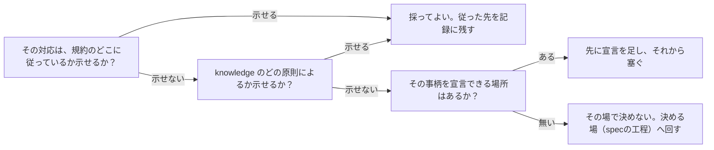

# 不備の塞ぎ方は規約とknowledgeから導く：knowledge-cand-avoidable-friction-is-not-detection

## 概要

### この概念が答える判断

- エラーや不備に行き当たったとき、その場で思いついた対応を採ってよいか
- 「そうすれば実装者が困って気づく」を対策として数えてよいか
- 採った対応が正しいかを、何に照らして確かめるか

エラーや不備を塞ぐ対応は、規約と knowledge から導く。その場で思いついた対応は、困りごとを消すだけで原因を残し、しかも導かれていないので誰も誤りだと言えない。

---

## 原則

- 塞ぐ対応が規約からも knowledge からも導かれていないとき、それは決定ではなく思いつきである。思いつきは、正しさを確かめる相手を持たない。
- 困りごとが消えることと、原因が無くなることは別である。その場しのぎは前者だけを達成し、達成した瞬間に後者を見えなくする。
- 「そうすれば実装者が困って気づく」は対策として数えない。困った人がその場で塞ぐと消えるので、次に同じ原因を持ち込む人には何も出ない。
- しかも塞ぎ方が規約に縛られていなければ、最も手近な回避策が選ばれる。その回避策が、避けようとしていた構成そのものであることがある。
- 検査が捕まえる範囲に合わせて規約の適用範囲を決めない。それは規約ではなく検査の穴に従っている状態で、穴が塞がった瞬間に総崩れになる。
- 規約にも knowledge にも導く根拠が無いなら、その場で決めずに宣言を先に足す。決めてから足すのではなく、足してから決める。

---

## 分類

| 分類 | 特徴 |
|---|---|
| 規約から導いた対応 | 宣言のどこに従ったかを示せる。誤りなら宣言を直せば全体が直る |
| knowledge から導いた対応 | どの原則によるかを示せる。宣言に無い事柄はここから導く |
| その場しのぎ | どちらからも導かれていない。困りごとは消えるが原因は残る |

---

## 判断基準

---

## 実例

蔵書を扱う仕組みで、貸出と予約という2つの一貫性の単位が、同じ「利用者番号」という値の型を両方とも宣言している。どちらに属するかの判断が済んでいない。

実装者はこの値をどこへ置くか決められず、共通の置き場所を1つ作って収めた。困りごとは消えた。しかしその置き場所は、構成を定める宣言のどこにも書かれていない。以後、どちらにも属さない値がそこへ溜まっていき、帰属が済んでいないという事実は誰の目にも触れなくなる。

別の場面。docstring の規約が「Args と Returns を書く」と定めているのに、検査がその有無を見ていないように見えたので、書かないことにした。これは規約ではなく検査の穴に従った判断である。あとで検査が実際にはタグを見ていたことが分かり、判断の根拠そのものが消えた。

どちらも、規約と knowledge のどちらからも導いていない。前者は宣言を先に足すべきで、後者はそもそも規約に従えばよかった。

---

## アンチパターン

| アンチパターン | 問題点 |
|---|---|
| 困っている人が、その場で置き場所を発明する | 困りごとは消えるが、宣言のどこにも無い場所が生まれ、以後そこへ溜まる |
| 検査が捕まえる範囲に合わせて、規約の適用範囲を決める | 検査の穴が塞がった瞬間に、それまでの判断の根拠が一斉に消える |
| 摩擦を対策として設計する | 回避された瞬間に消え、しかも最も手近な回避策が避けたかった形であることがある |
| 仕様に合っているように見せる形だけを作る | 宣言と実装が食い違ったまま、見た目だけが揃うので検査にも人にも気づかれない |

---

## 出典・根拠の透明性

特定の文献ではなく、このリポジトリで実際に起きた複数の一件（共有される値の置き場所をその場で作った件、検査の穴に合わせて規約の適用範囲を決めた件、宣言された2つのエンティティを1クラスの別名で済ませた件）からの一般化。「塞ぎ方が規約とknowledgeに反してはならない」という立て方はユーザーの指摘による。

### 留保事項

規約にも knowledge にも導く根拠が無く、かつ宣言を足す場も無い事柄をどこで決めるかは、この実例からは定まっていない。

---

## 関連概念

| 関連概念 | 関係 |
|---|---|
| knowledge-cand-declaration-text-arbitrates-violation-claims | 同じ一件から出たもう1つの規律。適合の主張と宣言への異議を見分けること |
| architecture-evidence-based-scope | 実例が足りないうちに構造を作り替えないという、同型の抑制 |
| knowledge-cand-declared-constraints-require-self-check | 明文化した制約が遵守を保証しないのと同じく、困りごとの解消が原因の解消を保証しない |
