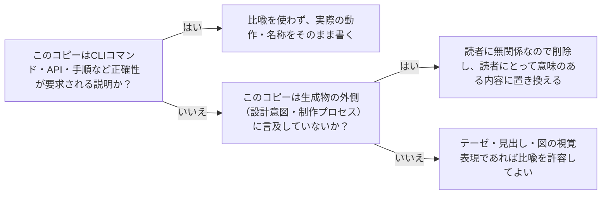

# 読者向けコピーの語り口の一貫性：copy-register-discipline

## 概要

### この概念が答える判断

- 生成物のコピーに、生成AI自身の設計意図やプロセスの説明が紛れ込んでいないか、どう見分けるか？
- 比喩表現はコピーのどの部分でなら使ってよく、どの部分では避けるべきか？

読者向けコピーにおいて、生成AI自身への言及（自己言及的メタ説明）を排除し、比喩表現をテーゼ・見出し・図の視覚表現に限定して、正確性が要求される説明文には持ち込まない語り口の一貫性規律。

---

## 原則

- 生成物のUIコピーは、読者が生成物の外側（設計意図・制作プロセス・生成AI自身の判断）に興味を持たない前提で書く。「この図は流れをさらっと見せるだけ」のような自己言及的なメタ説明は、書き手（生成AI）向けの実装メモであり、読者向けのコピーに混入してはならない。
- 比喩は、それが有効なレジスタ（テーゼ・見出し・図の視覚表現）に留める限り機能する。CLIコマンドの説明文・技術的な手順の説明など、正確性が要求されるレジスタに比喩が漏れ出すと、読者は何が実際の動作で何が装飾的表現かを区別できなくなる。
- 1つの生成物の中でも、セクションごとに異なるレジスタ（テーゼ的な比喩表現／実務的な機能説明）が意図的に使い分けられていてよいが、その切り替えは読者にとって予測可能な単位（セクション単位等）で行い、同一セクション内で無秩序に混在させない。

---

## 分類

| 分類 | 特徴 |
|---|---|
| 自己言及的メタ説明の混入 | 生成AI自身の設計意図やプロセスをコピーとして書いてしまう誤り |
| 比喩のスコープ逸脱 | テーゼ・図の視覚表現用の比喩が、正確性が要求される説明文に漏れ出す誤り |

---

## 判断基準

---

## 実例

架空のツール「Bar」のLPで、ヒーローの図に添えたテーゼ的な比喩「積み木を組み上げるように機能を重ねる」はそのまま活かしつつ、機能セクションのコマンド説明に紛れ込んだ「この図は全体像をさらっと見せるための簡略表現です」という一文（読者に無関係な制作メモ）を削除し、代わりに実際のコマンド名と引数を明記した。

---

## アンチパターン

| アンチパターン | 問題点 |
|---|---|
| 自己言及的メタ説明の残留 | 「この図は〜を表現したもの」「ここでは簡単のため〜と表記」のような生成AI自身の制作意図の説明が読者向けコピーに残ると、読者はその文が何のためにあるか理解できず、プロフェッショナルでない印象を与える。 |
| 技術説明文への比喩の混入 | CLIコマンドや実際の処理の説明に比喩表現（「焼き上げる」等の題材由来の言葉）を使うと、読者はどこまでが実際の動作でどこからが装飾かを判別できず、誤った理解をする可能性がある。 |

---

## 出典・根拠の透明性

本セッション（Waffle OSS LP作成）での実例の再構成。ユーザーが「ここにまだ焼き上がるみたいな表現が残っちゃってる」「もう少しLPであることを意識して表現して欲しい」と繰り返し指摘した経緯を一般化した。

### 留保事項

レジスタの切り替え単位（セクション単位が適切か等）は本セッションの1事例からの一般化であり、他の題材・トーンの生成物でも同じ単位が妥当かは未検証。

---

## 関連概念

他の概念（investigate-before-explain、scoped-validation-does-not-propagate）は技術的正確性・構造的整合性を扱うのに対し、この概念は文体・語り口のレジスタを扱っており、直接の依存関係は無い。
