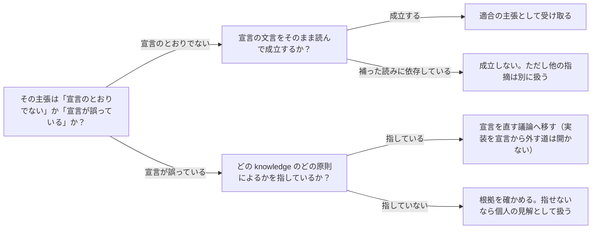

# 適合の主張と、宣言そのものへの異議を見分ける：knowledge-cand-declaration-text-arbitrates-violation-claims

## 概要

### この概念が答える判断

- 助言が「宣言に違反している」と述べたとき、何を確かめれば裁けるか
- 宣言そのものが誤っていると考えるとき、どう主張すべきか
- 宣言と knowledge が食い違ったとき、どちらを正本とするか

「宣言に適合しているか」と「その宣言が正しいか」は別の問いで、答えを持つ相手が違う。前者は宣言の文言が、後者は knowledge が裁く。混ぜると、宣言が反証不能になるか、knowledge が何でも押し通せるかのどちらかに倒れる。

---

## 原則

- 「宣言に違反している」は適合の主張であり、宣言の文言との照合だけで真偽が決まる。ここに解釈を足すと、照合ではなく解釈の比べ合いになる。
- 「その宣言は誤っている」は別の主張であり、knowledge が根拠を持つ。宣言は knowledge から導かれた結果であって、それ自体が事実の出どころではない。
- 宣言は途中の姿である。版を重ねている最中の宣言を正本として扱うと、誤った宣言がそのまま固定され、誰も直せなくなる。
- 宣言が誤っていると主張するときは、どの knowledge のどの原則によるかを指す。指さない主張は、knowledge を根拠にしているのか個人の見解なのかを区別できない。
- 宣言が誤っていると決まったときの行き先は、宣言を直すことである。宣言を残したまま実装だけをそこから外す道を開くと、宣言と実装が別々に漂流する。
- 助言の中で型を取り違えた主張が1つ崩れても、同じ助言に含まれる他の指摘は別に扱う。崩れたのは主張の型であって、助言者の見立て全体ではない。

---

## 分類

| 分類 | 特徴 |
|---|---|
| 適合の主張 | 実装が宣言のとおりか。宣言の文言との照合で裁く |
| 宣言への異議 | その宣言が正しいか。knowledge の原則を指して裁く |
| 現物の観察 | 実装や成果物を見て言えること。宣言にも knowledge にも依存しない |

---

## 判断基準

---

## 実例

蔵書を扱う仕組みで、構成の宣言が「目録という概念は1ファイルに1つ」と述べている。開発者が、目録に属する値の型を別のフォルダへ移した。

助言者は「宣言に違反した。目録の仕様が2つのファイルにまたがっている」と述べ、移動の撤回を勧めた。

宣言の文言を読むと「1ファイルに1つ」で、1つと数えているのは目録という概念そのものである。移動後も目録の型は1ファイルに1つだけ置かれている。適合の主張としては成立しない。

しかし助言者が本当に言いたかったのは別のことだった。「一貫性の境界＝一緒に変わるものの単位」という原則からすると、目録とその値は一緒に変わるので同じ場所にあるべきで、種類でフォルダを分ける構成そのものが誤っている——これは宣言への異議である。

この型で述べていれば、文言を持ち出して退けることはできず、宣言を直す議論になった。適合の主張として述べたために、文言と照らして崩れ、正しい見立てまで一緒に退けられた。

---

## アンチパターン

| アンチパターン | 問題点 |
|---|---|
| 宣言への異議を、適合の主張として述べる | 文言と照らすと崩れるため、その裏にある正しい見立てまで一緒に退けられる |
| 宣言を正本として扱い、誤りうるものとして見ない | 版を重ねている途中の宣言が固定され、knowledge の側から直す道が閉じる |
| knowledge を根拠に、宣言を直さず実装だけを宣言から外す | 宣言と実装が別々に漂流し、どちらが今の意図なのか誰にも分からなくなる |
| どの原則によるかを指さずに「knowledge に反する」と述べる | knowledge を根拠にしているのか個人の見解なのかを、受け手が区別できない |

---

## 出典・根拠の透明性

特定の文献ではなく、このリポジトリで実際に起きた一件（助言者が「宣言に違反」と述べ、文言と照らすと成立しなかったが、その裏にあった見立ては正しかった）からの一般化。区別の立て方はユーザーの指摘による——事実と根拠を持つのは knowledge の側であり、宣言は誤りうる。

### 留保事項

実例は1件である。knowledge どうしが食い違う場合にどちらを採るかは、この一件からは決まっていない。

---

## 関連概念

| 関連概念 | 関係 |
|---|---|
| knowledge-cand-avoidable-friction-is-not-detection | 同じ一件から出たもう1つの規律。塞ぎ方を規約とknowledgeから導くこと |
| knowledge-cand-investigate-before-explain | 実物を確認してから述べるという規律を、助言を受け取る側から見たもの |
| knowledge-cand-aggregate-declaration-is-not-class-existence | 宣言と実装の対応を読み違えると、厳しすぎて同時に緩すぎる判定になる例 |
