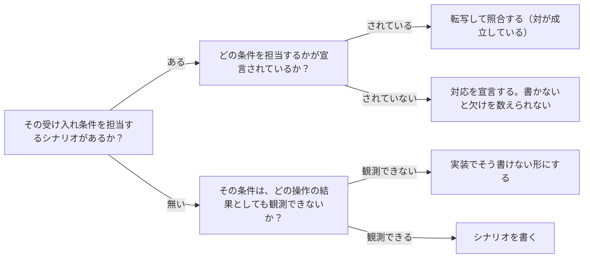

# 受け入れ条件と振る舞いのシナリオという単一のつなぎ方：knowledge-cand-one-binding-for-all-contract-levels

## 概要

### この概念が答える判断

- 仕様と実装のトレーサビリティは、何と何を突き合わせれば取れるか
- 集約の不変条件は、業務ユースケースとは違うつなぎ方が要るのか
- 境界づけられたコンテキストとして満たすべきことに、独立した仕組みが要るか
- いま担保が効いていない箇所は、機構が足りないのか宣言が足りないのか
- どの受け入れ条件にシナリオが付いていないかを、どうすれば数えられるか

仕様と実装をつなぐ経路は1つであり、受け入れ条件・振る舞いのシナリオ・実装への転写・照合という同じ形が、業務ユースケース・集約・業務サービスのどれでも変わらないこと。したがって不足は機構の不足としてではなく、宣言の対の欠けとして現れる。

---

## 原則

- 仕様と実装をつなぐ経路は1つである。受け入れ条件があり、それに対する振る舞いのシナリオがあり、そのシナリオが実装へ転写されて照合される。
- この対を持つのは、業務ユースケース・集約・業務サービスの3つである。どこであってもつなぎ方は同じで、段によって経路が変わることはない。
- 集約の受け入れ条件は不変条件であり、業務ユースケースの受け入れ条件と同じ扱いを受ける。「常に」の形をしていることは、つなぎ方を変える理由にならない。その不変条件に対する振る舞いのシナリオを書き、実装へ転写すればよい。
- 境界づけられたコンテキストとして満たすべきことは、この3つの対が揃っていれば担保される。文脈が受け入れ条件と振る舞いの対を独自に持つ必要はない。
- ただし、契約の対を持たないことと、何も担わないことは違う。境界づけられたコンテキストは所属を担う——この文脈に何が属するかという参照構造そのものである。
- 所属を機械が判定できるようにするには、3つの宣言が要る——その文脈に属する要素の一覧（意図）、各種別が仕様側と実装側のどこにどういう名前で在るかという所在の規則、そしてその規則が及ぶ走査の領域。
- この3つが揃うと、所属は2方向で照合できる。一覧から実物へ辿る向きは欠けを見つけ、領域から一覧へ戻る向きは余りを見つける。見つかる失敗が違うので、片方だけでは足りない。
- 一覧が無ければ欠けの向きは定義できず、走査の領域が無ければ余りの向きは定義できない。どちらか一方だけを持つ設計は、必ずもう一方の失敗を見逃す。
- 照合の起点は一覧でなければならない。領域の走査を起点にすると、一覧に載っていないものも普通に処理され、一覧が唯一の正である意味が消える。走査は余りを出すためだけに使う。
- 所属の照合に使える手がかりは、要素の種類によって深さが違う。ファイルの存在までしか言えないもの、クラスの名前まで言えるもの、クラスの中身（属性の一致）まで言えるもの、そして説明文の一字一句まで言えるもの（振る舞いのシナリオ）がある。深く言える要素ほど、所属の宣言が実装の実態から離れにくい。
- 実装側に対応物を持たない要素（業務領域の分類など）は、仕様側だけで照合する。鏡にできるのは成果物を持つ要素だけで、これは欠陥ではなく、その要素が解決空間に属していないというだけのことである。
- 仕様が唯一の正であるなら、実装側も同じ参照構造で照合できることが望ましい。ただし鏡にできるのは実装の成果物を持つ要素だけで、業務領域の分類や不変条件のように対応物を持たないものは、仕様側だけで照合する。
- したがって担保の不足は、機構の不足としてではなく宣言の欠けとして現れる。受け入れ条件があってシナリオが無い、あるいはシナリオがあって受け入れ条件が無い、という形をとる。
- 欠けを機械が数えるには、どの受け入れ条件をどのシナリオが担当しているかの対応が宣言されている必要がある。対応が無ければ「シナリオの付いていない受け入れ条件」を特定できない。
- 転写して照合する経路が届かない規則が、わずかに残る。情報の不在を主張するもの——保持しない・残らない・追記しかできない・保持期限を超えない——は、観測するための操作を作った時点で規則そのものが壊れるため、実装でそう書けない形にすることでしか守れない。ただしその観測できる部分（一度しか示されない、見返せない）はシナリオとして書けるため、残るのは保管そのものについての言明だけである。
- 受け入れ条件にシナリオが付いていることと、そのシナリオが実装へ実際に届いていることは別である。転写が行われていなければ、対が揃っていても何も担保されない。対の充足と転写の到達は、別々に測る。
- 宣言は、読み手が居て初めて機能する。欄が存在することと、機械がその欄を読むことは別であり、読み手の居ない欄は、記入されていない状態と検査に通った状態が同じ見た目になる。
- 検知が「宣言が無ければ黙って対象外にする」形になっていると、宣言の欠落と検査の合格が区別できなくなる。欠落は欠落として報告する。
- この設計前提は、業務領域駆動設計の知識体系へは足さない。あちらは特定の著者が提唱する枯れた設計手法として完成された抽象概念であり、派生を混ぜると、その知識を背景に持つ助言役がこの派生を反証できなくなる。

---

## 分類

| 分類 | 特徴 |
|---|---|
| 対が揃っている | 受け入れ条件と、それを担当する振る舞いのシナリオの両方がある状態。転写と照合が働く。 |
| 条件だけある | 受け入れ条件はあるが、担当するシナリオが無い状態。実装との接点を持たない。 |
| シナリオだけある | 振る舞いは書かれているが、それが何を満たすための振る舞いなのかが宣言されていない状態。 |
| 所属の宣言 | 受け入れ条件と振る舞いの対ではなく、その文脈に何が属するかを宣言するもの。両方向で照合する。 |

---

## 判断基準

---

## 実例

架空の題材として、社内の備品貸出を扱う仕組みを考える。同じつなぎ方が3箇所に現れる。

【業務ユースケース】受け入れ条件「貸出を延長するとき、上限回数を超えていれば延長は断られる」。これに対する振る舞い「上限に達した貸出は延長できない」を書き、その筋書きをそのまま実装の検証へ転写する。文言が食い違えば照合が落ちる。

【集約】受け入れ条件（不変条件）「同じ備品が同時に2人へ貸し出されている状態には、常にならない」。これに対する振る舞い「貸出中の備品は別の人へ貸し出せない」を書き、同じように転写する。「常に」であっても、やることは変わらない。台帳が持つコマンドが増えたときに新しい振る舞いが要るかどうかは、その不変条件を担当する筋書きが足りているかという問いに帰着する。

【業務サービス】複数の台帳をまたぐ判断「持ち出し可否の判定」。ここにも満たすべき受け入れ条件があり、それに対する振る舞いを書いて転写する。

3つとも同じ形をしている。違うのは、それぞれの対が実際に揃っているかどうかだけである。

【例外】「借り主の連絡先は、返却が済んだ時点から常に保持しない」。観測できる部分——返却後に連絡先が表示されない——は振る舞いとして書けるが、保管の中に何が残っているかは、それを見る操作を作らない限り観測できず、作った時点で規則が壊れる。ここだけは書けなさで守る。

---

## アンチパターン

| アンチパターン | 問題点 |
|---|---|
| 段ごとに別のつなぎ方を用意する | 同じ形の繰り返しにすぎないものに別の機構を当てようとして、本当の不足（宣言の対の欠け）が機構の不足として誤診される。 |
| 受け入れ条件とシナリオの対応を書かずに済ませる | どの条件にシナリオが付いていないかを機械が特定できず、欠けが件数の差としてしか見えない。 |
| 対が揃っていることを、実装に届いている証拠と読む | 転写が行われていなくても対は揃って見えるため、誰とも突き合わされていない宣言の集合が「ずれ無し」として通る。 |
| 読み手の居ない宣言欄を足す | 記入されていない状態と検査に通った状態が同じ見た目になり、欄が増えるほど「宣言したから守られている」という誤った安心が積み上がる。 |
| 検知が、宣言の無いものを黙って対象外にする | 検知が緑を返しても、それが「適合している」なのか「そもそも見ていない」なのか区別できなくなる。 |
| 所属の照合を片方向だけにする | 一覧だけを持つと領域に紛れ込んだ余りが見えず、領域だけを持つと宣言されているのに存在しない欠けが見えない。 |
| 所属の照合を、領域の走査から始める | 一覧に載っていない要素も走査に拾われて普通に処理されるため、一覧が唯一の正でなくなり、実際にディスクの実在が正として振る舞いはじめる。 |

---

## 出典・根拠の透明性

業務領域駆動設計の原則から直接導かれるものではなく、「受け入れ基準と振る舞いのドリフトをなくすことで仕様と実装のトレーサビリティを取る」という構想を、実際に動いている照合の仕組みと突き合わせて整理したもの。この仕組みを持つ側の設計判断であり、外部の一般原則の要約ではない。

### 留保事項

未検証の留保が3点ある。
(1) 対の欠けが実測で3箇所ある。集約は受け入れ条件（不変条件）17件に対しシナリオ12件で、5件分が足りない。業務サービスはシナリオ5件があるのに受け入れ条件そのものが無い（責務の散文だけ）。そして対応の宣言が17件中4件しか記入されていないため、どの条件にシナリオが無いのかを機械的に特定できない。この3つが埋まった状態は、まだ一度も実現していない。
(2) 受け入れ条件そのものを読む実装は存在しない。いま機械が読んでいるのはシナリオの側だけで、条件の側は7ブロックとも読み手が居ない。
(3) 情報の不在を主張する規則について、観測できる部分をシナリオへ、保管についての言明を書けなさへ、という切り分けはまだ実際に当てはめていない。切り分けたあと何が残るかは未確認。

なお元の定式化では「仕様と実装のつなぎ方は段によって変わる（末端は転写、上の段は被覆）」としていたが、これは誤りとして退けた。集約の不変条件もそれに対する振る舞いのシナリオを持ち、ユースケースのシナリオとまったく同じ経路で実装へ転写・照合される。「被覆」と呼んでいたものは別のつなぎ方ではなく、同じつなぎ方が全部の受け入れ条件に届いているかという、対の充足の問題だった。
(4) 所属の宣言について、手がかりも両方向の照合も大半は既に存在し、欠けと余りを実際に検出している。ただし照合の起点が一覧ではなく領域の走査になっており、仕様文書がディスクに在れば一覧に載っていなくても通る。所属の一覧が唯一の正として機能していない。あわせて、一覧の種別に業務サービスが無く、集約は仕様側の余りの向きが見られていない。

---

## 関連概念

| 関連概念 | 関係 |
|---|---|
| knowledge-cand-operation-contract-closes-invariants | どの要素が受け入れ条件と振る舞いの対を持つかを定める、モデリング側の規律。対をなす。 |
| knowledge-cand-avoidable-friction-is-not-detection | 困りごとを消すだけの対応が原因を残すという規律で、読み手の居ない欄を足す誤りと同じ形をしている。 |
| self-improving-generation-cycle | 対の充足と転写の到達を、一発の生成でなく測定と修正の反復として回すための土台。 |
