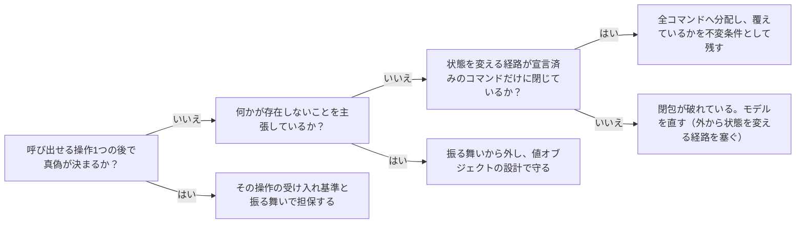

# 呼び出せる操作の契約で全体整合を閉じるためのモデリング規律：knowledge-cand-operation-contract-closes-invariants

## 概要

### この概念が答える判断

- 受け入れ基準と振る舞いは、業務領域を構成するどの要素に持たせるべきか
- 集約の不変条件は、業務ユースケースの受け入れ基準へ還元して廃止できるか
- どの操作からも観測できない規則に出会ったとき、モデルを直すべきか別の手段で守るべきか
- 呼び出せる操作の契約だけで全体整合を担保できるようにするには、何を守ればよいか
- 集約が適切に小さいかどうかを、どう見分けるか

受け入れ基準と振る舞いは、業務領域の要素そのものにではなく、要素が公開する呼び出せる操作に付くという整理と、それだけで全体整合を担保できるようにするために業務領域のモデルが満たすべき規律。

---

## 原則

- この規律は、業務領域駆動設計の原則から導いた派生であって、原典の主張ではない。原典が保証するのは「集約はルート経由でのみ変更される」ところまでで、そこから先の——閉包が宣言されていれば全称命題を分配できるという——主張は、この規律のものである。
- この規律は、業務領域駆動設計の知識体系へは足さない。あちらは特定の著者が提唱する枯れた設計手法として完成された抽象概念であり、派生を混ぜると、その知識を背景に持つ助言役がこの派生を反証できなくなる。外に置いたままにすることで、次に検証させたときも敵対的に読める。
- 受け入れ基準と振る舞いは、業務領域を構成する要素そのものにではなく、要素が公開する呼び出せる操作に付く。どちらも「呼び出したらこうなる」という形をしているため。
- 呼び出せる操作を持つのは、業務ユースケース・業務サービス・集約のコマンドの3つである。集約自身が持つのではなく、集約のコマンドが持つ。
- 業務イベント・境界づけられたコンテキスト・サブドメインは、独自の受け入れ基準と振る舞いを持たない。イベントの契約は発行側の操作へ、境界の規則は境界上の操作へ落ち、サブドメインは投資判断の分類であって一貫性の単位ではない。
- 不変条件は「あらゆる操作列のあとで成り立つ」という全称命題であり、個別の操作の受け入れ基準をいくら集めても表現できない。「操作を全部数え上げた」という主張自体が、操作の側のどこにも書けないため。
- 集約の状態を変える経路が宣言済みのコマンドだけに閉じていれば、「あらゆる操作列」は有限のコマンド集合に閉じ、全称命題は各コマンドの個別命題へ分配できる。
- したがって不変条件が操作の契約に届かない原因は、不変条件の特殊性ではなく、操作集合の閉包が宣言されていないことである。閉包を宣言すれば届く。
- ただし「情報の不在」を主張する規則は例外で、分配しても届かない。秘密を保持しない・記録が残らない・追記しかできない・保持期限を超えない、がこれにあたり、観測するための操作を作った瞬間に規則そのものが壊れる。
- 「情報の不在」を主張する規則は振る舞いから外し、値オブジェクトの設計で守る。これは表現の制約であって振る舞いの制約ではない。
- 不変条件は廃止せず、「全コマンドへの分配が覆っている」という網羅性の主張として残す。コマンドを1つ足したとき、既存の受け入れ基準は1つも赤くならないが不変条件は壊れうる。その差分を受け取る場所が不変条件である。
- この規律の代償は、コマンド数と不変条件数の掛け算になることである。
- その掛け算が現実的な大きさに収まるかどうかが、集約が適切に小さいかの指標になる。集約が肥大すると規律が回らなくなり、回らないこと自体が集約を割る合図になる。
- 集約をまたぐ整合は結果整合でよく、それを実現する業務サービスやプロセスは呼び出せる操作なので、操作の契約で表現できる。
- 以上により、全体整合は「集約の内側」「集約と集約の間」「表現そのもの」の3つに分解して閉じる。業務領域の外側の概念を持ち込む必要はない。
- 段の受け入れ基準は、段によって言明の種類が違う。集約の不変条件が状態空間についての全称命題であるのに対し、境界づけられたコンテキストの受け入れ基準は意味と分担についての全称命題である（この境界の内側で語がそれぞれ一つの意味を持つ／同じデータへの一連の操作が境界の外へ分散していない／外部へ公開する契約と外部モデルを取り込む際の変換）。
- この違いは、破ったときに起きることの違いとして現れる。集約の不変条件は実行時に検出でき、操作が失敗する。コンテキストの受け入れ基準は実行時には何も起きず、動き続けたままモデルが実態から乖離する。修復も前者は実装を直すだけだが、後者は境界を引き直す。
- したがってコンテキストの段の受け入れ基準は、機能要件の形式では書けない。機能要件として書こうとすると、必ず下の段の内容が上へ複写され、コンテキストの段が目次に退化する。
- 段の数は業務領域の実装方法に依存する。集約と不変条件を持たない実装方法を採る領域では集約の段が存在せず、梯子は2段になる。段の数を全域で固定した宣言形式は、この差を表現できない。
- 語彙は、この梯子の前提であって梯子の一部ではない。各段の基準も振る舞いも、境界の内側で一貫した意味を持つ言葉の上に書かれる。

---

## 分類

| 分類 | 特徴 |
|---|---|
| 操作ごとの個別命題 | 呼び出せる操作1つの後で真偽が決まる規則。受け入れ基準と振る舞いでそのまま担保できる。 |
| 分配できる全称命題 | あらゆる操作列にわたる規則だが、状態を変える経路が閉じていれば全コマンドへ分配できる。 |
| 分配できない全称命題（情報の不在） | 何かが存在しないことを主張する規則。観測用の操作を作った瞬間に規則が壊れるため、表現の設計で守るしかない。 |

---

## 判断基準

---

## 実例

架空の題材として、社内の備品貸出を扱う業務領域を考える。

集約「貸出台帳」は、借りる・返す・延長する・紛失を記録する、の4つのコマンドを持つ。不変条件は「同じ備品が同時に2人へ貸し出されている状態には、常にならない」。

この不変条件は「あらゆる操作列のあとで」を主張しているため、どれか1つの操作の受け入れ基準としては書けない。しかし台帳の状態を変える経路がこの4つのコマンドだけだと宣言されていれば、「借りたあとで二重貸出にならない」「延長したあとで二重貸出にならない」というように4つの個別命題へ分配でき、それぞれは受け入れ基準と振る舞いで担保できる。不変条件そのものは廃止されず、「4つ全部を覆えている」という主張として残る。

ここに5つ目のコマンド「他部署へ移管する」を足したとき、既存の4つの受け入れ基準は1つも壊れないが、不変条件は壊れうる。この差分に気づく場所が不変条件である。

一方、同じ業務領域に「借り主の連絡先は、返却が済んだ時点から常に保持しない」という規則があるとする。これは分配できない。返却後に連絡先を確認する操作を作れば観測できるが、その操作を作った時点で規則が壊れる。したがってこれは振る舞いではなく、返却後の台帳が連絡先を持てない形になっているかという表現の設計で守る。

---

## アンチパターン

| アンチパターン | 問題点 |
|---|---|
| 不変条件を受け入れ基準へ吸収して廃止する | 全称命題が個別命題の集合に化け、操作を1つ足したときに既存の受け入れ基準が1つも赤くならないまま不変条件だけが壊れる。 |
| 観測するためだけの操作を足す | その境界の言葉に存在しない語彙をモデルへ持ち込み、「情報の不在」を主張する規則については観測可能にした瞬間に規則そのものを壊す。 |
| 集約の外から状態を変える経路を残す | 操作集合の閉包が成り立たなくなり、全称命題を分配してよいという根拠そのものが失われる。 |
| サブドメインや境界づけられたコンテキストに独自の受け入れ基準を持たせる | 振る舞いの単位でないものを振る舞いの単位として扱うことになり、投資判断の分類と一貫性の境界が混ざる。 |
| 観測できない規則を「書き方が悪い」として仕様から追い出す | 秘密の非保持や保持期限のように、失敗したときの損害が最も大きい種類の規則だけが、検証しやすさを理由に構造的に取り残される。 |
| コンテキストの段に機能要件を書ける欄を与える | 下の段の内容が上へ複写され、コンテキストの段が単なる目次に退化して、意味と分担についての言明を置く場所が失われる。 |
| 段の数を全域で固定する | 集約を持たない実装方法の領域でも3段を強い、空の段を埋めるための形だけの宣言が生まれる。 |

---

## 出典・根拠の透明性

業務領域駆動設計の一般原則（集約はルート経由でのみ変更される／集約は小さく保つ／集約をまたぐ整合は結果整合でよい／値オブジェクトが表現の制約を担う）の再構成と、それらを「受け入れ基準と振る舞いだけで全体整合を担保できるか」という問いへ適用した導出。特定の書籍からの直接引用ではない。

### 留保事項

この規律は業務領域の分類（中核・一般・補完）に依存せず、すべてに適用されるものとして述べている。分類は導出の中で二度効いている——サブドメインが契約の段ではないという結論として、そして段の数が実装方法に依存するという原則として。領域の複雑さで成否が変わる性質のものではない。

未検証の留保が4点ある。
(1) 段の数が実装方法に依存することは原則として述べているが、「段が無い」と「段を書き忘れた」を宣言の上でどう区別するかは決まっていない。
(2) 実際に当てはめて確かめた業務領域が、いまのところ補完（supporting）と分類されたもの1件しかない。これは抽象そのものの根拠ではなく、当てはめて得た測定値の偏りである。抽象は分類を踏まえて導いているため採用を妨げるものではないが、中核（core）の業務領域で一度確かめる価値はある。
(3) コマンド数と不変条件数の掛け算が、中核領域の規模で現実的な大きさに収まるかは未実測。
(4) 「情報の不在」を主張する規則の一覧（秘密の非保持・消去の完全性・追記専用性・保持期限）がこの族を尽くしているかは確かめていない。

なお検証の過程で、「中核領域はピラミッド形のテスト方針をとるため、不変条件を受け入れ基準へ寄せるとテスト方針の経験則と衝突する」という異議が出たが、これは採らなかった。この異議は「どこで宣言するか」と「どの層で検証するか」を混ぜている。コマンドへ分配した基準を単体テストで厚く検証することは矛盾なくできるため、分配（宣言の話）とピラミッド（検証層の話）は両立する。

---

## 関連概念

| 関連概念 | 関係 |
|---|---|
| domain-model | 集約がルート経由でのみ変更されるという原則が、この規律の閉包の前提になる。 |
| bounded-context | 境界の規則が境界上の操作へ落ちる、という還元先を与える。 |
| subdomain | サブドメインが振る舞いの単位でない根拠を与える。この規律自体は分類に依存せず、中核・一般・補完のすべてに適用される。 |
| design-heuristics | 業務領域の分類から実装方法・テスト方針が連鎖する経験則。この規律は宣言の置き場所を定めるもので、検証層の選択には踏み込まないため、分類ごとのテスト方針とは両立する。 |
| event-driven-architecture | 業務イベントの契約が発行側の操作へ落ちる、という主張の検証相手。 |
| knowledge-cand-one-binding-for-all-contract-levels | この規律を前提として成り立つ、仕様と実装の結び付け方についての設計前提。対をなす。 |
