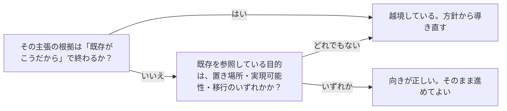

# 再定義では方針が正で、実測は判定される側であること：knowledge-cand-policy-is-ssot-measurement-is-judged

## 概要

### この概念が答える判断

- 作り直しの設計判断で、既存の実測をどこまで根拠にしてよいか
- 実測が方針から大きく外れているとき、方針を緩めるべきか
- 自分の主張が既存に引っ張られているかを、どう見分けるか
- 既存を参照してよいのは、どういう目的のときか

既存の仕組みを作り直す作業において、新しく定めた方針が唯一の正であり、既存の実測はその方針に照らして判定される対象であるという関係。実測を当てること自体は有用で、避けるべきなのは実測を根拠に方針を決めることである。

---

## 原則

- 既存の仕組みを作り直す作業では、新しく定めた方針が唯一の正であり、既存の実測はその方針に照らして判定される対象である。
- 実測を当てること自体は有用である。方針からの逸脱を見つけ、移行で直すべき対象を特定できる。敵対的に当てるほど価値が出る。
- 避けるべきなのは、実測を根拠にして方針を決める・裁くことである。既存は、いま置き換えようとしている方式の下で作られたものなので、目標の形がどうあるべきかについての証拠にならない。
- 既存を根拠にしてよい範囲は3つに限られる——実装をどこに置くか、実現できるかどうか、そして移行の入力として。宣言や概念の形そのものを決めるのには使えない。
- 見分け方は単純である。その主張が「既存がこうだから」で終わるなら越境している。「方針がこうだから、既存のここが外れている」なら向きが正しい。
- 逸脱が多いことは、方針が誤っている証拠ではない。旧方式の下で書かれた以上、逸脱があるのは当然であり、逸脱の量を理由に方針を緩めると、作り直す意味が消える。
- この誤りは、実測が手元にあるときほど起きやすい。数えた結果は根拠として強く見えるため、何の問いに答えるために数えたのかを見失うと、そのまま方針の根拠に転用してしまう。

---

## 分類

| 分類 | 特徴 |
|---|---|
| 実装の置き場所 | どの層のどこに置くか。既存の配置を参照してよい。 |
| 実現可能性 | その形が既存の仕組みで表現できるか。既存を参照して確かめてよい。 |
| 移行の入力 | 何件あるか、どこから翻訳できるか。既存の実測がそのまま材料になる。 |
| 宣言や概念の形 | 何をどう宣言するか。既存を根拠にしてはならない唯一の領域。 |

---

## 判断基準

---

## 実例

架空の題材として、社内の備品貸出の仕組みを作り直す場面を考える。

新しい方針として「貸出の記録は、備品ではなく借り主に紐づける」と定めたとする。そのうえで既存の記録を数えたところ、9割が備品に紐づいていた。

ここで「9割がそうなっているのだから、備品に紐づける形のほうが実態に合う」と読むと、方針を実測が裁いている。作り直す前の形が多数派なのは当然で、それは証拠にならない。

正しい読み方は「9割が方針から外れている。移行で直す対象が9割ある」である。同じ数字が、方針を覆す根拠ではなく、移行の見積もりになる。

一方で、既存を参照してよい場面もある。「借り主に紐づける形を、いまの記録の仕組みで表現できるか」は実現可能性の問いなので、既存を調べて確かめてよい。「新しい記録をどのファイルに置くか」も置き場所の問いなので、既存の配置に合わせてよい。

---

## アンチパターン

| アンチパターン | 問題点 |
|---|---|
| 実測を根拠に方針を決める | 置き換えようとしている方式の下で作られたものが、目標の形を規定してしまい、作り直しが旧方式の追認に終わる。 |
| 既存に前例があることを設計判断の理由にする | 前例が正しかったかは検証されていないため、誤った設計が「既にそうなっている」というだけで再生産される。 |
| 逸脱の量を理由に方針を緩める | 旧方式の下では逸脱があるのが当然なので、この理由を認めると、どんな方針も既存の形へ引き戻される。 |
| 何のために数えたのかを見失う | 数えた結果は根拠として強く見えるため、移行の見積もりのために取った数字が、そのまま設計判断の根拠へ転用される。 |

---

## 出典・根拠の透明性

外部の一般原則ではなく、実際の作り直しの作業で3度繰り返した誤りを、ユーザーからの訂正を受けて定式化したもの。

### 留保事項

この規律は「既存を見るな」ではない。実測を敵対的に当てて逸脱を洗い出すことは、むしろ推奨される。境界は、実測が答えている問いが「方針はどうあるべきか」なのか「既存は方針からどれだけ外れているか」なのかにある。

見分けが常に容易とは限らない。とくに実現可能性の問いは、「表現できないから形を変える」という形で宣言の形の決定へ滑り込みやすい。その場合は、表現できない理由が原理的なものか、いまの仕組みの都合かを分けて確かめる必要がある。

---

## 関連概念

| 関連概念 | 関係 |
|---|---|
| knowledge-cand-one-binding-for-all-contract-levels | この規律が守られなかった実際の対象。宣言の形を、旧方式の文書から裁こうとした。 |
| architecture-evidence-based-scope | 実例が揃うまで抽象化しないという規律。実例を根拠に使う向きが逆になると、この規律と衝突する。 |
| knowledge-cand-investigate-before-explain | 主張の前に実物を確認する規律。確認した実物をどう使うかを、この規律が定める。 |
