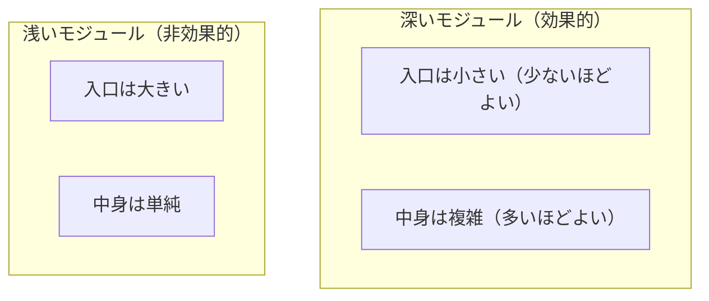
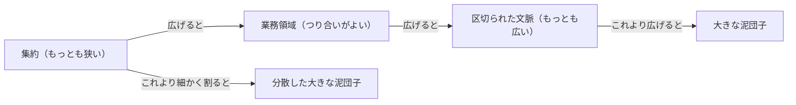
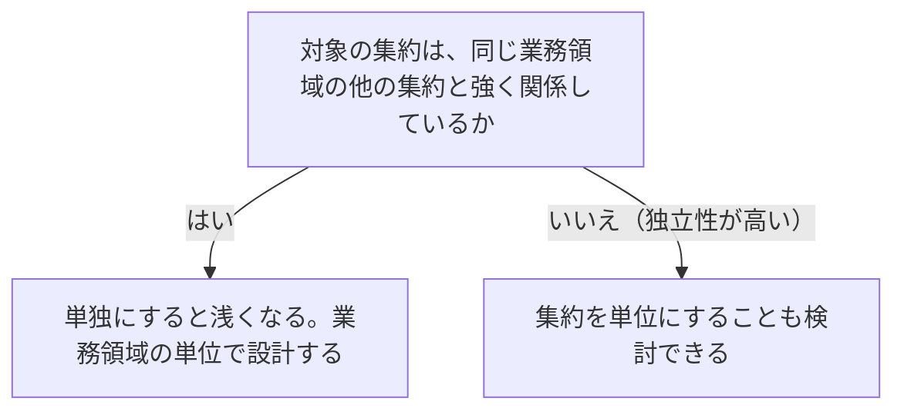
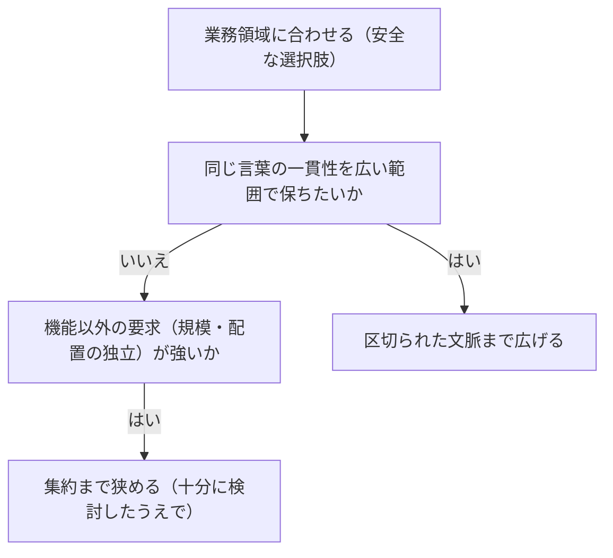

# マイクロサービスの境界を扱う概念：microservices

## 概要

### この概念が答える判断

- マイクロサービスの境界をどこに引けばよいのか
- 設計したサービスが深いか浅いかを、どう確かめるのか
- 集約をそのままサービスの単位にしてよいのか
- 区切られた文脈とマイクロサービスは同じものか
- 分割したのに複雑さが増えるのはなぜか

設計の方法論であるドメイン駆動設計と、実装の方法論であるマイクロサービスの関係。マイクロサービスとは入口がきわめて小さいサービスで、良し悪しは入口と中身の比——深さ——で決まる。境界の広さは区切られた文脈から集約までの幅があり、業務領域に合わせるのがもっともつり合いのよい選択肢になる。

---

## 出典・根拠の透明性

『ドメイン駆動設計をはじめよう』第14章の書き起こしを、粒度を保ったまま構造へ移したもの。見出しそれぞれにノードを1つ対応させ、書き起こし版で図として書かれていたものは図として持たせ、文章で述べられていた境界の広さの順序も図として起こしている。

### 留保事項

標準化団体の名称、引用元の文献名、著者名は、著作権への配慮からすべてその内容の説明に置き換えた。示している構造——深さの定義、境界の広さの順序、両端がどちらも失敗になること——は保っている。

---

## 関連概念

| 関連概念 | 関係 |
|---|---|
| bounded-context | 区切られた文脈の設計。マイクロサービスと対等でない関係 |
| subdomain | 業務領域。境界として安全な選択肢 |
| domain-model | 集約。境界としてもっとも狭い単位 |
| context-integration | 共用サービスとモデル変換装置の詳細 |
| communication | サービスどうしをつなぐ具体的な形 |
| real-world-ddd | 既存システムへの導入 |

---

## マイクロサービス

### この概念が扱う範囲

設計の方法論であるドメイン駆動設計と、実装の方法論であるマイクロサービスの関係を扱う。マイクロサービスは、素早い変更・規模の拡大・計算資源を借りる形への適合を意図した技術方式として広まったが、多くの組織が手にしたのは柔軟さではなく分散した大きな泥団子だった——分解しようとした一枚岩より、はるかに壊れやすく不格好で費用のかかるシステムである。

### サービスとマイクロサービス

サービスとは、1つ以上の機能へたどりつける仕組みで、取り決められた入口を通して提供されるもの。その入口が、他の部品と通信する手段になる。マイクロサービスとは、その入口がきわめて小さいサービスである。

#### 入口を小さくすると何が起きるか

3つある——サービスが何をするものかが明快になる。他の部品とのつながり方が理解しやすくなる。変更する理由が限られるので、開発・運用・規模の拡大を独立して行いやすくなる。

#### データベースを外へ見せない

マイクロサービスはデータベースを内側に閉じ込める。データへの到達手段を、連係に特化した小さな入口だけに限る。データベースを外へさらけ出すと、入口が巨大になる。

#### 1つの処理につき1つのサービスは、完璧ではない

入口をたった1つの処理に限れば完璧なマイクロサービスになる、とは言えない。その形で分解すると、各サービスのデータベースは確かに閉じ込められるが、他のサービスのデータへ到達するには入口を通るしかなくなる。連係と同期のために入口が次々と広がり、結果として分散した大きな泥団子になる。

### 2種類の複雑さ

部分の複雑さを最小にすることより、はるかに重要な複雑さがある——プログラム全体、システム全体の構造の複雑さである。目標は、全体の複雑さと局所の複雑さの両方を同時に最適化することにある。

2種類の複雑さを対比する

片方だけを最小にすると、もう片方が最悪になる。両方を同時に最適化することが目標になる。

| 種別 | 内容 | 片方だけ最小にすると |
|---|---|---|
| 局所の複雑さ | 個々のサービスの複雑さ。実装に依存する | 極限まで分割 → 分散した大きな泥団子 |
| 全体の複雑さ | 複数のサービスで構成するシステム全体の複雑さ。サービスどうしの相互作用と依存関係で決まる | 全機能を1つのサービスに → 大きな泥団子 |

### モジュールの深さ

モジュールは2つで定義される——何を行うか（入口）と、それを実現する業務ロジック（中身）。簡潔な入口が複雑な中身を閉じ込めているものを深いモジュールと呼び、入口が閉じ込める複雑さに比べて大きすぎるものを浅いモジュールと呼ぶ。

モジュールの深さが、入口の小ささと中身の複雑さの比で決まることを示す

入口が小さく中身が複雑なら深く、入口が大きく中身が単純なら浅い。大事なのはどちらか一方ではなく、両者の比である。



| どこの話か | 図に載せきれないこと |
|---|---|
| 深いモジュール（効果的） | 「小さい」と「複雑」が同居していることが要点である。どちらか片方だけを見て評価すると、小さいだけの浅いモジュールを良いものと取り違える。 |
| 中身は単純 | 極端な例は、2つの数を足して返すだけのものを1つのサービスにする形。これは複雑さを閉じ込めるどころか、システム全体に不必要な複雑さを持ち込むだけになる。 |
| 2つの囲み | 良し悪しの評価が付いているのは、深さがそのままシステム全体の複雑さを減らすか増やすかに対応するためである。深いモジュールは減らし、浅いモジュールは増やす。 |

#### 浅いモジュールの極端な例

閉じ込める複雑さより、呼び出す手間のほうが大きくなる形。

浅いモジュールの極端な例を示す

これをサービスとして切り出すと、閉じ込める複雑さより、呼び出すための手間のほうが大きくなる。

```csharp
int AddTwoNumbers(int a, int b)
{
    return a + b;
}
```

#### 深さは論理と物理の両方を表す

マイクロサービスは物理的な境界だけを表すのに対し、深いモジュールは論理的な境界と物理的な境界の両方を表す。システム全体の複雑さから見ると、深いモジュールはそれを減らし、浅いモジュールは増やす。浅いサービスこそが、マイクロサービスを目指した取り組みが失敗する原因である。

#### 使ってはいけない定義

「一定の行数以下で書けるサービス」「直すより書き換えるほうが簡単なサービス」——こうした定義は、設計のもっとも重要な側面であるシステム全体を見渡すことを見失わせる。

#### 粒度と変更の費用

粒度と変更の費用の関係はU字を描く。その最低点がマイクロサービスにあたり、そこから外れると費用が上がる。大きな泥団子も、分散した大きな泥団子も、どちらも変更の費用が高い。

### 境界の広さは何で決まるか

ドメイン駆動設計の手法のほとんどは境界に関わる——区切られた文脈はモデルの境界、業務領域は業務活動の境界、集約と値オブジェクトはトランザクションの境界を表す。このうちどれをマイクロサービスの境界に使うかで、大きさが決まる。

境界の広さが、いくつかの概念で決まっていくことを示す

区切られた文脈がもっとも広く、集約がもっとも狭い。マイクロサービスとして成り立つのはその間で、業務領域がその中でつり合っている。



| どこの話か | 図に載せきれないこと |
|---|---|
| 集約（もっとも狭い） | これより細かく割ることは、次善の策にすらならない。トランザクション境界を表す最小の単位なので、割ると境界そのものが壊れる。 |
| 業務領域（つり合いがよい） | 経験則としてもっともつり合いがとれている、というだけで、常に正解という意味ではない。同じ言葉の一貫性を広く保ちたいなら区切られた文脈まで広げてよく、機能以外の要求が強いなら集約まで狭めてよい。 |
| 2つの泥団子 | 両端がどちらも失敗として描かれているのが要点である。広すぎても狭すぎても変更の費用は上がり、合理的な選択肢はその間の範囲にしかない。 |

#### 区切られた文脈との関係は対等ではない

マイクロサービスと区切られた文脈には共通点が多い——どちらも物理的な境界で、1つのチームが持つ。しかし関係は対等ではない。すべてのマイクロサービスは区切られた文脈だが、すべての区切られた文脈がマイクロサービスとは限らない。

マイクロサービスと区切られた文脈の関係が、対等でないことを示す

すべてのマイクロサービスは区切られた文脈だが、逆は成り立たない。


| どこの話か | 図に載せきれないこと |
|---|---|
| マイクロサービスから区切られた文脈 | 逆向きの線が無いのが主張である。描き忘れではなく、区切られた文脈がマイクロサービスとは限らない——巨大な一枚岩であることもあり、それが有効な選択である場合もある。 |
| 区切られた文脈 | 含まれるモデルの一貫性を守りながら取れる、もっとも広い有効な境界を示す。マイクロサービスは逆に、もっとも小さい有効な境界を定義する。 |

#### 集約はもっとも狭い

集約は有効な境界をもっとも狭い範囲で決める。これより細かい単位の物理的なサービスや区切られた文脈へ分解することは、次善の策にすらならない。

集約をサービスの単位にしてよいかを、関係の強さで確かめる

他との関係が強いほど、単独のサービスにすると浅くなる。



| どこの話か | 図に載せきれないこと |
|---|---|
| 対象の集約は、同じ業務領域の他の集約と強く関係しているか | 確かめる観点は3つ——同じ業務領域の他の集約とやりとりがあるか、他の集約と値オブジェクトを共有しているか、この集約の業務ロジックを変えたとき他の部品にどれだけ影響するか。 |
| 集約を単位にすることも検討できる | 「検討できる」であって「そうすべき」ではない。多くの場合は業務領域の単位のほうが適切である。 |

#### 業務領域がもっともつり合う

経験則として、もっともつり合いがとれているのはサービスの境界を業務領域に合わせる方法である。業務領域が自然に深いモジュールになるのは、事業活動の観点では「何をするか」を説明するものであり（どう実現するかではない）、技術の観点では強く関連した一貫したユースケースの集まり——同じモデル、密接なデータ、機能として強い関係——だからである。その強い関係が、結果としてモジュールの深さを保証する。小さな単位へ割ると入口が複雑になり、モジュールとしては浅くなる。業務領域に合わせることは安全な選択肢で、ほとんどのマイクロサービスにとってそれが最適解になる。例外は2つ——同じ言葉の一貫性を重視して広い範囲を境界にする場合と、機能以外の要求を満たすために集約を境界にする場合。設計判断は事業の活動内容だけでなく、組織の構造・事業の方針・機能以外の要求にも依存する。

### 入口を小さくする

ドメイン駆動設計の考え方は、境界を見つけるだけでなく、サービスを深くすることにも役立つ。

#### 共用サービスで小さくする

共用サービスは、ある区切られた文脈のモデルと、他の部品と連係するためのモデルを分ける。外向けの言葉を導入すると2つのことが起きる——利用する側に影響を与えずにサービスの実装を改善できる（新しい実装のモデルは、既存の外向けの言葉へ変換できる）。そして外向けの言葉は限られたモデルだけを外へ出すので、関係のない実装の複雑さを閉じ込めて隠せる。中身の実装が同じでも、入口を小さくすればサービスは深くなる。

共用サービスが、入口を小さくして深さを生む位置を示す

内部のモデルと、連係のためのモデルを分ける。中身を変えても外向けの形は変わらない。


| どこの話か | 図に載せきれないこと |
|---|---|
| 共用サービス（外向けの言葉） | 中身の処理は変わっていない。入口を小さくするだけでサービスは深くなる。深さは中身の量ではなく、入口との比で決まるためである。 |
| 共用サービス（外向けの言葉）から下流の2つ | 外向けの言葉は連係の要件に合わせて設計するので、関係のない実装の複雑さを外へ見せずに済む。利用する側に影響を与えないまま、中身の実装を改善できる。 |

#### モデル変換装置で小さくする

共用サービスと役割が逆になる。他の区切られた文脈と連係する複雑さを軽くする。使う側の局所の複雑さと、システム全体の複雑さの両方が減る。使う側の業務の複雑さと変換の複雑さが切り離され、変換の複雑さはモデル変換装置の側へ移る。使う側は使い勝手のよい連係向けのモデルを使えるので、入口が簡潔になる。独立したサービスとして実装することもできる。

モデル変換装置が、使う側の複雑さを引き取る位置を示す

共用サービスと役割が逆で、変換の負担を使う側の外へ出す。


| どこの話か | 図に載せきれないこと |
|---|---|
| モデル変換装置 | 独立したサービスとして立てることもできる。そうすると、使う側の業務の複雑さと変換の複雑さが切り離され、変換の複雑さはこちらへ移る。 |
| モデル変換装置から下流の2つ | 使う側は、使い勝手のよい連係向けのモデルだけを見ればよくなる。その結果、使う側の入口も簡潔になり、局所の複雑さと全体の複雑さの両方が減る。 |

### 4つの概念の対比

境界の広さの順に並べる。

4つの概念が、境界としてどの位置にあるかを並べる

広さの順に並んでいて、どれを選ぶかで境界の大きさが決まる。

| 概念 | 境界の性質 |
|---|---|
| 区切られた文脈 | モデルの一貫性を守りながら取れる、もっとも広い有効な境界 |
| 業務領域 | 安全な選択肢。深いモジュールを自然に定義する |
| マイクロサービス | もっとも小さい有効な境界 |
| 集約 | もっとも狭い境界。これより細かく割るのは望ましくない |

### 境界をどう決めるか

まず業務領域に合わせ、外れる理由があるかを順に問う。

マイクロサービスの境界をどう決めるかを、順に問うて決める

まず業務領域に合わせる。それを外れるのは、2つの事情があるときだけである。



| どこの話か | 図に載せきれないこと |
|---|---|
| 業務領域に合わせる（安全な選択肢） | 起点であって、分岐ではない。まずここに合わせると決めたうえで、外れる理由があるかを順に問う。 |
| 機能以外の要求（規模・配置の独立）が強いかから集約まで狭める | 「いいえ」の枝を描いていないのは、どちらの事情も無ければ起点のままでよいためである。 |
| 集約まで狭める（十分に検討したうえで） | 括弧書きが付いているのは、この終点だけ条件つきだからである。同じ業務領域の他の集約と関係が強いほど、単独のサービスにすると浅くなり、全体の複雑さが増す。 |

### アンチパターン

マイクロサービスの境界の決め方でよく起きる誤り。

#### 1つの処理につき1つのサービスにする

入口を極限まで細かくすると、サービスどうしの連係のために入口が次々と足され、分散した大きな泥団子になる。

#### 局所の複雑さだけを最適化する

個々のサービスを細かくするほど全体の複雑さが増える。全体と局所の両方をつり合いよく最適化する必要がある。

#### マイクロサービスと区切られた文脈を同じものと見なす

両者の関係は対等ではない。すべてのマイクロサービスは区切られた文脈だが、逆は成り立たない。区切られた文脈が巨大な一枚岩になることもあり、場合によってはそれが有効な選択になる。

#### 集約を常にサービスの単位にする

集約はトランザクション境界を表す最小の単位であり、それ以下への分解は望ましくない結果を招く。対象によって判断は分かれるが、多くの場合は業務領域の単位のほうが適切である。
