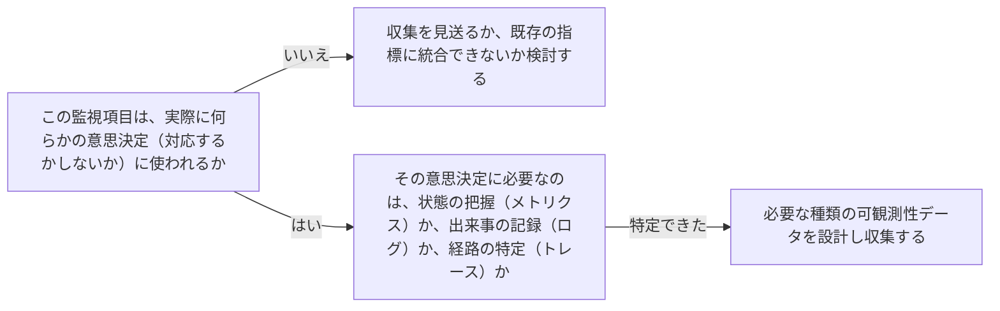

# 可観測性（ログ・メトリクス・トレース）の設計原則を扱う概念：observability-design

## 概要

### この概念が答える判断

- サービスの状態を把握するために、何を計測しておくべきか？
- 監視項目はどこまで増やせばよいか？
- 計測したデータをどう意思決定に繋げるべきか？

可観測性（オブザーバビリティ）とは、稼働中のシステムが自分の内部状態（何が起きているか）を外部から把握できるように、メトリクス・ログ・トレースの3種類の情報を出力できるように設計しておくことである。

---

## 原則

- 可観測性はメトリクス（数値の推移）・ログ（個々の出来事の記録）・トレース（1つのリクエストがシステム内をどう通過したかの記録）という3種類の情報から成り立つ。
- この3つはそれぞれ異なる問いに答える——メトリクスは「今どういう状態か」、ログは「何が起きたか」、トレースは「なぜ遅かったか・どこで失敗したか」。
- 可観測性を整備する目的は、収集すること自体ではなく、システムの挙動・性能・信頼性・健全性について実行可能な洞察を得て、重要業績評価指標（KPI）に基づいた意思決定と迅速な対応につなげることにある。
- 監視項目を増やすこと自体は目的ではなく、「その指標が実際に意思決定（対応するかしないか）に使われるか」を基準に取捨選択すべきである。

---

## 分類

| 分類 | 特徴 |
|---|---|
| メトリクス (Metrics) | 数値の推移（リクエスト数・エラー率・レイテンシ等）。「今どういう状態か」に答える |
| ログ (Logs) | 個々の出来事の記録。「何が起きたか」に答える |
| トレース (Traces) | 1つのリクエストがシステム内をどう通過したかの記録。「なぜ遅かったか・どこで失敗したか」に答える |

---

## 判断基準

---

## 実例

架空の物流プラットフォーム「ShipFast」の配送状況APIで、当初は大量のログだけを出力していたが、障害発生時に「今どのくらいのリクエストが失敗しているか」を即座に把握できず対応が遅れた。エラー率・レイテンシをメトリクスとして常時収集するよう変更し、しきい値を超えたら通知される状態にした。さらに「特定の配送記録の更新だけが遅い」という問い合わせに対応するため、リクエストごとのトレースも導入し、どの内部処理で時間がかかっているかを特定できるようにした。

---

## アンチパターン

| アンチパターン | 問題点 |
|---|---|
| 使われない監視項目を際限なく増やす | 収集・保管のコストだけが増え、本当に重要な指標がノイズに埋もれて見つけにくくなる |
| ログだけに頼り、メトリクス・トレースを整備しない | 「今どういう状態か」を即座に把握できず、障害時にログを1件ずつ読んで原因を推測することになり対応が遅れる |
| 監視データを集めるだけで、対応基準（しきい値・エスカレーション）を決めていない | 異常が発生しても誰も気づかない、あるいは気づいても何をすべきか判断できない |

---

## 出典・根拠の透明性

AWS Well-Architected FrameworkのOperational Excellence Pillarが扱う可観測性の三本柱（メトリクス・ログ・トレース）とKPIに基づく意思決定の原則をAIが要約・再構成したものであり、本文の直接引用ではない。単一の権威ある出典ではなく、広く確立されたクラウド運用実務知見として扱う。

---

## 関連概念

| 関連概念 | 関係 |
|---|---|
| reliability-targets-and-error-budgets | SLI（サービスレベル指標）は可観測性データ（主にメトリクス）から算出される |
