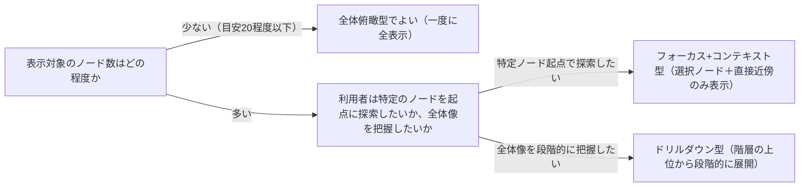

# 情報を段階的に開示するUI設計原則を扱う概念：progressive-disclosure

## 概要

### この概念が答える判断

- グラフ・ネットワーク図で、全ノードを一度に表示してよいか？
- 情報量が多い画面で、何を最初に見せ、何を後から見せるべきか？
- 「賑やかで情報量が多そうに見える」ビジュアルと「実際に使える」ビジュアルの違いは何か？

プログレッシブディスクロージャー（段階的開示）とは、情報を一度に全て見せるのではなく、利用者の操作（選択・展開・絞り込み等）に応じて必要な分だけ段階的に開示する設計原則である。

---

## 原則

- 人間が一度に把握できる情報量には限界があり、ノード数・エッジ数が多いグラフをそのまま初期表示すると、視覚的な密度は高く見えても、個々のノード・関係を実際には読み取れなくなる。
- 「見た目の情報量が多く見える」ことと「情報として機能する」ことは別であり、UI設計では後者を優先しなければならない。
- 初期表示では焦点となる少数の要素（例: 選択中の対象とその直接の関連のみ）だけを見せ、利用者が選択・展開・ズーム・フィルタといった操作をして初めて周辺情報を追加表示する構成にする。

---

## 分類

| 分類 | 特徴 |
|---|---|
| 全体俯瞰型 | 全ノードを一度に表示する。対象が少数（目安として20程度以下）で、関係性がシンプルな場合に限り適する |
| フォーカス+コンテキスト型 | 選択中のノードとその直接近傍のみ表示し、それ以外は間引く・折りたたむ。ノード数が多い場合の既定選択 |
| ドリルダウン型 | 上位階層から選択して初めて下位階層が展開される。階層構造を持つデータに適する |

---

## 判断基準

---

## 実例

架空のOKF互換ビューアで、初期表示は10個程度のbounded-contextノードのみを見せる構成にした。1つを選択すると、それに属するsubdomain群が展開表示され、さらにsubdomainを選ぶとaggregate/usecaseが表示される、という段階的開示（ドリルダウン型）にした。全spec（数百ノード）を最初から一括描画する案も検討されたが、線が密集して個々の関係を読み取れなくなるため却下された。

---

## アンチパターン

| アンチパターン | 問題点 |
|---|---|
| 全ノード・全エッジを初期表示から一度に描画する | 見た目は情報量が多く見えるが、線が交差・密集して個々の関係を人間が読み取れなくなる。「賑やかで情報量が多そうに見えるが実際には使えない」状態に陥る |
| ズーム・フィルタ・選択展開等の絞り込み手段を用意しない | 情報量が多い画面で絞り込み手段が無いと、利用者は最初の密集した表示から逃れられず、実質的に画面を読めない |

---

## 出典・根拠の透明性

Nielsen Norman Groupのプログレッシブディスクロージャー原則と、情報可視化における「フォーカス+コンテキスト」パターン（一般的な情報可視化のデザインパターン）をAIが総合し、has-udd独自にまとめたものである。単一の権威ある出典ではなく、複数の確立された実務知見の交差点である。

---

## 関連概念

| 関連概念 | 関係 |
|---|---|
| design-system-tokens | 視覚的一貫性の土台という点で関連するが、design-system-tokensは色・書体等の値の一貫性、progressive-disclosureは情報の見せ方・開示のタイミングに特化する |
