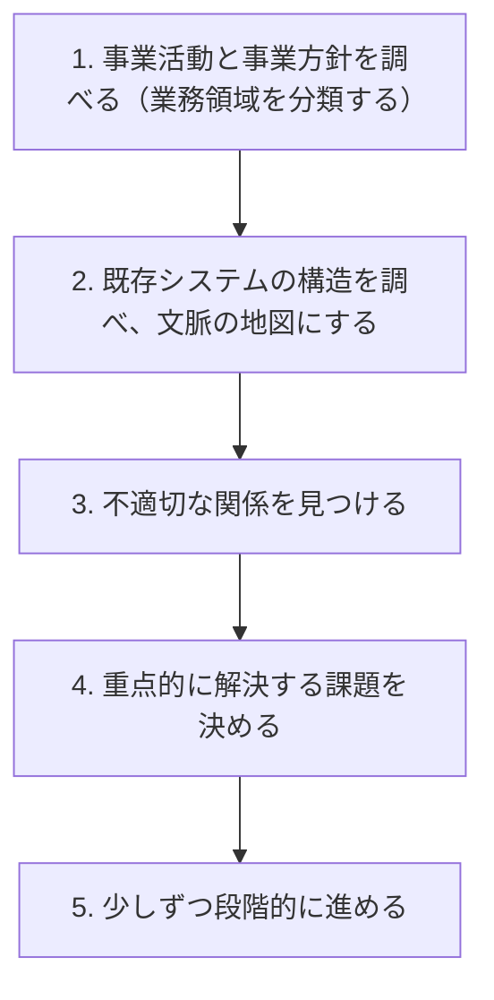
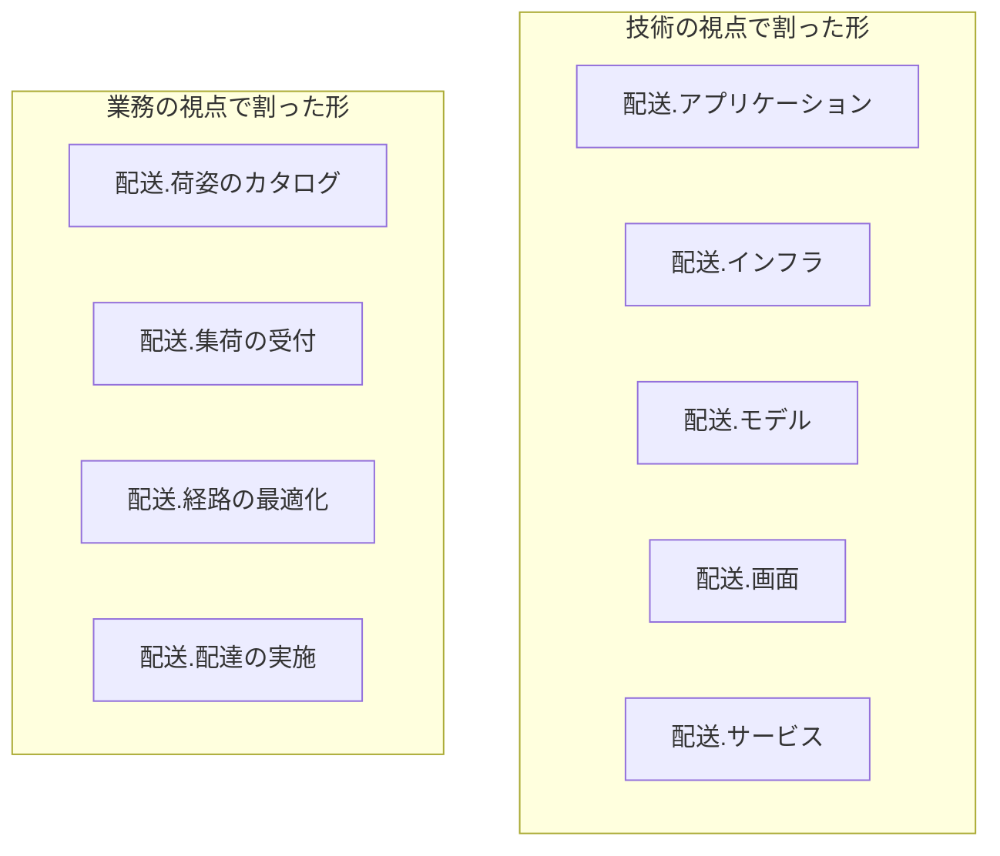
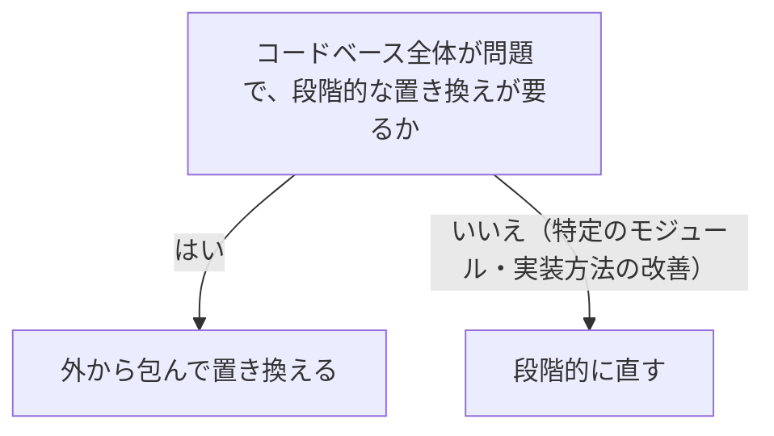
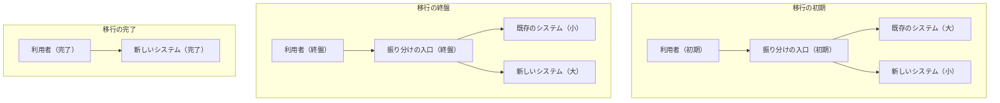
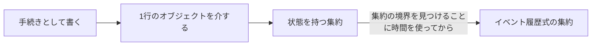

# 現場への導入を扱う概念：real-world-ddd

## 概要

### この概念が答える判断

- 既存システムに取り入れるとき、最初に何をするのか
- 中核の業務領域を、既存システムのどこから見つけるのか
- 外から包んで置き換えるのと、段階的に直すのは、どう選ぶのか
- 実装方法を移していく順序で、飛ばしてはいけない段はどこか
- 周囲をどう説得するのか

すでに稼働しているシステムへ、ドメイン駆動設計をどう持ち込むか。全部やるか、やらないかではない。事業活動を理解し、いまの構造を文脈の地図にし、大きな絵を描いたうえで小さく始める。外から包んで置き換えるか、段階的に直すかを選び、権威ではなく理由で周囲を説得する。

---

## 出典・根拠の透明性

『ドメイン駆動設計をはじめよう』第13章の書き起こしを、粒度を保ったまま構造へ移したもの。見出しそれぞれにノードを1つ対応させ、書き起こし版で図として書かれていたものは図として持たせ、文章で述べられていた移行の順序と最初の5段も図として起こしている。

### 留保事項

モジュール構成の例は、著作権への配慮から架空の業務（配送）へ置き換えた。示している構造——技術の視点で割った形から業務の視点で割った形への組み替え——は保っている。植物の生態にちなんだ移行方式の呼び名は、その方式が何をするかの説明（外から包んで置き換える）に言い換えている。

---

## 関連概念

| 関連概念 | 関係 |
|---|---|
| subdomain | 業務領域の分類（中核・一般・補完）の特定 |
| bounded-context | 区切られた文脈の設計と、物理的な境界への変換 |
| context-integration | 連係方法の見直し先 |
| event-storming | 失われた業務知識を取り戻す手段 |
| evolving-design | 実装方法を移していく手順の詳細 |
| design-heuristics | 実装方法と技術方式を選ぶ経験則 |

---

## 現場への導入

### 全部やるか、やらないかではない

ドメイン駆動設計の適用は二者択一ではない。すべての技法を習得して実践することはおそらく不可能だが、すべてを取り入れなくても価値は生まれる。そもそも「ソフトウェアの設計判断を事業活動で駆動すること」がドメイン駆動設計であって、集約や値オブジェクトを実装することがそれではない。最も効果を発揮するのは、すでに稼働しているソフトウェアに取り組んだ場合である——事業への貢献が実証されていて、積み重なった負債と膨れ上がった設計の乱雑さを刷新する必要があるシステムこそ、取り組む価値がもっとも高い。

### 最初にやる2つのこと

事業活動を理解することと、システムの構造がいまどうなっているかを理解すること。この順序を逆にしない。

既存システムへ取り入れるときの、最初の5つの段を示す

事業を調べ、いまの構造を地図にし、問題を見つけ、どこから手をつけるかを決めてから動く。

| どこの話か | 図に載せきれないこと |
|---|---|
| 1. 事業活動と事業方針を調べる（業務領域を分類する） | コードから始めないのがこの並びの要点である。先にコードを読むと、いま入り組んでいる場所が重要な場所に見えてしまう。 |
| 5. 少しずつ段階的に進める | 大きな絵を描いて、小さく始める。4までで全体像を持ったうえで着手するので、小さく始めることと行き当たりばったりは別のことになる。 |

#### 事業活動を理解する

自社の事業とは何かを、4つの問いで特定する——事業活動を展開している領域はどこか、顧客は誰か、顧客に提供しているサービスや価値は何か、競合している企業や製品は何か。よい手がかりは自社の組織図で、存続し発展していくためにそれぞれの部門がどう協力しているかを分析する。

##### 中核の業務領域を見つける

競合とどうやって差別化しているかを探すと明らかになる——競合が持っていない独自のノウハウ（自社で作った手順や、権利として守られているもの）があるか。技術とは別の領域での優位性（優秀な人を採用する力、独創的な設計を生み出す力など）があるか。もう1つ、ありがたくない強力な経験則がある——大きな泥団子がある場所。システムでもっとも入り組んだ設計になっている場所は、中核の業務領域である可能性が高い。この部分の全面的な書き換えは大きな事業上の危険を伴い、既製品や外部サービスへの置き換えもできない。

##### 一般的な業務領域を見つける

既製品・外部サービス・公開されているソフトウェアを探す。競合も同じものを使える業務領域で、他社が同じものを導入しても自社の不利益にならない。

##### 補完の業務領域を見つける

既製品や外部サービスに置き換えられないが、競争優位を直接生み出すこともない部品を探す。ソースコードが粗削りのままでも大きな問題にならない部分にあたる——変更の機会が少なく、技術者が関心を持つこともほとんどない。すべてを洗い出す必要は無く、いま取り組んでいるシステムにもっとも関係するものに絞る。

#### 既存システムの構造を調べる

業務領域が分かったら、いまのシステムがどんな解決方法を選び、どんな設計判断をしてきたかを調べる。注目するのは、それぞれの部分の一生の違いである——1つの置き場にまとめられた巨大なコードでも、他と切り離して直し・広げ・確かめ・配置できそうな部分が無いかを確かめる。

##### 実装方法を確認する

部品ごとに、どんな業務領域が含まれているか、業務ロジックの実装方法に何を選んでいるか、技術方式に何を選んでいるかを見る。そのうえで問う——いまの実装方法は、解く課題の複雑さと合っているか。設計を洗練させるべき場所は無いか。手を抜いたり既製のものを使ったりできそうな業務領域があるか。

##### 設計の基本方針を評価する

全体を俯瞰して得た知識で、既存の部品を区切られた文脈のように扱い、いまの構造を文脈の地図として描く。連係方法の分類を使って、部品どうしのつながり方を特定して追いかける。そのうえで、5つの不適切な関係が無いかを確かめる。

文脈の地図から探す、5つの不適切な関係を並べる

どれも、境界の引き方かチームの持ち方に問題があることの現れである。

| 見つけるもの | 何を意味するか |
|---|---|
| 同じ部品に複数のチームが関わっている | 1つの文脈は1つのチームが持つ、という原則が崩れている |
| 中核の業務領域の実装が重複している | 中核をもっとも効率よく実装するという事業戦略にそむいている |
| 中核の業務領域の開発を外部に依存している | 競争力の源を自分たちで持てていない |
| 連係がうまくいかず、摩擦が起きている | 想定した協力関係が実際には成り立っていない |
| 外部サービスや既存システムに引きずられた、ぎこちないモデルになっている | モデル変換装置を置くべきところに置いていない |

### 大きな絵を描いて、小さく始める

システム全体を一から書き直してすべてをきれいにする、という試みが成功することはほとんどない。経営の側がそうした技術視点の再構築を支持することも、まずありえない。安全なやり方は、大きな絵を描いたうえで小さく始め、どこを重点的に改善するかを戦略的に判断することである。まずは論理的な境界——名前の空間・モジュール・パッケージ——を業務領域の境界に対応させるところから始める。本格的な区切られた文脈（物理的な境界）である必要は無い。

モジュールの区切り方を、技術の視点から業務の視点へ組み替えることを示す

同じコードを、層ごとに割る形から業務領域ごとに割る形へ並べ替える。境界の位置が変わるだけで、業務ロジックそのものは変えない。

| どこの話か | 図に載せきれないこと |
|---|---|
| 技術の視点で割った形 | この形が誤りだと言っているのではない。層で割ること自体は正しいが、業務領域の境界と対応していないと、1つの業務の変更がすべての箱にまたがることになる。 |
| 業務の視点で割った形 | 箱の数が減っているのは偶然で、増えることもある。数ではなく、1つの業務領域の変更が1つの箱に収まるかどうかが要点である。 |
| この組み替え全体 | 本格的な区切られた文脈（物理的な境界）である必要は無い。名前の空間やモジュールといった論理的な境界を、業務領域の境界に対応させるだけでよい。業務ロジックを変えないので、比較的安全に行える。ただし、動的な読み込みや型名の文字列による参照を壊さないよう注意する。 |

#### 論理の境界を物理の境界へ変えるとき

大きな価値を生む場所を探す手がかりが2つある——1つのコードベースを複数のチームが変更しているなら、チームごとに区切られた文脈を定義し、それぞれの開発の一生を切り離す。競合するモデルが別々の部品に使われているなら、そのモデルをそれぞれ別の区切られた文脈へ移す。最低限必要な境界が定まったら、文脈どうしの関係と連係方法を調べる。

連係の問題ごとに、どの方法へ変えるかを並べる

どれも、いまの関係が実際の協力の度合いと合っていないときの直し方である。

| 問題 | 変更先 |
|---|---|
| 良きパートナーを想定して設計したのに、協力関係が維持できていない | 使う側と供給する側の関係へ（従属する・モデル変換装置・共用サービス） |
| 既存システムのモデルが下流の部品に悪い影響を与えている | モデル変換装置を足して、区切られた文脈を守る |
| 部品の実装を変えると、多くの利用者に影響する | 共用サービスを作る（外へ公開する形と内部のモデルを切り離す） |
| 複数のチームが共通の機能に取り組んで摩擦が起きている（中核でない場合） | 互いに独立して開発する |

#### 実装方法の不一致を見つける

実装の水準でもっとも重要なのは、事業上の価値と実装方法の食い違いがひどい箇所を見つけることである。もっとも問題なのは、中核の業務領域の複雑な業務ロジックを手続きや1行のオブジェクトで実装している場合。中核は変わり続けるので、設計がまずいと変更がきわめてやっかいで危険になる。

### 同じ言葉を育てる

既存システムの設計改善を成功させる必要条件は、業務知識と適切なモデルの2つである。業務知識を得る近道はイベントストーミングで、失われた業務知識を取り戻す最良の道具にあたる。業務知識とモデルが手に入ったら、改善の進め方を選ぶ。

既存システムをどう改善するかを、範囲の広さで決める

コードベース全体が問題なら包んで置き換え、特定の箇所なら段階的に直す。

| どこの話か | 図に載せきれないこと |
|---|---|
| コードベース全体が問題で、段階的な置き換えが要るか | 「全体を一から書き直す」という第3の選択肢は、この図に描いていない。描き忘れではなく、ほとんど成功せず、経営の側の支持も得られないためである。 |
| 外から包んで置き換える／段階的に直す | どちらを選んでも、その前に業務知識と適切なモデルが要る。この2つが無いまま着手すると、置き換えても直しても同じ形が再生産される。 |

#### 外から包んで置き換える

既存のシステムを外から包み、少しずつ機能を移していく形。手順は4つ——新しい要求を実装するための区切られた文脈を、包む側として足す。既存の側は、急を要する修正を除いて機能の修正と拡張を止める。既存のすべての機能を新しい側へ移す。最後に、既存のコードベースは役目を終える。

既存のシステムを、外から包んで少しずつ置き換えていく形を示す

入口を1つ用意して振り分け、新しい側を育てながら古い側を細らせる。最後に入口ごと取り除く。

| どこの話か | 図に載せきれないこと |
|---|---|
| 振り分けの入口（初期） | 外へ公開する窓口として働く薄い層で、要求を既存の側か新しい側かへ振り分ける。移行が終わったら取り除く。恒久的な部品ではない。 |
| 既存のシステム（大）／既存のシステム（小） | 大きさが変わっているのは、機能が移っていくためである。既存の側では、急を要する修正を除いて機能の修正も拡張も止める。止めないと、新しい側が追いつけない。 |
| 移行の完了 | 入口が消えている。これが移行の終わりの目印になる。 |
| この図に描いていないこと | データベースをどちらが持つかは描いていない。この移行のあいだは「1つの区切られた文脈に1つのデータベース」の原則を一時的に曲げ、両者で共有してよい——連係を複雑にしないためである。移行後は新しい側が専有する。 |

#### 段階的に直す

全面的に書き換えるより、小さな変更を積み重ねるほうが安全である。始めどころは値オブジェクトの候補を見つけるところ——状態が変わらないオブジェクトを導入するだけでも、複雑さはかなり減る。そこから対象の業務ロジックを集め、ひと塊の変更の境界を詳しく調べる——技術の視点ではなく業務の視点で。業務の視点でその必要性を徹底的に分析して、はじめて集約の境界を設計できる。

実装方法を移していく順序と、飛ばしてはいけない段を示す

左から順に移る。手続きから直接イベント履歴式へ飛ぶ経路は、意図的に描いていない。

| どこの話か | 図に載せきれないこと |
|---|---|
| 状態を持つ集約 | ここを飛ばしてはいけない。手続きや1行のオブジェクトから直接イベント履歴式へ移ると、誤ったトランザクション境界をそのまま持ち込むことになる。いったんここで止まり、集約の境界を確かめる。 |
| 状態を持つ集約からイベント履歴式の集約 | この矢印には時間がかかる、という意味が込められている。移ること自体より、その前に集約の境界を見つけることに時間を使う。 |
| この並び全体 | 全面的に書き換えるのではなく、小さな変更を積み重ねる。始めどころは値オブジェクトの候補を見つけるところで、状態が変わらないオブジェクトを導入するだけでも複雑さはかなり減る。 |

##### 守りの仕組みを置く

既存システムを直すときは、モデル変換装置で新しいコードを古いモデルから守り、共用サービスを作って外向けの言葉を提供する。こうしておくと、上流の変更が下流に及ばない。

### 道具として位置づける

「売り込む」という考え方より、技術者が使う道具の1つとして位置づけるほうがよい。組織の戦略として取り入れる必要は無い。大切なのは事業活動の要求にもとづいた設計判断であって、すべての道具を使うことではない。実装の水準の設計のやり方が個別の状況で役に立たないなら、それでよい。

#### 同じ言葉から始める

事業活動について関係者が口にする言葉をしっかり聞き取る。技術者だけに通じる言い回しを避け、業務として意味が通る言葉を使う。使い方が一貫しない用語を見つけたら、質問して理由を探る——複数のモデルが混ざっている合図である。業務エキスパートとできるだけたくさん会話する。正式な会議だけでなく、給湯室や休憩の時間も機会になる。そしてもっとも重要なのは、ソースコードを同じ言葉で書くことである。

#### 区切られた文脈の背景にある原則にこだわる

3つの問いに答えられるようにしておく。あらゆるユースケースを1つのモデルで表すより、課題ごとに複数のモデルを作るのはなぜか——「何でもできる」は実際には何の役にも立たないから。1つの区切られた文脈の中に複数のモデルを作らないのはなぜか——異なるモデルが混ざると頭にかかる負荷が増え、ソフトウェアが不必要に複雑になるから。同じコードベースを複数のチームで開発するのがよくないのはなぜか——チーム間の関係がぎくしゃくし、仕事が進まなくなるから。

#### 権威ではなく理由で説得する

「本にそう書いてあるから」という説得は機能しない。それぞれの設計判断について、論理的な理由を説明する。

設計の決まりごとを、権威ではなく理由で説明する言い方を並べる

左の問いに右の理由で答える。「本にそう書いてあるから」は説得にならない。

| 問い | 理由 |
|---|---|
| トランザクション境界を明確にするのはなぜか | データの一貫性を保つため |
| 2つ以上の集約を同時に変更してはいけないのはなぜか | 一貫性を保つ境界を正しく定義できていることを保証するため |
| 集約の内部の状態を外から直接変えてはいけないのはなぜか | 関係する業務ロジックを1か所に集め、重複させないため |
| 集約の処理の一部をデータベース側へ移してはいけないのはなぜか | 記述を重複させないため。物理的にも論理的にも離れた場所に同じ処理があると、実装に差が生まれ、データの食い違いの原因になる |
| 集約をできるだけ小さく保つのはなぜか | ひと塊の変更の単位を大きくすると、集約が不必要に複雑になり、性能も落ちるため |
| 監査の記録に記録のファイルを使ってはいけないのはなぜか | 長い目で見ると、ファイルではデータの一貫性を保証できないため |

#### イベント履歴式の利点は業務エキスパートに響く

業務エキスパートとの会話で、状態を保存する形と履歴を保存する形の2種類があることを伝え、それぞれの利点を説明する。とくに時間軸に沿ったモデルの利点を説明するとよい。たいていの場合、業務エキスパートはそこから得られる洞察の深さを気に入り、同僚へ積極的に勧めてくれるようになる。業務エキスパートと話すときは、同じ言葉を使うことを絶対に忘れない。

### アンチパターン

現場へ持ち込むときによく起きる誤り。

#### 全部やるか、やらないかで考える

すべての技法を使うことがドメイン駆動設計であり、一部だけ使うのは違う、というとらえ方は誤りである。適切な道具を選んで使う。

#### 全面的に書き直す

システム全体を一から書き直す試みが成功することはほとんどない。経営の側の支持も得られない。期待できる事業上の価値より、失敗の危険が上回る。

#### 1行のオブジェクトから直接イベント履歴式へ移る

誤ったトランザクション境界を持ち込む危険がある。いったん状態を持つ集約へ移り、境界を確立してからイベント履歴式へ移る。

#### 権威に訴えて導入しようとする

「本にそう書いてあるから」という説得のしかたは機能しない。それぞれの設計判断の論理的な理由を説明する。
