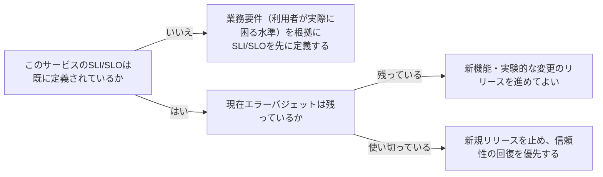

# 信頼性目標とエラーバジェットの設定を扱う概念：reliability-targets-and-error-budgets

## 概要

### この概念が答える判断

- サービスの可用性目標は何を根拠に決めるべきか？
- 100%の可用性を目指すべきか？
- リリース頻度と信頼性、どちらを優先すべきか判断に迷うときはどうするか？

SLI（サービスレベル指標）・SLO（サービスレベル目標）・エラーバジェット（許容できる障害の予算）とは、可用性・信頼性を感覚ではなく数値目標として定義し、その目標に対する余裕（バジェット）を使い切ったかどうかで意思決定するための枠組みである。

---

## 原則

- 可用性は100%を目指すべきではない——完璧な信頼性を追求するコストは、利用者が実際に体感できる差を上回ることが多く、投資対効果が悪化する。
- まずSLI（何を測るか、例: リクエスト成功率）を定め、次にSLO（その指標がどの水準を満たすべきか、例: 99.9%）を設定する。
- SLOと100%の差（例: 0.1%）が「エラーバジェット」であり、これは許容される障害の予算として扱う。
- エラーバジェットが残っている間は新機能のリリース・実験的な変更を積極的に進めてよく、エラーバジェットを使い切った場合は新規リリースを止めて信頼性の回復を優先する、という判断基準に変換できる。
- SLOは業務要件（どれだけの信頼性が事業上必要か）を反映すべきであり、技術的に達成可能な最大値をそのまま目標にしない。

---

## 分類

| 分類 | 特徴 |
|---|---|
| SLI (Service Level Indicator) | 実際に測定する指標そのもの（例: リクエスト成功率・レイテンシ） |
| SLO (Service Level Objective) | SLIが満たすべき目標水準（例: 99.9%） |
| エラーバジェット | SLOと100%の差。許容される障害の予算として扱う |

---

## 判断基準

---

## 実例

架空の物流プラットフォーム「ShipFast」の配送状況APIで、当初「可用性99.99%」という技術的に達成可能な最大値がそのまま目標にされていたが、実際に利用者が困るのは「配送状況が1分以上更新されない」場合であり、業務要件に即してSLIを「配送状況更新の反映遅延」、SLOを「95%のリクエストで30秒以内に反映」と再定義した。ある月にエラーバジェットの大半を消費したため、その月の残り期間は新機能リリースを凍結し、原因調査と信頼性改善を優先した。

---

## アンチパターン

| アンチパターン | 問題点 |
|---|---|
| 可用性目標を100%に設定する | 達成不可能かつコストに見合わない。わずかな信頼性向上のために開発速度を犠牲にする |
| 技術的に達成可能な最大値をそのままSLOにする | 業務要件を反映しておらず、利用者が実際に困る水準と乖離した目標になりやすい |
| エラーバジェットを使い切っても新機能リリースを止めない | 信頼性の低下が続き、利用者の信頼を損なう |

---

## 出典・根拠の透明性

GoogleのSite Reliability Engineering（SRE）が確立したSLI/SLO/エラーバジェットの概念をAIが要約・再構成したものであり、本文の直接引用ではない。広く確立されたSRE実務知見として扱う。

---

## 関連概念

現時点でこの概念に直接関連付けるKnowledge documentは無い。
