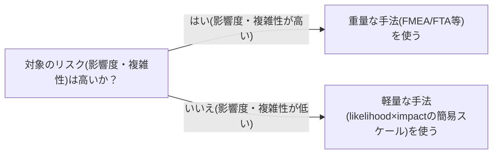

# リスクベースのテスト工数配分を扱う概念：risk-based-testing

## 概要

### この概念が答える判断

- 限られたテスト工数を、どの機能・領域に優先配分すべきか？
- 高リスクな箇所とそうでない箇所で、テストの厚みをどう変えるべきか？

ソフトウェアが持つリスク(未検出のバグがシステム利用者に悪影響を及ぼす確率)を、テスト計画・設計・実装・実行・評価という全フェーズの意思決定を導く指針とするアプローチ。

---

## 原則

- リスクベーステスト(RBT)は、プロジェクトの初期段階からプロダクトリスクの水準を低減し、その状況をステークホルダーに伝えるためのアプローチであり、核となる要素はリスクの識別とリスクレベルの活用である。
- 評価手法には、発生可能性(likelihood)と影響度(impact)の2軸を簡易スケール(高・中・低等)で評価する軽量な手法と、FMEA(故障モード影響解析)・FTA(故障の木解析)・QFD等の重量な技法がある。
- リスクが高いと判定された領域には、より厚く・より早い段階でテストリソースを配分する。

---

## 分類

| 分類 | 特徴 |
|---|---|
| 軽量な手法 | 発生可能性(likelihood)と影響度(impact)を高中低等の簡易スケールで評価する |
| 重量な手法 | FMEA(故障モード影響解析)・FTA(故障の木解析)・QFD等の体系的な技法を用いる |

---

## 判断基準

---

## 実例

例えば決済機能のリスク評価では、影響度(金銭的損失・信頼失墜)が高いため、FMEAのような重量な手法で網羅的に故障モードを洗い出す。一方、UIの表示崩れのような軽微な不具合は、発生可能性×影響度を高中低で簡易評価するだけで十分であり、テストの厚みをそこに合わせて調整する。

---

## アンチパターン

| アンチパターン | 問題点 |
|---|---|
| 全機能に均等にテスト工数を配分する | 高リスク領域のテストが薄くなり、低リスク領域に工数を浪費する。限られたテスト工数はリスクに応じて傾斜配分すべき |

---

## 出典・根拠の透明性

Felderer & Schieferdecker(2014年、Software Tools for Technology Transfer誌掲載の査読論文)およびISTQB glossaryにおける定義に基づく。

### 留保事項

『リスク=発生確率×影響度』という単純な掛け算による定量化については、確立された唯一の合意とまでは言えず、軽量・重量それぞれの評価手法が併存している点に留意。

---

## 関連概念

| 関連概念 | 関係 |
|---|---|
| boundary-value-analysis-equivalence-partitioning | 境界値分析は『どこを狙うか』の技法、リスクベーステストは『どこに力を注ぐか』の戦略。粒度が異なる |
