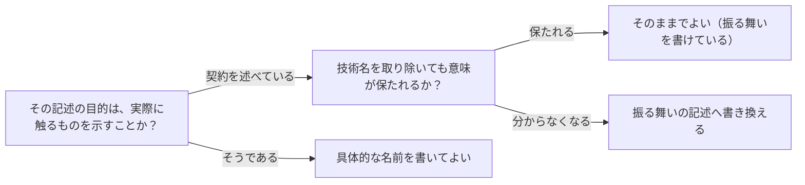

# 仕様は振る舞いを書き実装手段を書かない原則を扱う概念：spec-describes-behavior-not-implementation

## 概要

### この概念が答える判断

- 仕様書に具体的な技術名を書いてよいか
- 実装が変わったとき、仕様書のどこを直すべきか
- 抽象的に書けているかをどう判定するか
- 実装手段を書いてよい箇所はどこか
- 仕様書がすぐ古くなるのはなぜか

仕様を記述する文書において、外から観測できる振る舞い・契約と、それを実現する実装手段を書き分ける考え方。どちらをどこに書くかを定め、実装が変わっても仕様が古びない状態を保つ。

---

## 原則

- 契約に面する記述は振る舞いだけを書く: 何を渡すと何が起きるか、どの条件で許可し何を拒否するかを、外から観測できる事実として書く。それを実現している手段の名前は書かない。手段が変わっても振る舞いが同じなら、その記述は正しいままである。
- 実装手段を書いてよい箇所を限定する: 実際に触るもの・作るものを説明することが目的の箇所（作業の見通し、影響範囲、構成要素の一覧）では、具体的な名前を書いてよい。むしろ書かないと役に立たない。禁じるのは、契約を述べる箇所に手段が混じることである。
- 古びる速さが違うものを混ぜない: 振る舞いは合意が変わるまで変わらないが、実装手段は都合で変わる。同じ段落に混在させると、手段が変わるたびに仕様のどこが古いのかを判別できなくなり、結果として文書全体が信用されなくなる。
- 抽象化の度合いは削除で試す: その記述から技術名を取り除いて、意味が保たれるかを確かめる。取り除くと何を言っているか分からなくなるなら、それは振る舞いではなく手段を書いていた証拠である。
- 曖昧にすることではない: 手段を書かないことと、内容を薄くすることは違う。むしろ条件・境界・失敗時の扱いは具体的に書く。避けるのは実現手段の固有名詞であって、具体性そのものではない。

---

## 分類

| 分類 | 特徴 |
|---|---|
| 契約に面する記述 | 外部と約束している内容。入出力、許可と拒否の条件、状態の変化、失敗時の扱い。振る舞いだけで書く。 |
| 実現に面する記述 | 実際に触るもの・作るものの説明。作業の見通し、影響範囲、構成要素の一覧。具体的な名前を書いてよい。 |

---

## 判断基準

---

## 実例

ある投稿機能の仕様書に、次の記述があったとする。「投稿された内容は、分散ストレージへ非同期に書き込まれ、一覧取得は別系統の索引から行われるため、反映まで数秒かかる」。ここから技術に関する語を取り除くと「投稿は反映まで数秒かかる」しか残らず、なぜそうなるのかも、利用者にどう案内すべきかも消える。書いていたのは仕組みであって、約束ではなかった。

同じことを振る舞いとして書くとこうなる。「投稿は受け付けられた時点で成功として返るが、一覧への反映は即時ではない。数秒から数十秒の遅れが生じうるため、利用者へは『少し待って再読み込み』と案内し、『即時に反映される』とは案内しない」。ここには、いつ成功と見なすか、どの程度の遅れを許容範囲とするか、利用者に何と伝えるかという約束だけがある。ストレージを別のものに入れ替えても、この記述は正しいままである。

一方、同じ文書の「影響範囲」の節には「投稿を受け付ける関門と、一覧を組み立てる処理の2箇所を変更する」と書いてよい。ここは何を触るかを示すことが目的であり、名前を伏せると誰も作業を見積もれない。

---

## アンチパターン

| アンチパターン | 問題点 |
|---|---|
| 契約の説明への実装名の混入 | 振る舞いを述べるべき箇所に具体的な製品名・関数名・サービス名が混ざり、実装を差し替えるたびに仕様の記述が誤りになる。どこを直せば済むのかも判別できなくなる。 |
| 抽象化と曖昧化の取り違え | 手段を書かない代わりに条件や境界まで省いてしまい、何を約束しているのか分からない文書になる。実装者が判断できず、結局コードを読みに行くことになる。 |
| 実現に面する箇所での過剰な抽象化 | 作業の見通しや影響範囲まで抽象的に書いてしまい、何を触るのか誰にも分からなくなる。見積もりも引き継ぎもできない。 |
| 自己申告による抽象化の判定 | 書き手が「抽象的に書けている」と判断したまま検査しないため、手段が残っていることに気づかない。削除して意味が保たれるかを実際に確かめない限り、混入は見つからない。 |

---

## 出典・根拠の透明性

特定の文献に基づくものではなく、機能の仕様を記述した文書を検証する過程で、契約を述べる節に実装手段が混入していた事例から一般化したもの。要約ではなく再構成である。仕様と実装を分けるという考え方自体は古くからあるが、本概念は「どの節では手段を書いてよいか」という書き分けと、削除による判定という検査手続きを併せて定める点に主眼がある。

### 留保事項

削除による判定は、明らかな固有名詞の混入には有効だが、抽象度の中間にある語（たとえば分野の一般的な用語であり、かつ特定の実装を強く示唆する語）をどう扱うかまでは定式化できていない。また、どこまで抽象化すると読み手が理解できなくなるかという下限は、文書の読み手によって変わるため、一律の基準を置いていない。

---

## 関連概念

| 関連概念 | 関係 |
|---|---|
| document-two-layer-structure | 掴む層と確かめる層のどちらにも適用される原則であり、特に契約を述べる節でこの書き分けが効く |
