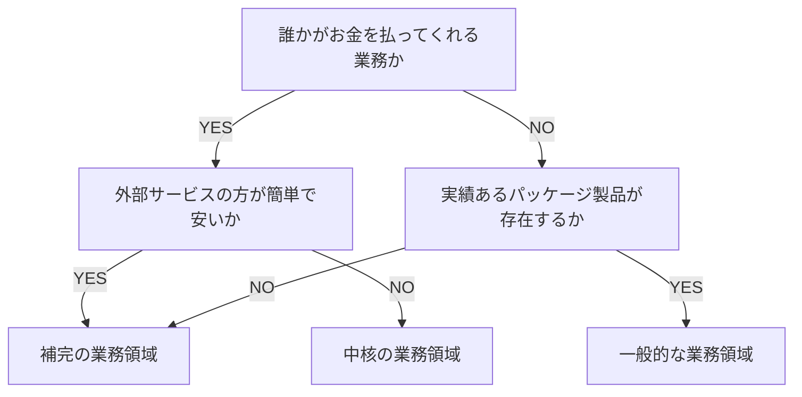
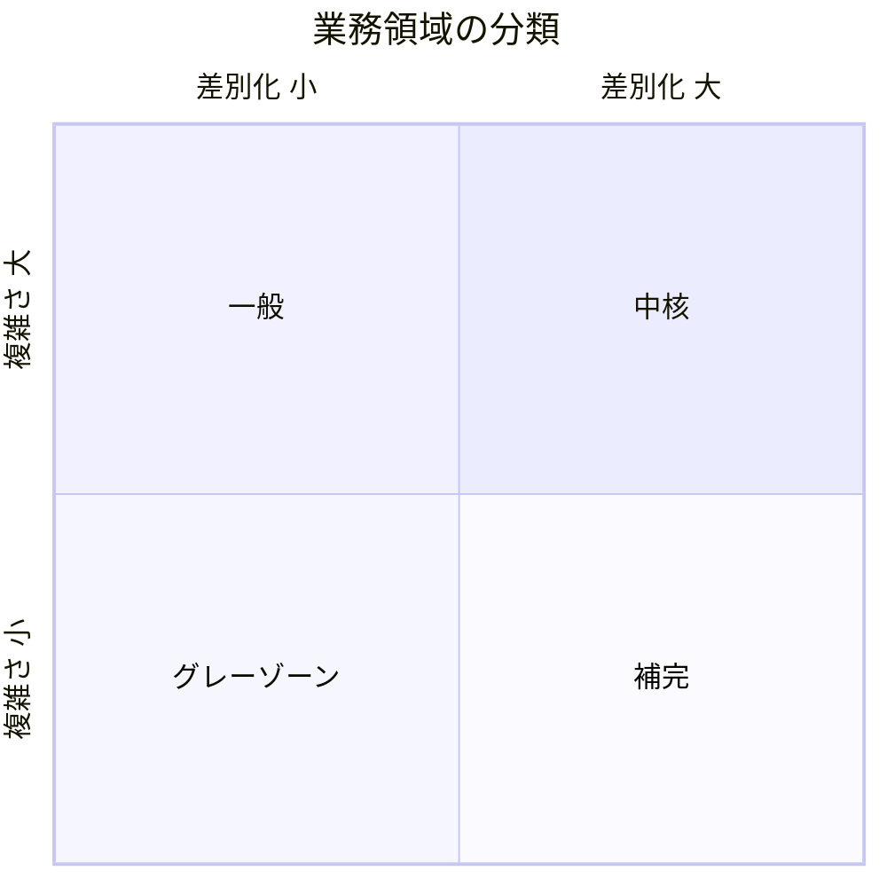
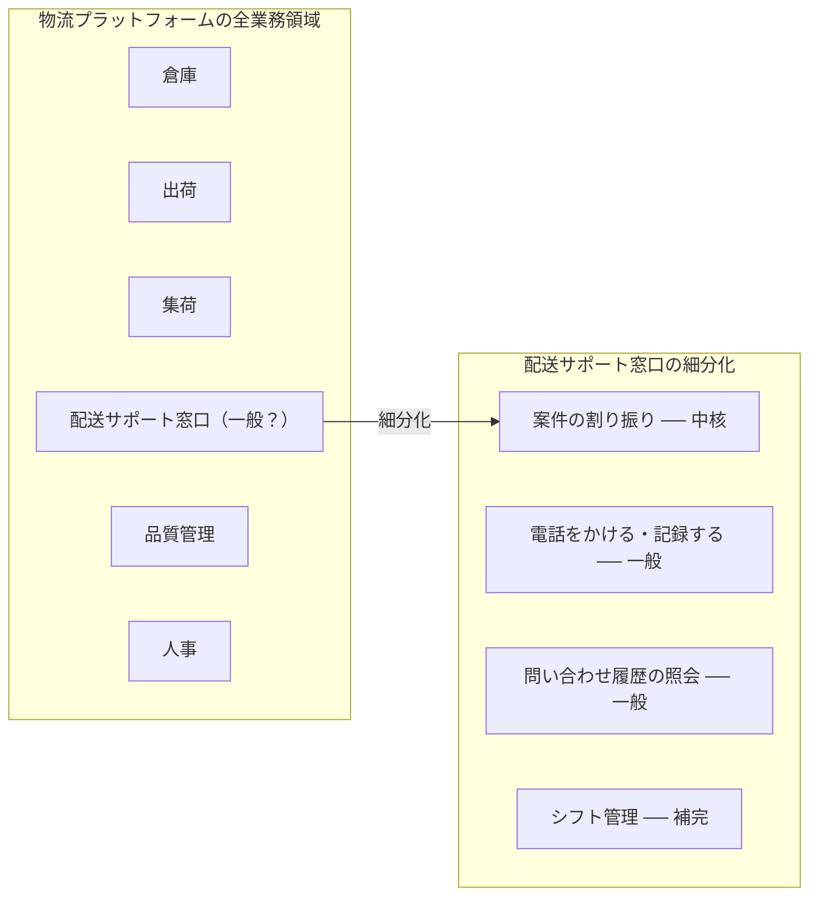
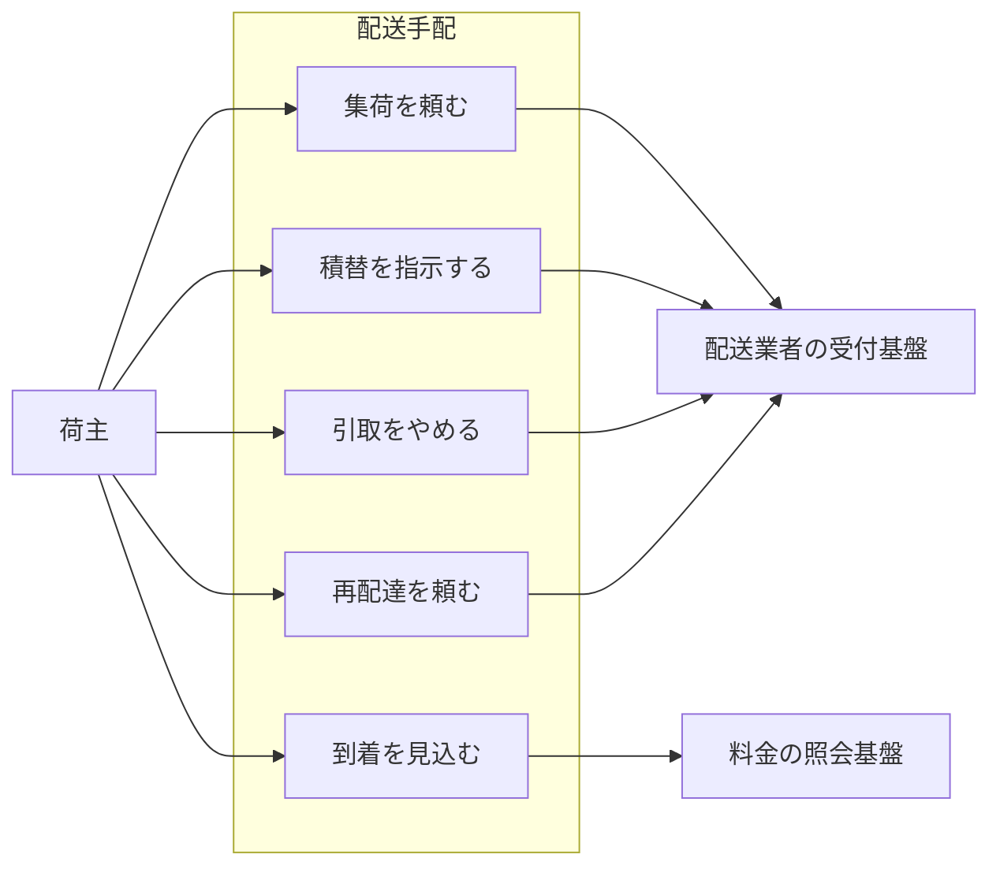
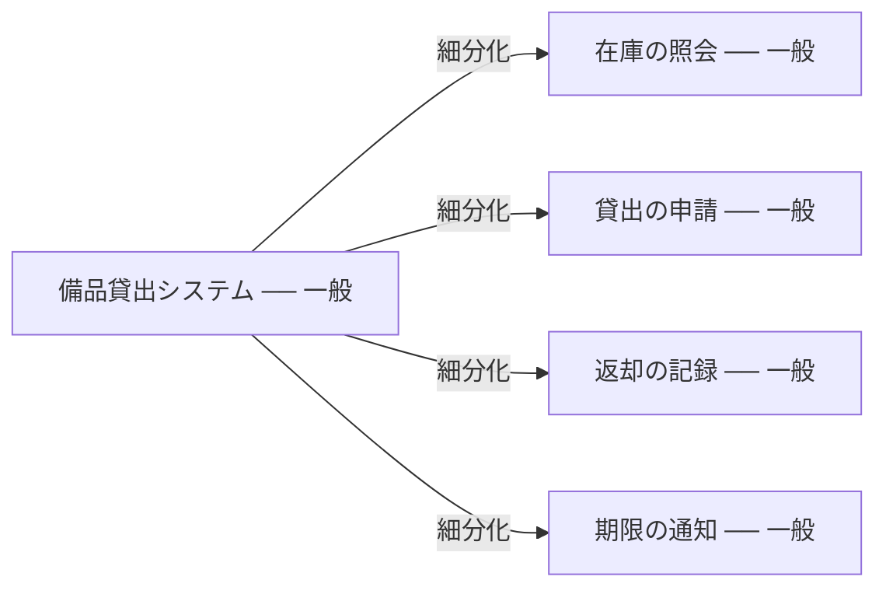

# サブドメインの概念そのものを扱う：subdomain

## 概要

### この概念が答える判断

- この業務活動は自社で作り込むべきか、既製品やパッケージに任せてよいか
- この業務活動は競合他社との差別化に直結しているか
- サブドメインの分類は、粒度をどこまで細かくすれば見えてくるのか
- 業務領域の境界は、何を手がかりに見つけるのか
- 分類の見直しは、いつ・何をきっかけに起きるか

企業の事業活動を中核・一般・補完に分類し、どの業務活動を自社で作り込み、どれを既製品やパッケージに任せるべきかを判断するための投資判断の道具。

---

## 出典・根拠の透明性

『ドメイン駆動設計をはじめよう』第1章の書き起こしを、粒度を保ったまま構造へ移したもの。見出し16件それぞれにノードを1つ対応させている。

### 留保事項

書籍固有の実例（特定業界の企業例）は著作権への配慮から教材用の架空ドメイン（物流プラットフォーム・オンライン学習サービス・社内の備品貸出）へ置き換えている。ただし図が示す関係の構造は原文のまま保っている——置き換えて構造まで崩すと、示していたことが消えるため。

---

## 関連概念

| 関連概念 | 関係 |
|---|---|
| business-domain | サブドメインを含む事業全体の領域 |
| bounded-context | サブドメインをソフトウェアとして実装する境界 |
| evolving-design | サブドメインのカテゴリーは変化する（中核→一般など） |

---

## 業務領域（サブドメイン）

### 業務領域（サブドメイン）とは

企業の事業活動全体を細分化した個々の業務活動の単位。すべての業務領域が連動することで顧客へのサービス提供活動が成り立つ。

### 3つの分類

業務領域は中核・一般・補完の3つに分類される。

#### 中核の業務領域（Core）

競合他社との差別化を生み出す業務活動。他社がまねできない独自製品・サービス・業務プロセスの最適化が対象で、必然的に複雑になる（単純なら競合がすぐ追いつける）。継続的な革新・進化が必要で「完了」がない。社内開発必須で、外部委託・パッケージ利用は戦略的リスク。

#### 一般的な業務領域（Generic）

どの企業も同じやり方で解決する業務活動。競争優位を生まないが事業運営に不可欠。業務知識の観点では「わからないことがわかっている」領域。実績あるパッケージ製品・クラウドサービスで賄え、自社開発より既製品の活用が費用対効果で優れる。

#### 補完的な業務領域（Supporting）

事業活動を支えるが、競争優位を生まない業務活動。業務ロジックが単純（基本的に CRUD・ETL 操作）で、他社も同じことを簡単にできる。社内開発でもよいが外部委託も有力な選択肢で、成長途上の若手技術者の育成の場として活用できる。

### 判断基準

3つのステップで分類を決める。

業務領域を中核・一般・補完のどれに分類するかを、順に問うて決める

まず「誰かがお金を払ってくれる業務か」を問い、YES なら次に「外部サービスを導入するより自分たちで作った方が簡単で安いか」を問う。ここで YES なら補完、NO なら中核。最初の問いが NO なら「実績あるパッケージ製品・クラウドサービスが存在するか」を問い、YES なら一般、NO なら補完。



| から | へ | 関係 |
|---|---|---|
| 誰かがお金を払ってくれる業務か | 外部サービスの方が簡単で安いか | YES |
| 誰かがお金を払ってくれる業務か | 実績あるパッケージ製品が存在するか | NO |
| 外部サービスの方が簡単で安いか | 補完の業務領域 | YES |
| 外部サービスの方が簡単で安いか | 中核の業務領域 | NO |
| 実績あるパッケージ製品が存在するか | 一般的な業務領域 | YES |
| 実績あるパッケージ製品が存在するか | 補完の業務領域 | NO |

#### ソースコードから判断する場合

「そのプログラムはデータ入力の CRUD 画面の集まりか」── YES ならおそらく補完的な業務領域。NO（複雑なアルゴリズム・業務ルール・制約条件がある）なら、典型的な中核の業務領域。

### 分類マトリクス

2軸で業務領域のカテゴリーが決まる。左下のグレーゾーンはパッケージ製品の有無で一般か補完かが決まる。

差別化の大小と業務ロジックの複雑さという2軸で、4つの分類が定まることを示す

差別化が大きく複雑さも高い象限が中核。差別化は小さいが複雑な象限が一般。差別化も複雑さも小さい象限はグレーゾーンで、実績あるパッケージ製品が存在すれば一般、しなければ補完になる。差別化が大きく複雑さが低い象限は補完。



### 比較表

3つの分類を観点ごとに並べたもの。

3つの分類を観点ごとに並べて対比する

中核だけが競争優位を生み、社内開発が必須。一般は複雑だが既製品で賄え、補完は単純で社内開発でも外部委託でもよい。複雑さでは中核と一般が同じで、分かれるのは競争優位を生むかどうか。

```markdown
| 観点 | 中核 | 一般 | 補完 |
|---|---|---|---|
| 競争優位 | ○ 生む | × 生まない | × 生まない |
| 複雑さ | 複雑 | 複雑 | 単純 |
| 変化の頻度 | 多い | 少ない | 少ない |
| 実装方針 | 社内開発必須 | 製品購入・外部サービス利用 | 社内または外部委託 |
| 課題の特徴 | 複雑で興味深い | 既存の解決策がある | 明確 |
```

### 具体例

実在の事業に当てはめた例と、判断を誤りやすい例。

#### 物流プラットフォーム

中核は配送ルートの最適化と集荷から配達までのリアルタイム追跡。一般は請求・会計処理と認証・認可。補完は配送先住所の形式検証と配達完了の記録。

#### オンライン学習サービス

中核は学習到達度に応じた出題の組み立てと、つまずきの検知。一般は動画配信・決済・認証と認可。補完は受講証明書の発行と学習時間の集計。

#### 粗い括りの細分化

ひとまとまりに見える業務をそのまま1つの分類に当てはめるのは粗い。細分化して初めてカテゴリーが見える。

ひとまとまりに見える業務を細分化すると、異なる分類が混在していることを示す

物流プラットフォームの全業務領域の中で「配送サポート窓口」は一見すると一般に見える。しかし細分化すると、案件の割り振りは中核、電話をかけて記録することと問い合わせ履歴の照会は一般、シフト管理は補完となり、3つの分類が同居している。



| から | へ | 関係 |
|---|---|---|
| 配送サポート窓口（一般？） | 案件の割り振り ── 中核 | 細分化 |

#### 業務領域の境界 = 強く関連するユースケースの集まり

業務領域はユースケースの集まりとして定義できる。同じアクター・同じ外部システムとつながり、密接に関係するデータを操作するユースケース群がひとつの業務領域を形成する。

業務領域の境界が、ユースケースの集まりとして見えることを示す

荷主という同じアクターから伸び、配送業者の受付基盤という同じ外部システムにつながる4つのユースケース（集荷を頼む・積替を指示する・引取をやめる・再配達を頼む）が、ひとつの業務領域「配送手配」を形成している。一方、到着を見込むは料金の照会基盤へつながり、別の集まりになる。



| から | へ | 関係 |
|---|---|---|
| 荷主 | 集荷を頼む |  |
| 荷主 | 積替を指示する |  |
| 荷主 | 到着を見込む |  |
| 荷主 | 引取をやめる |  |
| 荷主 | 再配達を頼む |  |
| 集荷を頼む | 配送業者の受付基盤 |  |
| 積替を指示する | 配送業者の受付基盤 |  |
| 引取をやめる | 配送業者の受付基盤 |  |
| 再配達を頼む | 配送業者の受付基盤 |  |
| 到着を見込む | 料金の照会基盤 |  |

#### 細分化しすぎの例

分割後のカテゴリーがすべて分割前と同じなら、その細分化は不要。

設計判断を何も変えない細分化があることを示す

一般に分類された社内の備品貸出システムを、在庫の照会・貸出の申請・返却の記録・期限の通知へ細分化しても、4つとも一般のままになる。分割の前後で分類が変わらないので、この細分化は設計判断を何も変えておらず不要。



| から | へ | 関係 |
|---|---|---|
| 備品貸出システム ── 一般 | 在庫の照会 ── 一般 | 細分化 |
| 備品貸出システム ── 一般 | 貸出の申請 ── 一般 | 細分化 |
| 備品貸出システム ── 一般 | 返却の記録 ── 一般 | 細分化 |
| 備品貸出システム ── 一般 | 期限の通知 ── 一般 | 細分化 |

### 細分化の焦点

業務領域を探す時はソフトウェアが関係しない業務機能を特定して除外することが役に立つ。ソフトウェアが関係しない業務を識別できれば、取り組んでいるソフトウェアシステムが対象とする業務領域に集中できる。

### 「コアドメイン」という別の呼び名

文献によって「コアドメイン」と呼ぶものと「コアサブドメイン」と呼ぶものがある。この knowledge では「中核の業務領域」で統一する。理由は2つ——(1) 議論しているのはサブドメインであり、ドメイン全体との混乱を避けたい。(2) 分類は変化するため、「中核の業務領域が一般の業務領域に変わった」のほうが意味が明確になる。

### アンチパターン

サブドメインの分類でよく起きる誤り。

#### 中核をパッケージに外注する

中核の業務領域のソフトウェア開発を外部委託すると、短期的には安く見えるが長期的には会社の存続に関わる問題を引き起こす。変更がやりにくく危険なコードベースになり、事業目標の達成を技術面で支援できなくなる。

#### 組織図でサブドメインを決める

部門名でサブドメインを決めると粗すぎる判断になる。業務の細部に重要な情報が隠れており、細分化してはじめて中核・補完・一般が見えてくる。

#### 細分化をやりすぎる

分割しても設計判断が変わらないなら、その分割は必要ない。「分割した後のカテゴリーがすべて分割前と同じ」なら意味がない細分化。
