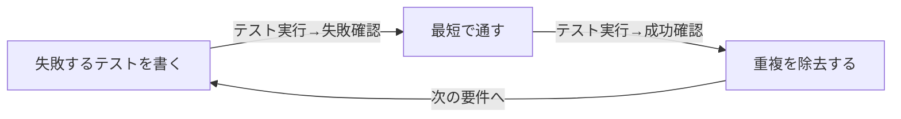

# テスト駆動開発（TDD）の原則を扱う概念：tdd

## 概要

### この概念が答える判断

- 新しいコードを書く前に何をすべきか？
- TDDのサイクルはどう回すべきか？
- 動くこと(works)ときれいなこと(clean)、どちらを先に優先すべきか？

新しいコードを書く前に、まず失敗する自動テストを書き、重複を排除しながら小さく前進する開発手法。Kent Beckが提唱した。

---

## 原則

- TDDの原典的なルールは2つだけ——『失敗する自動テストを書くまで新しいコードを書かない』『重複をすべて除去する』。
- この2ルールから、Red(失敗するテストを書く)→Green(汚くてもよいのでテストを通す)→Refactor(重複を除去する)という実行順序、通称『Red/Green/Refactorマントラ』が導かれる。
- 優先順位は明確で、まず動作すること(works)を最優先し、その後に品質(clean)を追求する。
- テストファーストは自己テスト可能なコードを保証するだけでなく、実装より先にインターフェース(呼び出し側からの見え方)を考えさせるという設計上の効果も持つ。

---

## 分類

| 分類 | 特徴 |
|---|---|
| Red | 失敗するテストを書く段階。まだ動く実装が無いことを確認する |
| Green | テストを通すことだけを目的に、汚くてもよいので最短で実装する段階 |
| Refactor | テストが通った状態を保ったまま、重複を除去し設計を整理する段階 |

---

## 判断基準

---

## 実例

「注文の合計金額を計算する」という要件があるとき、まず「商品2つで合計300円になる」ことを検証する失敗するテストを書く(Red)。次に、ハードコードでもよいので300を返すだけの実装でテストを通す(Green)。テストが通った状態を保ったまま、実際の計算ロジックへ置き換える(Refactor)。

---

## アンチパターン

| アンチパターン | 問題点 |
|---|---|
| テストを書かずに実装を先に書く | インターフェース設計が実装都合に引きずられ、テスト容易性が損なわれる。TDDの『実装より先にインターフェースを考えさせる』という設計上の効果を失う |
| Green段階できれいなコードを書こうとする | 『まず動く、その後きれいに』の優先順位が崩れ、動作確認前に設計に時間を使いすぎて手戻りのリスクが増える |

---

## 出典・根拠の透明性

Kent Beck『Test-Driven Development: By Example』(2002年前後)における原典の記述に基づく。TDD自体は1990年代後半、Kent BeckがExtreme Programmingの一部として考案した。

---

## 関連概念

| 関連概念 | 関係 |
|---|---|
| exploratory-testing | TDDは実装前のテスト設計、探索的テストは実装後の学習型テスト実行。両者は異なるフェーズ・目的を持つ |
