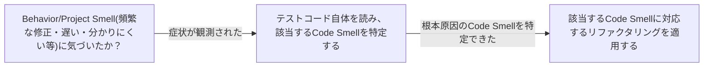

# テストコードの臭い（アンチパターン）を扱う概念：test-smells

## 概要

### この概念が答える判断

- テストコード自体に現れる問題をどう分類するか？
- テストの臭いを放置するとなぜ危険か？
- テストの臭いと、それが引き起こす症状はどう区別すべきか？

テストコードそのもの・テストの振る舞い・プロジェクト運用のいずれかの層に現れる、テストの保守性や信頼性を損なう兆候の総称。Gerard Meszarosが体系的にカタログ化した。

---

## 原則

- test smellsはCode Smells(テストコード自体に見える問題)・Behavior Smells(テストの振る舞いに見える問題)・Project Smells(プロジェクト管理者から見える問題)の3種に分類される。
- Code SmellsはしばしばBehavior SmellsやProject Smellsの根本原因になる——テストコード自体の書き方の問題が、遅い・脆い・分かりにくいといった振る舞いの問題や、保守コスト増大といったプロジェクトレベルの問題として表面化する。
- Code Smellsの是正は、症状(Behavior/Project Smell)を直接取り繕うのではなく、根本原因であるテストコード自体の構造を直すことを狙う。

---

## 分類

| 分類 | 特徴 |
|---|---|
| Conditional Test Logic | テストコード自体にif/loop等の条件分岐・制御構造が含まれる状態。何を検証しているか一見して分かりにくくなり、テスト自体にバグが混入するリスクも生む |
| Hard to Test Code | 対象コードの設計上の問題(密結合・隠れた依存等)により、テストを書くこと自体が困難になっている状態 |
| Obscure Test | テストの意図・検証内容が読み手に伝わりにくい書き方になっている状態 |
| Test Code Duplication | 複数のテスト間でセットアップ・アサーション等のコードが重複している状態 |
| Test Logic in Production | テストのためだけの分岐・フックが本番コードに混入している状態 |

---

## 判断基準

---

## 実例

「認証まわりのコードを触るたびに関係の薄いテストまで落ちる」という症状(Behavior Smell)を調査したところ、テスト内にif文でモックの挙動を切り替えるConditional Test Logicが埋め込まれており、テストの複雑さ自体が原因だったと判明した。

---

## アンチパターン

| アンチパターン | 問題点 |
|---|---|
| カバレッジ数値だけを見てテストの健全性を判断する | Project Smellとしての兆候(頻繁な修正・低い信頼性)を見逃し、Code Smellという根本原因を放置し続けることになる |

---

## 出典・根拠の透明性

Gerard Meszaros著『xUnit Test Patterns: Refactoring Test Code』(2007年、Addison-Wesley Signature Series)。Part II(第15〜17章)でCode Smells/Behavior Smells/Project Smellsを体系的にカタログ化している。

### 留保事項

本文書の分類名・定義は著者本人のカンファレンス資料(JAOO 2009)および書籍紹介(Agile Alliance)に基づき確認したものであり、書籍本文そのものの直接引用ではない。各Code Smellの詳細な症状描写(例:どのSmellがどの具体的なコードパターンに対応するか)は書籍原典でのさらなる確認が望ましい。「Fragile Test」というBehavior Smellをhard-coded assertion値に直接紐付ける主張は調査時の検証で反証されたため、本文書には含めていない。

---

## 関連概念

| 関連概念 | 関係 |
|---|---|
| sociable-solitary-unit-tests | test smellsは症状の分類、sociable/solitaryはテストの協調オブジェクトの扱い方の分類。異なる軸だが、Conditional Test Logic等はsolitary化の過剰適用から生じることがある |
| test-induced-design-damage | test smellsは個々のテストの症状、test-induced design damageはテスト容易性を追求した結果としての設計全体への影響。粒度が異なる |
| tdd | TDDのRefactor段階で本来是正されるべきなのがtest smells。Refactorが徹底されないとtest smellsが蓄積する |
