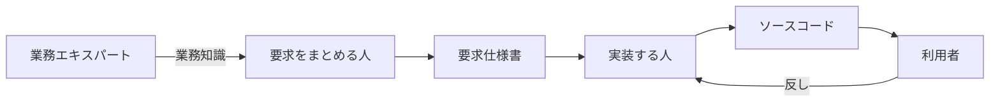
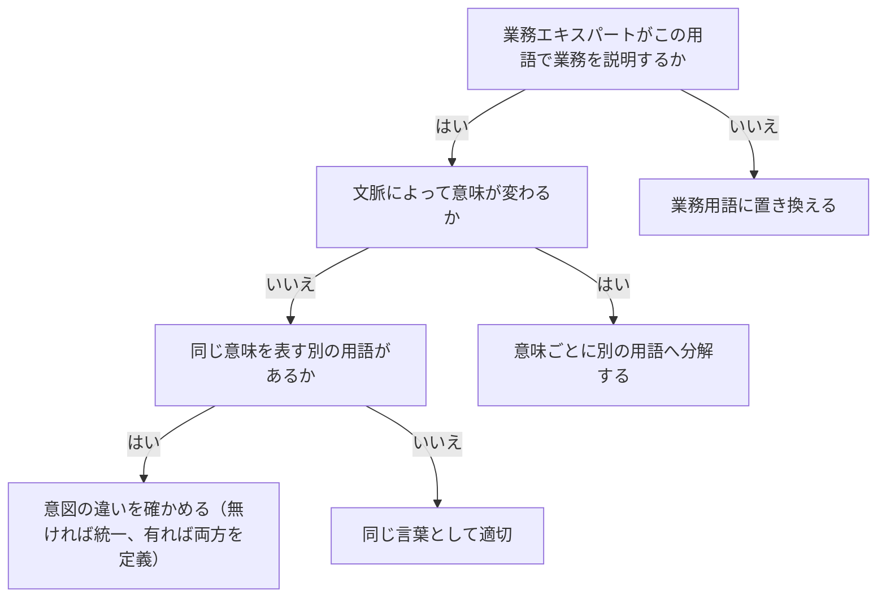

# ユビキタス言語の原則を扱う概念：ubiquitous-language

## 概要

### この概念が答える判断

- この用語は同じ言葉として適切か
- あいまいな用語をどう扱うか
- 同じ意味の別の用語があるとき、統一すべきか分けるべきか
- 言語化されていない業務知識へ、どうたどりつくか
- 既存のシステムに、あとから同じ言葉を取り込めるか

関係者全員が共通して使う、事業活動を表現するための単一の言語。業務知識が人やモデルを介して翻訳されるたびに意図が変質するのを防ぎ、業務エキスパートの考え方をそのままコードへ反映させる。

---

## 出典・根拠の透明性

『ドメイン駆動設計をはじめよう』第2章の書き起こしを、粒度を保ったまま構造へ移したもの。見出しそれぞれにノードを1つ対応させている。

### 留保事項

実例は著作権への配慮から架空の業務（配送の依頼）へ置き換え、実在の道具の製品名は落として役割の説明に置き換えた。図が示す関係の構造（翻訳の連鎖・モデル変換の連鎖）は保っている。

---

## 関連概念

| 関連概念 | 関係 |
|---|---|
| domain-expert | 同じ言葉の源泉。業務エキスパートの用語と考え方が基になる |
| bounded-context | 同じ言葉が有効な範囲を定義する境界 |
| business-domain | 同じ言葉が対象とする事業活動の全体像 |

---

## 同じ言葉（ユビキタス言語）

### 同じ言葉とは

プロジェクトのすべての関係者——業務エキスパート・ソフトウェア技術者・プロダクト責任者・画面を設計する人など——が共通して使う、事業活動を表現するための単一の言語。ドメイン駆動設計の土台となる手法である。

### なぜ必要か

業務知識は関係者を通じて翻訳されながら開発者に届き、翻訳のたびに意図が変質する。同じ言葉は、その変換をなくして業務エキスパートの考え方をそのままコードへ反映させる。

#### 人を介するたびに意図が変質する

業務知識が、要求をまとめる人・仕様書・実装する人と受け渡されるあいだに翻訳され、そのたびに意図が変わる。

業務知識が人を介して伝わるあいだに、意図が変質していくことを示す

業務エキスパートの知識が、要求をまとめる人・仕様書・実装する人と受け渡されるたびに翻訳され、そのたびに意図が変わる。利用者からの反しも同じ経路を逆にたどるので、ずれは往復で積み上がる。



| どこの話か | 図に載せきれないこと |
|---|---|
| 利用者から実装する人（反し） | 他の線と向きが逆だが、経路が短いという意味ではない。反しも同じ翻訳を逆にたどるので、ずれは往復で積み上がる。 |
| 要求仕様書／ソースコード | 人ではなく成果物である。人と成果物が同じ形で並んでいるのは、どちらも翻訳を挟む点では同じだからである。 |
| 経路全体 | 示しているのは経路が長いことではなく、各段で翻訳が起きることである。段の数を減らしても翻訳が残れば、問題は残る。 |

#### モデルの変換のたびに情報が欠落する

業務知識がコードになるまでに複数回のモデル変換が起きる。変換のたびに情報が欠落し、最終的に業務の課題を解決できないソフトウェアが生まれる。

業務知識がコードになるまでに、複数回モデルが変換されることを示す

業務知識は、概念のモデル・解決のモデル・ソースコードへと3回変換される。変換のたびに情報が欠落し、最終的に業務の課題を解決できないソフトウェアが生まれる。


| どこの話か | 図に載せきれないこと |
|---|---|
| 発見／設計／実装 | 担当者の交代を表さない。同じ人が3段すべてを担っても、変換は起きる。 |
| 業務知識 | 文書ではなく、業務エキスパートの頭の中にあるものを指す。最初の変換は、それを言葉にする段階にあたる。 |

### 同じ言葉の3つのルール

満たすべき条件は3つある。

#### 業務用語のみで構成する

技術用語を含めてはいけない。業務エキスパートが分からない言葉は、同じ言葉ではない。

#### 一貫性（一語一義）

ひとつの用語に意味はひとつ。あいまいな用語は意味ごとに分解する。

1つの用語が2つの意味を持っている状態と、分解した状態を対比する

「区分」という1語が、荷物の大きさの区分と、料金の区分の両方を指していると、どちらの話をしているのか読み手が決められない。意味ごとに別の用語へ分解すると、名前だけで区別がつく。

| | 用語 | 指しているもの |
|---|---|---|
| あいまい | 区分 | 荷物の大きさの区分／料金の区分（2つの意味） |
| 分解後 | 荷姿区分 | 荷物の大きさによる区分 |
| 分解後 | 料金区分 | 料金体系による区分 |

#### 同義語を使わない

同じ意味を表す言葉はひとつに統一する。ただし意図が異なるなら、あえて別の用語を使う——「利用者」「訪問者」「管理者」「会員」は技術的には同じ利用者でも、行動・データ・機能が異なるなら別の用語として扱う。

### この用語は同じ言葉として適切か

3つの問いで確かめる。

ある用語が同じ言葉として適切かを、3つの問いで確かめる

業務エキスパートがその用語で業務を説明しないなら、それは同じ言葉ではない。文脈によって意味が変わるなら、意味ごとに分解する。同じ意味の別の用語があるなら、意図の違いを確かめて、違いがなければ統一し、違いがあればそれぞれを正式な用語として定義する。



| どこの話か | 図に載せきれないこと |
|---|---|
| 3つの問いの並び | 入れ替えられない。業務用語でないものを先に置き換えないと、後の2問が意味を持たない。 |
| 意図の違いを確かめる（無ければ統一、有れば両方を定義） | この節点だけ、答えが2つに分かれる。図では1つの箱に見えるが、実際には分岐である。 |
| 同じ言葉として適切 | 3問すべてを通った場合にだけ到達する。途中の終点へ行った場合は、直したうえで最初から問い直す。 |

### 業務の言葉と技術の言葉

同じことを述べていても、業務エキスパートの表現と技術者の表現は別物になる。たとえば業務側は「配送の依頼は、いくつかの荷物をまとめて出せる」「配送を始めるには、受け付け可能な集荷先が少なくともひとつ要る」と言う。技術側は「画面の枠を使って一覧を表示する」「集荷先の表に有効な行があるときだけ処理できる」と言う。技術的な説明は業務エキスパートに伝わらず、業務ロジックの正しい理解を妨げる。

### 継続的に取り組む

同じ言葉は一度作ったら終わりではなく、継続的に育てるもの。業務エキスパートとの会話を通じて不正確な表現・誤解・誤認を検出し、修正し続ける。関係者がいつでもどこでも同じ言葉を使う——会話・要件・テスト・文書・ソースコード。事業の理解が進んだら、新しい業務知識を同じ言葉へ取り込んで進化させる。

### 道具の利用

同じ言葉を支える道具は3種類ある——用語をまとめる場所、振る舞いを業務エキスパートが読める形で書く記法、そしてソースコードでの使われ方を検査する仕組み。

#### 用語をまとめる場所

同じ言葉を見つけて書き留める場所として使える。重要なのは全員が更新できることで、一部の人だけが管理する中央集権的なやり方とは逆になる。新しく加わった人が事業活動を学ぶときの、最初の参照先にもなる。ただし限界がある——名詞（モノ・プロセス・役割の名前）の整理には役立つが、振る舞い（業務ロジック・規則・制約）は表現できない。

#### 振る舞いを読める形で書く記法

前提・操作・結果の3つで振る舞いを書く記法。業務エキスパートが読める形でテストの筋書きを書けるので、同じ言葉の文書化と検証を兼ねられる。ただし業務エキスパートがこの形式で書けるという期待は持たない——読めるだけである。

業務エキスパートが読める形で、振る舞いを書き表した例

前提・操作・結果の3つで書くと、業務エキスパートが読んで「そうではない」と言える形になる。ただし業務エキスパートがこの形式で書けるという期待は持たない——読めるだけである。

```gherkin
Scenario: 新しい依頼を担当者へ知らせる
  Given 荷主が新しい配送の依頼を出す
  When  その依頼を担当者へ割り当てる
  Then  担当者へ割り当ての知らせが届く
```

#### ソースコードでの使われ方を検査する仕組み

ソースコードを解析して、記述の一貫性の問題や依存関係の複雑さを示す道具がある。同じ言葉の用語がソースコードで適切に使われているかを検査できる。

### 困難に立ち向かう

同じ言葉を育てるときに、実際に直面する3つの難しさ。

#### 言語化されていない知識へたどりつく

重要な業務知識の多くは言語化されておらず、業務エキスパートの頭の中だけにある。たどりつく唯一の方法は質問すること。質問することで、業務エキスパート自身が気づいていなかった曖昧さ・見落とし・未定義の概念が明らかになる。これは相互作用であり、技術者の質問が業務エキスパートの理解を深める助けにもなる（とくに中核の業務領域で起きやすい）。

#### 既存のシステムへ取り込む

既存のシステムに取り入れようとすると、すでに何らかの言語が存在することに気づく。しかしその言語は業務知識を適切に表現できていない可能性がある（技術的な視点で命名された表の名前など）。関係者のあいだで言葉の使い方を変えるのは簡単ではない。基本手段は忍耐で、自分たちが動かしやすい場所——技術文書やソースコード——から手をつける。

#### 言語の選択

同じ言葉の用語には、ソースコードで扱いやすい言語の名詞を使うことが推奨される。業務エキスパートが別の言語を使っている場合の次善策は、コード上の名前と、その言語での名前を並記して対応づけること。

### アンチパターン

同じ言葉でよく起きる誤り。

#### 翻訳を挟む

業務エキスパートと技術者のあいだに翻訳する人を置き、直接対話しない。変換のたびに意図が変質し、伝言ゲームになる。

#### コードだけに同じ言葉を適用する

会話では別々の用語を使い、コードだけ業務用語にする。会話とコードで言葉がずれると、議論とコードを照合できなくなる。

#### あいまいな用語をそのままモデル化する

1語が2つの意味を持ったまま、ひとつの型で両方を扱う。意味の衝突が不具合や設計の混乱を生む。
