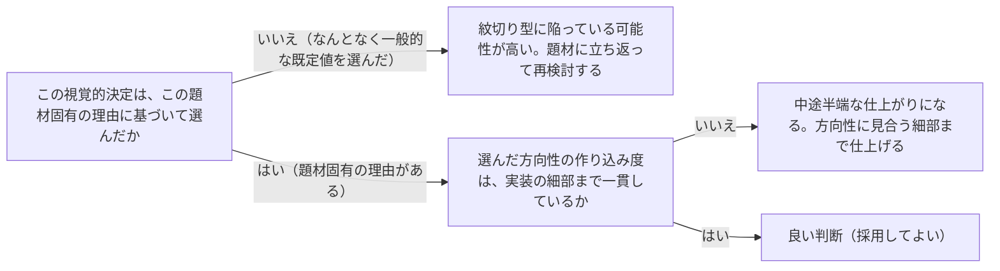

# 視覚的階層と抑制の原則を扱う概念：visual-hierarchy-and-restraint

## 概要

### この概念が答える判断

- 画面の最初に何を見せるべきか？
- 見出しと本文のフォントは同じ組み合わせでよいか？
- 番号付きの手順表示（01/02/03等）はいつ使ってよいか？
- アニメーションはどこに入れるべきか？
- 凝ったデザインと最小限のデザイン、どちらを選んでも成立させるコツは？

画面設計における視覚的判断（何を最初に見せるか・書体の組み合わせ・構造表現・モーション・作り込みの度合い）を、思いつきではなく一貫した基準で決めるための原則群。

---

## 原則

- 5つの判断軸から成る。
- (1)画面の最初の要素（Hero）は、そのプロダクト・題材にとって最も特徴的なものを選ぶ——「大きな数字＋小さなラベル＋補足統計＋グラデーション」のような定型パターンを、それが本当に最適でない限り既定にしない。
- (2)見出し用書体と本文用書体は意図的に組み合わせる——どんな案件でも同じ組み合わせを使い回さない。
- (3)番号・見出し接頭辞・区切り線などの構造表現は、実際の意味（本当に順序が理解に関わる工程か等）を反映させる——意味のない01/02/03を飾りとして使わない。
- (4)モーション（アニメーション）は「この題材に効くか」を先に問い、ページ読み込み時の演出・スクロール連動・ホバー時の反応等、狙いを絞って配置する——散発的な効果の乱用はAI生成っぽさとして読まれるリスクがある。
- (5)実装の作り込み度は選んだ方向性と一致させる——凝った方向を選んだら細部まで凝る、最小限の方向を選んだら余白・書体・仕上げの精度で勝負する。
- 中途半端が最も避けるべき状態である。

---

## 分類

| 分類 | 特徴 |
|---|---|
| Hero | 画面最初の要素の選び方。題材固有の特徴を象徴するものを選ぶ |
| Typography | 見出し用・本文用の書体を意図的に組み合わせる |
| Structure | 番号・区切り等の構造表現に、実際の意味を持たせる |
| Motion | アニメーションをどこに・なぜ配置するかの判断 |
| Complexity Matching | 作り込み度と選んだ方向性を一致させる |

---

## 判断基準

---

## 実例

架空のSaaS「TaskFlow」のトップページを作る場面。Hero部分に当初「タスク完了率92%」という定型的な統計＋グラデーションを置く案が出たが、TaskFlowの特徴（チームの会話からタスクが自動生成される点）を象徴する、実際のチャットからタスクカードが生成されるアニメーションをHeroに据え直した。見出し書体には角の効いたサンセリフ、本文には可読性の高い別のサンセリフを意図的に組み合わせ、「01 チャットで話す」「02 タスクが生まれる」「03 進捗が見える」という3ステップの番号表記は、実際に時系列で意味のある工程だったため採用した。

---

## アンチパターン

| アンチパターン | 問題点 |
|---|---|
| 定型パターンをそのまま採用する | 「大きな数字＋小さなラベル＋グラデーション」のようなHero、「暖色クリーム＋セリフ体」「ダーク＋蛍光グリーン」「密な新聞レイアウト」のような配色・レイアウトは、AIが生成しがちな既定値であり、プロダクト固有の判断に見えず個性を欠く |
| 意味の無い番号付けを装飾として使う | 実際には順序に意味が無いのに01/02/03と振ると、利用者に「順番通りに読むべき」という誤った期待を持たせる |
| モーションを散発的に足す | 狙いを持たず複数箇所にバラバラな効果を入れると、統一感が無くAI生成的な印象を強める |
| 方向性と作り込み度が一致しない | 凝った方向性を選びながら細部を仕上げない、または最小限の方向性なのに余計な装飾を足す、という中途半端な実装になる |

---

## 出典・根拠の透明性

Anthropic公式`/frontend-design`skillのDesign Principles（Hero as Thesis／Typography／Structure as Information／Motion／Complexity Matching）を要約・再構成したものであり、本文の直接引用ではない。

---

## 関連概念

| 関連概念 | 関係 |
|---|---|
| design-system-tokens | この5原則で決めた判断を実際に記録・再利用する仕組みがdesign-system-tokens |
