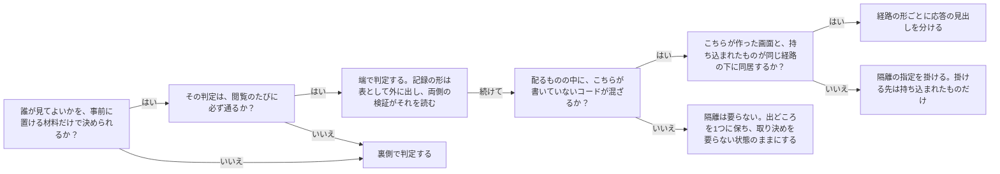

# 配信の端で守るときのブラウザ側の信頼境界：knowledge-cand-edge-delivery-browser-trust-boundary

## 概要

### この概念が答える判断

- 誰が見てよいかの判定を、配信の端（CDN）と裏側のどちらへ置くべきか
- 持ち込まれたHTMLを配るとき、隔離の指定はどこへ掛ければよいか
- オリジン間の取り決め（CORS）が要らない構成とは、何をした結果そうなっているのか
- 手元の検証と、コマンドラインからの確認だけで「通しで動いた」と言えるのはどこまでか
- 配信の端に置く判定コードには、どんな制約が付いて回るのか

配信網（CDN）の端で誰が見てよいかを判定し、持ち込まれたHTMLを同じ配信元から配る構成では、守りの主語がサーバーではなくブラウザになる。ブラウザが何を同じ出どころ（オリジン）とみなすかが設計の土台になり、指定の掛け方ひとつで、守るつもりだった画面自身が壊れる。

---

## 原則

- 配信の端で判定するとき、判定に使える材料は、あらかじめ計算して端の保管へ置いておけるものに限られる。端では網の外へ問い合わせられず、動かせるコードの大きさと時間にも上限があるため。
- そのため、判定に使う記録の形（何をどう並べた文字列か）は、書く側と読む側の取り決めそのものになる。書く側と読む側は多くの場合、別の言語・別の実行環境にある。
- 取り決めが2か所に別々に実装されると、両方が同じ誤解でずれたとき、どちらの検証も落ちない。取り決めを1つの表として外へ出し、両側の検証がその表を読む形にして初めて、ずれが検証で現れる。
- 隔離の指定（CSPのsandbox）は、それを受け取った文書自身に掛かる。囲う側が囲われる側を閉じ込める指定（iframeのsandbox属性）とは向きが逆であり、混同すると閲覧画面自身を閉じ込める。
- 隔離された文書は不透明な出どころを持つ。自分自身への問い合わせすらオリジンをまたぐ扱いになり、SameSiteを厳しくした手元の記録は送られず、保管領域への読み書きは例外になる。つまり、その画面の機能が静かに全滅する。
- 信頼の境界は、URLの形と一致しない。こちらが作った画面と、持ち込まれたHTMLが同じ経路の下に同居していることがある。応答の見出しは経路の形ごとに分けて掛ける。
- すべてを1つの出どころにまとめると、オリジン間の取り決め（CORS）は要らなくなる。要らないのは省略したからではなく、またぐものが無いからであり、この不在は構成が担っている性質そのものである。
- 逆に、管理の口だけを別の出どころへ置くと、取り決めが要るようになり、手元の記録も緩めざるをえなくなる。境界を1つ増やすことの代償は、設定項目1つでは済まない。
- 手元の記録に付ける前置き（__Host-）と、厳しい送出条件は、すべてが1つの出どころで、経路が全体である場合にだけ成り立つ。出どころを分けた瞬間に、この守りは使えなくなる。
- 配信元が裏側へ署名して渡す仕組みを使うと、その署名のために特定の見出し（authorization）が占有される。利用者を示す証明は別の見出しへ載せる必要がある。
- 端の保管は、書いた内容が行き渡るまでに時間がかかる。発行・失効の直後は、正しい相手が一時的に弾かれうる。「即時」を前提にした案内をしない。
- コマンドラインからの確認は、隔離の指定・オリジン間の取り決め・手元の記録の送出条件のいずれも解釈しない。つまり、この構成でブラウザが担っている守りの半分は、その確認からは構造的に見えない。

---

## 分類

| 分類 | 特徴 |
|---|---|
| 端で判定する | 誰が見てよいかを配信網の端で決める。裏側を起こさず速いが、判定に使えるのは事前に置いた材料だけになる |
| 裏側で判定する | 誰が見てよいかを裏側の処理で決める。材料を自由に引けるが、すべての閲覧が裏側を起こす |
| ブラウザに守らせる | 隔離の指定・出どころの分離・手元の記録の送出条件で、持ち込まれたコードのできることを縛る。サーバー側では何も起きず、壊れたときはブラウザの中でだけ現れる |

---

## 判断基準

---

## 実例

社内の設計文書を、招かれた人だけが上げ、合言葉を渡された人が読める仕組みを考える。読む人には利用者登録を求めない。

閲覧のたびに裏側を起こさずに済むよう、合言葉の照合は配信網の端で行う。端では外へ問い合わせられないので、合言葉そのものではなく、照合できる形（ハッシュの先頭・期限・世代番号を並べた1行）をあらかじめ端の保管へ置く。この1行の形が、上げる側（Python）と端（JavaScript）の取り決めになる。

ここで最初の落とし穴が来る。取り決めが両方の実装に別々に書かれていると、片方が「保管にはハッシュが入っている」、もう片方が「合言葉がそのまま入っている」と思い込んだまま、両方の検証が緑で通る。実際に、正しい合言葉でも開けない状態が、全検証を通り抜けて本番でだけ現れた。表を1つ外に置き、両側の検証がその表を読むようにすると、この思い込みは検証で落ちる。

次に、持ち込まれたHTMLを配る。書き換えずに配るので、中に何が書かれていても閲覧の合言葉や他人の文書へ手が伸びないようにしたい。そこで隔離の指定を掛ける。

ここで2つ目の落とし穴が来る。指定を配信全体へ掛けると、閲覧画面自身にも掛かる。閲覧画面は不透明な出どころになり、自分のコメント欄が自分の保管先へ書き込めなくなる。指定は経路の形（/p/*/content.html）で切り分け、持ち込まれたものにだけ掛ける。

3つ目は、確認の仕方そのものにある。コマンドラインから叩くと、どちらの掛け方でも応答は返る——隔離の指定は解釈されないからだ。全部通ったという結果を「通しで動いた」と読むと、ブラウザでだけ壊れている状態を出荷することになる。上げた直後に、外から見える範囲と見えない範囲を分けて示す点検を1周置く。

---

## アンチパターン

| アンチパターン | 問題点 |
|---|---|
| 隔離の指定をまとめて掛ける | こちらが作った画面自身が不透明な出どころになり、その画面の問い合わせ・手元の記録・保管領域が静かに全滅する。持ち込まれたHTMLは表示されるので、一見動いて見える |
| 端で読む取り決めを、両側に書き写す | 両方が同じ誤解でずれたとき、どちらの検証も落ちない。片方だけ直しても検証は通り、本番でだけ現れる |
| コマンドラインでの確認を通し確認とみなす | ブラウザが担っている守り（隔離・出どころ・手元の記録の送出条件）は解釈されないため、そこが壊れていても全部通る。壊れていないことの根拠にならない |
| 信頼の境界をURLの形と同一視する | 同じ経路の下に、こちらが作ったものと持ち込まれたものが同居していることに気づかず、応答の見出しを一括で掛けてしまう |
| 管理の口だけ別の出どころへ置く | オリジン間の取り決めが要るようになり、手元の記録の送出条件も緩めざるをえない。要らなかった守りを自分で捨てることになる |
| 端の保管への反映を即時とみなす | 発行・失効の直後に正しい相手が弾かれ、渡した合言葉が間違っていると受け取られる |
| 実際に配る形を検証しない | 端に置けるコードには上限があり、注釈を落とす等の加工を経て配ることがある。検証していた文字列と動いている文字列が別物になり、加工が壊しても上げるまで分からない |

---

## 出典・根拠の透明性

CDN配信基盤（S3＋CloudFront＋CloudFront Functions＋KeyValueStore＋API Gateway＋Lambda＋Cognito）で、招かれた者だけが公開しトークン保持者が閲覧する仕組みを実装・運用した際の実地の記録（2026-07〜08）。ブラウザ側の挙動はW3C Content Security Policy Level 3のsandbox指令およびHTML Standardのopaque originの定義に対応するが、直接引用ではなく実地で確かめた振る舞いの再構成である。

### 留保事項

2026-08-11の審査で取り下げ。内容は特定の配信構成に固有の設計判断であり、横断して効く knowledge ではなく、その構成の仕様として書かれるべきものと判断した。記録としては残す。

---

## 関連概念

| 関連概念 | 関係 |
|---|---|
| knowledge-cand-investigate-before-explain | ブラウザ側の挙動は通念で語ると誤る。実物で確かめてから主張する規律が前提になる |
| knowledge-cand-scoped-validation-does-not-propagate | ある経路で確かめた応答の見出しが、別の経路にも同じく掛かっているとは限らないという同型の話 |
| delegation-fidelity-verification | 確認手段が対象の性質を実際に検査しているかを問う点で同型。コマンドラインからの確認が隔離の指定を解釈しないのはこの一例 |
