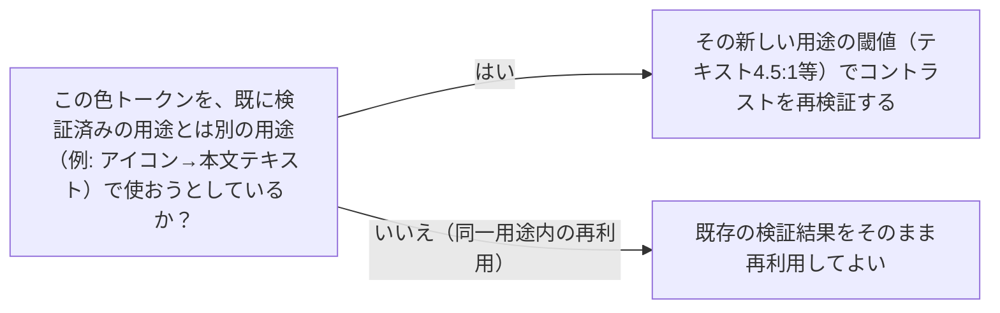

# 色トークンのコントラスト検証は用途スコープごとに必要：token-scope-revalidation

## 概要

### この概念が答える判断

- 既に検証済みの色トークンを、別の場所・別の用途で再利用してよいか、どう判断するか？
- 色トークンの再利用によるコントラスト不足を防ぐには、何を確認すればよいか？

色トークンのコントラスト検証結果はその適用用途（テキスト/非テキスト）にスコープされており、別用途への転用時には閾値の違いに応じた再検証が必要という規律。

---

## 原則

- WCAGのコントラスト基準は用途（テキスト/非テキスト）によって閾値が異なる（通常テキスト4.5:1、アイコン等の非テキストは3:1）。ある色トークンをある用途で検証しOKだったという事実は、その用途に対してのみ有効な検証結果であり、別の用途への適合を保証しない。
- デザイントークン（CSS変数等）は命名上「1つの色」として扱われるため、生成AIは既に検証済みのトークンを別の場所に再利用する際、命名の同一性から検証済みだと錯覚しやすい。実際には用途が変われば閾値も変わるため、再利用のたびに用途を確認し、閾値が上がる場合は再検証が必要。
- 同一トークンの用途スコープ逸脱は、生成物内で複数回・独立に発生しうる（同じ色を複数箇所で本文用途に転用する等）。1箇所を修正しても、他の転用箇所は機械的に洗い出さない限り残る。

---

## 分類

この概念は分類軸ではなく、色トークン再利用時に守るべき単一の検証規律のため分類を持たない。

---

## 判断基準

---

## 実例

架空のツール「Bar」のLPで、アクセントカラー`--brand-deep`をアイコンの装飾色として3:1基準で検証しOKだった。後の作業で同じトークンをタグのテキスト色・ボタンのホバー時テキスト色として複数箇所に転用したが、テキスト用の4.5:1基準では不足しておりWCAG違反のまま出荷寸前まで残った。全て同じトークン名だったため、検証済みという錯覚が転用のたびに繰り返された。

---

## アンチパターン

| アンチパターン | 問題点 |
|---|---|
| トークン名の同一性による検証済みの錯覚 | 同じCSS変数名を別のUIロール（アイコン→本文/タグ/ボタンテキスト等）に転用する際、変数名が同じであることを理由に既存の検証結果（閾値の低いアイコン用3:1等）をそのまま流用してしまい、閾値の高いテキスト用途（4.5:1）で実際には不足したまま出荷される。 |

---

## 出典・根拠の透明性

本セッション（Waffle OSS LP作成）での実例の再構成。--gold-deepトークンがアイコン用途で検証済みだったにも関わらず、タグ・ボタンホバーのテキスト色として3箇所で再利用されコントラスト不足のまま残っていた事例（最終adversarial audit時に発覚）を一般化した。

### 留保事項

knowledge-cand-scoped-validation-does-not-propagateへ統合されたため非推奨（2026-07-20）。個別の具象事象として記録していたが、より抽象化された1原則へまとめた。

---

## 関連概念

既存knowledge内の関連候補（地色の多様性関連のアンチパターン）はKnowledge documentとして独立した参照IDを持たないため、conceptIdでのリンクができない。
