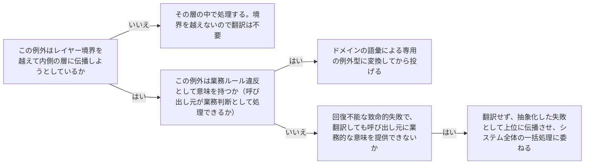

# architecture-cross-boundary-exception-handling

---

## 概要

### この概念が答える判断

- インフラ層で発生した例外を、そのままドメイン層・アプリケーション層に伝播させてよいか？
- ドメイン層の業務ルール違反は、どんな形の例外として表現すべきか？
- 全ての例外をレイヤー境界で翻訳する必要があるか？

例外もデータと同じくレイヤー境界を越えて伝播する。境界を越えるたびに、その例外は受け取る側の層の語彙に翻訳されるべきであり、外側の技術的な例外型をそのまま内側の層に漏らしてはならない、という原則。

---

## 原則

- 例外には大きく2種類ある。
- 1つは「業務ルール違反」——ドメイン層が意図的に投げる、業務上意味のある例外（例：在庫不足）。
- もう1つは「技術的失敗」——インフラ層で起きる、ドメインの言葉では説明できない失敗（例：DB接続エラー・タイムアウト）。
- ドメイン層は業務ルール違反を独自の例外型として定義し、それを投げることでコマンドの失敗を表現する。
- 一方、インフラ層で発生した技術的失敗をそのままドメイン層・アプリケーション層に伝播させると、内側の層が外側の技術詳細（特定のライブラリの例外型等）を知ることになり、依存方向が乱れる。
- レイヤー境界を越える箇所（多くはSecondaryアダプター）で、技術的例外を、内側の層が理解できるより抽象的な失敗の形に翻訳してから伝えるべきである。
- ただし全ての技術的失敗を無理にドメイン例外へ翻訳する必要はない——復旧不能な致命的な失敗は、翻訳せずそのまま上位へ伝播させ、システム全体で一括処理する方が適切な場合もある。

---

## 分類

| 分類 | 特徴 |
|---|---|
| 業務ルール違反（ドメイン例外） | ドメイン層が意図的に投げる。業務上意味のある名前を持つ（例：InsufficientStockError）。呼び出し元は業務判断としてこれを処理する |
| 技術的失敗（インフラ例外） | 外側の層で発生する。ドメインの語彙では説明できない。レイヤー境界を越える際に翻訳するか、翻訳せず抽象化した失敗として伝播させるかを判断する |

---

## 判断基準

---

## 実例

架空の物流プラットフォームで、配送先住所の検証に使う外部APIがタイムアウトした場合を考える。これは技術的失敗であり、ドメイン層は業務判断できないため、`AddressValidationUnavailable`というアプリケーション層の抽象化された失敗に変換して伝播させる。一方、在庫確認の結果「集荷可能数を超えている」と判明した場合は、業務ルール違反として`InsufficientCapacityError`というドメイン例外を投げ、呼び出し元（ユースケース）がそれをキャッチしてユーザーに分かりやすいメッセージへ変換する。

---

## アンチパターン

| アンチパターン | 問題点 |
|---|---|
| DB例外（特定ORM/ライブラリ固有の例外型）をそのままユースケース層まで伝播させる | アプリケーション層がインフラの実装詳細（使用しているライブラリ）に依存することになり、依存方向が逆転する |
| 全ての例外をキャッチして握りつぶす | 失敗が握りつぶされると、呼び出し元は成功したと誤認し、データ不整合や無限リトライ等の重大な障害につながる |
| 技術的失敗を無理にドメイン例外として表現する | 「DB接続エラー」を業務ルール違反であるかのように扱うと、ドメインモデルの語彙が技術的関心事で汚染される |

---

## 出典・根拠の透明性

クリーンアーキテクチャ・ヘキサゴナルアーキテクチャの共通原則（境界を越えるデータは受け手の語彙に翻訳する）を例外処理に適用し、AIが総合してhas-udd独自にまとめたものである（[[brainstorm-platform-engineering-application]] 論点11のddd-advisor/tech-lead-advisor相談結果を受けて着手）。

---

## 関連概念

| 関連概念 | 関係 |
|---|---|
| architecture-cross-layer-data-shape | 同じ「境界を越える際は受け手の語彙に翻訳する」原則の、例外・エラー版 |
| architecture-dependency-direction | 例外の型が境界を越えて内側に漏れることは依存方向の逆転そのものである |
