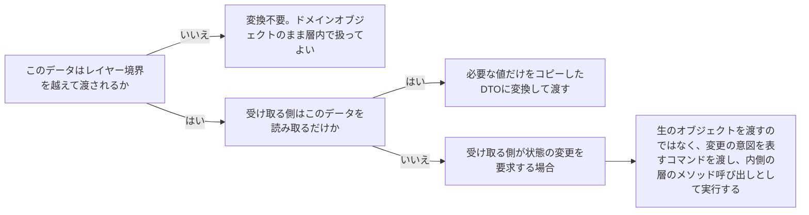

# architecture-cross-layer-data-shape

---

## 概要

### この概念が答える判断

- レイヤー境界を越えてデータを渡すとき、ドメインのエンティティ・集約をそのまま渡してよいか？
- DTO（Data Transfer Object）とドメインオブジェクトは何が違うのか？
- APIのリクエスト/レスポンス型は、そのままドメイン層のメソッドに渡してよいか？

レイヤー境界を越えてデータを受け渡す際、各層は自分の関心事に閉じた専用のデータ形（DTO）に変換して渡すべきであり、内側の層のドメインオブジェクト（エンティティ・集約）をそのまま外部に渡してはならない、という原則。

---

## 原則

- レイヤー境界を越える際にドメインオブジェクトをそのまま渡すと、外側の層がそのオブジェクトの参照を保持し続けることになり、集約のメソッドを経由せずに直接フィールドを書き換えられてしまう可能性が生まれる（不変条件のカプセル化の崩壊）。
- また、ドメイン層の内部構造が外部の契約（API仕様等）にそのまま晒され、ドメインモデルの変更が外部インターフェースの破壊的変更に直結してしまう。
- DTOは「その層の外に出るための専用の入れ物」であり、必要なデータだけをコピーし、ふるまい（メソッド）を持たない単純なデータ構造にする。
- 層をまたぐたびに変換処理（マッピング）が必要になるが、この変換コストは、レイヤー境界の独立性を守るための対価として正当なものである。

---

## 分類

| 分類 | 特徴 |
|---|---|
| リクエスト/レスポンスDTO | Primaryアダプター（API/CLI等）とアプリケーション層の境界で使う。外部の入力形式をユースケースの引数形式に変換する |
| 永続化用DTO（レコード/ドキュメント） | アプリケーション・ドメイン層とSecondaryアダプター（DB）の境界で使う。集約の状態をDBのスキーマ形式に変換する |
| ドメインオブジェクト（エンティティ・集約・値オブジェクト） | レイヤー境界を越えて渡さない。常にドメイン層・アプリケーション層の内部に留める |

---

## 判断基準

---

## 実例

架空の物流プラットフォームで、配送状況をAPIで返す場面を考える。Shipment集約をそのままJSONシリアライズして返すと、内部の実装詳細（経由地点記録の内部構造等）がAPI契約として固定されてしまう。代わりに`ShipmentStatusResponse`というDTO（配送ID・現在地・予定日時のみを持つ）を用意し、Shipment集約からその値だけをコピーして返す。逆に「配送先住所を変更する」というリクエストを受け取る場合も、住所オブジェクトをそのままShipment集約に注入するのではなく、`UpdateDeliveryAddressCommand`というDTOとして受け取り、それをShipment集約の`updateAddress()`メソッドの引数として渡す形にする。

---

## アンチパターン

| アンチパターン | 問題点 |
|---|---|
| ドメインの集約をそのままAPIレスポンスにシリアライズする | ドメインモデルの内部構造が外部契約として固定され、ドメインモデルを変更するたびに外部インターフェースが壊れる |
| 外側から受け取ったDTOのフィールドを直接ドメインオブジェクトに代入する | 集約のメソッドを経由しない状態変更となり、不変条件のカプセル化が崩れる |
| DTOにビジネスロジックを持たせる | DTOは単純なデータの入れ物であるべきで、ふるまいを持たせるとドメインロジックの置き場所が分散する |

---

## 出典・根拠の透明性

クリーンアーキテクチャ（レイヤー境界を越える際はデータ構造かDTOのみを渡すという越境ルール）とヘキサゴナルアーキテクチャ（ポートの入出力形状の設計）の共通原則をAIが総合し、has-udd独自にまとめたものである（[[brainstorm-platform-engineering-application]] 論点11のddd-advisor/tech-lead-advisor相談結果を受けて優先着手した）。

---

## 関連概念

| 関連概念 | 関係 |
|---|---|
| architecture-dependency-direction | 越境時のデータ変換は依存方向の原則を実務レベルで守るための具体的な手段 |
| architecture-port-adapter | ポートの入出力の形そのものがこのDTO設計の対象になる |
