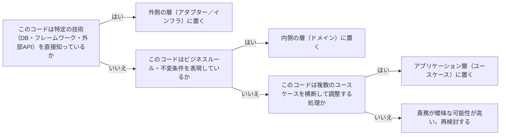

# architecture-dependency-direction

---

## 概要

### この概念が答える判断

- このコードは、どの層に依存してよいか？
- ドメインロジックが特定のフレームワーク・DBライブラリに直接依存してしまっている。これは問題か？
- 「依存の方向が正しい」とは具体的にどういう状態か？

ソフトウェアの層（レイヤー）間の依存は、常により変化しにくい・より本質的な層（ビジネスロジック）に向かって流れるべきであり、逆方向の依存を禁止する原則。クリーンアーキテクチャ・オニオンアーキテクチャ・ヘキサゴナルアーキテクチャは、いずれもこの同じ原則を異なる図・異なる用語で表現したものである。

---

## 原則

- 依存とは「AがBを知っている（import・参照している）」という関係を指す。
- ソフトウェアの安定性は、頻繁に変わる技術的詳細（DB・UI・外部API）と、めったに変わらないビジネスルールを分離することで保たれる。
- 依存性逆転の原則（内側の層がインターフェースを定義し、外側の層がそれを実装する）を使うと、実行時のデータの流れは外側から内側でも、コンパイル時の依存方向は常に内向きに保てる。
- 3つの著名な表現形式はいずれも同一思想の別表現である——クリーンアーキテクチャはEntities/UseCases/Interface Adapters/Frameworks&Driversの同心円として、オニオンアーキテクチャはDomain Model/Domain Services/Application Servicesの同心円として、ヘキサゴナル（ポートとアダプター）はアプリケーションコアが定義する「ポート」を外側の「アダプター」が実装する構図として、それぞれ表現する。
- 不変条件のカプセル化は「状態を変更するメソッドを用意する」だけでは不十分であり、状態フィールドへの直接代入という別経路が残っていれば、その経路から不変条件を迂回できてしまう。
- 言語機能（private化・読み取り専用プロパティ等）を使い、メソッド経由以外の変更手段そのものを塞ぐところまでを実装の完了条件とする。

---

## 分類

| 分類 | 特徴 |
|---|---|
| クリーンアーキテクチャ | Entities/UseCases/Interface Adapters/Frameworks&Driversの4層同心円。層をまたぐ際はデータ構造かDTOのみを渡すという越境ルールを明確化している |
| オニオンアーキテクチャ | Domain Modelを中心に置いた同心円。インフラ層がドメイン層の定義したインターフェースを実装する点を強調する |
| ヘキサゴナル（ポートとアダプター） | アプリケーションコアが公開する「ポート」と、それを実装する「アダプター」という対比で表現する。外部から呼び出される側（Primary/Driving）と、外部を呼び出す側（Secondary/Driven）を区別する |

---

## 判断基準

---

## 実例

架空の物流プラットフォームで「配送料金を計算する」ロジックを実装する場面を考える。料金は距離・重量・繁忙期割増率という業務ルールで決まるため、これはビジネスルール（Q2=はい）であり、ドメイン層に置く。一方「計算結果をどのDBテーブルの列に保存するか」は技術的詳細（Q1=はい）なのでインフラ層のアダプターに置く。「配送依頼を受け付けて、料金計算・在庫確認・配車手配を順番に呼び出す」処理は複数のユースケースを横断する調整（Q3=はい）なので、アプリケーション層に置く。

---

## アンチパターン

| アンチパターン | 問題点 |
|---|---|
| ドメイン層からORMのモデルクラスを直接使う | ビジネスルールがDBスキーマの変更に巻き込まれる。DBを変更するとドメインロジックまで壊れる |
| ユースケース層に個別のビジネスルールの詳細判定を書きすぎる | ドメインロジックが分散し、同じルールが複数箇所に重複して実装される |
| インターフェース（ポート）をアダプター側で定義する | 依存の方向が逆転し、アプリケーションコアが特定の実装技術に縛られる。ポートは常にコア側が所有すべき |
| 不変条件を守るメソッドは用意するが、状態フィールド自体はpublicのまま直接代入できてしまう | 呼び出し元がメソッドを経由せずフィールドへ直接書き込めば、不変条件を素通りできる。「ルールをメソッドに書いた」ことと「そのメソッド以外から状態を変更できない」ことは別であり、後者を言語機能（private化・読み取り専用プロパティ等）で保証しなければカプセル化は完成しない |
| UI（プレゼンテーション）層に業務ルールの判定ロジックを持たせる | 表示・入力制御を超えた業務判断がUIコードに埋め込まれ、同じルールがドメイン層と重複したり、UIを差し替えると業務ルールごと失われるリスクが生まれる |

---

## 出典・根拠の透明性

クリーンアーキテクチャ（Robert C. Martin）・オニオンアーキテクチャ（Jeffrey Palermo）・ヘキサゴナルアーキテクチャ／ポートとアダプター（Alistair Cockburn）という、広く確立された複数の思想の共通原則をAIが総合し、has-udd独自にまとめたものである。複数流派の交差点としての一般的理解である点に留意すること（[[brainstorm-platform-engineering-application]] 論点6の方針転換を参照）。

---

## 関連概念

| 関連概念 | 関係 |
|---|---|
| architecture-layer-boundary | 依存方向の原則を、具体的にどこに境界線を引くかの判断に適用したもの |
| architecture-port-adapter | 依存性逆転の原則を具体的に実装するパターンの一つ |
