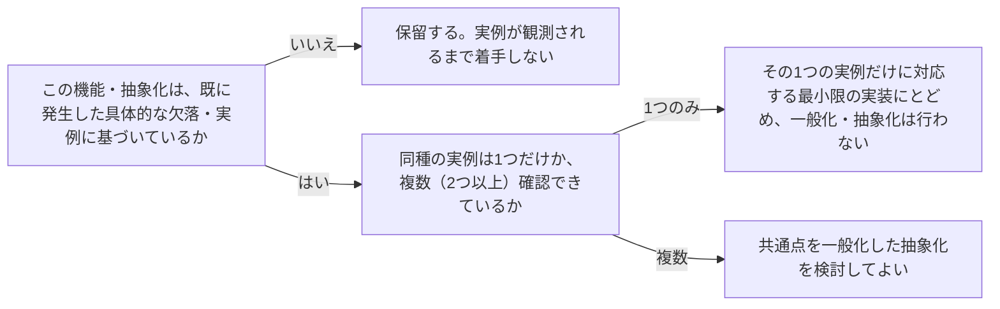

# architecture-evidence-based-scope

---

## 概要

### この概念が答える判断

- 新しい抽象化・レイヤー・拡張ポイントを、今のうちに用意しておくべきか？
- 「将来の拡張性のために」「網羅性のために」という理由で機能を追加してよいか？
- 似たような要件が2つ出てきた。今すぐ共通化・抽象化すべきか？

機能・抽象化・拡張ポイントの追加は、実証された具体的な欠落・実例に基づいて行うべきであり、机上の推測や「念のため」という理由だけで先回りして作らない、という設計規律。

---

## 原則

実際に発生していない要件のために作られた抽象化・拡張ポイントは、複雑さのコストだけを先払いすることになる——しかもその抽象化の形が、後で実際に必要になる要件と一致する保証はない。早すぎる一般化のコストは、後から一般化するコストより通常高くつく。判断の目安は「その機能・抽象化を必要とする具体的な実例が、既に1つ以上（できれば2つ以上）観測されているか」であり、実例が無いうちは最小限の・その場限りの実装にとどめ、一般化は複数の具体例から共通点が見えてから行う。ただし「最小限」は「後回しにできるものを後回しにする」という意味であり、「既に確定している要件に対して品質を下げてよい」という意味ではない。

この規律は「実装の手間を省くための節約術」ではなく、経済的な意思決定原則として理解すべきである（Kent Beckの整理）。先回りして構造を作ることには、推測が完全に正しかった場合でも消えない2種類のコストが存在する。

- オプション性のコスト: 今、確定的な構造を先に作ってしまうと、後でより良い情報（実例・実際の使われ方）を得てから決め直すという「選択権」を失う。待つことは怠惰ではなく、選択権という資産を保持することである。
- NPV（正味現在価値）のコスト: 構造構築のコストは今日払い、そこから得られる価値は実際に必要になった時点まで実現しない。この時間的なズレそのものが損失であり、推測が当たっていたかどうかとは無関係に発生する。

「AIでコード生成が安くなったのだから、先回りして抽象化を作ってしまってよい」という反論は、この2つのコストを見落としている。生成コストがゼロに近づいても、オプション喪失とNPVコストという経済的実体は消えない。むしろ生成が安いことで、理解の浅い複雑な構造を安易に・大量に作ってしまいやすくなる分、悪化する場合がある。

---

## 分類

| 分類 | 特徴 |
|---|---|
| 実証済みの拡張（実装してよい） | 具体的に困った実例が既に存在する。実例に対応する最小限の実装を行う |
| 推測に基づく拡張（保留すべき） | 「あった方が良さそう」という推測のみで、具体的な実例が無い。実例が観測されるまで着手を保留する |
| 複数実例からの一般化（抽象化してよい） | 同種の実例が複数（2つ以上）観測され、共通点が具体的に説明できる。このときに初めて抽象化・共通化を検討する |

---

## 判断基準

---

## 実例

架空の物流プラットフォームで、現在は「トラック配送」という1種類の配送方法しか実装されていない段階で、将来の複数配送方法（船便・航空便等）に備えた抽象的な`DeliveryMethodStrategy`インターフェースを先回りして用意しようとする提案が出た。しかし実例（実際に必要になった配送方法）はまだ1つしか無いため、抽象化は保留し、トラック配送に特化した具体的な実装のみを用意する。その後、実際に「船便配送」の要件が発生し、2つ目の具体例が揃った時点で初めて、両者の共通点を見て`DeliveryMethodStrategy`という抽象化を導入する。

---

## アンチパターン

| アンチパターン | 問題点 |
|---|---|
| 「将来の拡張性のために」仮定の抽象化を追加する | 実際には発生しなかった要件のために複雑さのコストだけを払うことになる。抽象化の形が実際のニーズと一致しない可能性も高く、後で作り直すコストがかえって増える |
| 網羅性のためにあらゆる組み合わせ・パターンを先に実装する | 使われない組み合わせの保守コストだけが残る。実際に使われるパターンが判明してから対応する方が無駄がない |
| 1つの実例だけで一般化した抽象化を作る | たった1つの具体例から導いた抽象化は、次に本当に異なる実例が現れた時に形が合わず、抽象化自体を作り直すことになりやすい。最低2つの実例を待つ |
| 「AIでコード生成が安いから」を理由に先回りして抽象化・フレームワークを作る | 生成コストの低さは、オプション喪失コスト・NPVコストという経済的実体を相殺しない。安く大量に作れる分、理解の浅い複雑な構造が積み上がりやすく、むしろ悪化しうる |

---

## 出典・根拠の透明性

エクストリームプログラミングのYAGNI原則（Ron Jeffries）と、プラットフォームエンジニアリングにおけるThinnest Viable Platform（Team Topologies由来）という、広く確立された2つの思想の共通原則をAIが総合し、has-udd独自にまとめたものである（[[brainstorm-platform-engineering-application]] 論点4を参照）。「原則」内のオプション性コスト・NPVコストの経済的整理は、Kent BeckのNewsletter記事「The Cost YAGNI Was Never About」(https://newsletter.kentbeck.com/p/the-cost-yagni-was-never-about) の主張を要約・反映したものである。

---

## 関連概念

| 関連概念 | 関係 |
|---|---|
| architecture-layer-boundary | 層を増やすかどうかの判断にも同じ「実証されてから」という規律が適用できる |
| architecture-cross-cutting-concerns | 横断的関心事を共通化するかどうかの判断にも同じ考え方が使える |
