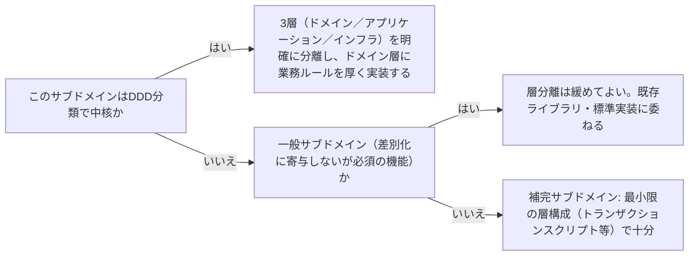

# architecture-layer-boundary

---

## 概要

### この概念が答える判断

- この機能はドメイン層に置くべきか、アプリケーション層に置くべきか？
- レイヤーはいくつに分けるべきか？分けすぎ・少なすぎの判断基準は？
- DDDのサブドメイン分類（中核・一般・補完）は、レイヤー設計にどう影響するか？

ソフトウェアをいくつの層に分割し、各層にどんな責務を割り当てるかという設計判断。層の数自体に唯一の正解はなく、「同じ理由で変更されるコードを同じ層にまとめる」という単一責任の原則を層レベルに適用した基準で決める。

---

## 原則

- 最小構成は「ドメイン層（ビジネスルール）」「アプリケーション層（ユースケースの調整）」「インフラ層（技術的詳細）」の3層である。
- UIを含めるなら「プレゼンテーション層」が加わるが、DDD自体はこの層をスコープ外にすることが多い。
- 層を増やす判断基準は、変更の理由が明確に分離できる場合に限る——増やしすぎるとコードを追う手間が増え、少なすぎると責務が混ざり[[architecture-dependency-direction]]の依存方向原則が守れなくなる。
- DDDのサブドメイン分類（中核・一般・補完）は、事業の差別化にどれだけ寄与するかという事業側の判断だが、この分類は「どれだけ層を厳密に分離すべきか」という設計側の判断に直接影響する——中核は変化・複雑さの中心なので層を厳密に分離する価値が高く、補完は変化が少ないため層を簡略化しても実害が小さい。

---

## 分類

| 分類 | 特徴 |
|---|---|
| ドメイン層 | 業務ルール・不変条件。他のどの層にも依存しない |
| アプリケーション層 | 1つのユースケースを実現するために、ドメイン層とインフラ層のポートを呼び出して調整する。業務ルールそのものは持たない |
| インフラ層 | DB・外部API・フレームワーク等の技術的詳細。ドメイン層・アプリケーション層が定義したポートを実装する |
| プレゼンテーション層（任意） | UI・入出力の表現。DDD自体はこの層を積極的にモデル化しないため、必要な場合は別途明示的な設計判断が要る |

---

## 判断基準

---

## 実例

架空の物流プラットフォームで、「集荷担当者の最適な配車ルートを計算する」機能（中核サブドメイン）は、ドメイン層に厚い最適化ロジックを持ち、アプリケーション層は「配車要求を受け取り、最適化ロジックを呼び、結果を通知する」だけの薄い調整役に徹する。一方「配送先住所が実在するかを検証する」機能（補完サブドメイン）は、外部住所検証APIをほぼそのまま呼ぶだけのトランザクションスクリプトで十分であり、独立したドメイン層を持たなくてもよい。

---

## アンチパターン

| アンチパターン | 問題点 |
|---|---|
| 全てのサブドメインに同じ厚みの層構成を適用する | 補完サブドメインにまで過剰な設計コストをかけ、開発速度が落ちる。中核でないものに中核と同じ手間をかけるのは資源配分の誤り |
| レイヤーをまたいで直接データベースにアクセスする「レイヤーのバイパス」 | 層の意味が失われ、依存関係が追跡不能になる。将来的な変更の影響範囲が予測できなくなる |

---

## 出典・根拠の透明性

クリーンアーキテクチャ・オニオンアーキテクチャ・ヘキサゴナルアーキテクチャの共通原則（単一責任の原則の層レベルでの適用）をAIが総合し、has-udd独自にまとめたものである。DDDサブドメイン分類との接続部分は、ddd-advisorのbackboneとは独立した、tech-lead-advisor独自の判断ロジックである（[[brainstorm-platform-engineering-application]] 論点6を参照）。

---

## 関連概念

| 関連概念 | 関係 |
|---|---|
| architecture-dependency-direction | レイヤー境界を引く際に守るべき依存方向の原則 |
| architecture-port-adapter | アプリケーション層・ドメイン層が外側に公開するインターフェースの設計パターン |
