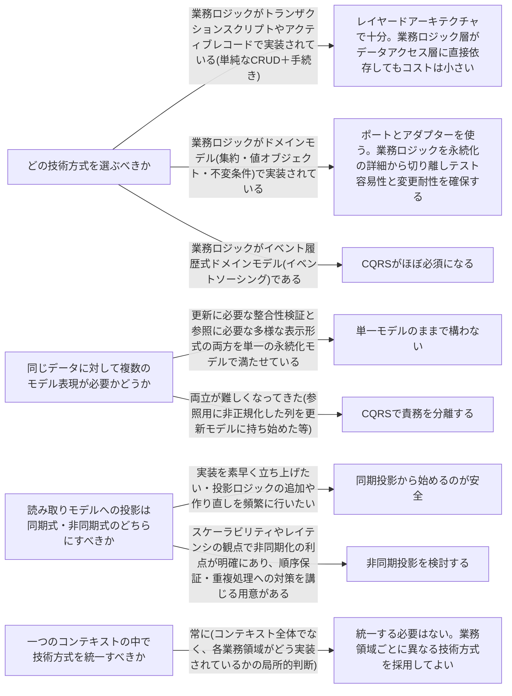

# architecture-patterns

---

## 概要

### この概念が答える判断

- 業務ロジックとDB・外部サービスとの結合をどう扱うべきか
- 同じ区切られたコンテキストの中で、複数の技術方式を混在させてよいのか
- 読み取り用のデータ表現と、更新用のデータ表現を分けるべきタイミングはいつか

技術方式(レイヤードアーキテクチャ・ポートとアダプター・CQRS)は、プレゼンテーション・業務ロジック・永続化・外部連係という関心事をどう構造化するかについての原則である。

---

## 原則

技術方式とは、コードベースに存在するさまざまな関心事(プレゼンテーション・業務ロジック・永続化・外部連係)をどう構造化するかについての原則である。業務ロジックはソフトウェアの中で最も重要な部分だが唯一の関心事ではなく、これらを無秩序に混在させると業務ロジックが技術的な都合に浸食され、モデルの独立性が失われる。代表的な技術方式は三つある。レイヤードアーキテクチャは技術的な関心事にもとづいてコードを上から下へ積み重ね、各層は直下の層にのみ依存する。ポートとアダプター(ヘキサゴナル/オニオン/クリーンアーキテクチャとも呼ばれる)は業務ロジック層が抽象インターフェース(ポート)を定義し、データアクセス層はそのポートを実装するアダプターとして業務ロジック層に依存する。依存の向きをレイヤードから逆転させることで、業務ロジックを基盤コンポーネントから独立させる。CQRS(コマンド・クエリ責任分離)は同じデータを、更新専用のコマンド実行モデルと参照専用の読み取りモデル(投影)という複数のモデルで表現する方式で、読み取りモデルはコマンド実行モデルから機械的に投影される。これらは互いに排他的な選択肢ではなく組み合わせて使える。

---

## 分類

| 分類 | 特徴 |
|---|---|
| レイヤードアーキテクチャ | 技術的な関心事にもとづいてコードを上から下へ積み重ねる(プレゼンテーション層→業務ロジック層→データアクセス層)。各層は直下の層にのみ依存する。 |
| ポートとアダプター | 業務ロジック層が抽象インターフェース(ポート)を定義し、データアクセス層はそのポートを実装するアダプターとして業務ロジック層に依存する。依存関係逆転の原則により業務ロジックを基盤コンポーネントから独立させる。 |
| CQRS | 同じデータを更新専用のコマンド実行モデルと参照専用の読み取りモデル(投影)という複数のモデルで表現する。読み取りモデルはコマンド実行モデルから機械的に投影される。 |

---

## 判断基準

---

## 実例

架空のオンライン書店Bookwaveの注文処理コンテキストを考える。注文受付(カート確定〜注文確定)は在庫引当・クーポン適用・支払い確定といった不変条件の検証が集中する業務ロジックであり、Order集約で実装されている。ここではポートとアダプターを採用し、OrderRepositoryというポートを業務ロジック層に置き、実際のDB操作は外側のアダプター(例: PostgresOrderRepository)が担う。注文履歴一覧・注文詳細画面は過去の注文をどう見せるかという参照専用の関心事であり、同じOrder集約のデータを注文一覧向けに非正規化した読み取りモデル(OrderSummaryView)として別に持ち、注文確定イベントが発生するたびに同期的に再構築する。これはCQRSにおける読み取りモデルの投影にあたり、Order集約が唯一の真実の情報源でOrderSummaryViewはそこから導出されたキャッシュにすぎない。注文確定メールの送信履歴管理は単純な追記・参照だけの業務であり、複雑な不変条件を持たないため、無理にポートとアダプターを持ち込まずレイヤードアーキテクチャのまま業務ロジック層がテーブル操作を直接呼び出す形で実装する。一つの注文処理コンテキストの中でも業務領域ごとに異なる技術方式が共存している。

---

## アンチパターン

| アンチパターン | 問題点 |
|---|---|
| ドメインモデルにレイヤードアーキテクチャを使う | 業務ロジック層がデータアクセス層に直接依存する構造になり、永続化の変更が業務ロジックに波及する。テストのために本物のDBやモックが必要になり単体テストが書きにくくなる。 |
| 非同期投影だけをいきなり採用する | 順序保証や重複処理への対策なしに非同期投影を組むと、読み取りモデルが更新モデルと食い違ったまま気づかれないリスクが高い。 |
| コマンドが読み取りモデルのデータを返す | コマンド実行結果は更新後の状態を元にすべきであり、投影されたキャッシュから値を持ってくるとコマンドとクエリの責任分離が崩れる。 |
| 技術方式を機械的にコンテキスト全体へ一律適用する | コンテキストはこの技術方式にすると決めて全業務領域をそれに合わせるのは過剰設計になりやすい。業務領域ごとの複雑さに応じて選び分けるべき。 |

---

## 出典・根拠の透明性

本ファイルの原則・判断の分岐点・アンチパターンは『ドメイン駆動設計をはじめよう』第8章が扱う一般原則(レイヤードアーキテクチャ・ポートとアダプター・CQRSの選択基準)を要約・再構成したものであり、本文の直接引用ではない。書籍固有の企業例・図版は用いず、教材専用の架空ドメイン(オンライン書店の注文処理システム)の実例に置き換えている。

---

## 関連概念

| 関連概念 | 関係 |
|---|---|
| business-logic-simple | レイヤードアーキテクチャが向いているトランザクションスクリプト・アクティブレコードの詳細 |
| domain-model | ポートとアダプターが向いているドメインモデルの詳細 |
| event-sourced-domain-model | CQRSが必須となるイベント履歴式ドメインモデルの詳細 |
| bounded-context | 技術方式の選択は区切られたコンテキストごとに行い、コンテキスト内で混在してもよい |
