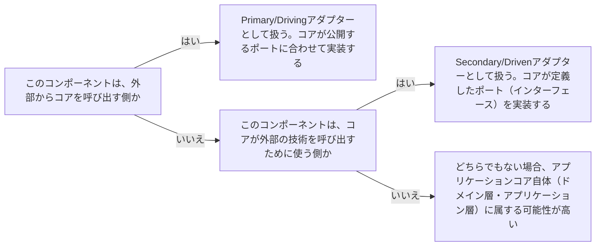

# architecture-port-adapter

---

## 概要

### この概念が答える判断

- このインターフェースは誰が定義すべきか、コア側か外側か？
- 「ポート」と「アダプター」の違いは何か？
- 駆動する側（Primary/Driving）と駆動される側（Secondary/Driven）の違いは？

アプリケーションコア（ドメイン＋アプリケーション層）が外部と接続する箇所を「ポート」（インターフェース）として明示的に定義し、外部の技術的詳細を「アダプター」として実装するパターン。コアは常にポートの所有者であり、外部技術に依存しない。

---

## 原則

ポートには2種類ある。1つはアプリケーションコアを外部から呼び出すための「駆動する側（Primary/Driving）」ポート（例：ユースケースを呼び出すAPI）。もう1つはアプリケーションコアが外部を呼び出すための「駆動される側（Secondary/Driven）」ポート（例：データを永続化するリポジトリのインターフェース）。いずれの場合も、ポート（インターフェース）はコア側が定義し、アダプター（実装）は外側が持つ。これにより、コアは「何をする必要があるか」だけを知り、「どうやってそれを実現するか」という技術的詳細を知らずに済む。テスト時はアダプターを差し替える（テスト用の偽実装に置き換える）ことで、コアを外部依存なしに検証できる。プレゼンテーション層はPrimary/Drivingアダプターとして扱う。ユースケースが公開するポート（インターフェース）を、DIによって注入された形で呼び出す——プレゼンテーション層自身がユースケースの実装や業務ルールを内包することはない。

---

## 分類

| 分類 | 特徴 |
|---|---|
| Primary/Driving ポート・アダプター | 外部からアプリケーションコアを駆動する側。例：HTTP APIハンドラ・CLIコマンド・メッセージキューの受信ハンドラがアダプター、それらが呼び出すユースケースのインターフェースがポート |
| Secondary/Driven ポート・アダプター | アプリケーションコアが外部を駆動する側。例：リポジトリインターフェースがポート、実際のDBアクセス実装がアダプター |

---

## 判断基準

---

## 実例

架空の物流プラットフォームで、集荷依頼を受け付けるCLIコマンドはPrimaryアダプター（コアの「集荷を依頼する」ユースケースというポートを呼び出す）。配送記録を永続化する処理は、コアが定義した「ShipmentRepository」というポート（インターフェース）を、実際のDB実装がSecondaryアダプターとして実装する。コアのユースケースコード自体は、DBが何であるか（PostgreSQLかDynamoDBか）を一切知らない。

---

## アンチパターン

| アンチパターン | 問題点 |
|---|---|
| アダプター側でポート（インターフェース）を定義する | コアが特定の実装技術のインターフェース形状に引きずられる。ポートは常にコアが「何を必要としているか」の視点で定義すべき |
| 1つのポートに無関係な複数の責務を詰め込む | テスト用の差し替えが難しくなり、変更の影響範囲が広がる。ポートは1つの明確な目的ごとに分ける |

---

## 出典・根拠の透明性

ヘキサゴナルアーキテクチャ（Alistair Cockburn）が提唱したポートとアダプターの概念を中心に、クリーンアーキテクチャ・オニオンアーキテクチャとの共通点をAIが総合し、has-udd独自にまとめたものである（[[brainstorm-platform-engineering-application]] 論点6の方針転換を参照）。

---

## 関連概念

| 関連概念 | 関係 |
|---|---|
| architecture-dependency-direction | ポートとアダプターは依存性逆転の原則を具体的に実装したパターン |
| architecture-layer-boundary | ポートはアプリケーション層・ドメイン層と外側の層の境界そのものを定義する |
